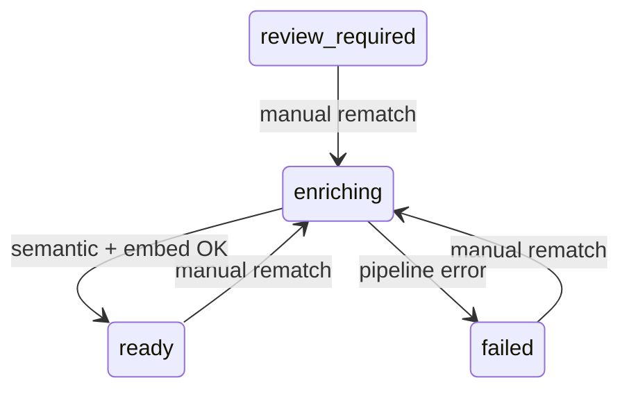

# Film Picker — API Contract Specification

Version 1.0

-----

## Table of Contents

1. [Conventions](#1-conventions)
1. [Error Contract](#2-error-contract)
1. [Import & Enrichment](#3-import--enrichment)
1. [Films](#4-films)
1. [Metadata Match Reviews](#5-metadata-match-reviews)
1. [Synchronisation](#6-synchronisation)
1. [Recommendations](#7-recommendations)
1. [Recommendation History](#8-recommendation-history)
1. [Developer Mode](#9-developer-mode)
1. [System](#10-system)

-----

## 1. Conventions

### Base URL

**Direct API access** (OpenAPI docs at `/docs`, curl, health checks, integration tests):

```
http://localhost:8000/api/v1
```

**Browser UI** (Next.js app at `http://localhost:3000`):

The frontend calls same-origin paths under `/api/v1`. Next.js rewrites those requests to the FastAPI backend. The rewrite target is `API_UPSTREAM_URL` (default `http://localhost:8000` for local `npm run dev`; Docker Compose sets `http://api:8000` on the frontend service).

Example: a UI fetch to `/api/v1/health` is proxied to `http://localhost:8000/api/v1/health`.

**Optional overrides:**

| Variable | Service | Purpose |
|----------|---------|---------|
| `API_UPSTREAM_URL` | Next.js (build/runtime) | Backend origin for `/api/v1` rewrites |
| `NEXT_PUBLIC_API_URL` | Frontend (build time) | Legacy direct API base URL; bypasses the rewrite when set |
| `LAN_HOST` | API (`.env`) | Adds `http://{LAN_HOST}:3000` to CORS allowlist for direct API access without the Next.js proxy |

### Content Type

All requests and responses use `application/json` unless the endpoint accepts a file upload, in which case `multipart/form-data` is used.

### Timestamps

All timestamps are ISO 8601 with UTC timezone: `2024-11-01T14:30:00Z`.

### UUIDs

All resource identifiers are UUIDs v4.

### Pagination

Endpoints returning collections support cursor-based pagination via `limit` and `offset` query parameters unless otherwise noted.

|Parameter|Type   |Default|Max|
|---------|-------|-------|---|
|`limit`  |integer|20     |100|
|`offset` |integer|0      |—  |

Paginated responses include a `pagination` envelope:

```json
{
  "data": [...],
  "pagination": {
    "total": 142,
    "limit": 20,
    "offset": 0,
    "has_more": true
  }
}
```

### Nullable Fields

Fields marked `nullable` may be omitted or explicitly `null` in responses. Request fields marked `optional` may be omitted; omitting them is equivalent to `null` unless a default is stated.

-----

## 2. Error Contract

All errors follow a consistent envelope. HTTP status codes are used semantically.

### Error Response Schema

```json
{
  "error": {
    "code": "VALIDATION_ERROR",
    "message": "Human-readable description of the error.",
    "details": [
      {
        "field": "genres",
        "message": "'No Preference' cannot be combined with other genre selections."
      }
    ]
  }
}
```

|Field              |Type           |Description                                                    |
|-------------------|---------------|---------------------------------------------------------------|
|`code`             |string         |Machine-readable error code (see table below)                  |
|`message`          |string         |Human-readable summary                                         |
|`details`          |array, nullable|Per-field validation errors; present on `VALIDATION_ERROR` only|
|`details[].field`  |string         |Dot-notation field path, e.g. `questionnaire.genres`           |
|`details[].message`|string         |Specific reason for this field’s failure                       |

### HTTP Status Codes

|Status|Meaning                                                           |
|------|------------------------------------------------------------------|
|200   |Success                                                           |
|201   |Resource created                                                  |
|202   |Accepted (async job started)                                      |
|400   |Bad request / validation failure                                  |
|404   |Resource not found                                                |
|409   |Conflict (e.g. duplicate active watchlist entry)                  |
|422   |Unprocessable entity (structurally valid but semantically invalid)|
|500   |Internal server error                                             |

### Error Codes

|Code                     |HTTP|Description                                       |
|-------------------------|----|--------------------------------------------------|
|`VALIDATION_ERROR`       |400 |One or more request fields failed validation      |
|`NOT_FOUND`              |404 |Requested resource does not exist                 |
|`CONFLICT`               |409 |Resource state prevents the operation             |
|`INVALID_CSV_FORMAT`     |400 |Uploaded file is not a valid Letterboxd CSV       |
|`WATCHLIST_SIZE_EXCEEDED`|400 |CSV contains more than 500 films                  |
|`NO_PREFERENCE_CONFLICT` |400 |“No Preference” combined with other selections    |
|`ENRICHMENT_NOT_READY`   |409 |Operation requires `enrichment_status = ready`    |
|`INSUFFICIENT_CANDIDATES`|422 |Fewer than 1 film passed hard constraint filtering|
|`PROVIDER_ERROR`         |500 |External AI provider call failed                  |
|`INTERNAL_ERROR`         |500 |Unexpected server-side failure                    |

-----

## 3. Import & Enrichment

### 3.1 Upload Watchlist CSV

Import a Letterboxd watchlist CSV export. Returns immediately with a job ID. Enrichment proceeds asynchronously.

```
POST /import
Content-Type: multipart/form-data
```

#### Request

|Field |Type|Required|Description                    |
|------|----|--------|-------------------------------|
|`file`|file|yes     |Letterboxd watchlist CSV export|

**Validation Rules**

- File must be `text/csv` or have a `.csv` extension.
- File must not be empty.
- CSV must contain the columns: `Date`, `Year`, `Letterboxd URI`, and either `Title` or `Name` (Letterboxd exports use `Title`; some list exports use `Name`).
- Column names are case-sensitive.
- `Letterboxd URI` must be a non-empty string per row.
- `Year` must be a 4-digit integer between 1880 and current year + 2, or blank.
- Total film rows (excluding duplicates within the file) must not exceed 500.

#### Response `202 Accepted`

```json
{
  "job_id": "a1b2c3d4-...",
  "status": "running",
  "created_at": "2024-11-01T14:30:00Z"
}
```

|Field       |Type  |Description                       |
|------------|------|----------------------------------|
|`job_id`    |UUID  |Poll this ID for enrichment status|
|`status`    |string|Always `running` on creation      |
|`created_at`|string|ISO 8601 timestamp                |

#### Errors

|Code                     |HTTP|Trigger                                     |
|-------------------------|----|--------------------------------------------|
|`INVALID_CSV_FORMAT`     |400 |Missing required columns or unparseable file|
|`WATCHLIST_SIZE_EXCEEDED`|400 |More than 500 film rows in the CSV          |
|`VALIDATION_ERROR`       |400 |File field missing or wrong content type    |

-----

### 3.2 Get Import Job Status

Poll the status of an import job. Returns aggregate progress counts.

```
GET /import/{job_id}/status
```

#### Path Parameters

|Parameter|Type|Description  |
|---------|----|-------------|
|`job_id` |UUID|Import job ID|

#### Response `200 OK`

```json
{
  "job_id": "a1b2c3d4-...",
  "status": "running",
  "total_films": 120,
  "processed_films": 47,
  "failed_films": 2,
  "duplicate_films": 3,
  "failure_summary": [
    {
      "letterboxd_uri": "https://letterboxd.com/film/example/",
      "reason": "TMDB match not found"
    }
  ],
  "created_at": "2024-11-01T14:30:00Z",
  "completed_at": null
}
```

|Field                             |Type             |Description                                                              |
|----------------------------------|-----------------|-------------------------------------------------------------------------|
|`job_id`                          |UUID             |Import job ID                                                            |
|`status`                          |string           |`running` | `complete` | `failed`                                        |
|`total_films`                     |integer, nullable|Total films detected in the CSV; null until parsing is complete          |
|`processed_films`                 |integer          |Films that have reached a terminal enrichment state (`ready` or `failed`)|
|`failed_films`                    |integer          |Films that reached `enrichment_status = failed`                          |
|`duplicate_films`                 |integer          |Rows skipped because the `letterboxd_uri` already exists in the database |
|`failure_summary`                 |array, nullable  |Present when `failed_films > 0`; one entry per failed film               |
|`failure_summary[].letterboxd_uri`|string           |Identifies the film that failed                                          |
|`failure_summary[].reason`        |string           |Human-readable failure reason                                            |
|`created_at`                      |string           |ISO 8601 timestamp                                                       |
|`completed_at`                    |string, nullable |ISO 8601 timestamp; null while still running                             |

#### Errors

|Code       |HTTP|Trigger           |
|-----------|----|------------------|
|`NOT_FOUND`|404 |`job_id` not found|

-----

## 4. Films

### 4.1 List Films

Return films in the local database with optional filtering.

```
GET /films
```

#### Query Parameters

|Parameter          |Type   |Default     |Description                                               |
|-------------------|-------|------------|----------------------------------------------------------|
|`status`           |string |—           |Filter by `film_status`: `active` | `pending_watch_review` | `watched` | `archived`. When `status=watched`, results include both `watched` and `pending_watch_review` films (Watched tab). Cannot be combined with `statuses`.|
|`statuses`         |string |—           |Comma-separated exact `film_status` set (e.g. `active,pending_watch_review,watched`). Unlike singular `status=watched`, does **not** expand `watched` to include `pending_watch_review` — list both explicitly when needed. Cannot be combined with `status`. Empty / blank tokens → `VALIDATION_ERROR`.|
|`enrichment_status`|string |—           |Filter by `enrichment_status` (see enum in §3.2)          |
|`on_watchlist`     |boolean|`false`     |When `true`, only films with an active watchlist entry    |
|`search`           |string |—           |Case-insensitive substring match on title                 |
|`year`             |integer|—           |Exact release year                                        |
|`year_from`        |integer|—           |Minimum release year (inclusive)                          |
|`year_to`          |integer|—           |Maximum release year (inclusive)                          |
|`created_from`     |date   |—           |Minimum `created_at` date (inclusive)                     |
|`created_to`       |date   |—           |Maximum `created_at` date (inclusive)                     |
|`sort`             |string |`created_at`|Sort field: `title` | `year` | `created_at` | `enrichment_status`|
|`sort_dir`         |string |`desc`      |Sort direction: `asc` | `desc`                          |
|`limit`            |integer|20          |Page size                                                 |
|`offset`           |integer|0           |Page offset                                               |

#### Response `200 OK`

```json
{
  "data": [
    {
      "id": "f1a2b3c4-...",
      "title": "The Wicker Man",
      "year": 1973,
      "letterboxd_uri": "https://letterboxd.com/film/the-wicker-man/",
      "status": "active",
      "enrichment_status": "ready",
      "tmdb_id": 11453,
      "poster_url": "https://image.tmdb.org/...",
      "director": "Robin Hardy",
      "runtime": 88,
      "genres": ["Horror", "Mystery"],
      "created_at": "2024-11-01T14:30:00Z",
      "updated_at": "2024-11-01T15:00:00Z",
      "removed_at": null,
      "latest_watched_at": null,
      "watch_review_incomplete": false,
      "pending_watch": null
    }
  ],
  "pagination": {
    "total": 87,
    "limit": 20,
    "offset": 0,
    "has_more": true
  }
}
```

**Film Object**

|Field              |Type             |Description                      |
|-------------------|-----------------|---------------------------------|
|`id`               |UUID             |Film ID                          |
|`title`            |string           |Display title                    |
|`year`             |integer, nullable|Release year                     |
|`letterboxd_uri`   |string           |Canonical Letterboxd URI         |
|`status`           |string           |`active` | `pending_watch_review` | `watched` | `archived`|
|`enrichment_status`|string           |See enrichment status enum       |
|`tmdb_id`          |integer, nullable|TMDB ID from `film_metadata` when present |
|`poster_url`       |string, nullable |TMDB poster URL                  |
|`director`         |string, nullable |Director name                    |
|`runtime`          |integer, nullable|Runtime in minutes               |
|`genres`           |array of string  |Genres from TMDB                 |
|`created_at`       |string           |ISO 8601                         |
|`updated_at`       |string           |ISO 8601                         |
|`removed_at`       |string, nullable |Most recent watchlist `removed_at` when listing watched/archived (singular `status` or multi `statuses` that include those values); omitted otherwise |
|`latest_watched_at`|date, nullable   |Latest finalized watch record date when listing watched/pending/archived extras |
|`watch_review_incomplete`|boolean  |`true` when `status=pending_watch_review` |
|`pending_watch`    |object, nullable |Pending watch-review prefill when listing watched/archived or `statuses` including `pending_watch_review` / `watched` / `archived` |

#### Errors

|Code              |HTTP|Trigger                                      |
|------------------|----|---------------------------------------------|
|`VALIDATION_ERROR`|400 |Invalid `status`/`statuses` token, empty `statuses`, combining `status` with `statuses`, invalid `enrichment_status`, `sort`, or `sort_dir` value|

-----

### 4.1.1 Set Film Status

Manually transition a film between `active`, `pending_watch_review`, and `archived`. Direct `active → watched` is forbidden — use `POST /films/{film_id}/watch-review` to complete a watch diary entry. Forbidden transitions (`watched` ↔ `archived`, `pending_watch_review` ↔ `archived`) return `409`. Restoring to `active` enforces the 500-film active watchlist cap.

```
POST /films/{film_id}/status
```

#### Path Parameters

|Parameter|Type|Description|
|---------|----|-----------|
|`film_id`|UUID|Film ID    |

#### Request Body

```json
{ "status": "active" }
```

Allowed values: `active` | `pending_watch_review` | `archived`. (`watched` is only reachable via watch-review completion.)

#### Response `200 OK`

Returns the updated `FilmDetail` (same shape as §4.2).

#### Errors

|Code           |HTTP|Trigger                                              |
|---------------|----|-----------------------------------------------------|
|`NOT_FOUND`    |404 |Film not found                                       |
|`CONFLICT`     |409 |Forbidden transition or active watchlist cap exceeded|
|`UNPROCESSABLE`|422|Invalid `status` value                               |

-----

### 4.1.2 Watch Review

Complete, cancel, or list pending watch diary entries. A film in `pending_watch_review` has a draft `film_watches` row (`is_pending=true`) until the user saves score + watched date.

#### List pending watch reviews

```
GET /films/watch-review-required
```

Paginated list of films with `status=pending_watch_review` and a pending watch record. Same pagination shape as §4.1.

#### Combined pending review count

```
GET /films/reviews/pending-count
```

```json
{
  "metadata_count": 2,
  "watch_review_count": 1,
  "total": 3
}
```

#### Complete watch review

```
POST /films/{film_id}/watch-review
```

```json
{
  "score": 4.5,
  "watched_at": "2024-11-01",
  "notes": "Optional diary note"
}
```

Validates score (0.5–5.0, 0.5 steps) and watched date (not in future). Finalizes the pending watch record and transitions film to `watched`. Returns `FilmDetail`.

#### Cancel watch review

```
DELETE /films/{film_id}/watch-review
```

Deletes the pending watch record and reverts film to `active` (reactivates watchlist entry). Returns `204`.

#### Edit watch record

```
PATCH /films/{film_id}/watches/{watch_id}
```

Same body as complete. Updates a finalized watch record only.

-----

### 4.2 Get Film

Return a single film with full metadata, semantic profile, and watch history.

```
GET /films/{film_id}
```

#### Path Parameters

|Parameter|Type|Description|
|---------|----|-----------|
|`film_id`|UUID|Film ID    |

#### Response `200 OK`

```json
{
  "id": "f1a2b3c4-...",
  "title": "The Wicker Man",
  "year": 1973,
  "letterboxd_uri": "https://letterboxd.com/film/the-wicker-man/",
  "status": "active",
  "enrichment_status": "ready",
  "metadata": {
    "tmdb_id": 11453,
    "imdb_id": "tt0070917",
    "original_title": "The Wicker Man",
    "runtime": 88,
    "synopsis": "A devoutly Christian police officer...",
    "genres": ["Horror", "Mystery"],
    "keywords": ["folk horror", "paganism", "island"],
    "original_language": "en",
    "country": "GB",
    "director": "Robin Hardy",
    "tmdb_rating": 7.6,
    "rotten_tomatoes_score": 88,
    "letterboxd_rating": 3.9,
    "poster_url": "https://image.tmdb.org/...",
    "backdrop_url": "https://image.tmdb.org/...",
    "match_confidence": 0.9800,
    "metadata_source": "tmdb"
  },
  "semantic_profile": {
    "subgenres": ["Folk Horror"],
    "themes": ["Obsession", "Isolation", "Faith"],
    "tones": ["Eerie", "Unsettling"],
    "visual_descriptors": ["Atmospheric", "Sun-drenched"],
    "emotional_outcomes": ["Disturbed", "Unsettled"],
    "viewing_contexts": ["Solo Viewing"],
    "complexity": 6.5,
    "pacing": 4.0,
    "energy": 3.5,
    "obscurity": 4.0,
    "semantic_summary": "A slow-burn folk horror...",
    "semantic_version": "semantic-v1",
    "generated_by_model": "gpt-4o",
    "generated_at": "2024-11-01T15:00:00Z"
  },
  "watches": [
    {
      "id": "w1a2b3c4-...",
      "score": 4.5,
      "watched_at": "2024-11-01",
      "notes": "Still unsettling.",
      "source": "manual",
      "is_pending": false,
      "created_at": "2024-11-02T10:00:00Z",
      "updated_at": "2024-11-02T10:00:00Z"
    }
  ],
  "created_at": "2024-11-01T14:30:00Z",
  "updated_at": "2024-11-01T15:00:00Z"
}
```

The `semantic_profile` field is `null` when `enrichment_status` is not `ready`.

#### Errors

|Code       |HTTP|Trigger            |
|-----------|----|-------------------|
|`NOT_FOUND`|404 |`film_id` not found|

-----

### 4.3 List Films Pending Metadata Review

Return films currently at `enrichment_status = review_required`, with their candidate match details.

```
GET /films/review-required
```

#### Query Parameters

|Parameter|Type   |Default|Description|
|---------|-------|-------|-----------|
|`limit`  |integer|20     |Page size  |
|`offset` |integer|0      |Page offset|

#### Response `200 OK`

```json
{
  "data": [
    {
      "film_id": "f1a2b3c4-...",
      "title": "Possession",
      "year": 1981,
      "letterboxd_uri": "https://letterboxd.com/film/possession-1981/",
      "review_id": "r9e8d7c6-...",
      "candidate_tmdb_id": 11622,
      "confidence_score": 0.7400,
      "candidate_payload": {
        "tmdb_id": 11622,
        "title": "Possession",
        "year": 1981,
        "director": "Andrzej Żuławski",
        "poster_url": "https://image.tmdb.org/..."
      },
      "created_at": "2024-11-01T14:35:00Z"
    }
  ],
  "pagination": {
    "total": 4,
    "limit": 20,
    "offset": 0,
    "has_more": false
  }
}
```

|Field              |Type             |Description                                |
|-------------------|-----------------|-------------------------------------------|
|`film_id`          |UUID             |Film ID                                    |
|`title`            |string           |Title from Letterboxd CSV                  |
|`year`             |integer, nullable|Year from Letterboxd CSV                   |
|`letterboxd_uri`   |string           |Canonical Letterboxd URI                   |
|`review_id`        |UUID             |ID of the `metadata_match_reviews` record  |
|`review_type`      |string           |`tmdb_match` or `letterboxd_uri`           |
|`candidate_tmdb_id`|integer          |TMDB ID of the proposed match              |
|`confidence_score` |number           |Match confidence between 0 and 1           |
|`candidate_payload`|object           |Snapshot of TMDB candidate data for display|
|`created_at`       |string           |ISO 8601                                   |

-----

### 4.4 Search TMDB for Film

Proxy TMDB movie search for manual metadata rematch. Requires `TMDB_API_KEY`.

```
GET /films/{film_id}/tmdb-search
```

#### Path Parameters

|Parameter|Type|Description|
|---------|----|-----------|
|`film_id`|UUID|Film ID    |

#### Query Parameters

|Parameter|Type   |Default|Description                          |
|---------|-------|-------|-------------------------------------|
|`q`      |string |—      |Search query (required, min length 1)|
|`year`   |integer|—      |Optional release year filter         |
|`page`   |integer|1      |Logical results page (1-based; offset = `(page - 1) * limit`)|
|`limit`  |integer|20     |Results per page (1–20; may slice within a TMDB page when &lt; 20)|

#### Response `200 OK`

```json
{
  "data": [
    {
      "tmdb_id": 11453,
      "title": "The Wicker Man",
      "original_title": "The Wicker Man",
      "year": 1973,
      "overview": "A devoutly Christian police officer...",
      "poster_url": "https://image.tmdb.org/t/p/w500/..."
    }
  ],
  "pagination": {
    "total": 42,
    "limit": 20,
    "offset": 0,
    "has_more": true
  }
}
```

#### Errors

|Code            |HTTP|Trigger                    |
|----------------|----|---------------------------|
|`NOT_FOUND`     |404 |`film_id` not found        |
|`PROVIDER_ERROR`|502 |TMDB HTTP failure          |

-----

### 4.5 Rematch Film

Apply a user-selected TMDB movie to a watchlist film. Replaces `film_metadata`, reconciles pending metadata reviews, and enqueues semantic profile and embedding regeneration.

```
POST /films/{film_id}/rematch
```

#### Path Parameters

|Parameter|Type|Description|
|---------|----|-----------|
|`film_id`|UUID|Film ID    |

#### Request Body

```json
{
  "tmdb_id": 11453
}
```

#### Response `202 Accepted`

```json
{
  "film_id": "f1a2b3c4-...",
  "enrichment_status": "enriching"
}
```

The film transitions to `ready` (or `failed` if the semantic/embedding pipeline errors) asynchronously.

#### Enrichment state transitions (manual rematch)



Blocked while `matching` or `enriching` (concurrent rematch).

#### Errors

|Code            |HTTP|Trigger                                                                 |
|----------------|----|------------------------------------------------------------------------|
|`NOT_FOUND`     |404 |`film_id` not found, or TMDB movie ID not found                         |
|`CONFLICT`      |409 |Film in `matching`/`enriching`; `tmdb_id`/`imdb_id` owned by another film|
|`PROVIDER_ERROR`|502 |TMDB or OMDb HTTP failure during detail fetch                            |

On success, `metadata_source` is set to `tmdb_manual` and `match_confidence` to `1.0`.

-----

### 4.6 Get Film Watch Providers

Real-time streaming availability for a watchlist film via TMDB Watch Providers (GB by default). Requires `TMDB_API_KEY`.

```
GET /films/{film_id}/watch-providers
```

#### Path Parameters

|Parameter|Type|Description|
|---------|----|-----------|
|`film_id`|UUID|Film ID    |

#### Query Parameters

|Parameter|Type  |Default|Description                                |
|---------|------|-------|-------------------------------------------|
|`country`|string|GB     |ISO 3166-1 country code (from `config.yaml`)|

#### Response `200 OK`

```json
{
  "film_id": "f1a2b3c4-...",
  "tmdb_id": 603,
  "country_code": "GB",
  "link": "https://www.themoviedb.org/movie/603/watch?locale=GB",
  "categories": [
    {
      "type": "flatrate",
      "label": "Stream",
      "providers": [
        {
          "provider_id": 8,
          "provider_name": "Netflix",
          "logo_url": "https://image.tmdb.org/t/p/w92/...",
          "display_priority": 1
        }
      ]
    }
  ]
}
```

Empty category groups are omitted. When the country object exists but all monetization arrays are empty, returns `200` with `categories: []`.

#### Errors

|Code            |HTTP|Trigger                                      |
|----------------|----|---------------------------------------------|
|`NOT_FOUND`     |404 |`film_id` not found                          |
|`UNPROCESSABLE` |422 |Film has no `tmdb_id` in `film_metadata`     |
|`PROVIDER_ERROR`|502 |TMDB HTTP failure                            |
|`PROVIDER_ERROR`|503 |`TMDB_API_KEY` missing or TMDB not configured|

-----

### 4.7 Global TMDB Search

Proxy TMDB movie search without requiring an existing film row. Used by the `/search` library+TMDB picker (and legacy `/watchlist/add` redirect). Requires `TMDB_API_KEY`.

Letterboxd identity for manual adds is resolved server-side via `https://letterboxd.com/tmdb/{id}` when reachable, with a slug-probe fallback against `/film/{slug}/` when Cloudflare blocks the shortcut.

```
GET /films/tmdb-search
```

Query parameters and response shape match §4.4. Errors: `PROVIDER_ERROR` (502) on TMDB HTTP failure.

-----

### 4.8 Add Film to Watchlist

Manually add a film by user-selected TMDB ID. Resolves Letterboxd identity via `https://letterboxd.com/tmdb/{tmdb_id}`, creates or restores the film and active watchlist entry, persists TMDB metadata (`metadata_source: tmdb_manual_add`), and enqueues enrichment. Manual adds are exempt from the 500-film active watchlist cap.

```
POST /watchlist/films
```

#### Request Body

```json
{ "tmdb_id": 603 }
```

#### Response variants

|Case                 |HTTP|Body highlights                                              |
|---------------------|----|-------------------------------------------------------------|
|New add, enriching   |202 |`film_id`, `enrichment_status: "enriching"`                  |
|Already on watchlist |200 |`already_on_watchlist: true`, `film_id`                      |
|Letterboxd unresolved|202 |`enrichment_status: "review_required"`, `review_id`          |
|Restore archived/watched|202|`restored: true`, `film_id`                               |

#### Errors

|Code            |HTTP|Trigger                         |
|----------------|----|--------------------------------|
|`NOT_FOUND`     |404 |Invalid TMDB movie ID           |
|`CONFLICT`      |409 |TMDB ID already linked to another film |
|`PROVIDER_ERROR`|502 |TMDB HTTP failure               |

-----

## 5. Metadata Match Reviews

### 5.1 Accept a Match

Accept the proposed TMDB match for a film in `review_required` state. Transitions the film to `enriching`.

```
POST /reviews/{review_id}/accept
```

#### Path Parameters

|Parameter  |Type|Description                 |
|-----------|----|----------------------------|
|`review_id`|UUID|Metadata match review record|

#### Response `200 OK`

```json
{
  "review_id": "r9e8d7c6-...",
  "film_id": "f1a2b3c4-...",
  "review_status": "accepted",
  "reviewed_at": "2024-11-01T16:00:00Z"
}
```

#### Errors

|Code       |HTTP|Trigger                                   |
|-----------|----|------------------------------------------|
|`NOT_FOUND`|404 |`review_id` not found                     |
|`CONFLICT` |409 |Review is already `accepted` or `rejected`|

-----

### 5.2 Reject a Match

Reject the proposed TMDB match. The film remains stored with `enrichment_status = failed` and is excluded from recommendations until manually resolved or re-imported.

```
POST /reviews/{review_id}/reject
```

#### Path Parameters

|Parameter  |Type|Description                 |
|-----------|----|----------------------------|
|`review_id`|UUID|Metadata match review record|

#### Response `200 OK`

```json
{
  "review_id": "r9e8d7c6-...",
  "film_id": "f1a2b3c4-...",
  "review_status": "rejected",
  "reviewed_at": "2024-11-01T16:05:00Z"
}
```

#### Errors

|Code       |HTTP|Trigger                                   |
|-----------|----|------------------------------------------|
|`NOT_FOUND`|404 |`review_id` not found                     |
|`CONFLICT` |409 |Review is already `accepted` or `rejected`|

-----

### 5.3 Resolve Letterboxd URI

Complete a manual watchlist add when Letterboxd redirect resolution failed. Validates the pasted film URL (including `boxd.it` short links), updates `letterboxd_uri`, activates the watchlist entry, persists TMDB metadata, and enqueues enrichment.

```
POST /reviews/{review_id}/resolve-letterboxd
```

#### Request Body

```json
{ "letterboxd_uri": "https://letterboxd.com/film/the-matrix/" }
```

#### Response `200 OK`

Same shape as §5.1 (`review_status: accepted`).

#### Errors

|Code              |HTTP|Trigger                                      |
|------------------|----|---------------------------------------------|
|`NOT_FOUND`       |404 |`review_id` not found                        |
|`CONFLICT`        |409 |Review is not `letterboxd_uri` or not pending|
|`VALIDATION_ERROR`|400 |Invalid or unresolvable Letterboxd URL       |

-----

## 6. Synchronisation

### 6.1 Manual Sync via CSV Upload

Upload a fresh Letterboxd CSV as a **supplemental import**: new URIs are added as active films; existing URIs in any status are left unchanged. CSV re-sync never removes or reclassifies films.

```
POST /sync/csv
Content-Type: multipart/form-data
```

#### Request

|Field |Type|Required|Description                    |
|------|----|--------|-------------------------------|
|`file`|file|yes     |Letterboxd watchlist CSV export|

**Validation Rules**

Same rules as `POST /import` (§3.1), except the 500-film limit applies to the post-sync active watchlist total (`count_active + added`), not just the uploaded file.

#### Response `200 OK`

```json
{
  "added": 3,
  "unchanged": 114,
  "failed": 0,
  "added_films": [
    { "film_id": "f1a2b3c4-...", "title": "Berberian Sound Studio", "year": 2012 }
  ]
}
```

|Field       |Type   |Description                                                |
|------------|-------|-----------------------------------------------------------|
|`added`     |integer|New URIs created as active films                           |
|`unchanged` |integer|URIs already present in the database (any status)            |
|`failed`    |integer|Rows that could not be processed                           |
|`added_films`|array  |Summary objects for each added film                        |

#### Errors

|Code                     |HTTP|Trigger                                          |
|-------------------------|----|-------------------------------------------------|
|`INVALID_CSV_FORMAT`     |400 |Missing columns or unparseable file              |
|`WATCHLIST_SIZE_EXCEEDED`|400 |Post-sync active watchlist would exceed 500 films|

-----

### 6.1.1 Import Watched History

Bulk-import Letterboxd watched-library exports (`watched.csv` + `ratings.csv` + `diary.csv`) into Cuebox watch history. Separate from watchlist CSV sync. Does **not** enforce the 500 active watchlist cap. New films are created without an active watchlist entry and enqueued for enrichment.

```
POST /sync/watched
Content-Type: multipart/form-data
```

#### Request

|Field    |Type|Required|Description                         |
|---------|----|--------|------------------------------------|
|`watched`|file|yes     |Letterboxd `watched.csv` export     |
|`ratings`|file|yes     |Letterboxd `ratings.csv` export     |
|`diary`  |file|yes     |Letterboxd `diary.csv` export       |

**Merge rules (summary)**

- Join key: `Name` + `Year` (trimmed), starting from `watched.csv`
- Diary `Watched Date` is used for `watched_at` (never diary `Date`)
- No diary row → `watched_at = 1984-09-28`; score from ratings or `null`
- Diary without rating → `pending_watch_review` (review queue); multi-diary extras staged until finalize
- Rated paths write completed `film_watches` and set `status = watched`
- Re-upload skips existing non-pending `(film_id, watched_at)` pairs

#### Response `200 OK`

```json
{
  "films_seen": 10,
  "films_created": 3,
  "watches_created": 12,
  "watches_skipped_duplicate": 2,
  "pending_review": 1,
  "enrichment_job_id": "a1b2c3d4-...",
  "failures": []
}
```

|Field                       |Type   |Description                                      |
|----------------------------|-------|-------------------------------------------------|
|`films_seen`                |integer|Watched.csv rows processed                       |
|`films_created`             |integer|New film stubs created                           |
|`watches_created`           |integer|New completed watch rows inserted                |
|`watches_skipped_duplicate` |integer|Skipped as existing `(film_id, watched_at)`      |
|`pending_review`            |integer|Films sent/refreshed in watch review queue       |
|`enrichment_job_id`         |uuid\|null|Import job id when new films need enrichment  |
|`failures`                  |array  |Per-film failures (`title`, `year`, `letterboxd_uri`, `reason`)|

#### Errors

|Code                |HTTP|Trigger                             |
|--------------------|----|------------------------------------|
|`INVALID_CSV_FORMAT`|400 |Missing columns or unparseable file |
|`VALIDATION_ERROR`  |400 |Empty file or missing multipart field|

-----

### 6.2 Configure RSS Sync

Store or update the Letterboxd RSS username used for automatic polling. Polling runs every 15 minutes once configured.

```
PUT /sync/rss
```

#### Request Body

```json
{
  "username": "johndoe"
}
```

|Field     |Type  |Required|Validation                                              |
|----------|------|--------|--------------------------------------------------------|
|`username`|string|yes     |1–50 characters; alphanumeric, hyphens, underscores only|

#### Response `200 OK`

```json
{
  "username": "johndoe",
  "polling_interval_seconds": 900,
  "configured_at": "2024-11-01T14:00:00Z"
}
```

#### Errors

|Code              |HTTP|Trigger                          |
|------------------|----|---------------------------------|
|`VALIDATION_ERROR`|400 |Invalid username format or length|

-----

### 6.3 Get RSS Sync Status

Return the current RSS sync configuration and the timestamp of the last successful poll.

```
GET /sync/rss/status
```

#### Response `200 OK`

```json
{
  "configured": true,
  "username": "johndoe",
  "polling_interval_seconds": 900,
  "last_polled_at": "2024-11-01T16:45:00Z",
  "last_poll_status": "success",
  "events_processed_last_poll": 2
}
```

|Field                       |Type             |Description                              |
|----------------------------|-----------------|-----------------------------------------|
|`configured`                |boolean          |Whether RSS sync has been set up         |
|`username`                  |string, nullable |Letterboxd username; null if unconfigured|
|`polling_interval_seconds`  |integer          |Always 900 (15 minutes)                  |
|`last_polled_at`            |string, nullable |ISO 8601; null if never polled           |
|`last_poll_status`          |string, nullable |`success` | `error`; null if never polled|
|`events_processed_last_poll`|integer, nullable|Count of events applied in the last poll |

-----

## 7. Recommendations

### 7.1 Create Recommendation

Submit questionnaire answers to generate a recommendation. This is a synchronous endpoint with a target response time of under 30 seconds.

```
POST /recommendations
```

#### Request Body

```json
{
  "questionnaire": {
    "genres": ["Horror", "Folk Horror"],
    "runtime": "le_120",
    "viewing_context": "solo",
    "thinking_effort": "complex_puzzle",
    "pacing": "slow_burn",
    "emotional_outcomes": ["Disturbed", "Unsettled"],
    "visual_tonal_vibes": ["Atmospheric", "Gritty"],
    "era": "modern_classics",
    "subtitle_preference": "no_preference",
    "obscurity_preference": "hidden_gems"
  },
  "notes": "I've been enjoying slow-burn atmospheric horror lately."
}
```

**Questionnaire Field Definitions**

|Field                 |Type           |Required|Values / Validation                                                                                                                                             |
|----------------------|---------------|--------|----------------------------------------------------------------------------------------------------------------------------------------------------------------|
|`genres`              |array of string|yes     |Flat list of genre and/or subgenre labels from the controlled vocabulary. `["No Preference"]` is valid alone; invalid if combined with other values. Min 1 item.|
|`runtime`             |string         |yes     |`le_90` | `le_120` | `le_150` | `any`                                                                                                                           |
|`viewing_context`     |string         |yes     |`solo` | `with_others`                                                                                                                                          |
|`thinking_effort`     |string         |yes     |`brain_off` | `decent_plot` | `complex_puzzle`                                                                                                                  |
|`pacing`              |string         |yes     |`slow_burn` | `balanced` | `fast_paced` | `no_preference`                                                                                                       |
|`emotional_outcomes`  |array of string|yes     |Values from emotional outcome vocabulary. `["No Preference"]` valid alone only. Min 1 item.                                                                     |
|`visual_tonal_vibes`  |array of string|yes     |Values from vibe vocabulary. `["No Preference"]` valid alone only. Min 1 item.                                                                                  |
|`era`                 |string         |yes     |`current` | `modern_classics` | `vintage` | `no_preference`                                                                                                     |
|`subtitle_preference` |string         |yes     |`yes` | `no` | `no_preference`                                                                                                                                  |
|`obscurity_preference`|string         |yes     |`mainstream` | `hidden_gems` | `obscure` | `no_preference`                                                                                                      |

|Field  |Type            |Required|Validation         |
|-------|----------------|--------|-------------------|
|`notes`|string, optional|no      |Max 1000 characters|

**Validation Rules**

- All `questionnaire` fields are required; the `questionnaire` object itself is required.
- For `genres`, `emotional_outcomes`, and `visual_tonal_vibes`: if `"No Preference"` appears alongside any other value, return `NO_PREFERENCE_CONFLICT`.
- `notes` must not exceed 1000 characters.

#### Response `200 OK`

```json
{
  "session_id": "s1a2b3c4-...",
  "profile_id": "p9e8d7c6-...",
  "profile_cache_hit": false,
  "winner": {
    "film_id": "f1a2b3c4-...",
    "title": "The Wicker Man",
    "year": 1973,
    "runtime": 88,
    "director": "Robin Hardy",
    "synopsis": "A devoutly Christian police officer...",
    "letterboxd_rating": 3.9,
    "tmdb_rating": 7.6,
    "rotten_tomatoes_score": 88,
    "poster_url": "https://image.tmdb.org/...",
    "explanation": {
      "why_it_matches": "A slow-burn folk horror with themes of isolation and obsession...",
      "most_influential_factors": ["Folk Horror subgenre", "Solo viewing context", "Pacing match"],
      "why_it_beat_alternatives": "Outscored alternatives on emotional fit and obscurity preference...",
      "caveats": "Subtitles not required; runtime is slightly under your preference ceiling."
    }
  },
  "runners_up": [
    {
      "film_id": "f2b3c4d5-...",
      "title": "Midsommar",
      "year": 2019,
      "runtime": 148,
      "director": "Ari Aster",
      "synopsis": "A couple travels to Sweden for a midsummer festival.",
      "letterboxd_rating": 3.7,
      "tmdb_rating": 7.1,
      "rotten_tomatoes_score": 83,
      "poster_url": "https://image.tmdb.org/...",
      "explanation": {
        "why_it_matches": "Shares folk horror themes and unsettling emotional outcomes...",
        "most_influential_factors": ["Folk Horror", "Emotional outcome fit"],
        "why_it_beat_alternatives": null,
        "caveats": "Runtime exceeds ≤120 min preference; constraint was relaxed."
      }
    }
  ],
  "constraint_relaxation": null,
  "created_at": "2024-11-01T17:00:00Z"
}
```

**Top-Level Fields**

|Field                  |Type            |Description                                                        |
|-----------------------|----------------|-------------------------------------------------------------------|
|`session_id`           |UUID            |Recommendation session ID                                          |
|`profile_id`           |UUID            |Recommendation profile ID                                          |
|`profile_cache_hit`    |boolean         |Whether an existing cached profile was reused                      |
|`winner`               |object          |The top recommended film                                           |
|`runners_up`           |array           |Exactly 4 runner-up films (may be fewer if watchlist is very small)|
|`constraint_relaxation`|object, nullable|Present when hard constraints were loosened; null otherwise        |
|`created_at`           |string          |ISO 8601                                                           |

**Film Result Object** (winner and each runner-up)

|Field                  |Type             |Description                         |
|-----------------------|-----------------|------------------------------------|
|`film_id`              |UUID             |Film ID                             |
|`title`                |string           |                                    |
|`year`                 |integer, nullable|                                    |
|`runtime`              |integer, nullable|Minutes                             |
|`director`             |string, nullable |                                    |
|`synopsis`             |string, nullable |Film overview from metadata         |
|`letterboxd_rating`    |number, nullable |0–5 (retained for API compatibility; not shown on results UI) |
|`tmdb_rating`          |number, nullable |TMDB vote average (0–10)            |
|`rotten_tomatoes_score`|integer, nullable|0–100                               |
|`poster_url`           |string, nullable |                                    |
|`explanation`          |object           |LLM-generated structured explanation|

**Explanation Object**

|Field                     |Type            |Description                 |
|--------------------------|----------------|----------------------------|
|`why_it_matches`          |string          |Narrative explanation of fit|
|`most_influential_factors`|array of string |Up to 5 key factors         |
|`why_it_beat_alternatives`|string, nullable|Only present on the winner  |
|`caveats`                 |string, nullable|Trade-offs or mismatches    |

`GET /recommendations/{session_id}` returns the same `Film Result Object` and `Explanation Object` shapes as `POST /recommendations`, including full winner explanation fields, `synopsis`, and `tmdb_rating`. The API persists the structured winner explanation so results remain complete after the UI navigates to the results page and refetches the session.

**Constraint Relaxation Object**

```json
{
  "runtime_minutes": { "original": 90, "relaxed_to": 120 },
  "original_language": { "relaxed": true }
}
```

Each key is a constraint that was relaxed; its value describes the relaxation applied.

#### Errors

|Code                     |HTTP|Trigger                                                                  |
|-------------------------|----|-------------------------------------------------------------------------|
|`VALIDATION_ERROR`       |400 |Missing required fields or invalid enum values                           |
|`NO_PREFERENCE_CONFLICT` |400 |“No Preference” combined with other multi-select values                  |
|`INSUFFICIENT_CANDIDATES`|422 |No `ready` films survive hard constraint filtering, even after relaxation|
|`PROVIDER_ERROR`         |500 |LLM ranking call failed                                                  |

-----

### 7.2 Get Recommendation Session

Return the full result of a past or current recommendation session.

```
GET /recommendations/{session_id}
```

#### Path Parameters

|Parameter   |Type|Description              |
|------------|----|-------------------------|
|`session_id`|UUID|Recommendation session ID|

#### Response `200 OK`

Returns the same schema as `POST /recommendations` response (including full winner `explanation`, `synopsis`, and `tmdb_rating` on each film result), plus:

```json
{
  "session_id": "...",
  "profile_id": "...",
  "profile_cache_hit": false,
  "winner": { ... },
  "runners_up": [ ... ],
  "constraint_relaxation": null,
  "created_at": "2024-11-01T17:00:00Z",
  "profile_summary": {
    "narrative_profile": "Slow-burn atmospheric folk horror with immersive visuals and emotional unease.",
    "structured_profile": {
      "genres": ["Horror", "Folk Horror"],
      "pacing": "slow_burn",
      "desired_emotions": ["Disturbed", "Unsettled"]
    }
  }
}
```

The `profile_summary` object is included in the detail view but omitted from the creation response.

#### Errors

|Code       |HTTP|Trigger               |
|-----------|----|----------------------|
|`NOT_FOUND`|404 |`session_id` not found|

-----

## 8. Recommendation History

### 8.1 List Recommendation History

Return a paginated list of past recommendation sessions for the history view.

```
GET /recommendations
```

#### Query Parameters

|Parameter     |Type   |Default|Description                                                      |
|--------------|-------|-------|-----------------------------------------------------------------|
|`search`      |string |—      |Filter by winner title (case-insensitive, partial)               |
|`date_from`   |string |—      |ISO 8601 date; return sessions on or after                       |
|`date_to`     |string |—      |ISO 8601 date; return sessions on or before                      |
|`watch_status`|string |—      |`watched` | `unwatched` — filter by winner’s current watch status|
|`limit`       |integer|20     |Page size                                                        |
|`offset`      |integer|0      |Page offset                                                      |

#### Response `200 OK`

```json
{
  "data": [
    {
      "session_id": "s1a2b3c4-...",
      "winner_film_id": "f1a2b3c4-...",
      "winner_title": "The Wicker Man",
      "winner_year": 1973,
      "winner_poster_url": "https://image.tmdb.org/...",
      "winner_watch_status": "active",
      "preference_summary": "Slow-burn atmospheric folk horror with immersive visuals and emotional unease.",
      "created_at": "2024-11-01T17:00:00Z"
    }
  ],
  "pagination": {
    "total": 23,
    "limit": 20,
    "offset": 0,
    "has_more": true
  }
}
```

**History Card Object**

|Field                |Type             |Description                                   |
|---------------------|-----------------|----------------------------------------------|
|`session_id`         |UUID             |Links to full session detail                  |
|`winner_film_id`     |UUID, nullable   |Null if the winner film has since been deleted|
|`winner_title`       |string           |Winner title at time of recommendation        |
|`winner_year`        |integer, nullable|                                              |
|`winner_poster_url`  |string, nullable |                                              |
|`winner_watch_status`|string, nullable |Current `film_status` of the winner           |
|`preference_summary` |string           |Narrative profile excerpt for display         |
|`created_at`         |string           |ISO 8601                                      |

#### Errors

|Code              |HTTP|Trigger                                                     |
|------------------|----|------------------------------------------------------------|
|`VALIDATION_ERROR`|400 |Invalid `date_from`/`date_to` format or `watch_status` value|

-----

### 8.2 Delete Recommendation Session

Permanently remove a single recommendation history entry. Before the session row is deleted, exposure counters (`recommendation_exposure`) are decremented for every shortlisted candidate so future diversity scoring treats those films as if the run never happened. Child `recommendation_candidates` and `recommendation_results` rows are removed via `ON DELETE CASCADE`.

```
DELETE /recommendations/{session_id}
```

#### Success `204 No Content`

Empty body.

#### Errors

|Code        |HTTP|Trigger              |
|------------|----|---------------------|
|`NOT_FOUND` |404 |Unknown `session_id` |

**Idempotency:** A second `DELETE` for the same `session_id` returns `404` after the first delete succeeds.

-----

## 9. Developer Mode

All Developer Mode endpoints are prefixed with `/dev`. They return the same recommendation data with additional internal observability fields.

Developer Mode must be enabled in `config.yaml` for these endpoints to return data. If disabled, all `/dev` endpoints return `404`.

-----

### 9.1 Get Session Retrieval Trace

Return retrieval-stage internals for a recommendation session.

```
GET /dev/recommendations/{session_id}/retrieval
```

#### Response `200 OK`

```json
{
  "session_id": "s1a2b3c4-...",
  "profile": {
    "profile_id": "p9e8d7c6-...",
    "profile_hash": "a3f2e1d0...",
    "structured_profile": { ... },
    "narrative_profile": "Slow-burn atmospheric folk horror...",
    "embedding_model": "text-embedding-3-small",
    "embedding_version": "embedding-v1",
    "profile_cache_hit": false
  },
  "candidates": [
    {
      "film_id": "f1a2b3c4-...",
      "title": "The Wicker Man",
      "retrieval_rank": 1,
      "similarity_score": 0.923456
    }
  ],
  "retrieval_candidate_limit": 100,
  "candidates_returned": 47
}
```

#### Errors

|Code       |HTTP|Trigger                                           |
|-----------|----|--------------------------------------------------|
|`NOT_FOUND`|404 |`session_id` not found, or Developer Mode disabled|

-----

### 9.2 Get Session Scoring Detail

Return per-candidate scoring breakdown for a recommendation session.

```
GET /dev/recommendations/{session_id}/scoring
```

#### Response `200 OK`

```json
{
  "session_id": "s1a2b3c4-...",
  "scoring_version": "scoring-v1",
  "weight_set": "default",
  "weights": {
    "theme_fit": 0.25,
    "emotional_fit": 0.20,
    "pacing_fit": 0.15,
    "complexity_fit": 0.10,
    "era_fit": 0.10,
    "obscurity_fit": 0.05,
    "viewing_context_fit": 0.05,
    "diversity_adjustment": 0.10
  },
  "candidates": [
    {
      "film_id": "f1a2b3c4-...",
      "title": "The Wicker Man",
      "raw_score": 0.8812,
      "final_score": 0.8960,
      "llm_rank": 1,
      "score_breakdown": {
        "theme_fit": 0.92,
        "emotional_fit": 0.88,
        "pacing_fit": 0.95,
        "complexity_fit": 0.70,
        "era_fit": 0.50,
        "obscurity_fit": 0.75,
        "viewing_context_fit": 1.00,
        "diversity_adjustment": 0.05
      }
    }
  ]
}
```

#### Errors

|Code       |HTTP|Trigger                                           |
|-----------|----|--------------------------------------------------|
|`NOT_FOUND`|404 |`session_id` not found, or Developer Mode disabled|

-----

### 9.3 Get Session AI Detail

Return AI provider, model, prompt version, and token usage for a recommendation session.

```
GET /dev/recommendations/{session_id}/ai
```

#### Response `200 OK`

```json
{
  "session_id": "s1a2b3c4-...",
  "semantic_enrichment": {
    "provider": "openai",
    "model": "gpt-4o",
    "semantic_version": "semantic-v1"
  },
  "embedding": {
    "provider": "openai",
    "model": "text-embedding-3-small",
    "embedding_version": "embedding-v1"
  },
  "ranking": {
    "provider": "anthropic",
    "model": "claude-sonnet-4-20250514",
    "prompt_version": "recommendation-v1",
    "tokens_input": 4821,
    "tokens_output": 1103
  }
}
```

#### Errors

|Code       |HTTP|Trigger                                           |
|-----------|----|--------------------------------------------------|
|`NOT_FOUND`|404 |`session_id` not found, or Developer Mode disabled|

-----

### 9.4 Get Film Match Metadata

Return match confidence and source attribution for a film’s metadata.

```
GET /dev/films/{film_id}/match
```

#### Response `200 OK`

```json
{
  "film_id": "f1a2b3c4-...",
  "tmdb_id": 11453,
  "imdb_id": "tt0070917",
  "match_confidence": 0.9800,
  "metadata_source": "tmdb",
  "enrichment_status": "ready"
}
```

#### Errors

|Code       |HTTP|Trigger            |
|-----------|----|-------------------|
|`NOT_FOUND`|404 |`film_id` not found|

-----

### 9.5 Get Active System Versions

Return the currently active version identifiers for all AI artifacts.

```
GET /dev/system/versions
```

#### Response `200 OK`

```json
{
  "versions": [
    {
      "artifact_type": "semantic",
      "artifact_name": "semantic-profile",
      "version": "semantic-v1",
      "active": true,
      "created_at": "2024-11-01T12:00:00Z"
    },
    {
      "artifact_type": "embedding",
      "artifact_name": "film-embedding",
      "version": "embedding-v1",
      "active": true,
      "created_at": "2024-11-01T12:00:00Z"
    },
    {
      "artifact_type": "scoring",
      "artifact_name": "recommendation",
      "version": "scoring-v1",
      "active": true,
      "created_at": "2024-11-01T12:00:00Z"
    },
    {
      "artifact_type": "prompt",
      "artifact_name": "ranking-prompt",
      "version": "recommendation-v1",
      "active": true,
      "created_at": "2024-11-01T12:00:00Z"
    }
  ]
}
```

-----

## 10. System

### 10.1 Health Check

Basic liveness check for the API and its dependencies.

```
GET /health
```

#### Response `200 OK`

```json
{
  "status": "ok",
  "database": "ok",
  "providers": {
    "embedding": "ok",
    "semantic_enrichment": "ok",
    "ranking": "ok"
  },
  "version": "1.0.0"
}
```

If any dependency is unavailable, the corresponding value is `"error"` and the HTTP status is still `200` (the API itself is alive). Callers should inspect individual field values to determine readiness.

-----

## Appendix A — Enrichment Status Enum

|Value            |Description                                             |
|-----------------|--------------------------------------------------------|
|`pending`        |Awaiting metadata matching                              |
|`matching`       |Metadata lookup in progress                             |
|`review_required`|Low-confidence match; user action needed                |
|`enriching`      |Semantic enrichment and embedding generation in progress|
|`ready`          |Fully enriched; eligible for recommendations            |
|`failed`         |Enrichment failed; retryable via re-import              |

-----

## Appendix B — Film Status Enum

|Value     |Description                                                |
|----------|-----------------------------------------------------------|
|`active`  |On the watchlist; eligible for recommendation (if enriched)|
|`watched` |Marked as watched; excluded from future recommendations    |
|`archived`|Removed from watchlist; retains metadata and history       |

-----

## Appendix C — Questionnaire Enum Reference

**`runtime`**

|Value   |Meaning      |
|--------|-------------|
|`le_90` |≤ 90 minutes |
|`le_120`|≤ 120 minutes|
|`le_150`|≤ 150 minutes|
|`any`   |No limit     |

**`viewing_context`**

|Value        |Meaning      |
|-------------|-------------|
|`solo`       |Solo viewing |
|`with_others`|Group viewing|

**`thinking_effort`**

|Value           |Meaning                |
|----------------|-----------------------|
|`brain_off`     |Brain-off entertainment|
|`decent_plot`   |Follow a decent plot   |
|`complex_puzzle`|Complex puzzle         |

**`pacing`**

|Value          |Meaning      |
|---------------|-------------|
|`slow_burn`    |Slow burn    |
|`balanced`     |Balanced     |
|`fast_paced`   |Fast paced   |
|`no_preference`|No preference|

**`era`**

|Value            |Meaning      |
|-----------------|-------------|
|`current`        |2020s        |
|`modern_classics`|1990s–2010s  |
|`vintage`        |Pre-1990     |
|`no_preference`  |No preference|

**`subtitle_preference`**

|Value          |Meaning      |
|---------------|-------------|
|`yes`          |Subtitles OK |
|`no`           |No subtitles |
|`no_preference`|No preference|

**`obscurity_preference`**

|Value          |Meaning      |
|---------------|-------------|
|`mainstream`   |Mainstream   |
|`hidden_gems`  |Hidden gems  |
|`obscure`      |Obscure      |
|`no_preference`|No preference|