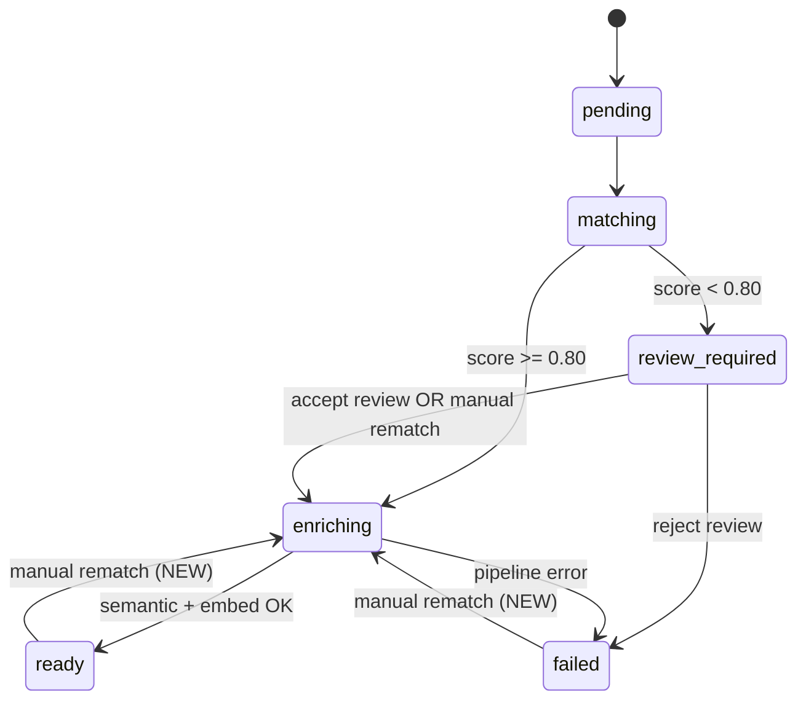
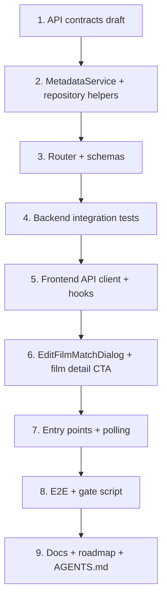

# Manual Film Rematch / Metadata Editing

## Context

**Phase 8 is complete.** Cuebox delivers the full MVP: import, automated TMDB matching, low-confidence review (accept/reject only), semantic enrichment, embeddings, recommendations, and history.

**Problem:** Users cannot correct a wrong TMDB match after enrichment. The existing `/review` flow only accepts or rejects a single auto-picked candidate when `enrichment_status = review_required`. Films that matched with high confidence but incorrectly, or films stuck in `failed` after reject, have no in-app recovery path except re-import.

**Goal:** Let any user open a film detail page, search TMDB, pick the correct match, and have the backend replace metadata and regenerate semantic profiles and embeddings.

**Authoritative references:**

| Document | Purpose |
|----------|---------|
| [PRD.md](./PRD.md) | §5 enrichment lifecycle; §22 future expansion |
| [api-contracts.md](./api-contracts.md) | §4 Films, §5 Reviews — extend with rematch endpoints |
| [database-design.md](./database-design.md) | `film_metadata`, `metadata_match_reviews`, semantic re-enrichment pattern |
| [sequence-diagrams.md](./sequence-diagrams.md) | §4 Metadata Match Review — add §4b Manual Rematch |
| [DESIGN.md](./DESIGN.md) | Dialog, card, and film detail styling |
| [roadmap.md](./roadmap.md) | Future backlog item "Automatic metadata re-match" (periodic refresh — distinct from this feature) |

---

## Current State (Gap Analysis)

### What exists today

| Layer | Capability | Key files |
|-------|------------|-----------|
| **Matching** | Automated TMDB search + confidence scoring | `api/app/services/metadata_service.py`, `api/app/services/confidence.py` |
| **Review** | Accept/reject single candidate when `review_required` | `api/app/routers/v1/reviews.py`, `frontend/src/app/review/page.tsx` |
| **Persistence** | Metadata upsert, semantic + embedding pipeline | `api/app/repositories/film_metadata_repository.py`, `api/app/services/enrichment_pipeline.py` |
| **Film detail** | Read-only `/watchlist/[filmId]` | `frontend/src/app/watchlist/[filmId]/page.tsx`, `frontend/src/components/film-detail-view.tsx` |
| **TMDB client** | `search_movie`, `get_movie_details`, `get_movie_keywords` | `api/app/providers/tmdb.py` |

### What is missing

| Gap | Impact |
|-----|--------|
| No public TMDB search endpoint | Frontend cannot show candidate picker |
| No `POST /films/{id}/rematch` | Cannot apply user-selected TMDB ID |
| `accept_review` only works for `review_required` | Cannot fix `ready` or `failed` films |
| Review page has no "pick different match" | Users stuck with auto-picked candidate |
| Film detail has no edit CTA | No rematch entry point |
| Results/review cards don't link to film detail | PRD entry points not satisfied |
| `useAcceptReview` doesn't invalidate `["films", filmId]` | Stale detail after accept (rematch should fix this pattern) |
| No `metadata_source` value for manual override | Cannot distinguish user picks in dev/audit |

### Enrichment state machine (relevant transitions)



**Blocked states for rematch:** `matching`, `enriching` (in-flight work). Return `409 CONFLICT`.

---

## Proposed API Contract

Add to [api-contracts.md](./api-contracts.md) as §4.4 and §4.5.

### 4.4 Search TMDB Candidates

```
GET /films/{film_id}/tmdb-search
```

| Parameter | Type | Default | Description |
|-----------|------|---------|-------------|
| `q` | string | film.title | Search query (user override) |
| `year` | integer | film.year | Optional year filter passed to TMDB |
| `limit` | integer | 10 | Max results (cap at 20) |

**Response `200 OK`**

```json
{
  "film_id": "f1a2b3c4-...",
  "query": "Possession",
  "year": 1981,
  "results": [
    {
      "tmdb_id": 11622,
      "title": "Possession",
      "original_title": "Possession",
      "year": 1981,
      "overview": "A young woman left her family...",
      "poster_url": "https://image.tmdb.org/...",
      "director": null
    }
  ]
}
```

**Notes:**
- `director` is omitted in search results (requires per-candidate `get_movie_details` — too slow for list). Show title/year/poster/overview only; fetch full details on rematch confirm.
- Requires `TMDB_API_KEY` configured; return `503` or structured error if provider unavailable.
- Film must exist (`404` if not found).

### 4.5 Rematch Film

```
POST /films/{film_id}/rematch
```

**Request body**

```json
{
  "tmdb_id": 11622
}
```

**Response `202 Accepted`** (async semantic pipeline)

```json
{
  "film_id": "f1a2b3c4-...",
  "tmdb_id": 11622,
  "enrichment_status": "enriching",
  "metadata_source": "tmdb_manual",
  "match_confidence": 1.0
}
```

**Behavior:**
1. Validate film exists and `enrichment_status` is one of: `ready`, `failed`, `review_required`.
2. Fetch TMDB details + keywords for `tmdb_id`.
3. Check `film_metadata` for existing rows with same `tmdb_id` or `imdb_id` on a **different** `film_id` → `409 CONFLICT`.
4. Upsert `film_metadata` via existing `_persist_metadata` logic with `match_confidence = 1.0`, `metadata_source = "tmdb_manual"`.
5. If pending `metadata_match_reviews` exist for this film, mark them `accepted` (or add `superseded` if extending enum — prefer marking `accepted` with the chosen ID for audit simplicity).
6. Set `enrichment_status = enriching`.
7. Schedule `run_semantic_pipeline_for_film` via `BackgroundTasks` (same as review accept).
8. Commit and return `202`.

**Errors**

| Code | HTTP | Trigger |
|------|------|---------|
| `NOT_FOUND` | 404 | Film or TMDB movie not found |
| `CONFLICT` | 409 | Film in `matching`/`enriching`; duplicate `tmdb_id`/`imdb_id` on another film |
| `PROVIDER_ERROR` | 502 | TMDB HTTP failure |

---

## Implementation Plan

### Slice 1 — Backend service (`rematch-metadata-service`, `rematch-state-machine`, `rematch-conflict-handling`, `rematch-review-reconciliation`)

**File:** `api/app/services/metadata_service.py`

Add methods to `MetadataService`:

```python
async def search_tmdb_candidates(
    self, db: Session, film_id: uuid.UUID, *, query: str | None, year: int | None, limit: int
) -> list[TmdbSearchResult]: ...

async def rematch_film(self, db: Session, film_id: uuid.UUID, tmdb_id: int) -> Film: ...
```

**`search_tmdb_candidates`:**
- Load film; default `query` to `film.title`, `year` to `film.year`.
- Call `tmdb.search_movie(query, year=year)`.
- Map to response items with `poster_url` from `TmdbClient.poster_url` (search results include `poster_path` — extend `TmdbSearchResult` or map inline).
- Slice to `limit`.

**`rematch_film`:**
- Guard: `film.enrichment_status in {READY, FAILED, REVIEW_REQUIRED}` else `conflict(...)`.
- Fetch details + keywords.
- **Conflict check** (before upsert):

```python
existing = film_metadata_repository.get_by_tmdb_id(db, tmdb_id)
if existing and existing.film_id != film_id:
    raise conflict(f"TMDB ID {tmdb_id} already linked to another film")
```

Add `get_by_tmdb_id` / `get_by_imdb_id` to `film_metadata_repository.py`.

- Call `_persist_metadata(..., confidence=1.0, ...)` with `metadata_source="tmdb_manual"`.
- Reconcile reviews: `metadata_review_repository.supersede_pending_for_film(db, film_id)` — new helper that sets all `pending` reviews to `accepted` (or `rejected` with reason "superseded by manual rematch" — document choice in PR).
- `film_repository.update_enrichment_status(db, film, EnrichmentStatus.ENRICHING)`.
- Return film.

**No Alembic migration required** — `metadata_source` is already a free-form string; `match_confidence` already stored as `NUMERIC(5,4)`.

**Optional TMDB provider extension:** Add `poster_path` to `TmdbSearchResult` in `api/app/providers/tmdb.py` so search results can show posters without extra API calls.

---

### Slice 2 — Backend API (`rematch-schemas`, `rematch-router`)

**Files:**
- `api/app/schemas/film_schemas.py` — new request/response models
- `api/app/routers/v1/films.py` — two new endpoints

**Router pattern** (mirror `reviews.py`):

```python
@router.get("/{film_id}/tmdb-search", response_model=TmdbSearchResponse)
async def search_tmdb_candidates(...): ...

@router.post("/{film_id}/rematch", response_model=RematchResponse, status_code=202)
async def rematch_film(
    film_id: uuid.UUID,
    body: RematchRequest,
    background_tasks: BackgroundTasks,
    ...
):
    film = await metadata_service.rematch_film(db, film_id, body.tmdb_id)
    db.commit()
    background_tasks.add_task(run_semantic_pipeline_for_film, film.id, provider_service)
    return RematchResponse(...)
```

**Route ordering:** Register `/review-required` before `/{film_id}` (already correct). New sub-routes `/{film_id}/tmdb-search` and `/{film_id}/rematch` are unambiguous.

---

### Slice 3 — Backend tests (`rematch-unit-tests`, `rematch-integration-tests`)

| Test file | Cases |
|-----------|-------|
| `api/tests/test_film_rematch.py` (new) | Search returns mocked results; rematch from `ready` → `enriching` → `ready`; rematch from `failed`; rematch from `review_required` clears pending review |
| | Rematch while `enriching` → 409; duplicate `tmdb_id` on another film → 409 |
| | `match_confidence == 1.0`, `metadata_source == "tmdb_manual"` after rematch |
| Extend `api/tests/mock_providers.py` | Ensure search + details paths cover rematch `tmdb_id` |

Reuse patterns from:
- `api/tests/test_integration_review_accept_semantic.py` — background pipeline → `ready`
- `api/tests/test_review_guards.py` — 409 state guards

---

### Slice 4 — Frontend API layer (`rematch-api-types`, `rematch-api-client`, `rematch-hooks`)

**`frontend/src/lib/api-client.ts`**

```typescript
export function searchTmdbCandidates(
  filmId: string,
  params?: { q?: string; year?: number; limit?: number }
): Promise<TmdbSearchResponse> { ... }

export function rematchFilm(
  filmId: string,
  tmdbId: number
): Promise<RematchResponse> { ... }
```

**`frontend/src/hooks/use-film-rematch.ts` (new)**

- `useTmdbSearch(filmId, query, enabled)` — debounce 300ms in caller or hook
- `useRematchFilm()` — `onSuccess` invalidate:
  - `["films"]`
  - `["films", filmId]`
  - `["films", "review-required"]`

Also fix `useAcceptReview` / `useRejectReview` to invalidate `["films", filmId]` (small regression fix in same PR).

---

### Slice 5 — Frontend UI (`rematch-modal-component`, `rematch-film-detail-cta`, `rematch-entry-points`, `rematch-polling`)

#### 5a. `EditFilmMatchDialog` component

**File:** `frontend/src/components/edit-film-match-dialog.tsx`

Uses existing `Dialog` from `frontend/src/components/ui/dialog.tsx` (currently unused — first consumer).

**UX flow:**
1. Pre-fill search input with `film.title` and optional year.
2. On open, auto-search with defaults.
3. Display results as rows: `FilmPoster` + title/year/overview snippet (reuse review page card density).
4. User can edit query and re-search.
5. Select row → confirmation line ("Replace match with **Title (Year)**?").
6. Confirm → `rematchFilm` → close dialog → parent polls film detail.

**Styling:** Follow [DESIGN.md](./DESIGN.md) — elevated dialog surface, `label-md` for metadata, lime secondary for confirm CTA.

#### 5b. Film detail page

**File:** `frontend/src/components/film-detail-view.tsx`

- Add **Edit Film Match** `Button` in header actions — **always visible**, including when `metadata` is `null` (failed / review_required / never matched).
- When `enrichment_status === "enriching"`, show inline status badge + disable edit button.
- When `enrichment_status === "failed"`, show failure context + edit CTA as primary recovery action.
- Optionally display `match_confidence` when metadata present.

**File:** `frontend/src/app/watchlist/[filmId]/page.tsx`

- After rematch, enable `refetchInterval` on `useFilm` while status is `enriching` (2–3s), stop when `ready` or `failed`.
- Toast on transition to `ready` ("Film match updated") or `failed`.

#### 5c. Entry points (per PRD)

| Screen | Change | File |
|--------|--------|------|
| **Watchlist** | Poster/title already link to `/watchlist/{id}` | `watchlist-table.tsx` — no change |
| **Review** | Add "Choose different match" link → `/watchlist/{film_id}`; optional inline `EditFilmMatchDialog` | `review/page.tsx` |
| **Results / History** | Make `FilmResultCard` title/poster link to `/watchlist/{film_id}` | `results-view.tsx` |

Extract `FilmResultCard` to `frontend/src/components/film-result-card.tsx` if reused.

---

### Slice 6 — Documentation (`rematch-api-contracts`, `rematch-sequence-diagram`, `rematch-roadmap-update`)

1. **api-contracts.md** — §4.4, §4.5 as specified above; add `tmdb_manual` to metadata_source enum in §4.2 example.
2. **sequence-diagrams.md** — new §4b:

```
User → UI: Edit Film Match
UI → API: GET /films/{id}/tmdb-search?q=...
API → TMDB: search/movie
UI → User: candidate list
User → UI: select candidate
UI → API: POST /films/{id}/rematch { tmdb_id }
API → DB: upsert film_metadata, status=enriching
API → Background: run_semantic_pipeline_for_film
UI → API: poll GET /films/{id}
API → DB: semantic + embedding upsert → ready
```

3. **roadmap.md** — add post-MVP feature section with checklist mirroring this plan's todos; note distinction from backlog "Automatic metadata re-match" (periodic refresh).

---

### Slice 7 — Verification (`rematch-gate-script`, `rematch-e2e`, `rematch-agents-md`)

**`scripts/verify-film-rematch-gates.sh`**

```bash
# 1. API rematch integration tests (Postgres required)
cd api && pytest tests/test_film_rematch.py -v

# 2. Review guard regression
pytest tests/test_review_guards.py tests/test_integration_review_accept_semantic.py -v

# 3. Frontend
cd ../frontend && npx tsc --noEmit && npm run build

# 4. Optional: mocked Playwright
npx playwright test e2e/film-rematch.spec.ts --grep "mocked API"
```

**E2E test:** `frontend/e2e/film-rematch.spec.ts`
- Mock `GET /films/{id}/tmdb-search` and `POST /films/{id}/rematch`
- Navigate to film detail → open dialog → select result → verify enriching → ready states

**AGENTS.md updates:**
- Gate script row in lint/test table
- Hello-world note: rematch via watchlist film detail

---

## Key Design Decisions

| Decision | Choice | Rationale |
|----------|--------|-----------|
| HTTP status for rematch | `202 Accepted` | Semantic pipeline is async (same as review accept) |
| Manual match confidence | `1.0` | User explicitly confirmed; distinguishes from auto-match |
| `metadata_source` | `"tmdb_manual"` | Audit trail; dev mode can surface |
| Letterboxd title/year | Unchanged on rematch | Identity stays tied to watchlist CSV; only TMDB metadata replaced |
| Semantic/embed on rematch | Full regeneration | Metadata change invalidates prior semantic profile and vector |
| Delete old metadata | Upsert in place | Matches existing `film_metadata_repository.upsert` and re-enrichment pattern in database-design.md |
| Search director in list | Omit | Avoid N+1 TMDB calls; show on detail after confirm |
| Permissions | All users | Single-user local app; no auth gate |
| Extend review page | Link to detail + optional inline dialog | Minimal scope: detail page is canonical rematch surface per PRD |

---

## File Change Summary

### Backend (new/modified)

| File | Action |
|------|--------|
| `api/app/services/metadata_service.py` | Add `search_tmdb_candidates`, `rematch_film` |
| `api/app/repositories/film_metadata_repository.py` | Add `get_by_tmdb_id`, `get_by_imdb_id` |
| `api/app/repositories/metadata_review_repository.py` | Add `supersede_pending_for_film` |
| `api/app/providers/tmdb.py` | Optional: `poster_path` on `TmdbSearchResult` |
| `api/app/schemas/film_schemas.py` | New rematch/search schemas |
| `api/app/routers/v1/films.py` | Two new endpoints |
| `api/tests/test_film_rematch.py` | New integration tests |

### Frontend (new/modified)

| File | Action |
|------|--------|
| `frontend/src/components/edit-film-match-dialog.tsx` | **New** — rematch modal |
| `frontend/src/components/film-detail-view.tsx` | Edit CTA, enriching state |
| `frontend/src/app/watchlist/[filmId]/page.tsx` | Polling after rematch |
| `frontend/src/hooks/use-film-rematch.ts` | **New** — search + rematch hooks |
| `frontend/src/hooks/use-reviews.ts` | Invalidate film detail cache |
| `frontend/src/lib/api-client.ts` | New API functions |
| `frontend/src/types/api.ts` | New types |
| `frontend/src/components/results-view.tsx` | Link to film detail |
| `frontend/src/app/review/page.tsx` | "Choose different match" link |
| `frontend/e2e/film-rematch.spec.ts` | **New** — mocked E2E |

### Documentation

| File | Action |
|------|--------|
| `documents/api-contracts.md` | §4.4, §4.5 |
| `documents/sequence-diagrams.md` | §4b diagram |
| `documents/roadmap.md` | Feature checklist + index |
| `documents/film-rematch-plan.md` | This plan |
| `scripts/verify-film-rematch-gates.sh` | **New** gate script |
| `AGENTS.md` | Gate + hello-world note |

---

## Risks & Mitigations

| Risk | Mitigation |
|------|------------|
| `tmdb_id` UNIQUE constraint on another film | Pre-check + clear 409 error message with conflicting film title |
| Rematch during active import job | `sync_import_job_progress` already called after semantic pipeline; rematch from `ready` won't affect job counters |
| Stale semantic profile shown briefly | Poll film detail until `enriching` resolves; hide semantic section when not `ready` (already behavior) |
| TMDB rate limits on search | Debounce frontend input; cap `limit` at 20; reuse `http_retry` |
| User picks same wrong match again | Allowed — idempotent rematch re-runs pipeline |
| `accept_flag` films with stale pending review | `supersede_pending_for_film` on rematch |

---

## Verification Checklist

Before merging implementation PR:

- [ ] `GET /films/{id}/tmdb-search` returns results for valid film; 404 for unknown film
- [ ] `POST /films/{id}/rematch` from `ready`, `failed`, `review_required` reaches `ready` with new metadata
- [ ] Duplicate `tmdb_id` returns 409
- [ ] Rematch during `enriching` returns 409
- [ ] Embeddings regenerated (vector changes in DB; retrieval scores may differ)
- [ ] Edit button visible on film detail with null metadata
- [ ] Watchlist poster/title reflect update after rematch completes
- [ ] Review page links to film detail for alternate match
- [ ] Results cards link to film detail
- [ ] `bash scripts/verify-film-rematch-gates.sh` passes
- [ ] Phase 8 regression subset still green

---

## Suggested Implementation Order



Implement backend slices 1–3 first so frontend can be built against stable contracts. Frontend slices 4–5 can proceed in parallel once `POST /rematch` and `GET /tmdb-search` are available in local dev.

---

## Out of Scope (this feature)

- Bulk rematch across multiple films
- Automatic periodic TMDB metadata refresh (roadmap backlog)
- Editing Letterboxd title/year on the `films` row
- Changing semantic model version (separate re-enrichment migration)
- Developer Mode panel changes (optional follow-up: show `metadata_source` in `/dev/films/{id}/match`)
