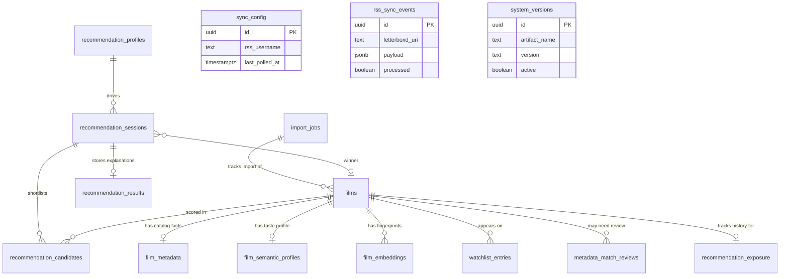

# How Cuebox Works

This guide explains what Cuebox does and how it turns your Letterboxd watchlist into a personalized film recommendation. It is written for anyone curious about the product — you do not need a technical background to follow along.

---

## What Cuebox Is

Cuebox is a locally hosted app that helps you decide **what to watch tonight** from films already on your Letterboxd watchlist. It does not search the wider internet for new films. Every recommendation comes from your own list.

The basic journey looks like this:

1. **Import** your watchlist from a Letterboxd CSV export.
2. **Enrich** each film in the background with catalog facts and an AI-generated taste profile.
3. **Answer a short questionnaire** about your mood and constraints.
4. **Receive a pick** (plus a few alternatives) with plain-language explanations.

Cuebox is designed to feel like a film-loving friend making a suggestion, not a search engine returning one fixed “correct” answer. If several films are a good fit, results can vary slightly between runs.

---

## Part 1: Film Metadata Enrichment

When you import your watchlist, Cuebox only knows what Letterboxd gave you: a **title**, **year**, and **Letterboxd link** for each film. That is enough to identify a film, but not enough to understand what it is like to watch or whether it matches your mood.

Enrichment is the background process that fills in those gaps. It runs automatically after import and can take a while for large watchlists. You can monitor progress in the app while films move through three stages.

### What gets added to each film

Enrichment builds up three layers of information on top of the basic Letterboxd record.

#### Layer 1 — Catalog facts

These are concrete details about the film, similar to what you would see on a movie database site:

| What is stored | Examples |
|----------------|----------|
| External IDs | TMDB and IMDb identifiers (used internally to link records) |
| Title details | Original title, director, runtime |
| Story summary | Plot synopsis |
| Classification | Genres and thematic keywords |
| Origin | Original language and country of production |
| Ratings | TMDB score; Rotten Tomatoes critic score when available |
| Artwork | Poster and backdrop image URLs |

#### Layer 2 — Semantic taste profile

An AI reads the catalog facts and writes a **taste profile** — a structured description of what watching the film is actually like. This is not copied from a website; it is generated specifically for recommendation matching.

| What is stored | What it describes |
|----------------|-------------------|
| Subgenres | More specific labels than broad genres (e.g. “Folk Horror” rather than just “Horror”) |
| Themes | Big ideas the film explores (e.g. identity, isolation) |
| Tones | Overall mood (e.g. bleak, surreal) |
| Visual style | How the film looks and feels on screen (e.g. atmospheric, gritty) |
| Emotional outcomes | How you might feel afterward (e.g. disturbed, inspired) |
| Viewing contexts | Good situations to watch in (e.g. solo viewing) |
| Complexity | How mentally demanding the story is (0–10 scale) |
| Pacing | How fast or slow the narrative moves (0–10 scale) |
| Energy | How intense the experience feels (0–10 scale) |
| Obscurity | How well-known vs. niche the film is (0–10 scale) |
| Summary | A short paragraph capturing the film’s overall character |

**Example of what is sent to the AI**

Cuebox sends two messages to the semantic enrichment AI: a fixed instruction (the *system* message) and a film-specific prompt (the *user* message) built from the catalog facts saved in Layer 1. Placeholders in `{curly_braces}` show where Cuebox fills in real values for each film.

*System message* (same for every film):

```
You are a film analysis assistant. Given film metadata, produce a JSON object with exactly these keys:
- subgenres: array of strings (specific subgenre labels)
- themes: array of strings (thematic elements)
- tones: array of strings (overall tonal qualities)
- visual_descriptors: array of strings (visual/cinematic style)
- emotional_outcomes: array of strings (how viewers may feel after watching)
- viewing_contexts: array of strings (ideal viewing situations)
- complexity: number 0-10 or null (narrative/thematic complexity)
- pacing: number 0-10 or null (narrative pacing)
- energy: number 0-10 or null (intensity/energy level)
- obscurity: number 0-10 or null (how well-known vs niche)
- semantic_summary: string (2-4 sentence summary of the film's semantic identity)

Respond with valid JSON only.
```

*User message* (populated per film):

```
Title: {film.title}
Year: {film.year}
Director: {film_metadata.director}
Genres: {film_metadata.genres joined by comma}
Keywords: {film_metadata.keywords joined by comma}
Synopsis: {film_metadata.synopsis}

Produce the semantic profile JSON object.
```

*Illustrative user message* (with sample values filled in):

```
Title: The Wicker Man
Year: 1973
Director: Robin Hardy
Genres: Horror, Mystery
Keywords: cult, island, paganism, police investigation
Synopsis: A police sergeant investigates the disappearance of a young girl on a remote Scottish island, where the locals behave strangely and resist his questions.

Produce the semantic profile JSON object.
```

The AI responds with JSON only. Cuebox validates the shape and saves the result to `film_semantic_profiles`. An illustrative response:

```json
{
  "subgenres": ["Folk Horror", "Mystery Thriller"],
  "themes": ["Faith", "Community", "Sacrifice", "Colonialism"],
  "tones": ["Unsettling", "Eerie", "Satirical"],
  "visual_descriptors": ["Pastoral", "Sun-drenched", "Ritualistic"],
  "emotional_outcomes": ["Disturbed", "Unsettled", "Reflective"],
  "viewing_contexts": ["Solo viewing", "Late night"],
  "complexity": 7.5,
  "pacing": 6.0,
  "energy": 5.5,
  "obscurity": 4.0,
  "semantic_summary": "A methodical investigation on an isolated island slowly reveals a tightly knit pagan community with disturbing traditions. Folk horror atmosphere builds through contrast between modern rationality and ancient ritual."
}
```

#### Layer 3 — Search fingerprint (embedding)

Cuebox also creates a **numeric fingerprint** of each film — a mathematical representation of its meaning based on the synopsis, genres, keywords, themes, and summary. You never see this directly, but it lets the app quickly find films that are semantically similar to what you asked for in the questionnaire.

### Where the information comes from

Different sources contribute different pieces:

| Source | What it provides |
|--------|------------------|
| **Letterboxd CSV** | Title, year, and link — the starting identity of each film |
| **TMDB** (The Movie Database) | Catalog facts: synopsis, runtime, genres, keywords, director, language, country, ratings, and artwork. TMDB is the primary catalog source. |
| **OMDb** (optional) | Rotten Tomatoes critic score, looked up using the IMDb ID from TMDB. If OMDb is not configured or unavailable, the film is still enriched — just without that score. |
| **AI language model** | The semantic taste profile, generated from the catalog facts |
| **AI embedding service** | The search fingerprint, generated from a blend of catalog and semantic data |

All of this happens on your machine (or your Docker stack). Provider API keys are only used to reach TMDB, OMDb, and your chosen AI services.

### Matching films to the right catalog entry

Because many films share similar titles, Cuebox does not blindly trust the first search result. It compares your Letterboxd title and year against several candidates and assigns a **confidence score** based on title similarity, year alignment, and director when available.

| Confidence | What happens |
|------------|--------------|
| Very high (95%+) | Match is accepted automatically and enrichment continues |
| High (80–94%) | Match is accepted, but flagged for your review if you want to double-check |
| Low (below 80%) | Enrichment pauses until you accept or reject the suggested match |

If you reject a match, that film is marked as failed. You can try again by re-importing your watchlist.

### How information is stored

Everything lives in a local **PostgreSQL database** on your machine. You can think of it as a set of linked tables:

- **Films** — one row per watchlist entry (title, year, Letterboxd link, and an enrichment status)
- **Film metadata** — one row of catalog facts per film
- **Film semantic profiles** — one row of AI-generated taste data per film
- **Film embeddings** — one search fingerprint per film
- **Match reviews** — pending low-confidence matches waiting for your decision

Each film moves through enrichment statuses as it progresses:

| Status | Meaning |
|--------|---------|
| Pending | Waiting to be looked up |
| Matching | Currently being matched to TMDB |
| Review required | Low-confidence match — needs your input |
| Enriching | Catalog data saved; AI profile and fingerprint being created |
| Ready | Fully enriched and eligible for recommendations |
| Failed | Something went wrong (no match, rejected review, or provider error) |

**Important:** Only films marked **ready** can appear in recommendations. Enrichment is done once per film and stored permanently — Cuebox does not re-fetch catalog data or regenerate profiles every time you ask for a recommendation.

---

## Part 2: The Recommendation Engine

When you are ready to pick a film, Cuebox walks you through a questionnaire and then runs a multi-step process to narrow your watchlist and choose a winner.

### What the questionnaire captures

The questionnaire has **10 required questions** plus an **optional notes field**. Together they describe what you are in the mood for right now.

| Question | What you choose | Why it matters |
|----------|-----------------|----------------|
| **Genres** | One or more genre labels (e.g. Horror, Folk Horror, Neo-Noir), or “No Preference” | Shapes theme matching and the overall taste profile |
| **Runtime** | Up to 90 min, up to 120 min, up to 150 min, or no limit | Hard filter — films longer than your ceiling are excluded |
| **Viewing context** | Solo or with others | Matched against each film’s ideal viewing situations |
| **Thinking effort** | Brain-off entertainment, follow a decent plot, or complex puzzle | Matched against each film’s narrative complexity |
| **Pacing** | Slow burn, balanced, fast paced, or no preference | Matched against each film’s pacing score |
| **Emotional outcomes** | How you want to feel (e.g. terrified, comforted, mind-blown), or “No Preference” | Matched against each film’s predicted emotional impact |
| **Visual & tonal vibes** | Look and feel (e.g. gritty, atmospheric, noir), or “No Preference” | Influences semantic search and the final AI ranking |
| **Era** | 2020s, 1990s–2010s, pre-1990, or no preference | Matched against each film’s release year |
| **Subtitles** | Subtitles OK, no subtitles, or no preference | “No subtitles” excludes non-English films as a hard filter |
| **Obscurity** | Mainstream, hidden gems, obscure, or no preference | Matched against how well-known each film is |
| **Notes** (optional) | Free text, up to 1,000 characters | Added to your taste description in your own words |

For multi-select questions (genres, emotions, vibes), you can pick “No Preference” on its own, but not combined with other options.

### Turning your answers into a recommendation profile

Your raw answers are not used directly. Cuebox first converts them into a **recommendation profile** with three parts:

1. **Structured preferences** — a tidy list of your choices (e.g. runtime ceiling, desired emotions, era band).
2. **Narrative summary** — a short sentence in plain English. For example: *“Horror, folk horror slow burn pacing seeking disturbed outcomes atmospheric, gritty vibes.”*
3. **Profile fingerprint** — an embedding (like the film fingerprints) so the app can find semantically similar titles.

If you submit the exact same answers and notes again, Cuebox reuses the cached profile instead of calling the embedding service a second time.

### How your watchlist gets filtered and ranked

Cuebox does not send your entire watchlist to the AI. It narrows the field through six stages, each building on the last.

#### Stage 1 — Hard filters

First, Cuebox removes films that cannot possibly fit:

- Films you have already watched or archived
- Films still being enriched (not yet “ready”)
- Films longer than your runtime limit
- Non-English films, if you chose “no subtitles”

If fewer than five films survive, Cuebox **relaxes constraints** rather than giving up:

- Runtime ceiling is extended by 30 minutes
- If still too few, the English-only subtitle rule is dropped

If nothing remains after relaxation, you see an error asking you to broaden your criteria.

#### Stage 2 — Semantic search

Among the survivors, Cuebox finds the films whose fingerprints are most similar to your profile fingerprint. By default it keeps the top 100 closest matches. This is where genres, vibes, and notes influence results even though they were not hard filters — they shaped your profile fingerprint.

#### Stage 3 — Structured scoring

Each remaining film receives a score based on how well its stored taste profile aligns with your structured preferences:

| What you said | What it is compared to | Weight |
|---------------|------------------------|--------|
| Genres | Film genres, keywords, subgenres, and themes | 25% |
| Emotional outcomes | Film’s predicted emotional impact | 20% |
| Pacing | Film’s pacing score | 15% |
| Thinking effort | Film’s complexity score | 10% |
| Era | Film’s release year | 10% |
| Obscurity preference | Film’s obscurity score | 5% |
| Viewing context | Film’s ideal viewing situations | 5% |

Visual and tonal vibes are not scored separately here, but they still matter through semantic search (Stage 2) and the final AI step (Stage 6).

#### Stage 4 — Variety adjustment

Cuebox looks at your recommendation history. Films you have been recommended many times (especially as winners) get a small penalty. Films you have not seen recommended recently get a freshness bonus. This helps avoid suggesting the same film every time.

#### Stage 5 — Controlled randomness

Among films with very similar scores, Cuebox introduces a small amount of randomness so equally good picks can surface on different days. The shortlist sent to the AI contains up to 20 films.

#### Stage 6 — AI ranking and explanations

The final step asks an AI language model to pick a **winner** and up to **four runners-up**, and to explain why.

**Example of what is sent to the AI**

Like semantic enrichment, ranking uses a fixed *system* message plus a session-specific *user* message. Placeholders in `{curly_braces}` show where Cuebox fills in values from your questionnaire profile and the Stage 5 shortlist.

*System message* (same for every recommendation):

```
You are a film recommendation assistant. Given a viewer profile and scored candidates,
select one winner and up to four runners-up. Return JSON with:
{
  "winner_film_id": "uuid",
  "runners_up_film_ids": ["uuid", ...],
  "explanations": {
    "<film_id>": {
      "why_it_matches": "string",
      "most_influential_factors": ["factor1", "factor2"],
      "why_it_beat_alternatives": "string or null",
      "caveats": "string or null"
    }
  }
}
Only use film IDs from the candidate list. Winner must include why_it_beat_alternatives.
```

*User message* (populated per recommendation session):

```
Profile: {recommendation_profile.narrative_profile}
Structured preferences: {recommendation_profile.structured_profile}
Candidates:
- {candidate.film_id}: {candidate.title} ({candidate.year}) final_score={candidate.final_score}
- {candidate.film_id}: {candidate.title} ({candidate.year}) final_score={candidate.final_score}
...
```

*Illustrative user message* (with sample values filled in):

```
Profile: Horror, folk horror slow burn pacing seeking disturbed outcomes atmospheric, gritty vibes I've been enjoying slow-burn atmospheric horror lately.
Structured preferences: {'genres': ['Horror', 'Folk Horror'], 'runtime': 'le_120', 'viewing_context': 'solo', 'thinking_effort': 'decent_plot', 'pacing': 'slow_burn', 'desired_emotions': ['Disturbed', 'Unsettled'], 'visual_tonal_vibes': ['Atmospheric', 'Gritty'], 'era': 'modern_classics', 'subtitle_preference': 'no_preference', 'obscurity_preference': 'hidden_gems'}
Candidates:
- a1b2c3d4-...: The Wicker Man (1973) final_score=0.847
- e5f6g7h8-...: Midsommar (2019) final_score=0.831
- i9j0k1l2-...: Kill List (2011) final_score=0.819
- m3n4o5p6-...: The Witch (2015) final_score=0.806
```

The ranking AI does **not** receive your full watchlist, raw questionnaire form data, or each film’s full semantic taste profile. It works from your profile text plus a scored shortlist of up to 20 titles (ID, title, year, and final score only).

### What the AI is expected to return

The AI must respond with structured JSON containing:

| Field | What it means |
|-------|---------------|
| **Winner** | The single best film ID from the shortlist |
| **Runners-up** | Up to four alternative film IDs |
| **Explanations** | For the winner and each runner-up: |

Each explanation includes:

| Explanation part | What you see |
|------------------|--------------|
| **Why it matches** | How the film fits what you asked for |
| **Most influential factors** | The top reasons behind the pick (shown as bullet points) |
| **Why it beat alternatives** | Why this film won over the others (winner only) |
| **Caveats** | Honest trade-offs or reasons it might not be perfect |

If the AI returns an invalid winner ID, Cuebox falls back to the highest-scored film. Missing explanations are filled in with sensible defaults so you always see a complete result.

### What you receive

The results screen shows:

- Your **top pick** with full explanation
- Up to **four alternatives** with their own explanations
- A summary of **your questionnaire answers**
- Any **constraint relaxations** that were applied (e.g. runtime extended because too few films matched)

Your session is saved to **recommendation history** so you can revisit past picks and explanations later.

---

## How the two parts fit together

Enrichment and recommendation serve different moments in time:

| Phase | When it runs | Purpose |
|-------|--------------|---------|
| **Enrichment** | Once, after import | Build a rich understanding of each film on your watchlist |
| **Recommendation** | Every time you ask | Match today’s mood against that stored understanding |

This separation keeps recommendations fast. The heavy lifting — catalog lookups, AI taste profiles, and film fingerprints — happens during import. When you answer the questionnaire, Cuebox mostly reads what it already knows and applies your current preferences on top.

### Database schema overview

All application data lives in a single PostgreSQL database. The diagram below shows every table and how they connect. Tables on the left support **import and enrichment**; tables on the right support **recommendations**; the `films` table sits in the center as the shared anchor for every film on your watchlist.



**Table reference**

| Table | Role |
|-------|------|
| `import_jobs` | Tracks a CSV import run (progress, failures, completion) |
| `films` | Core watchlist record — title, year, Letterboxd link, watch status, enrichment status |
| `film_metadata` | Catalog facts from TMDB/OMDb (synopsis, runtime, genres, ratings, artwork) |
| `film_semantic_profiles` | AI-generated taste profile (themes, pacing, complexity, summary) |
| `film_embeddings` | Vector fingerprint for semantic similarity search |
| `watchlist_entries` | Active/removed watchlist membership history per film |
| `metadata_match_reviews` | Low-confidence TMDB matches awaiting your accept/reject |
| `recommendation_profiles` | Cached questionnaire profile (structured + narrative + embedding) |
| `recommendation_sessions` | One recommendation run — links profile to winner and pipeline versions |
| `recommendation_candidates` | Films scored and shortlisted in a session (retrieval rank, scores, LLM rank) |
| `recommendation_results` | Winner and runner-up explanations returned by the ranking AI |
| `recommendation_exposure` | How often each film has been recommended (feeds variety adjustment) |
| `sync_config` | Letterboxd RSS username and last poll status (standalone) |
| `rss_sync_events` | Incoming RSS events from Letterboxd sync (standalone) |
| `system_versions` | Version registry for semantic, embedding, scoring, and prompt artifacts (standalone) |

---

## Related documentation

For setup instructions, see the [README](../README.md). For technical architecture, API details, and database schemas, see [Architecture.md](Architecture.md), [api-contracts.md](api-contracts.md), and [database-design.md](database-design.md).
