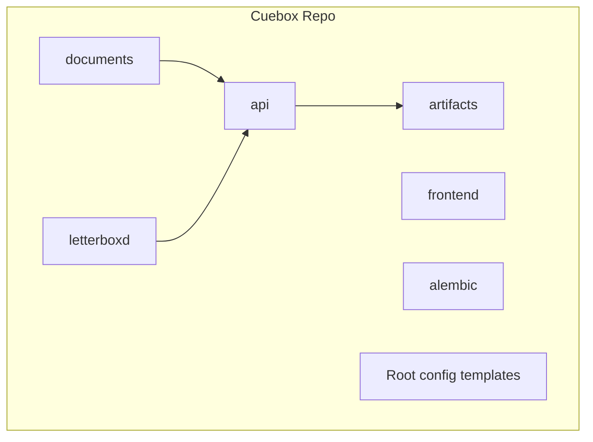

# Initial Repository Structure (Scaffold Only)

## Context

Cuebox is a greenfield project. Existing content stays untouched:

- [`documents/`](documents/) — authored specs (PRD, Architecture, API contracts, DB design, roadmap)
- [`letterboxd/`](letterboxd/) — CSV test fixtures

New application code lands at the **repo root** (not nested under a `cuebox/` folder), matching the layout in [roadmap.md Phase 0](documents/roadmap.md) with the structural refinements below.



### Layering convention (API)

```
Router → Service → Repository → SQLAlchemy (database/)
```

Scaffolding `repositories/` and `database/` now avoids SQL leaking into services later.

---

## Target Directory Tree

```
Cuebox/
├── api/
│   ├── app/
│   │   ├── __init__.py
│   │   ├── main.py              # stub only
│   │   ├── core/
│   │   │   ├── __init__.py
│   │   │   └── config.py        # stub: load/validate config.yaml (future: settings, logging, exceptions)
│   │   ├── routers/
│   │   │   ├── __init__.py
│   │   │   └── v1/
│   │   │       └── __init__.py
│   │   ├── services/
│   │   │   └── __init__.py
│   │   ├── repositories/
│   │   │   └── __init__.py
│   │   ├── database/
│   │   │   ├── __init__.py
│   │   │   ├── base.py          # stub: declarative base
│   │   │   ├── session.py       # stub: engine/session factory
│   │   │   └── models.py        # stub: SQLAlchemy ORM models (Phase 1)
│   │   ├── schemas/
│   │   │   ├── __init__.py
│   │   │   └── errors.py        # Pydantic models matching api-contracts §2
│   │   └── providers/
│   │       └── __init__.py
│   ├── tests/
│   │   ├── __init__.py
│   │   └── .gitkeep
│   └── pyproject.toml           # project metadata + planned deps (no lock/install)
├── frontend/
│   ├── src/
│   │   ├── app/
│   │   │   ├── layout.tsx       # minimal shell
│   │   │   ├── page.tsx         # placeholder home page
│   │   │   └── globals.css      # Tailwind entry stub
│   │   ├── features/            # bounded contexts: watchlist, recommendations, history, dev-mode
│   │   │   └── .gitkeep
│   │   ├── components/
│   │   │   └── .gitkeep
│   │   ├── hooks/
│   │   │   └── .gitkeep
│   │   ├── types/               # shared types: Film, Recommendation, ApiError, etc.
│   │   │   └── .gitkeep
│   │   └── lib/
│   │       └── api-client.ts    # typed fetch wrapper stub
│   ├── public/
│   │   └── .gitkeep
│   ├── package.json             # scripts/deps listed, not installed
│   ├── tsconfig.json
│   ├── next.config.ts
│   ├── postcss.config.mjs
│   ├── tailwind.config.ts
│   └── components.json          # shadcn/ui config stub
├── alembic/
│   ├── versions/
│   │   └── .gitkeep
│   └── README.md                # note: initialized in Phase 1
├── artifacts/                   # implementation-generated outputs (not authored specs)
│   ├── README.md
│   ├── openapi/                 # future OpenAPI exports
│   │   └── .gitkeep
│   ├── erd/                     # future ERDs
│   │   └── .gitkeep
│   └── coverage/                # future coverage reports
│       └── .gitkeep
├── .gitignore
├── .env.example
└── config.example.yaml
```

**No Dockerfiles in this scaffold.** Docker Compose and `api/Dockerfile` / `frontend/Dockerfile` are deferred to the first runnable phase—Dockerfiles imply deployment decisions the roadmap explicitly postpones.

**Explicitly out of scope** (deferred to runnable Phase 0):

- `docker-compose.yml`, `api/Dockerfile`, `frontend/Dockerfile`
- Working `GET /api/v1/health`, exception handlers, DB connectivity
- `npm install` / `pnpm install`, `shadcn init`, or verified `next dev`
- Alembic `env.py`, `alembic.ini`, and migrations

---

## Root Config Templates

### [`.gitignore`](.gitignore)

Exclude secrets, local config, and build artifacts:

- `config.yaml`, `.env`, `.env.local`
- `node_modules/`, `.next/`, `__pycache__/`, `.venv/`, `*.pyc`
- Python tooling caches (`.pytest_cache/`, `.ruff_cache/`, `dist/`, `*.egg-info/`)
- IDE/OS noise (`.idea/`, `.vscode/` optional, `Thumbs.db`)
- Generated artifact contents: `artifacts/coverage/`, `artifacts/openapi/*.json` (keep folder structure via README + `.gitkeep`)

### [`.env.example`](.env.example)

Document env vars from [roadmap.md](documents/roadmap.md) with empty/example values and comments:

| Variable | Purpose |
|----------|---------|
| `DATABASE_URL` | PostgreSQL connection string |
| `CONFIG_PATH` | Path to mounted `config.yaml` (e.g. `./config.yaml`) |
| `TMDB_API_KEY` | TMDB metadata API |
| `OMDB_API_KEY` | OMDb supplementation |
| `OPENAI_API_KEY`, `ANTHROPIC_API_KEY` | AI provider keys (extend as needed) |

### [`config.example.yaml`](config.example.yaml)

Committed template aligned with [Architecture.md §16](documents/Architecture.md) and provider roles in §6:

```yaml
developer_mode: false

providers:
  embedding:
    provider: openai
    model: text-embedding-3-small
  semantic_enrichment:
    provider: openai
    model: gpt-4o-mini
  ranking:
    provider: openai
    model: gpt-4o

recommendation:
  retrieval_candidate_limit: 100

scoring:
  theme_fit: 0.25
  emotional_fit: 0.20
  pacing_fit: 0.15
  complexity_fit: 0.10
  era_fit: 0.10
  obscurity_fit: 0.05
  viewing_context_fit: 0.05
  diversity_adjustment: 0.10
```

Add inline comments noting that API keys belong in `.env` (not committed) and that users copy this file to `config.yaml`.

### [`artifacts/README.md`](artifacts/README.md)

Short note separating authored specs (`documents/`) from implementation-generated outputs:

- `openapi/` — exported OpenAPI specs
- `erd/` — database ERDs
- `coverage/` — test coverage reports

---

## API Scaffold Details

[`api/pyproject.toml`](api/pyproject.toml) — name `cuebox-api`, Python `>=3.12`, **declared** dependencies (not installed in this pass):

- **Web / config:** `fastapi`, `uvicorn[standard]`, `pydantic`, `pydantic-settings`, `pyyaml`, `httpx`, `python-multipart`
- **Database (Phase 1-ready):** `sqlalchemy`, `alembic`, `psycopg[binary]`, `pgvector`
- **Dev group:** `pytest`, `ruff`

Including `alembic`, `psycopg[binary]`, and `pgvector` now avoids an immediate pyproject edit when Phase 1 starts.

[`api/app/schemas/errors.py`](api/app/schemas/errors.py) — Pydantic models mirroring [api-contracts.md §2](documents/api-contracts.md):

- `ErrorDetail`, `ErrorBody`, `ErrorResponse`
- `ErrorCode` enum covering all documented codes (`VALIDATION_ERROR`, `NOT_FOUND`, …)

[`api/app/database/`](api/app/database/) — stub modules with docstrings only (`base.py`, `session.py`, `models.py`); no engine or ORM definitions yet.

[`api/app/repositories/`](api/app/repositories/) — empty package; data-access layer home for Phase 1+.

[`api/app/core/config.py`](api/app/core/config.py) — stub for loading and validating `config.yaml` via Pydantic. No root-level `config.py`. Future additions in `core/`: `settings.py`, `logging.py`, `exceptions.py`, `constants.py`.

[`api/app/main.py`](api/app/main.py) — minimal stub with module docstring pointing to runnable Phase 0; **no** app factory yet.

---

## Frontend Scaffold Details

[`frontend/package.json`](frontend/package.json) — declare intended stack without running install:

- `next`, `react`, `react-dom`, `@tanstack/react-query`, `tailwindcss`, `typescript`
- Scripts: `dev`, `build`, `start`, `lint` (placeholders)

[`frontend/src/features/`](frontend/src/features/) — empty package reserved for bounded contexts:

- `watchlist`, `recommendations`, `history`, `developer-mode` (subfolders created as code lands)

[`frontend/src/types/`](frontend/src/types/) — shared TypeScript types used across features (`Film`, `Recommendation`, `RecommendationProfile`, `ApiError`, etc.).

Config files (`tsconfig.json`, `next.config.ts`, `tailwind.config.ts`, `postcss.config.mjs`, `components.json`) — minimal valid stubs matching Next.js App Router + Tailwind + shadcn/ui conventions from the roadmap.

[`frontend/src/lib/api-client.ts`](frontend/src/lib/api-client.ts) — stub exporting `API_BASE_URL` and a `fetchApi<T>()` wrapper with a TODO to parse the error envelope from api-contracts §2.

[`frontend/src/app/page.tsx`](frontend/src/app/page.tsx) — simple placeholder (“Film Picker / Cuebox”) so the tree reflects the intended App Router entry point.

---

## Alembic Placeholder

[`alembic/README.md`](alembic/README.md) — one short note: Alembic is initialized in Phase 1 per [database-design.md](documents/database-design.md); `versions/` reserved for migrations. Dependencies are already declared in `pyproject.toml`.

---

## Verification (Manual, Post-Scaffold)

After files are created, confirm:

- Existing `documents/` and `letterboxd/` paths unchanged
- `git status` shows only new scaffold files under `api/`, `frontend/`, `alembic/`, `artifacts/`, and root templates
- No secrets committed (`config.yaml`, `.env` absent; only `.env.example` and `config.example.yaml`)
- No `Dockerfile` files present

No `docker compose up` or HTTP checks in this pass.

---

## Follow-Up (Not This Task)

When ready for runnable Phase 0, the next pass would add `docker-compose.yml`, `api/Dockerfile`, `frontend/Dockerfile`, wire FastAPI `/api/v1/health`, implement `core/config.py` to load `config.yaml`, run `shadcn init`, and verify the three-service stack per the roadmap verification gate.
