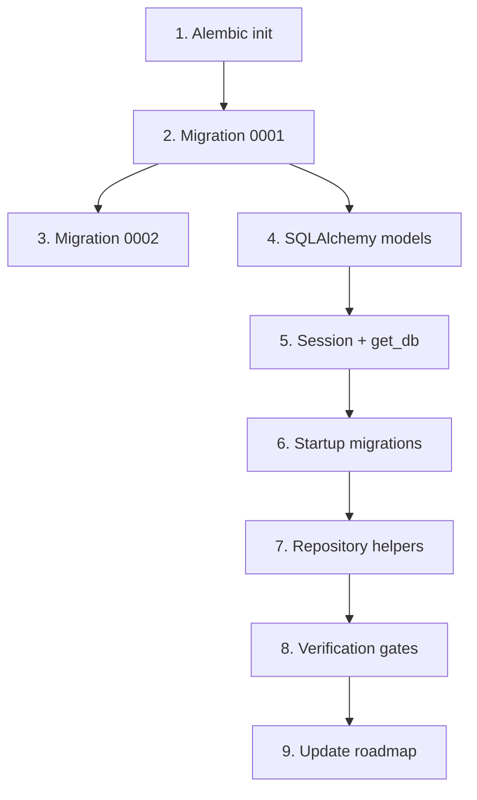

# Phase 1 — Database & Core Models

## Context

**Phase 0 is complete.** The repo has a runnable Docker Compose stack (`postgres`, `api`, `frontend`), a FastAPI app shell with health endpoint, and placeholder database modules. Phase 1 delivers the full schema and ORM layer that all subsequent phases depend on.

**Authoritative spec:** [`documents/database-design.md`](./database-design.md)  
**Roadmap reference:** [`documents/roadmap.md`](./roadmap.md) — Phase 1 section

### Current scaffold state

| Path | State |
|------|-------|
| `alembic/` | README placeholder only; no `env.py` or `versions/` |
| `api/app/database/base.py` | Stub comment |
| `api/app/database/models.py` | Stub comment |
| `api/app/database/session.py` | Engine init + `check_database()` only; no session factory |
| `api/app/repositories/` | Empty `__init__.py` |
| `api/app/main.py` | `init_engine()` on startup; no Alembic, no `get_db` |

### Dependency graph



---

## Work Breakdown

### Step 1 — Initialise Alembic

**Goal:** Alembic can connect to PostgreSQL and discover ORM metadata.

**Files to create/modify:**

| File | Action |
|------|--------|
| `alembic.ini` | Create at repo root (or `api/alembic.ini` — pick one location and keep consistent with Docker `WORKDIR`) |
| `alembic/env.py` | Create — sync engine from `DATABASE_URL`, `target_metadata = Base.metadata` |
| `alembic/script.py.mako` | Create — standard Alembic template |
| `alembic/versions/.gitkeep` | Ensure directory exists |
| `api/app/database/base.py` | Implement `DeclarativeBase` subclass |

**Configuration decisions:**

- Use **sync** SQLAlchemy engine (`postgresql+psycopg://...`) — matches existing `session.py` and Alembic conventions.
- Read `DATABASE_URL` from environment (same as `api/app/core/config.py` settings).
- Import all models in `env.py` so `Base.metadata` is fully populated before autogenerate (even if migrations are hand-written).

**Acceptance:** `alembic current` runs without error when Postgres is up.

---

### Step 2 — Migration `0001_initial_schema`

**Goal:** Single reversible migration creating the complete DDL per [`database-design.md`](./database-design.md).

**Create:** `alembic/versions/0001_initial_schema.py`

**Upgrade order (dependency-safe):**

1. Extensions: `pgcrypto`, `vector`
2. Enums (7): `film_status`, `enrichment_status`, `import_job_status`, `review_status`, `embedding_type`, `rss_event_type`, `artifact_type`
3. Tables (14, in order):
   - `import_jobs`
   - `films`
   - `film_metadata`
   - `film_semantic_profiles`
   - `film_embeddings`
   - `watchlist_entries`
   - `metadata_match_reviews`
   - `recommendation_profiles`
   - `recommendation_sessions`
   - `recommendation_candidates`
   - `recommendation_results`
   - `recommendation_exposure`
   - `rss_sync_events`
   - `system_versions`
4. All `ALTER TABLE ... ADD CONSTRAINT` checks from §4 and §6
5. All indexes from §7 (B-tree, GIN, partial, unique)
6. HNSW indexes:
   - `idx_film_embeddings_semantic_hnsw` on `film_embeddings` (`WHERE embedding_type = 'semantic'`)
   - `idx_rec_profiles_embedding_hnsw` on `recommendation_profiles` (`WHERE embedding IS NOT NULL`)
7. `set_updated_at()` function + triggers on tables with `updated_at`:
   - `films`
   - `film_metadata`
8. View: `v_recommendation_candidates_detail` (§8)

**Downgrade:** Drop in reverse order (view → triggers → function → indexes → tables → enums → extensions).

**Notes:**

- Use `op.execute()` for pgvector `VECTOR(1536)` columns and HNSW indexes where Alembic autogenerate is insufficient.
- PostgreSQL 16 `UNIQUE NULLS NOT DISTINCT` for `watchlist_entries.uq_watchlist_film_active`.
- Trigger syntax: `EXECUTE FUNCTION set_updated_at()` per database-design.md (PG 14+).

**Acceptance:** `alembic upgrade head` on a fresh database completes without errors.

---

### Step 3 — Migration `0002_seed_system_versions`

**Goal:** Seed active version registry rows required by later phases.

**Create:** `alembic/versions/0002_seed_system_versions.py`

**Seed data** (from database-design.md §11):

```sql
INSERT INTO system_versions (artifact_type, artifact_name, version, active) VALUES
    ('semantic',  'semantic-profile', 'semantic-v1',       TRUE),
    ('embedding', 'film-embedding',   'embedding-v1',    TRUE),
    ('scoring',   'recommendation',   'scoring-v1',      TRUE),
    ('prompt',    'ranking-prompt',   'recommendation-v1', TRUE);
```

**Downgrade:** `DELETE FROM system_versions WHERE version IN (...)` or truncate.

**Acceptance:** After upgrade, `SELECT * FROM system_versions WHERE active = true` returns 4 rows.

---

### Step 4 — SQLAlchemy ORM models

**Goal:** Models mirror all tables and enums; usable by repositories and Alembic metadata.

**Files:**

| File | Contents |
|------|----------|
| `api/app/database/base.py` | `Base = DeclarativeBase` |
| `api/app/database/models.py` | All 14 model classes (or split into `models/` package if file grows large) |
| `api/app/database/__init__.py` | Re-export `Base`, models, session helpers |

**Model requirements:**

- Map all 7 PostgreSQL enums via `sqlalchemy.Enum` with `native_enum=True` and `create_constraint=False` (enums created in migration).
- Use `pgvector.sqlalchemy.Vector(1536)` for embedding columns.
- Match column types, defaults, nullability, and FK `ondelete` behaviour from database-design.md.
- Define `relationship()` where useful for Phase 2+ (e.g. `Film.metadata`, `Film.watchlist_entries`).

**Suggested model groups (can be one file or submodules):**

```
ImportJob, Film, FilmMetadata, FilmSemanticProfile, FilmEmbedding,
WatchlistEntry, MetadataMatchReview, RecommendationProfile,
RecommendationSession, RecommendationCandidate, RecommendationResult,
RecommendationExposure, RssSyncEvent, SystemVersion
```

**Acceptance:** `from app.database.models import *` imports without error; `Base.metadata.tables` contains all 14 tables.

---

### Step 5 — Database session dependency

**Goal:** FastAPI routes and repositories can inject a scoped DB session.

**Modify:** `api/app/database/session.py`

**Implement:**

- `SessionLocal = sessionmaker(bind=engine, autoflush=False, autocommit=False)`
- Refactor `init_engine()` to also create/rebind `SessionLocal`
- `get_db()` generator: `yield session` → `finally: session.close()`
- Keep existing `check_database()` for health endpoint

**Acceptance:** `get_db` can be used as `Depends(get_db)` in a test route or unit test.

---

### Step 6 — Run migrations on API startup

**Goal:** Fresh deployments self-bootstrap schema before serving traffic.

**Modify:** `api/app/main.py` lifespan

**Implement:**

```python
from alembic.config import Config
from alembic import command

# In lifespan, after init_engine:
alembic_cfg = Config("alembic.ini")  # adjust path for Docker WORKDIR
alembic_cfg.set_main_option("sqlalchemy.url", settings.database_url)
command.upgrade(alembic_cfg, "head")
```

**Docker considerations:**

- Ensure `alembic.ini` and `alembic/` are copied into the API image (update `api/Dockerfile` if Alembic lives at repo root).
- API `depends_on: postgres` is not sufficient for readiness — add retry loop or wait-for-it if migrations fail on cold start.

**Acceptance:** `docker compose up` on a fresh volume runs migrations and `GET /api/v1/health` returns `database: ok`.

---

### Step 7 — Basic repository helpers

**Goal:** Thin data-access helpers for lookups needed in Phase 2+.

**Create (suggested):**

| Module | Helpers |
|--------|---------|
| `api/app/repositories/film_repository.py` | `get_by_id`, `get_by_letterboxd_uri`, `list_by_enrichment_status` |
| `api/app/repositories/system_version_repository.py` | `get_active_by_artifact_type`, `get_active_version(name)` |
| `api/app/repositories/import_job_repository.py` | `get_by_id`, `create`, `update_counters` |

**Conventions:**

- Repositories accept `Session` as first argument (no global session).
- No business logic — query/CRUD only.
- Re-export from `api/app/repositories/__init__.py` if helpful.

**Acceptance:** Unit or integration tests can call repository methods against a migrated test database.

---

## Verification Gates

Run these checks after all implementation steps. **All must pass before marking Phase 1 complete.**

### Gate 1 — Fresh database bootstrap

```bash
# Tear down and recreate database volume
docker compose down -v
docker compose up -d postgres
# Wait for postgres ready, then:
docker compose run --rm api alembic upgrade head
```

**Pass criteria:** Exit code 0, no migration errors.

### Gate 2 — Schema inventory (14 tables, enums, view)

Connect to Postgres and verify:

```bash
docker compose exec postgres psql -U cuebox -d cuebox -c "\dt"
docker compose exec postgres psql -U cuebox -d cuebox -c "\dT+"
docker compose exec postgres psql -U cuebox -d cuebox -c "\dv"
```

**Pass criteria:**

| Check | Expected |
|-------|----------|
| Tables | 14: `import_jobs`, `films`, `film_metadata`, `film_semantic_profiles`, `film_embeddings`, `watchlist_entries`, `metadata_match_reviews`, `recommendation_profiles`, `recommendation_sessions`, `recommendation_candidates`, `recommendation_results`, `recommendation_exposure`, `rss_sync_events`, `system_versions` |
| Enums | 7 types from database-design.md §3 |
| View | `v_recommendation_candidates_detail` exists |

Optional scripted check:

```sql
SELECT COUNT(*) FROM information_schema.tables
WHERE table_schema = 'public' AND table_type = 'BASE TABLE';
-- Expect: 14
```

### Gate 3 — Seed data

```bash
docker compose exec postgres psql -U cuebox -d cuebox -c \
  "SELECT artifact_type, artifact_name, version FROM system_versions WHERE active = true ORDER BY artifact_name;"
```

**Pass criteria:** Exactly 4 rows (`semantic-v1`, `embedding-v1`, `scoring-v1`, `recommendation-v1`).

### Gate 4 — HNSW indexes

```bash
docker compose exec postgres psql -U cuebox -d cuebox -c \
  "SELECT indexname, indexdef FROM pg_indexes WHERE indexdef ILIKE '%hnsw%';"
```

**Pass criteria:** At least 2 indexes:

- `idx_film_embeddings_semantic_hnsw`
- `idx_rec_profiles_embedding_hnsw`

### Gate 5 — Startup integration

```bash
docker compose up -d
curl -s http://localhost:8000/api/v1/health | jq .
```

**Pass criteria:** `status: ok`, `database: ok`.

### Gate 6 — Regression

```bash
cd api && pytest tests/ -v
```

**Pass criteria:** Existing health tests still pass.

---

## Roadmap Update Procedure

Update [`documents/roadmap.md`](./roadmap.md) **incrementally as work completes**, then do a final pass when all gates pass.

### Per-task checklist updates

As each todo completes, change `- [ ]` → `- [x]` in the Phase 1 **Task Checklist**:

| Roadmap item | Mark complete when |
|--------------|-------------------|
| Initialise Alembic | `env.py` runs; `alembic current` works |
| Create migration `0001_initial_schema` | Gate 1 + Gate 2 pass |
| Create migration `0002_seed_system_versions` | Gate 3 passes |
| Implement SQLAlchemy models | All models import; metadata has 14 tables |
| Implement `get_db` | Session dependency usable in tests |
| Run `alembic upgrade head` on startup | Gate 5 passes |
| Add repository helpers | Repository modules exist and are tested |

### Verification gate updates

When all gates pass, check off all four items in Phase 1 **Verification Gate**:

- [x] Fresh database bootstraps via `alembic upgrade head` without errors
- [x] All 14 tables, enums, indexes, and view exist
- [x] `SELECT * FROM system_versions WHERE active = true` returns 4 rows
- [x] HNSW indexes present on `film_embeddings` and `recommendation_profiles`

### Overview section update

Change the **Current state** line at the top of `roadmap.md`:

```markdown
**Current state:** Phase 1 complete. Full PostgreSQL schema deployed via Alembic; SQLAlchemy models, session dependency, and repository helpers in place. Next up: Phase 2 — Import, Metadata Matching & Enrichment Pipeline.
```

### Commit discipline

- One commit per major step (or logical grouping) with message prefix `phase-1:`.
- Include roadmap checkbox updates in the final commit or gate-verification commit.
- Do not mark roadmap items complete before the corresponding gate/check passes.

---

## Risks & Mitigations

| Risk | Mitigation |
|------|------------|
| pgvector HNSW DDL not supported by Alembic autogenerate | Hand-write `op.execute()` for vector columns and HNSW indexes |
| Alembic path mismatch between local dev and Docker | Co-locate `alembic.ini` with API package; copy into Docker image |
| Postgres not ready when API starts migrations | Retry loop in lifespan or `depends_on` + healthcheck |
| Enum/type drift between migration and ORM | Generate models from spec; verify with `\dT` and model inspection |
| `updated_at` triggers missing on `film_metadata` | Explicit checklist item in 0001 migration |

---

## Deliverables Summary

| Deliverable | Path |
|-------------|------|
| Alembic config | `alembic.ini`, `alembic/env.py`, `alembic/script.py.mako` |
| Schema migration | `alembic/versions/0001_initial_schema.py` |
| Seed migration | `alembic/versions/0002_seed_system_versions.py` |
| ORM models | `api/app/database/models.py` (+ `base.py`) |
| Session DI | `api/app/database/session.py` — `get_db` |
| Startup hook | `api/app/main.py` — `alembic upgrade head` |
| Repositories | `api/app/repositories/*.py` |
| Tests (optional) | `api/tests/test_migrations.py`, `api/tests/test_repositories.py` |
| Roadmap | `documents/roadmap.md` — Phase 1 checked off |

---

## Exit Criteria

Phase 1 is **done** when:

1. All 9 todos in this plan are `completed`
2. All 6 verification gates pass
3. `documents/roadmap.md` Phase 1 task checklist and verification gate are fully checked
4. Overview reflects Phase 1 complete / Phase 2 next
5. Changes are committed, pushed, and PR is ready for review
