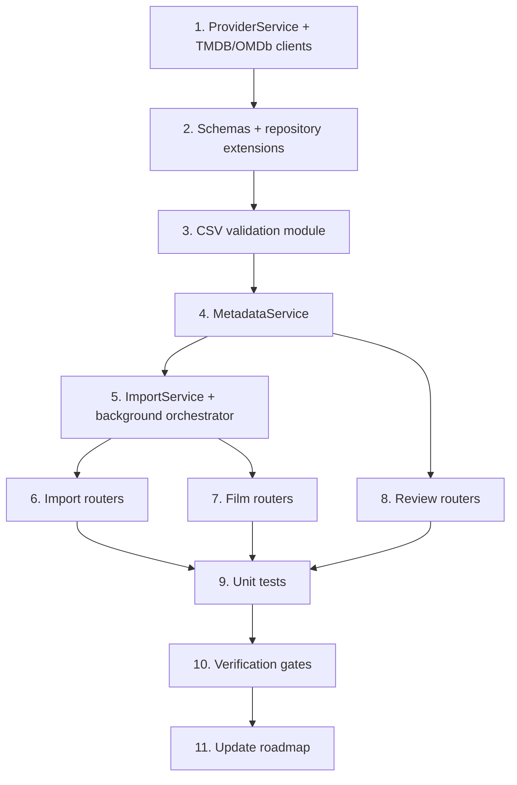

# Phase 2 — Import, Metadata Matching & Enrichment Pipeline (Part 1)

## Context

**Phase 1 is complete.** The repo has a runnable Docker Compose stack, full PostgreSQL schema via Alembic, SQLAlchemy ORM models, session dependency, and basic repository helpers for films, import jobs, and system versions.

**Phase 2 delivers the import and metadata-matching pipeline.** Users upload a Letterboxd watchlist CSV, receive an immediate job ID, and poll for progress while TMDB/OMDb enrichment runs asynchronously. Low-confidence matches surface for manual review.

**Phase 2 scope boundary:** Metadata matching and persistence only. Films that pass metadata matching transition to `enrichment_status = enriching`. Semantic enrichment and embeddings (transition to `ready`) are **Phase 3**. The background orchestrator should expose a continuation hook so Phase 3 can plug in without rewriting import/metadata code.

**Authoritative specs:**

| Document | Sections |
|----------|----------|
| [`documents/api-contracts.md`](./api-contracts.md) | §3 Import, §4 Films, §5 Reviews |
| [`documents/Architecture.md`](./Architecture.md) | §6–8 pipeline, §16 confidence scoring |
| [`documents/database-design.md`](./database-design.md) | `films`, `film_metadata`, `watchlist_entries`, `metadata_match_reviews`, `import_jobs` |
| [`documents/sequence-diagrams.md`](./sequence-diagrams.md) | §1–§4 |
| [`documents/roadmap.md`](./roadmap.md) | Phase 2 section |

### Current scaffold state

| Path | State |
|------|-------|
| `api/app/services/` | Empty `__init__.py` only |
| `api/app/providers/` | Empty `__init__.py` only |
| `api/app/routers/v1/` | Health router only |
| `api/app/repositories/` | `film_repository`, `import_job_repository`, `system_version_repository` |
| `api/app/core/config.py` | AI provider config; `TMDB_API_KEY` / `OMDB_API_KEY` in Settings |
| `config.example.yaml` | No metadata provider section yet |
| `api/pyproject.toml` | `httpx` present; suitable for TMDB/OMDb clients |

### Dependency graph



---

## Work Breakdown

### Step 1 — Provider Service & external clients

**Goal:** Resolve metadata provider clients from configuration and environment; encapsulate TMDB/OMDb HTTP calls.

**Files to create:**

| File | Responsibility |
|------|----------------|
| `api/app/providers/tmdb.py` | TMDB v3 client: `search_movie`, `get_movie_details`, `get_movie_keywords`, `get_movie_credits` |
| `api/app/providers/omdb.py` | OMDb client: fetch by `imdb_id`, extract Rotten Tomatoes score |
| `api/app/services/provider_service.py` | Factory/resolver for TMDB and OMDb clients |

**Config extension** — add metadata providers to `config.example.yaml` and `AppConfig`:

```yaml
providers:
  metadata:
    tmdb:
      enabled: true
    omdb:
      enabled: true
  embedding:
    # ... existing
```

API keys remain in `.env` (`TMDB_API_KEY`, `OMDB_API_KEY`) per existing convention.

**TMDB client requirements:**

- Base URL: `https://api.themoviedb.org/3`
- Auth: `api_key` query parameter
- Use `httpx.AsyncClient` with reasonable timeouts (connect 5s, read 30s)
- Retry transient 429/5xx with exponential backoff (max 3 attempts, respect `Retry-After`)
- Map responses to internal Pydantic/dataclass models (decouple from raw JSON)

**OMDb client requirements:**

- Base URL: `http://www.omdbapi.com/`
- Parse `Ratings` array for `Source: "Rotten Tomatoes"` → integer percent
- Graceful degradation: missing RT score is not a failure

**ProviderService interface:**

```python
class ProviderService:
    def get_tmdb_client(self) -> TmdbClient: ...
    def get_omdb_client(self) -> OmdbClient | None: ...  # None when disabled or no key
```

**Acceptance:** Clients can be instantiated in tests with mocked `httpx` transport; missing API key raises clear error at enrichment time (not at import).

---

### Step 2 — Pydantic schemas & repository extensions

**Goal:** Typed API contracts and data-access helpers for Phase 2 endpoints.

**Schemas** (`api/app/schemas/`):

| Module | Models |
|--------|--------|
| `import_schemas.py` | `ImportJobResponse`, `ImportJobStatusResponse`, `FailureSummaryItem` |
| `film_schemas.py` | `FilmSummary`, `FilmDetail`, `FilmMetadataBlock`, `FilmListResponse`, `ReviewRequiredItem`, `PaginationMeta` |
| `review_schemas.py` | `ReviewActionResponse` |

Match field names and types exactly to [api-contracts.md §3–§5](./api-contracts.md).

**Repository extensions:**

| Module | New helpers |
|--------|-------------|
| `watchlist_repository.py` | `create_active_entry`, `get_active_by_film_id` |
| `film_metadata_repository.py` | `upsert`, `get_by_film_id` |
| `metadata_review_repository.py` | `create`, `get_by_id`, `list_pending`, `update_status` |
| `film_repository.py` | `list_films` (filters + pagination), `create`, `update_enrichment_status`, `count_by_import_job_status` |
| `import_job_repository.py` | `mark_complete`, `list_films_for_job` |

**Acceptance:** Schemas validate against api-contracts JSON examples; repositories are thin (no business logic).

---

### Step 3 — CSV validation

**Goal:** Parse and validate Letterboxd watchlist CSV per api-contracts §3.1.

**Create:** `api/app/services/csv_parser.py` (or `api/app/utils/csv_validation.py`)

**Rules:**

| Rule | Error code |
|------|------------|
| File missing or empty | `VALIDATION_ERROR` |
| Not CSV content type / extension | `VALIDATION_ERROR` / `INVALID_CSV_FORMAT` |
| Missing required columns (`Date`, `Title`, `Year`, `Letterboxd URI`) — case-sensitive | `INVALID_CSV_FORMAT` |
| Empty `Letterboxd URI` on any row | `INVALID_CSV_FORMAT` |
| `Year` not blank and not 4-digit integer in 1880..(current year + 2) | `INVALID_CSV_FORMAT` |
| More than 500 unique rows (after in-file dedup by `letterboxd_uri`) | `WATCHLIST_SIZE_EXCEEDED` |

**In-file duplicate handling:** Keep first occurrence; count duplicates for reporting (not an error).

**Output:** `list[ParsedWatchlistRow]` dataclass with `title`, `year`, `letterboxd_uri`, `date`.

**Acceptance:** Unit tests cover valid file, missing columns, bad year, 501 films, duplicate URIs within file.

---

### Step 4 — Metadata Service

**Goal:** Match films to TMDB, score confidence, persist metadata, supplement with OMDb, handle failures.

**Create:** `api/app/services/metadata_service.py`

#### Per-film pipeline

```
pending → matching → (metadata outcome) → enriching | review_required | failed
```

1. Set `enrichment_status = matching`
2. TMDB search by title (+ year when present); pick best candidate or top-N for scoring
3. Fetch full movie details + keywords (+ credits for director)
4. Compute confidence score (see below)
5. Branch on confidence threshold
6. If metadata accepted: persist `film_metadata`, OMDb RT supplementation, set `enriching`
7. On TMDB not found / provider error: set `failed`, record reason for `failure_summary`

#### Confidence scoring

Inputs per [Architecture.md §16](./Architecture.md): title similarity, release year match, director match.

**Proposed algorithm** (unit-testable, no external deps):

| Signal | Weight | Scoring |
|--------|--------|---------|
| Title similarity | 0.55 | `difflib.SequenceMatcher` on normalized titles (lowercase, strip punctuation/articles) |
| Year match | 0.30 | Exact = 1.0; off by 1 = 0.7; off by 2+ = 0.0; CSV year blank = 0.5 (neutral) |
| Director match | 0.15 | 1.0 if CSV director matches TMDB primary director; 0.5 if CSV director blank; 0.0 if mismatch |

Renormalize weights when director signal is N/A (no credits data).

**Threshold actions** (per roadmap + sequence diagrams):

| Confidence | Action |
|------------|--------|
| ≥ 0.95 | Auto-accept: insert `film_metadata`, `enrichment_status → enriching` |
| 0.80 – 0.94 | Accept + flag: insert `film_metadata`, create `metadata_match_reviews` (`review_status: pending`, `candidate_payload` snapshot), `enrichment_status → enriching` |
| < 0.80 | Manual review: create `metadata_match_reviews` (`review_status: pending`), `enrichment_status → review_required`; **no** `film_metadata` yet |
| No TMDB match | `enrichment_status → failed`, reason `"TMDB match not found"` |

#### `film_metadata` fields to persist

`tmdb_id`, `imdb_id`, `original_title`, `runtime`, `synopsis`, `genres`, `keywords`, `original_language`, `country`, `director`, `tmdb_rating`, `rotten_tomatoes_score`, `poster_url`, `backdrop_url`, `match_confidence`, `metadata_source: "tmdb"`.

`letterboxd_rating` remains null until sync features populate it (Phase 4).

#### Review accept / reject

**Accept** (`POST /reviews/{review_id}/accept`):

- Validate review is `pending` and film is `review_required`
- Insert `film_metadata` from `candidate_payload` + full TMDB fetch if needed
- Set review `accepted`, `reviewed_at`
- Set film `enrichment_status → enriching`
- Schedule pipeline continuation hook (no-op stub until Phase 3)

**Reject** (`POST /reviews/{review_id}/reject`):

- Set review `rejected`, `reviewed_at`
- Set film `enrichment_status → failed`
- Increment job `failed_films`, append `failure_summary`

**Acceptance:** Unit tests for confidence thresholds; integration test with mocked TMDB responses.

---

### Step 5 — Import Service & background orchestrator

**Goal:** `POST /import` returns immediately; enrichment runs via FastAPI `BackgroundTasks`.

**Create:** `api/app/services/import_service.py`

#### `POST /import` flow

1. Validate uploaded file via CSV parser
2. Create `import_jobs` (`status: running`)
3. For each parsed row:
   - If `letterboxd_uri` already exists in DB → increment `duplicate_films`, skip insert
   - Else insert `films` (`enrichment_status: pending`, `status: active`, `import_job_id`)
   - Insert `watchlist_entries` (`active: true`)
4. Set `total_films` on job
5. Schedule `run_import_enrichment(job_id)` background task
6. Return `202 Accepted` with `job_id`

**Response time target:** < 1 second for job creation (roadmap Phase 8 NFR; validate in gates).

#### Background orchestrator

```python
async def run_import_enrichment(job_id: UUID) -> None:
    # Open DB session
    # For each film in job with enrichment_status in (pending,):
    #   await metadata_service.enrich_film(film_id)
    #   Update job counters
    #   Check job completion
```

**Concurrency:** Process films sequentially in Phase 2 to respect TMDB rate limits (4 req/s). Add configurable delay between films if needed. Parallelism can be introduced in Phase 3 with a semaphore.

**Job counter updates** after each film reaches a metadata-terminal state:

- `failed` → `failed_films++`, append to `failure_summary`
- `review_required` → counts as processed (metadata stage complete, awaiting user)
- `enriching` → counts as processed (metadata stage complete; Phase 3 will advance to `ready`)

#### Job completion semantics (Phase 2)

**Important:** api-contracts §3.2 defines `processed_films` as films in terminal states `ready` or `failed`. For Phase 2 (metadata-only), extend the aggregation logic:

| State | Counted in `processed_films`? | Rationale |
|-------|-------------------------------|-----------|
| `failed` | Yes | Terminal |
| `review_required` | Yes | Metadata stage complete; awaiting user |
| `enriching` | Yes | Metadata stage complete; semantic pending (Phase 3) |
| `ready` | Yes | Full pipeline terminal (Phase 3+) |
| `pending`, `matching` | No | Still in progress |

Set `status: complete` when `processed_films == total_films` (all films exited metadata matching). Set `completed_at` timestamp.

Document this interpretation in a code comment; align api-contracts wording in a follow-up doc PR if needed.

#### `GET /import/{job_id}/status`

- Load job by ID; `404` if missing
- Aggregate live counts from `films` table for the job (don't rely solely on stale counters)
- Build `failure_summary` array from failed films when `failed_films > 0`
- Return response per api-contracts §3.2

**Acceptance:** Import returns `202` immediately; background task processes films; status endpoint reflects live progress.

---

### Step 6 — Import routers

**Create:** `api/app/routers/v1/import.py`

| Endpoint | Status | Notes |
|----------|--------|-------|
| `POST /import` | 202 | `UploadFile`, schedule background task |
| `GET /import/{job_id}/status` | 200 | UUID path param |

Register in `api/app/routers/v1/__init__.py`.

**Acceptance:** OpenAPI docs show both endpoints; error codes match api-contracts.

---

### Step 7 — Film routers

**Create:** `api/app/routers/v1/films.py`

| Endpoint | Notes |
|----------|-------|
| `GET /films` | Query: `status`, `enrichment_status`, `limit`, `offset`; join `film_metadata` for poster/director/genres |
| `GET /films/{film_id}` | Full detail; `metadata` block when present; `semantic_profile: null` until Phase 3 |
| `GET /films/review-required` | Join `metadata_match_reviews` where `review_status = pending` and film `enrichment_status = review_required` |

**Acceptance:** List/detail responses match api-contracts §4 JSON shapes.

---

### Step 8 — Review routers

**Create:** `api/app/routers/v1/reviews.py`

| Endpoint | Notes |
|----------|-------|
| `POST /reviews/{review_id}/accept` | Delegate to MetadataService; `409` if already resolved |
| `POST /reviews/{review_id}/reject` | Delegate to MetadataService; `409` if already resolved |

**Acceptance:** Accept transitions film to `enriching`; reject to `failed`.

---

### Step 9 — Unit & integration tests

**Unit tests** (`api/tests/`):

| File | Coverage |
|------|----------|
| `test_csv_parser.py` | Column validation, year range, 500 limit, dedup |
| `test_confidence_scoring.py` | Threshold boundaries (0.79, 0.80, 0.94, 0.95) |
| `test_import_job_status.py` | Counter aggregation, completion detection |

**Integration tests** (mocked HTTP):

| File | Coverage |
|------|----------|
| `test_import_api.py` | POST /import → GET status with respx/httpx mock |
| `test_review_api.py` | Accept/reject flows |

Use `pytest` + existing test DB patterns from `test_database.py`.

**Acceptance:** `cd api && pytest tests/ -v` passes.

---

## Verification Gates

Run these checks after all implementation steps. **All must pass before marking Phase 2 complete.**

### Prerequisites

```bash
# Ensure API keys are set
cp config.example.yaml config.yaml
cp .env.example .env
# Edit .env: DATABASE_URL, TMDB_API_KEY, (optional) OMDB_API_KEY

# Place test fixture (gitignored)
mkdir -p letterboxd
# Copy or symlink watchlist.csv into letterboxd/
```

### Gate 1 — Stack health

```bash
docker compose up -d
curl -s http://localhost:8000/api/v1/health | jq .
```

**Pass criteria:** `status: ok`, `database: ok`.

### Gate 2 — Import returns immediately

```bash
time curl -s -o /dev/null -w "%{http_code}\n" \
  -F "file=@letterboxd/watchlist.csv" \
  http://localhost:8000/api/v1/import
```

**Pass criteria:**

| Check | Expected |
|-------|----------|
| HTTP status | `202` |
| Response body | Contains `job_id`, `status: "running"`, `created_at` |
| Elapsed time | < 1 second (job creation only) |

Capture `job_id` for subsequent gates.

### Gate 3 — Job completes with accurate counts

```bash
JOB_ID="<from gate 2>"
until [ "$(curl -s http://localhost:8000/api/v1/import/$JOB_ID/status | jq -r .status)" = "complete" ]; do
  sleep 3
done
curl -s http://localhost:8000/api/v1/import/$JOB_ID/status | jq .
```

**Pass criteria:**

| Check | Expected |
|-------|----------|
| `status` | `complete` |
| `total_films` | Matches unique rows in CSV |
| `processed_films` | Equals `total_films` |
| `processed_films` | Equals sum of films in `enriching` + `review_required` + `failed` (+ `ready` if any) |
| `duplicate_films` | Matches re-import behavior (0 on first import) |
| `completed_at` | Non-null ISO 8601 timestamp |
| `failure_summary` | Present and accurate when `failed_films > 0` |

Verify film states in database:

```bash
docker compose exec postgres psql -U cuebox -d cuebox -c \
  "SELECT enrichment_status, COUNT(*) FROM films GROUP BY enrichment_status ORDER BY 1;"
```

**Pass criteria:** No films remain in `pending` or `matching`; outcomes are `enriching`, `review_required`, and/or `failed`.

### Gate 4 — Film list endpoints

```bash
curl -s "http://localhost:8000/api/v1/films?limit=5" | jq .
curl -s "http://localhost:8000/api/v1/films/$(curl -s 'http://localhost:8000/api/v1/films?limit=1' | jq -r '.data[0].id')" | jq .
```

**Pass criteria:**

| Check | Expected |
|-------|----------|
| List response | `data` array + `pagination` object |
| Film summary fields | `id`, `title`, `enrichment_status`, `poster_url` (when metadata exists) |
| Detail response | `metadata` block populated for `enriching` films; `semantic_profile: null` |

### Gate 5 — Review-required flow

```bash
curl -s "http://localhost:8000/api/v1/films/review-required" | jq .
```

**Pass criteria:** Each item has `review_id`, `candidate_payload`, `confidence_score`.

If pending reviews exist, exercise accept and reject:

```bash
REVIEW_ID="<from above>"
curl -s -X POST "http://localhost:8000/api/v1/reviews/$REVIEW_ID/accept" | jq .
# Verify film enrichment_status → enriching

REVIEW_ID="<another pending>"
curl -s -X POST "http://localhost:8000/api/v1/reviews/$REVIEW_ID/reject" | jq .
# Verify film enrichment_status → failed
```

**Pass criteria:**

| Action | Film state after |
|--------|------------------|
| Accept | `enriching` |
| Reject | `failed` |
| Re-accept/re-reject same review | `409 CONFLICT` |

### Gate 6 — Error cases

```bash
# Invalid CSV (wrong columns)
echo "foo,bar" > /tmp/bad.csv
curl -s -F "file=@/tmp/bad.csv" http://localhost:8000/api/v1/import | jq .

# Unknown job ID
curl -s http://localhost:8000/api/v1/import/00000000-0000-0000-0000-000000000099/status | jq .
```

**Pass criteria:** `INVALID_CSV_FORMAT` (400), `NOT_FOUND` (404) with standardized error envelope.

### Gate 7 — Regression

```bash
cd api && pytest tests/ -v
```

**Pass criteria:** All tests pass (Phase 0/1 health + new Phase 2 tests).

---

## Roadmap Update Procedure

Update [`documents/roadmap.md`](./roadmap.md) **incrementally as work completes**, then do a final pass when all gates pass.

### Per-task checklist updates

As each todo completes, change `- [ ]` → `- [x]` in the Phase 2 **Task Checklist**:

| Roadmap item | Mark complete when |
|--------------|-------------------|
| Implement `ProviderService` | TMDB/OMDb clients work with mocked integration test |
| Implement TMDB client | Search + details + keywords return typed models |
| Implement OMDb client | RT score parsed when available |
| `POST /import` | Gate 2 passes |
| `GET /import/{job_id}/status` | Gate 3 passes |
| FastAPI Background Task orchestrator | Films process asynchronously after import |
| TMDB search by title + year | MetadataService unit tests pass |
| Confidence scoring | Threshold unit tests pass |
| Persist `film_metadata` | Gate 4 detail endpoint shows metadata block |
| OMDb supplementation | RT score present when OMDb key configured |
| Handle enrichment failures | `failure_summary` populated in Gate 3 |
| `GET /films` | Gate 4 list passes |
| `GET /films/{film_id}` | Gate 4 detail passes |
| `GET /films/review-required` | Gate 5 passes |
| `POST /reviews/{review_id}/accept` | Gate 5 accept path passes |
| `POST /reviews/{review_id}/reject` | Gate 5 reject path passes |

### Verification gate updates

When all gates pass, check off all five items in Phase 2 **Verification Gate**:

- [x] Upload `letterboxd/watchlist.csv` via `POST /import`; response returns immediately with `job_id`
- [x] Poll `GET /import/{job_id}/status` until `status: complete`
- [x] Films reach `enriching`, `review_required`, or `failed` with accurate counts
- [x] `GET /films/review-required` returns low-confidence matches with `candidate_payload`
- [x] Accept/reject review transitions film status correctly

> **Note:** Update the third gate bullet from `ready` to `enriching` when checking off — Phase 2 completes at metadata stage; `ready` is Phase 3.

### Overview section update

Change the **Current state** line at the top of `roadmap.md`:

```markdown
**Current state:** Phase 2 complete. Watchlist CSV import with async TMDB/OMDb metadata enrichment, confidence scoring, match review endpoints, and film listing APIs in place. Next up: Phase 3 — Semantic Enrichment & Embeddings.
```

### Commit discipline

- Prefix commits with `phase-2:` (e.g. `phase-2: add TMDB client and ProviderService`).
- Include roadmap checkbox updates in the gate-verification commit.
- Do not mark roadmap items complete before the corresponding gate/check passes.

---

## Risks & Mitigations

| Risk | Mitigation |
|------|------------|
| TMDB rate limits during bulk import | Sequential processing; exponential backoff on 429; optional inter-film delay |
| TMDB search ambiguity (duplicate titles) | Year-weighted scoring; flag 80–95% matches for review |
| `processed_films` semantics vs api-contracts | Document Phase 2 interpretation (`enriching` counts as processed); align docs in Phase 3 |
| Background task DB session lifecycle | Open dedicated session per film in background task; commit after each film |
| Missing OMDb key | Skip RT supplementation silently; `rotten_tomatoes_score` remains null |
| CSV encoding issues | Try UTF-8 with BOM fallback; reject undecodable files with `INVALID_CSV_FORMAT` |
| Accept review without persisted metadata | Fetch full TMDB details on accept if `candidate_payload` is snapshot-only |
| Duplicate import of same URI | Skip insert, increment `duplicate_films` (not an error) |

---

## Deliverables Summary

| Deliverable | Path |
|-------------|------|
| TMDB client | `api/app/providers/tmdb.py` |
| OMDb client | `api/app/providers/omdb.py` |
| Provider service | `api/app/services/provider_service.py` |
| CSV parser | `api/app/services/csv_parser.py` |
| Import service | `api/app/services/import_service.py` |
| Metadata service | `api/app/services/metadata_service.py` |
| API schemas | `api/app/schemas/import_schemas.py`, `film_schemas.py`, `review_schemas.py` |
| Repositories | `api/app/repositories/watchlist_repository.py`, `film_metadata_repository.py`, `metadata_review_repository.py` |
| Routers | `api/app/routers/v1/import.py`, `films.py`, `reviews.py` |
| Config update | `config.example.yaml`, `api/app/core/config.py` |
| Tests | `api/tests/test_csv_parser.py`, `test_confidence_scoring.py`, `test_import_api.py`, etc. |
| Roadmap | `documents/roadmap.md` — Phase 2 checked off |

---

## Exit Criteria

Phase 2 is **done** when:

1. All 11 todos in this plan are `completed`
2. All 7 verification gates pass
3. `documents/roadmap.md` Phase 2 task checklist and verification gate are fully checked
4. Overview reflects Phase 2 complete / Phase 3 next
5. Changes are committed, pushed, and PR is ready for review

---

## Implementation Order (recommended PR slicing)

For reviewable incremental PRs within Phase 2:

| PR slice | Contents | Gates partially satisfied |
|----------|----------|---------------------------|
| **2a — Providers** | TMDB/OMDb clients, ProviderService, config | — |
| **2b — Import** | CSV parser, ImportService, import routers, background orchestrator | Gates 1–3 |
| **2c — Metadata** | MetadataService, confidence scoring, failure handling | Gate 3 film states |
| **2d — Films & Reviews** | Film/review endpoints, repositories, schemas | Gates 4–6 |
| **2e — Gates & Roadmap** | Tests, gate verification, roadmap update | All gates |

Each slice should keep `pytest` green before merging.
