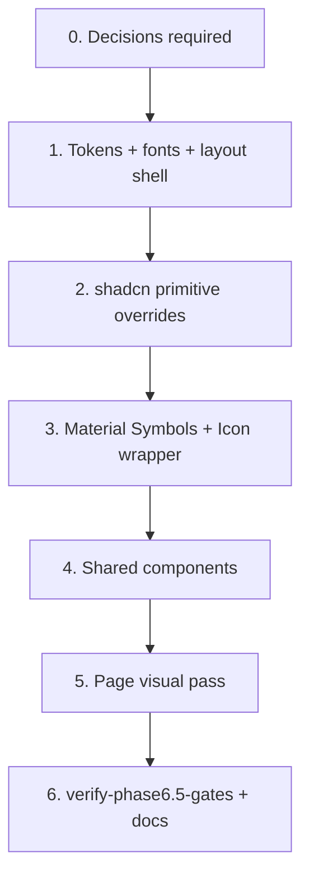

# Phase 6.5 — Design System Alignment (Modern Neo-Noir Cinema)

## Context

**Phase 6 is complete.** The frontend delivers all MVP journeys (import, review, questionnaire, results, history, sync) using **default shadcn/ui “new-york” styling**: neutral light-mode CSS variables, system fonts, `rounded-md` / `rounded-xl` corners, lucide-react icons, and ad-hoc light-theme warning colors (e.g. `border-amber-200 bg-amber-50` on the home review banner).

**[`documents/DESIGN.md`](./DESIGN.md)** defines the target **Modern Neo-Noir Cinema / Used Future** aesthetic: ultra-dark surfaces, Cabin + Libre Franklin + Space Mono typography, 4px industrial corners, chamfered primary buttons, terminal-like interactive states, optional film grain/scanline texture, and Material Symbols Outlined iconography.

**Phase 6.5 goal:** Restyle the existing UI to match DESIGN.md **without** changing routes, API contracts, or user journeys. Phase 7 (Developer Mode) should build on the aligned design system.

**Authoritative references:**

| Document | Purpose |
|----------|---------|
| [`documents/DESIGN.md`](./DESIGN.md) | **Source of truth** for tokens, typography, layout, interaction, icons |
| [`documents/roadmap.md`](./roadmap.md) | Phase 6.5 task checklist + verification gate (to be added) |
| [`documents/phase-6-plan.md`](./phase-6-plan.md) | Baseline frontend structure and gate pattern |
| [`scripts/verify-phase6-gates.sh`](../scripts/verify-phase6-gates.sh) | Regression baseline (must stay green) |

### Current vs target gap summary

| Area | Phase 6 (today) | DESIGN.md target |
|------|-----------------|------------------|
| **Color mode** | Light `:root` tokens; `.dark` unused | Dark-only viewport (`#111411` / `#121411` family) |
| **Palette** | shadcn neutral HSL (`--background`, `--primary`, …) | Semantic + M3-style tokens (`surface-container`, `accent-tertiary`, `secondary` lime, etc.) |
| **Typography** | System / Tailwind defaults | Cabin (headings), Libre Franklin (body), Space Mono (metadata) |
| **Corners** | `rounded-xl` cards, `rounded-md` buttons, pill badges | `4px` (`rounded` DEFAULT) on containers/posters; **no pills**; chamfered primary buttons |
| **Buttons** | Standard shadcn hover/focus | Hover glow (`accent-tertiary`), active 70% opacity + inner shadow, disabled 50% + greyscale |
| **Icons** | `lucide-react` (8 files) | Material Symbols Outlined; filled only for active nav |
| **Layout** | `container mx-auto px-4 py-8` | Mobile margin `16px`, desktop `48px`, `max-w-7xl` (1280px), `md` breakpoint 768px |
| **Atmosphere** | Flat background | Fixed grain or CRT scanline on `<main>` |
| **Metadata UI** | `text-sm text-muted-foreground` | Space Mono `label-md` / `title-lg` for scores, runtime, dl readouts |
| **Warnings** | Tailwind `amber-*` light-theme cards | Undefined in DESIGN.md — needs decision |

### Current scaffold inventory

| Path | Design relevance |
|------|------------------|
| `frontend/src/app/globals.css` | shadcn HSL variables — **replace/remap** |
| `frontend/tailwind.config.ts` | Extend with design spacing, radii, font families, custom colors |
| `frontend/src/app/layout.tsx` | Add fonts, `dark` class or dark-only `:root`, texture wrapper |
| `frontend/src/components/ui/*` | 18 shadcn primitives — **theme overrides** |
| `frontend/src/components/app-shell.tsx` | Nav structure — restyle + Material icons |
| `frontend/src/components/*.tsx` | 7 shared components — typography + surfaces |
| `frontend/src/app/**/page.tsx` | 9 routes — className pass, remove light-theme one-offs |

### Dependency graph



### Baseline (branch start)

```bash
bash scripts/verify-phase6-gates.sh
cd frontend && npx tsc --noEmit && npm run build
```

Mark `p65-baseline-gates` complete only when both succeed.

---

## Decisions required before executing

The following are **not fully specified** in DESIGN.md or contain **internal inconsistencies**. Resolve before implementation (design owner sign-off recommended).

### 1. Token source of truth

DESIGN.md contains **two token systems**:

| Source | Example background | Example CTA green |
|--------|-------------------|-------------------|
| YAML frontmatter (M3-style) | `background: '#121411'` | `primary: '#aed0a3'` |
| Markdown §Design Tokens | `--color-bg-main: #111411` | `--color-accent-tertiary: #aed0a3` |

**Decision needed:** Which file section is canonical? Recommend publishing a single `frontend/src/styles/tokens.css` generated from one source and treating the other as documentation-only.

### 2. Light mode

DESIGN.md describes **only** a dark cinematic theme. Phase 6 ships a light default.

**Decision needed:** Dark-only (remove light `:root` tokens) **or** retain a light mode for accessibility/user preference? If dark-only, drop shadcn `.dark` class indirection and set tokens on `:root` directly.

### 3. Primary vs tertiary accent usage

`primary` (#aed0a3 mint) and `tertiary` (same hex in frontmatter) overlap with `accent-primary` / `accent-tertiary` in prose. Secondary lime (#cccc5c) is specified for “focus rings and critical interactive feedback.”

**Decision needed:** Map shadcn `primary` button fill to mint (`#aed0a3`) and reserve lime (`#cccc5c`) for focus rings / secondary CTAs / badges — confirm hierarchy.

### 4. Environmental texture

> “film grain **or** horizontal CRT scanline overlay”

**Decision needed:** Grain, scanlines, both (layered), or configurable? Affects performance (GPU) and screenshot stability for visual tests.

### 5. Chamfered buttons scope

Chamfered `clip-path` is specified for “primary interaction buttons.”

**Decision needed:** Default/primary variant only, or also destructive/outline? Outline buttons may need square 4px corners without chamfer.

### 6. Icon migration strategy

8 files import `lucide-react` today (page chevrons, file-upload, shadcn primitives).

**Decision needed:** Full replacement in Phase 6.5 vs wrapper abstraction allowing gradual migration. Recommend **full replacement** + thin `Icon` component wrapping Material Symbols with `name`, `filled`, `size` props.

### 7. Material Symbols delivery

**Decision needed:** Google Fonts `<link>` in layout, `next/font` (if supported), or npm `@material-symbols/font-400`? Document CSP/offline implications for a local-first app.

### 8. Semantic colors beyond error

Only `--color-error` is defined. Phase 6 uses **amber** for:

- Pending review banner (home)
- Constraint relaxation banner (results)

**Decision needed:** Warning/success/info tokens (hex + on-color) or reuse `secondary` lime / `accent-tertiary` glow for warnings?

### 9. Multi-select chips (questionnaire)

DESIGN.md says avoid pills; Phase 6 uses `Badge` with `rounded-full` chip pattern.

**Decision needed:** Rectangular 4px chips with outline border, or monospace tag list (Space Mono `label-md`)? Define selected vs unselected states.

### 10. Form control spec gap

Input, select, textarea, checkbox, radio lack explicit states (focus border, placeholder color, invalid).

**Decision needed:** Derive from `outline` / `accent-secondary` focus ring + `surface-container-high` fill, or extend DESIGN.md before coding?

### 11. Progress bar

Import status uses shadcn `Progress` with no design spec.

**Decision needed:** Track = `surface-container-high`, fill = `accent-tertiary` or `secondary`?

### 12. Product naming in chrome

App shell displays **“Film Picker”**; repo/product name is **Cuebox**.

**Decision needed:** Header wordmark text and whether it uses Cabin `h2` or Space Mono `title-lg`.

### 13. Poster / empty poster placeholder

DESIGN.md mentions 4px corners on image wrappers; no treatment for missing poster.

**Decision needed:** `surface-container-high` placeholder with mono “NO POSTER” label?

### 14. Toast placement and duration

Not specified in DESIGN.md.

**Decision needed:** Keep shadcn bottom-right defaults or top terminal-style stack?

---

## Implementation Slices

### Slice 1 — Token foundation (`p65-design-tokens`, `p65-fonts`, `p65-environment`)

**Create token layer**

| File | Purpose |
|------|---------|
| `frontend/src/styles/tokens.css` | Canonical CSS variables from resolved DESIGN.md decisions |
| `frontend/src/app/globals.css` | Import tokens; map shadcn `--background`, `--card`, `--primary`, etc. |
| `frontend/tailwind.config.ts` | `fontFamily`, `spacing` (xs–xl), `borderRadius`, `maxWidth` 7xl, semantic colors |

**Font loading** (`frontend/src/app/layout.tsx`)

```tsx
import { Cabin, Libre_Franklin, Space_Mono } from "next/font/google";
```

Add typography utilities (Tailwind plugin or `@layer components`):

| Class | Spec |
|-------|------|
| `.text-h1` | Cabin 32px mobile / 40px desktop, weight 700 |
| `.text-h2` | Cabin 24px / 600 |
| `.text-body-lg` | Libre Franklin 18px / 28px |
| `.text-body-md` | Libre Franklin 16px / 24px |
| `.text-title-lg` | Space Mono 20px / 600 |
| `.text-label-md` | Space Mono 14px / 600, 0.05em tracking |

**Layout shell**

- `html`: dark-only class if using shadcn dark pattern
- `body`: `bg` = main viewport color
- `AppShell` `<main>`: `max-w-7xl mx-auto`, `px-4 md:px-12` (16px / 48px), texture pseudo-element overlay

**Roadmap checkboxes:** Token foundation section.

---

### Slice 2 — Primitive overrides (`p65-button`, `p65-card-surfaces`, `p65-toast`)

Update shadcn components in `frontend/src/components/ui/`:

| Component | Changes |
|-----------|---------|
| `button.tsx` | Chamfer `clip-path` on default variant; hover `box-shadow` glow; active opacity 0.7 + inset shadow; disabled greyscale + opacity 0.5; focus ring `accent-secondary` |
| `card.tsx` | `rounded` (4px), `bg-card` → `surface-container-low`, border `outline-variant`, remove heavy shadow |
| `input.tsx`, `textarea.tsx`, `select.tsx` | 4px corners, 1px outline border, surface fill |
| `badge.tsx` | 4px corners, no pill; mono font for tags |
| `progress.tsx` | Themed track/fill per decision #11 |
| `sheet.tsx`, `dialog.tsx` | `surface-container-high` panels |
| `toast.tsx` | Error colors from `error` / `on-error` tokens |

Add shared motion utilities in `globals.css`:

```css
/* hover-glow, active-flicker, disabled-terminal */
```

**Gate:** `npx tsc --noEmit` after each primitive batch.

---

### Slice 3 — Iconography (`p65-icons`)

| File | Action |
|------|--------|
| `frontend/src/components/icon.tsx` | **New** — Material Symbols wrapper (`filled` prop toggles `font-variation-settings`) |
| `frontend/src/components/ui/*.tsx` | Replace lucide imports (checkbox, select, dialog, sheet, toast, radio-group) |
| `frontend/src/app/page.tsx` | Chevron icons → Material expand icons |
| `frontend/src/components/file-upload.tsx` | Upload icon → `upload` symbol |
| `package.json` | Remove `lucide-react` if fully migrated |

**Nav rule:** Outlined default; `FILL 1` for active route only (`app-shell.tsx`).

---

### Slice 4 — Shared components (`p65-app-shell`, `p65-shared-components`)

| Component | Alignment tasks |
|-----------|-----------------|
| `app-shell.tsx` | Header `surface-container-low` + bottom outline; nav links `label-md`; active state glow; review count badge uses error or secondary per decision #8 |
| `film-poster.tsx` | `rounded` 4px; placeholder styling per decision #13 |
| `file-upload.tsx` | Dashed outline border, surface-container drop zone, chamfered CTA |
| `multi-select-chips.tsx` | Non-pill chips per decision #9; hover glow |
| `loading-state.tsx` / `error-state.tsx` | `body-md` copy; skeleton `surface-container-high` |
| `results-view.tsx` | Winner card elevated surface; ratings in Space Mono; explanation blocks `body-lg`; constraint banner uses warning token; factor tags as mono badges |

---

### Slice 5 — Page visual pass (`p65-pages-*`)

Apply typography classes and remove light-theme overrides across all routes. **No logic changes.**

| Route | Focus |
|-------|-------|
| `/` | `text-h1` hero; replace amber review card; health panel as mono readout |
| `/import`, `/import/[jobId]` | Upload + progress theming; failure list mono URI |
| `/review` | Candidate cards elevated; confidence % as `label-md` |
| `/recommend` | Step indicator `label-md`; wizard card surface |
| `/recommend/results/[sessionId]` | Full results-view (slice 4) |
| `/history`, `/history/[sessionId]` | Card grid hover glow; filter inputs |
| `/settings/sync` | Sync summary as definition list with mono values |

**Manual checklist:** Walk all 9 routes at 375px and 1280px widths.

---

### Slice 6 — Verification & docs (`p65-gate-script`, `p65-visual-regression`, roadmap, AGENTS.md)

#### Gate script: `scripts/verify-phase6.5-gates.sh`

| Gate | Check |
|------|-------|
| 1 | `cd frontend && npx tsc --noEmit` |
| 2 | `cd frontend && npm run build` |
| 3 | `bash scripts/verify-phase6-gates.sh` (Phase 6 regression) |
| 4 | Design token audit — grep confirms no `amber-50`, `bg-white`, or `lucide-react` imports remain |
| 5 | Optional Playwright visual smoke — screenshot key routes if `PLAYWRIGHT_E2E_STACK=1` |

#### Visual regression (recommended)

- `frontend/e2e/design-smoke.spec.ts` — navigate `/`, `/recommend`, `/history`; assert `data-theme` or computed `background-color` matches token; optional screenshot compare.

#### Roadmap update

- Insert **Phase 6.5** between Phase 6 and Phase 7
- Phase 7 **Depends on:** Phase 6.5
- Overview: “Next up: Phase 6.5 — Design System Alignment” until complete

#### AGENTS.md

- Note dark-only UI
- No new env vars expected
- Optional: visual smoke command in lint/test table

---

## Roadmap Checkbox Mapping

### Token & layout foundation

| Roadmap item | Plan todo(s) |
|--------------|--------------|
| Canonical CSS/Tailwind tokens from DESIGN.md | `p65-design-tokens`, `p65-decisions` |
| Google fonts (Cabin, Libre Franklin, Space Mono) | `p65-fonts` |
| Dark-only theme + main viewport texture | `p65-environment` |
| Layout margins and max-width | `p65-environment` |

### Primitives & iconography

| Roadmap item | Plan todo(s) |
|--------------|--------------|
| Button chamfer + interaction states | `p65-button` |
| Card/input/dialog/sheet/badge/progress restyle | `p65-card-surfaces`, `p65-toast` |
| Material Symbols + lucide removal | `p65-icons` |

### Components & pages

| Roadmap item | Plan todo(s) |
|--------------|--------------|
| App shell navigation restyle | `p65-app-shell` |
| Shared component alignment | `p65-shared-components` |
| All Phase 6 routes visually updated | `p65-pages-*` |

### Verification

| Roadmap item | Plan todo(s) |
|--------------|--------------|
| No functional regression | `p65-gate-script`, `p65-baseline-gates` |
| Visual consistency across journeys | `p65-visual-regression`, `p65-pages-*` |

---

## Recommended PR Slicing

| Slice | Contents | Gates |
|-------|----------|-------|
| **6.5a — Tokens + fonts + layout** | tokens.css, globals, tailwind, layout, texture | Gate 1 |
| **6.5b — Primitives** | ui/* overrides, toast | Gate 1 + build |
| **6.5c — Icons + shell** | Icon component, app-shell, lucide removal | Gate 1 |
| **6.5d — Shared + pages** | components + all pages | Gate 1 + manual walkthrough |
| **6.5e — Gates + docs** | verify-phase6.5-gates.sh, roadmap, AGENTS.md | All gates |

Prefix commits: `phase-6.5:`.

---

## Deliverables Summary

| Deliverable | Path |
|-------------|------|
| Design tokens | `frontend/src/styles/tokens.css` |
| Typography utilities | `frontend/src/app/globals.css` or `frontend/src/styles/typography.css` |
| Icon wrapper | `frontend/src/components/icon.tsx` |
| Updated shadcn primitives | `frontend/src/components/ui/*` |
| Restyled pages | `frontend/src/app/**` (className only) |
| Gate script | `scripts/verify-phase6.5-gates.sh` |
| Visual smoke (optional) | `frontend/e2e/design-smoke.spec.ts` |
| Roadmap Phase 6.5 section | `documents/roadmap.md` |
| This plan | `documents/phase-6.5-plan.md` |

---

## Exit Criteria

Phase 6.5 is **done** when:

1. All **Decisions required before executing** items are resolved and reflected in `tokens.css`
2. UI matches DESIGN.md at mobile and desktop breakpoints on all 9 Phase 6 routes
3. No `lucide-react` imports remain (unless decision #6 says otherwise)
4. No light-theme ad-hoc colors (`amber-50`, white cards) remain
5. `bash scripts/verify-phase6.5-gates.sh` passes
6. `bash scripts/verify-phase6-gates.sh` still passes (functional regression)
7. `documents/roadmap.md` Phase 6.5 checklist and verification gate checked off
8. Phase 7 dependency updated to Phase 6.5 in roadmap

---

## Risks & Mitigations

| Risk | Mitigation |
|------|------------|
| Token inconsistency in DESIGN.md | Resolve decision #1 first; single generated token file |
| Chamfered buttons break `asChild` / Link composition | Test Button+Link on all CTAs; fallback square corners for `asChild` |
| Material Symbols FOUC | `next/font` or preload font CSS in layout |
| Texture hurts readability | Keep opacity low; allow disable via `prefers-reduced-motion` / future config |
| Visual-only PR is hard to review | Before/after screenshots in PR; optional Playwright screenshots |
| shadcn upstream regen overwrites custom ui/* | Document “do not `shadcn add` without reapplying overrides” in AGENTS.md |
