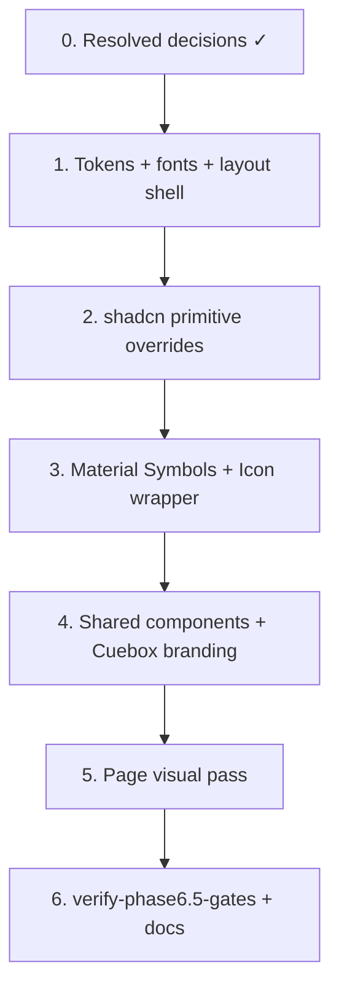

# Phase 6.5 — Design System Alignment (Modern Neo-Noir Cinema)

## Context

**Phase 6 is complete.** The frontend delivers all MVP journeys (import, review, questionnaire, results, history, sync) using **default shadcn/ui “new-york” styling**: neutral light-mode CSS variables, system fonts, `rounded-md` / `rounded-xl` corners, lucide-react icons, and ad-hoc light-theme warning colors (e.g. `border-amber-200 bg-amber-50` on the home review banner).

**[`documents/DESIGN.md`](./DESIGN.md)** defines the target **Modern Neo-Noir Cinema / Used Future** aesthetic: ultra-dark surfaces, Cabin + Libre Franklin + Space Mono typography, 4px industrial corners, chamfered primary buttons, terminal-like interactive states, optional film grain/scanline texture, and Material Symbols Outlined iconography.

**Phase 6.5 goal:** Restyle the existing UI to match DESIGN.md **without** changing routes, API contracts, or user journeys. Phase 7 (Developer Mode) should build on the aligned design system.

**Authoritative references:**

| Document | Purpose |
|----------|---------|
| [`documents/DESIGN.md`](./DESIGN.md) | **Source of truth** for tokens, typography, layout, interaction, icons |
| [`documents/roadmap.md`](./roadmap.md) | Phase 6.5 task checklist + verification gate (to be added) |
| [`documents/phase-6-plan.md`](./phase-6-plan.md) | Baseline frontend structure and gate pattern |
| [`scripts/verify-phase6-gates.sh`](../scripts/verify-phase6-gates.sh) | Regression baseline (must stay green) |

### Current vs target gap summary

| Area | Phase 6 (today) | DESIGN.md target |
|------|-----------------|------------------|
| **Color mode** | Light `:root` tokens; `.dark` unused | Dark-only viewport (`#121411` canonical) |
| **Palette** | shadcn neutral HSL (`--background`, `--primary`, …) | Semantic + M3-style tokens (`surface-container`, `accent-tertiary`, `secondary` lime, etc.) |
| **Typography** | System / Tailwind defaults | Cabin (headings), Libre Franklin (body), Space Mono (metadata) |
| **Corners** | `rounded-xl` cards, `rounded-md` buttons, pill badges | `4px` (`rounded` DEFAULT) on containers/posters; **no pills**; chamfered primary buttons |
| **Buttons** | Standard shadcn hover/focus | Hover glow (`accent-tertiary`), active 70% opacity + inner shadow, disabled 50% + greyscale |
| **Icons** | `lucide-react` (8 files) | Material Symbols Outlined; filled only for active nav |
| **Layout** | `container mx-auto px-4 py-8` | Mobile margin `16px`, desktop `48px`, `max-w-7xl` (1280px), `md` breakpoint 768px |
| **Atmosphere** | Flat background | Fixed CRT scanline overlay on `<main>` |
| **Metadata UI** | `text-sm text-muted-foreground` | Space Mono `label-md` / `title-lg` for scores, runtime, dl readouts |
| **Warnings** | Tailwind `amber-*` light-theme cards | Secondary lime border/glow + `accent-tertiary` glow |
| **Branding** | “Film Picker” in chrome | **Cuebox** everywhere in UI |

### Current scaffold inventory

| Path | Design relevance |
|------|------------------|
| `frontend/src/app/globals.css` | shadcn HSL variables — **replace/remap** |
| `frontend/tailwind.config.ts` | Extend with design spacing, radii, font families, custom colors |
| `frontend/src/app/layout.tsx` | Add fonts, `dark` class or dark-only `:root`, texture wrapper |
| `frontend/src/components/ui/*` | 18 shadcn primitives — **theme overrides** |
| `frontend/src/components/app-shell.tsx` | Nav structure — restyle + Material icons |
| `frontend/src/components/*.tsx` | 7 shared components — typography + surfaces |
| `frontend/src/app/**/page.tsx` | 9 routes — className pass, remove light-theme one-offs |

### Dependency graph



### Baseline (branch start)

```bash
bash scripts/verify-phase6-gates.sh
cd frontend && npx tsc --noEmit && npm run build
```

Mark `p65-baseline-gates` complete only when both succeed.

---

## Resolved design decisions

Signed off before implementation. Encode in `frontend/src/styles/tokens.css` and apply across all slices.

| # | Topic | Decision |
|---|--------|----------|
| 1 | **Token source** | YAML frontmatter is canonical. Main viewport background **`#121411`**. Publish tokens in `tokens.css`; update DESIGN.md markdown aliases to match (optional doc pass in 6.5e). |
| 2 | **Color mode** | **Dark-only.** Remove shadcn light `:root` palette and `.dark` indirection; set all semantic tokens on `:root`. |
| 3 | **Accent hierarchy** | shadcn `primary` button fill = **mint `#aed0a3`** (`on-primary: #1b3717`). **Lime `#cccc5c`** reserved for focus rings, `secondary` button variant, and badges. Hover glow uses **`accent-tertiary`** (`#aed0a3`). |
| 4 | **Texture** | **CRT scanlines only** on `<main>` (no film grain). Subtle fixed overlay; respect `prefers-reduced-motion` (disable texture). |
| 5 | **Chamfer** | **`default` / primary variant only.** Outline, ghost, destructive, link keep 4px square corners (no clip-path). |
| 6 | **Icons** | **Full lucide-react removal** in Phase 6.5. New `Icon` component: `name`, `filled`, `size` props wrapping Material Symbols. |
| 7 | **Icon delivery** | **Google Fonts** — Material Symbols Outlined via `<link>` in root layout (alongside `next/font/google` for Cabin, Libre Franklin, Space Mono). |
| 8 | **Warnings** | No new warning palette. Reuse **secondary lime** (border/text accents) + **`accent-tertiary` glow** for review-pending and constraint-relaxation banners. |
| 9 | **Questionnaire chips** | **Rectangular tags** — 4px corners, 1px `outline` border; selected = mint fill or lime border per context; unselected = `surface-container-high` + `on-surface-variant` text; Space Mono `label-md`. |
| 10 | **Form controls** | Implement from **interim spec below** during 6.5; full DESIGN.md extension is optional follow-up (see §Form controls — DESIGN.md extension). |
| 11 | **Progress bar** | Track = **`surface-container-high`** (`#292b27`); fill = **`secondary`** (`#cccc5c`). |
| 12 | **Branding** | **Cuebox** everywhere in user-facing UI. Retire “Film Picker” in frontend chrome, metadata title, and home copy. Header wordmark: **Cuebox** in Cabin **`text-h2`**. |
| 13 | **Missing poster** | **`surface-container-high`** placeholder, 4px corners, Space Mono **`label-md`**: `NO POSTER`. |
| 14 | **Toasts** | **Top terminal-style stack** (viewport anchored top-center or top-right); elevated `surface-container-high` panel; error variant uses `error` / `on-error` tokens. |

### Interim form control spec (implements decision #10)

Use until DESIGN.md is extended. Map to shadcn `Input`, `Textarea`, `Select`, `Checkbox`, `RadioGroup`:

| State | Spec |
|-------|------|
| **Default** | Background `surface-container-high`; 1px border `outline-variant` (`#434840`); 4px radius; `body-md` Libre Franklin; text `on-surface` |
| **Placeholder** | `on-surface-variant` at 70% opacity |
| **Focus** | 1px border `secondary` (`#cccc5c`); outer glow `0 0 0 2px` rgba(`#cccc5c`, 0.25) |
| **Hover** (enabled) | Border lightens to `outline` (`#8d9288`) |
| **Disabled** | 50% opacity, greyscale, `cursor-not-allowed` |
| **Invalid** | Border `error` (`#ffb4ab`); optional glow rgba(`#ffb4ab`, 0.2); helper text `error` |
| **Checkbox / radio** | Unchecked border `outline`; checked fill `primary` mint with `on-primary` tick/dot; focus ring lime |

Select trigger matches input. Select content panel = `surface-container-high` + outline border.

### Form controls — DESIGN.md extension (optional follow-up)

DESIGN.md does not yet document form primitives. A complete extension would add a new section (e.g. **§ Form Controls**) covering:

| Addition | Detail |
|----------|--------|
| **Component inventory** | `Input`, `Textarea`, `Select`, `Checkbox`, `RadioGroup`, `Label` — which typography token each uses |
| **State matrix** | Table per component: default, hover, focus, disabled, invalid, read-only (if any) with token references |
| **Sizing** | Height (e.g. 40px input), horizontal padding (`md` = 16px), icon padding for select chevron |
| **Label & helper text** | `Label` → `label-md` Space Mono; helper/error → `body-md` with `on-surface-variant` / `error` |
| **Select dropdown** | Panel elevation (`surface-container-high`), item hover (`surface-container-highest`), selected item (`primary-container` / `on-primary-container`) |
| **Checkbox / radio** | Box size (16px), corner radius (2px vs 4px), group spacing |
| **Textarea** | Min rows, resize policy (`vertical` only), same border/focus as input |
| **File upload zone** | Dashed `outline` border, drag-over state (lime border + tertiary glow) — ties to `file-upload.tsx` |
| **Token aliases** | Map interim CSS to named tokens: `--color-input-bg`, `--color-input-border-focus`, etc., for codegen parity with frontmatter |
| **Accessibility** | Focus ring always lime; minimum contrast notes for mint on dark surfaces |
| **Examples** | One ASCII or annotated screenshot per control in all states |

**Phase 6.5 scope:** implement from the interim spec above; DESIGN.md extension can land in the same PR (6.5e docs slice) or a small follow-up doc PR — not a blocker for coding.

---

## Implementation Slices

### Slice 1 — Token foundation (`p65-design-tokens`, `p65-fonts`, `p65-environment`, `p65-branding`)

**Create token layer** — canonical values from YAML frontmatter + resolved decisions:

| Token | Value | shadcn mapping |
|-------|-------|----------------|
| `--background` | `#121411` | page viewport |
| `--card` | `#1a1c19` | `surface-container-low` |
| `--popover` | `#292b27` | `surface-container-high` (sheets, dialogs, toasts) |
| `--primary` | `#aed0a3` | default button fill (mint) |
| `--primary-foreground` | `#1b3717` | on-primary text |
| `--secondary` | `#cccc5c` | secondary CTAs, badges, progress fill, focus rings |
| `--secondary-foreground` | `#323200` | on-secondary text |
| `--muted-foreground` | `#c3c8bd` | body secondary / placeholders |
| `--border` | `#434840` | `outline-variant` |
| `--ring` | `#cccc5c` | focus ring (lime) |
| `--destructive` | `#ffb4ab` | errors |

| File | Purpose |
|------|---------|
| `frontend/src/styles/tokens.css` | Canonical CSS variables (single source for implementation) |
| `frontend/src/app/globals.css` | Import tokens; remove light palette; scanline utility class |
| `frontend/tailwind.config.ts` | `fontFamily`, spacing (xs–xl), `borderRadius` (DEFAULT 4px), `maxWidth` 7xl |

**Font loading** (`frontend/src/app/layout.tsx`)

```tsx
import { Cabin, Libre_Franklin, Space_Mono } from "next/font/google";
// Material Symbols Outlined — Google Fonts <link> in <head>
```

**Scanline overlay** — fixed pseudo-element on `AppShell` `<main>`:

```css
.main-scanlines::after {
  /* horizontal CRT lines, low opacity, pointer-events: none */
}
```

Disable when `prefers-reduced-motion: reduce`.

**Layout shell**

- `html` / `body`: dark-only; no `.dark` class toggle
- `AppShell` `<main>`: `max-w-7xl mx-auto`, `px-4 md:px-12`, `main-scanlines`
- **Branding:** `layout.tsx` metadata `title: "Cuebox"`

**Roadmap checkboxes:** Token foundation section.

---

### Slice 2 — Primitive overrides (`p65-button`, `p65-card-surfaces`, `p65-toast`)

Update shadcn components in `frontend/src/components/ui/`:

| Component | Changes |
|-----------|---------|
| `button.tsx` | Chamfer `clip-path` on **`default` variant only**; mint fill + `on-primary` text; `secondary` variant = lime fill; outline/ghost/destructive = 4px corners, no chamfer; hover tertiary glow; active 70% + inset shadow; disabled greyscale 50%; focus ring lime |
| `card.tsx` | `rounded` (4px), `surface-container-low`, border `outline-variant`, no heavy shadow |
| `input.tsx`, `textarea.tsx`, `select.tsx` | Per **interim form control spec** (§Resolved design decisions) |
| `checkbox.tsx`, `radio-group.tsx` | Mint checked state; lime focus ring |
| `badge.tsx` | 4px corners; **lime** `secondary` variant for tags/counts; Space Mono `label-md` |
| `progress.tsx` | Track `surface-container-high`; fill **`secondary`** (lime) |
| `sheet.tsx`, `dialog.tsx` | `surface-container-high` panels |
| `toast.tsx` + `toaster.tsx` | **Top** viewport stack; `surface-container-high`; error tokens |

Add shared motion utilities in `globals.css`:

```css
/* hover-glow, active-flicker, disabled-terminal */
```

**Gate:** `npx tsc --noEmit` after each primitive batch.

---

### Slice 3 — Iconography (`p65-icons`)

| File | Action |
|------|--------|
| `frontend/src/components/icon.tsx` | **New** — `Icon({ name, filled?, size? })` wrapping Material Symbols via Google Fonts |
| `frontend/src/components/ui/*.tsx` | Replace all lucide imports (checkbox, select, dialog, sheet, toast, radio-group) |
| `frontend/src/app/page.tsx` | Chevron icons → `expand_more` / `expand_less` |
| `frontend/src/components/file-upload.tsx` | Upload icon → `upload` |
| `package.json` | **Remove** `lucide-react` dependency |

**Nav rule:** Outlined default; `FILL 1` for active route only (`app-shell.tsx`).

---

### Slice 4 — Shared components (`p65-app-shell`, `p65-shared-components`)

| Component | Alignment tasks |
|-----------|-----------------|
| `app-shell.tsx` | **Cuebox** wordmark (`text-h2` Cabin); header `surface-container-low`; nav `label-md` + Material icons; active = filled icon + tertiary glow; review badge = **lime secondary** |
| `film-poster.tsx` | 4px corners; missing poster = `surface-container-high` + `NO POSTER` (`label-md`) |
| `file-upload.tsx` | Dashed `outline` drop zone; drag-over lime border + tertiary glow; primary upload CTA chamfered |
| `multi-select-chips.tsx` | **Rectangular** 4px tags; selected/unselected per decision #9 |
| `loading-state.tsx` / `error-state.tsx` | `body-md` copy; skeleton `surface-container-high` |
| `results-view.tsx` | Elevated winner card; ratings Space Mono; explanations `body-lg`; constraint banner = **lime border + tertiary glow**; factor tags = lime secondary badges |

---

### Slice 5 — Page visual pass (`p65-pages-*`)

Apply typography classes and remove light-theme overrides across all routes. **No logic changes.**

| Route | Focus |
|-------|-------|
| `/` | `text-h1` “Welcome to **Cuebox**”; review card = lime border + tertiary glow (no amber); health panel mono readout |
| `/import`, `/import/[jobId]` | Upload + progress theming; failure list mono URI |
| `/review` | Candidate cards elevated; confidence % as `label-md` |
| `/recommend` | Step indicator `label-md`; wizard card surface |
| `/recommend/results/[sessionId]` | Full results-view (slice 4) |
| `/history`, `/history/[sessionId]` | Card grid hover glow; filter inputs |
| `/settings/sync` | Sync summary as definition list with mono values |

**Manual checklist:** Walk all 9 routes at 375px and 1280px widths.

---

### Slice 6 — Verification & docs (`p65-gate-script`, `p65-visual-regression`, roadmap, AGENTS.md)

#### Gate script: `scripts/verify-phase6.5-gates.sh`

| Gate | Check |
|------|-------|
| 1 | `cd frontend && npx tsc --noEmit` |
| 2 | `cd frontend && npm run build` |
| 3 | `bash scripts/verify-phase6-gates.sh` (Phase 6 regression) |
| 4 | Design audit — no `amber-50`, `bg-white`, `lucide-react`, or `Film Picker` in `frontend/src` |
| 5 | Optional Playwright visual smoke — screenshot key routes if `PLAYWRIGHT_E2E_STACK=1` |

#### Visual regression (recommended)

- `frontend/e2e/design-smoke.spec.ts` — navigate `/`, `/recommend`, `/history`; assert `data-theme` or computed `background-color` matches token; optional screenshot compare.

#### Roadmap update

- Insert **Phase 6.5** between Phase 6 and Phase 7
- Phase 7 **Depends on:** Phase 6.5
- Overview: “Next up: Phase 6.5 — Design System Alignment” until complete

#### AGENTS.md

- Note dark-only UI
- No new env vars expected
- Optional: visual smoke command in lint/test table

---

## Roadmap Checkbox Mapping

### Token & layout foundation

| Roadmap item | Plan todo(s) |
|--------------|--------------|
| Canonical CSS/Tailwind tokens from DESIGN.md | `p65-design-tokens`, `p65-decisions` |
| Google fonts (Cabin, Libre Franklin, Space Mono) | `p65-fonts` |
| Dark-only theme + main viewport texture | `p65-environment` |
| Layout margins and max-width | `p65-environment` |

### Primitives & iconography

| Roadmap item | Plan todo(s) |
|--------------|--------------|
| Button chamfer + interaction states | `p65-button` |
| Card/input/dialog/sheet/badge/progress restyle | `p65-card-surfaces`, `p65-toast` |
| Material Symbols + lucide removal | `p65-icons` |

### Components & pages

| Roadmap item | Plan todo(s) |
|--------------|--------------|
| App shell navigation restyle | `p65-app-shell` |
| Shared component alignment | `p65-shared-components` |
| All Phase 6 routes visually updated | `p65-pages-*` |

### Verification

| Roadmap item | Plan todo(s) |
|--------------|--------------|
| No functional regression | `p65-gate-script`, `p65-baseline-gates` |
| Visual consistency across journeys | `p65-visual-regression`, `p65-pages-*` |

---

## Recommended PR Slicing

| Slice | Contents | Gates |
|-------|----------|-------|
| **6.5a — Tokens + fonts + layout** | tokens.css, globals, tailwind, layout, texture | Gate 1 |
| **6.5b — Primitives** | ui/* overrides, toast | Gate 1 + build |
| **6.5c — Icons + shell** | Icon component, app-shell, Cuebox branding, lucide removal | Gate 1 |
| **6.5d — Shared + pages** | components + all pages | Gate 1 + manual walkthrough |
| **6.5e — Gates + docs** | verify-phase6.5-gates.sh, roadmap, AGENTS.md | All gates |

Prefix commits: `phase-6.5:`.

---

## Deliverables Summary

| Deliverable | Path |
|-------------|------|
| Design tokens | `frontend/src/styles/tokens.css` |
| Typography utilities | `frontend/src/app/globals.css` or `frontend/src/styles/typography.css` |
| Icon wrapper | `frontend/src/components/icon.tsx` |
| Updated shadcn primitives | `frontend/src/components/ui/*` |
| Restyled pages | `frontend/src/app/**` (className only) |
| Gate script | `scripts/verify-phase6.5-gates.sh` |
| Visual smoke (optional) | `frontend/e2e/design-smoke.spec.ts` |
| Roadmap Phase 6.5 section | `documents/roadmap.md` |
| This plan | `documents/phase-6.5-plan.md` |

---

## Exit Criteria

Phase 6.5 is **done** when:

1. All **Resolved design decisions** encoded in `tokens.css` and component styles
2. UI matches DESIGN.md + resolved decisions at mobile and desktop on all 9 routes
3. No `lucide-react` imports remain
4. No light-theme ad-hoc colors (`amber-50`, white cards) remain
5. User-facing copy says **Cuebox** (no “Film Picker” in frontend)
6. `bash scripts/verify-phase6.5-gates.sh` passes
7. `bash scripts/verify-phase6-gates.sh` still passes (functional regression)
8. `documents/roadmap.md` Phase 6.5 checklist and verification gate checked off
9. Optional: DESIGN.md updated — `#121411` aliases, form controls §, Cuebox naming in examples

---

## Risks & Mitigations

| Risk | Mitigation |
|------|------------|
| Token inconsistency in DESIGN.md | `#121411` canonical in `tokens.css`; optional DESIGN.md doc sync in 6.5e |
| Chamfered buttons break `asChild` / Link composition | Test Button+Link on all CTAs; fallback square corners for `asChild` |
| Material Symbols FOUC | `next/font` or preload font CSS in layout |
| Scanlines hurt readability | Low opacity (~3–5%); disable via `prefers-reduced-motion` |
| Visual-only PR is hard to review | Before/after screenshots in PR; optional Playwright screenshots |
| shadcn upstream regen overwrites custom ui/* | Document “do not `shadcn add` without reapplying overrides” in AGENTS.md |
