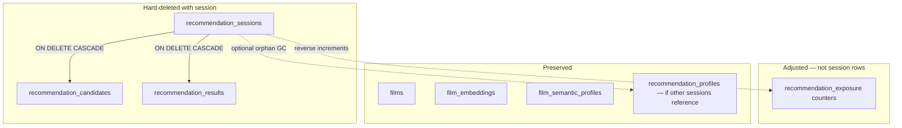

# Hard delete past recommendations from user history — implementation plan

## Context

Users need to remove specific films from their recommendation history. Deletion must be a **hard delete**: the session and all session-scoped relational data are removed from the database, and any algorithmic memory that would penalize or skip the film in future runs is reset.

**Current state:** History is read-only. The API exposes `POST /recommendations`, `GET /recommendations`, and `GET /recommendations/{session_id}`. There is no delete route, no repository delete helpers, and no frontend delete affordance.

**Product tension:** [PRD.md §17](./PRD.md) states history is retained indefinitely with no automatic pruning. [PRD.md §18](./PRD.md) requires full auditability. This feature adds an **explicit, user-initiated** delete — not automatic pruning. Update PRD copy to distinguish “no automatic pruning” from “user may remove entries.”

**Permissions:** Cuebox is single-user and local-first; there is no `user_id` column. “Users can only delete their own history” is satisfied by the absence of multi-tenancy — any caller with API access operates on the sole history store.

---

## Relevant files (inventory)

### Backend — data model & migrations

| File | Role |
|------|------|
| `api/app/database/models.py` | `RecommendationSession`, `RecommendationCandidate`, `RecommendationResult`, `RecommendationProfile`, `RecommendationExposure` ORM models |
| `api/alembic/versions/0001_initial_schema.py` | FK cascades: deleting a session cascades to `recommendation_candidates` and `recommendation_results` |
| `documents/database-design.md` | Canonical schema §4.8–4.12, exposure constraints |

### Backend — repositories (create/read only today)

| File | Role |
|------|------|
| `api/app/repositories/recommendation_session_repository.py` | `create`, `get_by_id`, `list_history` — **add `delete_by_id`** |
| `api/app/repositories/recommendation_candidate_repository.py` | `create_many` only — **add read helpers for delete side-effects** (or load via session relationship) |
| `api/app/repositories/recommendation_result_repository.py` | `create` only — no direct delete needed (CASCADE) |
| `api/app/repositories/recommendation_profile_repository.py` | `get_by_hash`, `create`, `get_by_id` — **add `count_sessions` / `delete_by_id` for orphan GC** |
| `api/app/repositories/recommendation_exposure_repository.py` | `increment_exposure`, `get_map` — **add `decrement_exposure` and/or `recompute_for_films`** |

### Backend — services & routes

| File | Role |
|------|------|
| `api/app/services/recommendation_service.py` | Orchestrates pipeline persistence and history reads — **add `delete_session`** |
| `api/app/services/diversity_service.py` | Stage 4 reads `recommendation_exposure` — must stay consistent after delete |
| `api/app/services/scoring_service.py` | `recommendation_history` signal is stubbed (`1.0`); no delete impact |
| `api/app/services/recommendation_profile_service.py` | Profile cache by questionnaire hash — **not** user-movie history; do not delete on session delete unless orphaned |
| `api/app/services/developer_service.py` | Dev traces for session — will 404 after delete (expected) |
| `api/app/routers/v1/recommendations.py` | **Add `DELETE /{session_id}`** |
| `api/app/schemas/recommendations.py` | Request/response types (delete likely returns 204, no body) |
| `api/app/core/exceptions.py` | `not_found("Recommendation session")` pattern for 404 |

### Backend — tests

| File | Role |
|------|------|
| `api/tests/test_integration_recommendation_history.py` | Extend with delete + list/detail 404 + exposure reversal |
| `api/tests/test_diversity_service.py` | Reference for exposure penalty math |
| `api/tests/conftest.py` | `TRUNCATE` pattern for full history clear |

### Frontend

| File | Role |
|------|------|
| `frontend/src/app/history/page.tsx` | History list — **add per-card delete control** |
| `frontend/src/app/history/[sessionId]/page.tsx` | History detail — **add delete + redirect** |
| `frontend/src/hooks/use-recommendations.ts` | **Add `useDeleteRecommendation` mutation** |
| `frontend/src/lib/api-client.ts` | **Add `deleteRecommendation(sessionId)`** |
| `frontend/src/types/api.ts` | `HistoryCard.session_id` is the delete key |
| `frontend/src/components/ui/dialog.tsx` | Unused today — **first use for confirmation modal** |
| `frontend/src/components/ui/button.tsx` | `variant="destructive"` for confirm action |
| `frontend/src/components/icon.tsx` | Material icon `delete` for trash affordance |
| `frontend/src/hooks/use-recommendations.test.tsx` | Mirror pattern for delete cache invalidation |
| `frontend/e2e/all-routes.spec.ts` | Optional E2E delete flow |

### Specifications

| File | Role |
|------|------|
| `documents/api-contracts.md` | **Add §8.2 Delete Recommendation Session** |
| `documents/PRD.md` | **Clarify §17** user-initiated delete vs indefinite retention |
| `documents/sequence-diagrams.md` | Optional delete sequence diagram |
| `documents/manual-testing-plan.md` | Manual delete checklist |
| `AGENTS.md` | Note new endpoint in hello-world / test sections |

---

## Data model: what gets deleted vs preserved



### Deleted automatically (DB CASCADE)

When `recommendation_sessions` row is removed:

1. **`recommendation_candidates`** — all pipeline candidates for that run (scores, `score_breakdown`, retrieval ranks, LLM ranks).
2. **`recommendation_results`** — winner explanation and runner-up explanations JSONB.

No Alembic migration is required; cascades already exist in `0001_initial_schema.py`.

### Must be handled in application code

3. **`recommendation_exposure`** — per-film cumulative counters (`recommendation_count`, `winner_count`, `last_recommended_at`). Created/incremented in `recommendation_service.create_recommendation` via `increment_exposure` for **every pipeline candidate**. Deleting a session without reversing exposure leaves inflated diversity penalties and freshness signals in Stage 4 (`diversity_service.apply_diversity`).

### Preserved (do not delete)

| Data | Reason |
|------|--------|
| `films`, `film_metadata`, `film_semantic_profiles`, `film_embeddings` | Watchlist / enrichment assets, not history |
| `recommendation_profiles` (when still referenced) | Questionnaire-intent cache keyed by `profile_hash`; shared across sessions with identical inputs |
| `watchlist_entries` | Independent of recommendation history |

### Optional orphan cleanup

If the deleted session was the **only** session referencing a `profile_id`, optionally delete the `recommendation_profiles` row to reclaim storage. This is **not** required for “film treated as never recommended” — profiles are not film-specific. Implement as a post-delete GC step guarded by `COUNT(sessions WHERE profile_id = ?) = 0`.

---

## Exposure reversal design (critical)

**Problem:** `increment_exposure` runs once per candidate film at recommendation creation time. Constraints require `recommendation_count >= 0`, `winner_count <= recommendation_count`.

**Recommended approach — decrement with recompute fallback:**

1. Before deleting the session, load its `candidates` (via `get_by_id` with `selectinload`) and `winner_film_id`.
2. For each candidate `film_id`:
   - Decrement `recommendation_count` by 1.
   - If `film_id == winner_film_id`, decrement `winner_count` by 1.
3. After decrements:
   - If `recommendation_count == 0`, **delete** the `recommendation_exposure` row (film has no exposure memory — matches pre-first-recommendation state).
   - Else **recompute `last_recommended_at`** for that film:

```sql
SELECT MAX(rs.created_at)
FROM recommendation_candidates rc
JOIN recommendation_sessions rs ON rs.id = rc.session_id
WHERE rc.film_id = :film_id
```

   Run this query **before** deleting the session, or exclude the current `session_id` in the subquery, so the timestamp reflects remaining history.

4. Clamp counts at zero defensively before flush (satisfies CHECK constraints even if data drifted).

**Alternative (heavier, more accurate):** Full recompute exposure for affected `film_id`s from all remaining `recommendation_candidates` + `winner_film_id`. Simpler to reason about but more SQL per delete. Prefer decrement + `last_recommended_at` recompute unless tests reveal edge cases.

**Verification:** After delete, run a second recommendation that includes the same film and assert exposure penalties in `score_breakdown` match a fresh film (or match a control film that was never recommended).

---

## Step-by-step implementation

### Step 1 — Specification & contracts

1. **`documents/api-contracts.md`** — add §8.2:

   ```
   DELETE /recommendations/{session_id}
   ```

   - **Response:** `204 No Content` on success.
   - **Errors:** `404 NOT_FOUND` if `session_id` unknown (same envelope as GET detail).
   - **Behavior:** Hard-delete session; cascade candidates/results; reverse exposure counters for all candidates in that session; optional orphan profile GC.

2. **`documents/PRD.md` §17** — add bullet: users may manually remove individual history entries; removal is irreversible and deletes stored session audit data for that run.

3. **`documents/database-design.md`** — add short § note under `recommendation_exposure` documenting delete reversal (application-level, not DB trigger).

### Step 2 — Repository layer

1. **`recommendation_session_repository.py`**
   - `delete_by_id(db, session_id) -> bool` — `db.delete(session)` after load, or `DELETE` statement; return whether a row was removed.

2. **`recommendation_exposure_repository.py`**
   - `decrement_exposure(db, *, film_id, is_winner) -> None` — mirror `increment_exposure`; delete row when count hits 0.
   - `recompute_last_recommended_at(db, film_id) -> None` — subquery over remaining candidates/sessions.

3. **`recommendation_profile_repository.py`** (optional GC)
   - `count_sessions_for_profile(db, profile_id) -> int`
   - `delete_by_id(db, profile_id) -> None`

4. **`recommendation_candidate_repository.py`** (optional)
   - `list_film_ids_for_session(db, session_id) -> list[UUID]` if not loading via session relationship.

### Step 3 — Service layer

Add `RecommendationService.delete_session(db, session_id) -> None`:

```
1. session = get_by_id(session_id)
2. if session is None: raise not_found("Recommendation session")
3. profile_id = session.profile_id
4. winner_film_id = session.winner_film_id
5. candidate_film_ids = [c.film_id for c in session.candidates]
6. For each film_id in candidate_film_ids:
     decrement_exposure(film_id, is_winner=(film_id == winner_film_id))
     if exposure row still exists: recompute_last_recommended_at(film_id)
7. delete session (cascade candidates + results)
8. if count_sessions_for_profile(profile_id) == 0: delete profile
9. db.commit()
```

Use a single transaction; on failure, roll back exposure adjustments and session delete together.

### Step 4 — API route

**`api/app/routers/v1/recommendations.py`:**

```python
@router.delete("/{session_id}", status_code=204)
def delete_recommendation_session(
    session_id: uuid.UUID,
    db: Session = Depends(get_db),
    recommendation_service: RecommendationService = Depends(get_recommendation_service),
) -> None:
    recommendation_service.delete_session(db, session_id)
```

Register before or after GET `/{session_id}` — no path conflict.

### Step 5 — Backend tests

Add to **`api/tests/test_integration_recommendation_history.py`** (or new `test_integration_recommendation_delete.py`):

| Test | Assert |
|------|--------|
| `test_delete_session_returns_204` | Create recommendation → DELETE → 204 |
| `test_delete_session_not_found` | Random UUID → 404 |
| `test_deleted_session_absent_from_list` | DELETE → GET list does not include `session_id` |
| `test_deleted_session_detail_404` | DELETE → GET detail 404 |
| `test_delete_reverses_exposure` | Create rec → note exposure counts → DELETE → counts decremented or row removed |
| `test_delete_allows_fresh_diversity_scoring` | Two recs same winner → delete second → exposure matches first-only state |
| `test_cascade_removes_candidates_and_results` | Direct DB query: no rows for `session_id` in candidates/results tables |
| `test_orphan_profile_gc` (optional) | Delete only session for a profile → profile row removed |

Reuse `seed_ready_films` + mocked providers pattern from existing history tests.

### Step 6 — Frontend API client & hook

1. **`frontend/src/lib/api-client.ts`**

   ```typescript
   export async function deleteRecommendation(sessionId: string): Promise<void> {
     await fetchApi(`/recommendations/${sessionId}`, { method: "DELETE" });
   }
   ```

   `fetchApi` already handles 204 No Content.

2. **`frontend/src/hooks/use-recommendations.ts`**

   ```typescript
   export function useDeleteRecommendation() {
     const queryClient = useQueryClient();
     return useMutation({
       mutationFn: (sessionId: string) => deleteRecommendation(sessionId),
       onSuccess: (_data, sessionId) => {
         void queryClient.invalidateQueries({ queryKey: ["recommendations", "history"] });
         queryClient.removeQueries({ queryKey: ["recommendations", sessionId] });
       },
     });
   }
   ```

   Wire `useToastOnError` consistent with `use-reviews` hooks.

3. **Unit test** in `use-recommendations.test.tsx` — assert history query invalidation and session query removal.

### Step 7 — Frontend UI

#### History list (`frontend/src/app/history/page.tsx`)

**UX per issue:**

1. Each card gets a visible delete control (trash icon).
2. Click opens confirmation dialog — copy: *“Are you sure you want to remove this from your history? This cannot be undone.”*
3. On confirm, call mutation; card disappears without full page reload (cache invalidation / optimistic update).

**Layout change:** Cards are currently wrapped in `<Link>`. Restructure to avoid accidental navigation:

```
<Card>
  <Link href={...}>…poster, title, summary…</Link>
  <Button variant="ghost" size="icon" aria-label="Remove from history" onClick={…}>
    <Icon name="delete" />
  </Button>
</Card>
```

Use `e.preventDefault()` / `e.stopPropagation()` on the delete button.

**Pagination edge case:** If deleting the last item on a non-first page, decrement `offset` or refetch and clamp offset to `max(0, total - 1)`.

#### History detail (`frontend/src/app/history/[sessionId]/page.tsx`)

- Add **“Remove from history”** button (`variant="destructive"` or outline with destructive text).
- Same confirmation `Dialog`.
- On success: `router.push("/history")`.

#### Confirmation component

Extract a small reusable **`DeleteHistoryDialog`** (e.g. `frontend/src/components/delete-history-dialog.tsx`) used by list and detail:

- Props: `open`, `onOpenChange`, `onConfirm`, `isPending`, `filmTitle?`
- Uses `Dialog`, `DialogHeader`, `DialogTitle`, `DialogDescription`, `DialogFooter`
- Cancel: `Button variant="outline"`; Confirm: `Button variant="destructive"`

Do **not** use `window.confirm` — no precedent in the codebase; `Dialog` matches the design system ([DESIGN.md](./DESIGN.md)).

#### Scope decision: `/recommend/results/[sessionId]`

Recommend **history-only delete** for v1. Fresh results page is ephemeral post-run; users who want removal navigate to history. Document in PR if product prefers parity later.

### Step 8 — E2E & gates

1. **`frontend/e2e/all-routes.spec.ts`** or **`first-time-journey.spec.ts`** — after journey creates history, delete from list, assert card gone (requires full stack + API delete).

2. **`scripts/verify-phase8-gates.sh`** — include new integration delete test in the collected suite (or add lightweight `verify-recommendation-delete.sh` if scope is isolated).

3. **`documents/manual-testing-plan.md`** — manual steps: delete from list, delete from detail, confirm dev panel 404 for deleted session.

### Step 9 — Documentation & roadmap

1. **`AGENTS.md`** — mention `DELETE /recommendations/{session_id}` under API overview if applicable.
2. **`documents/roadmap.md`** — add checklist item under a post-MVP or maintenance section (this is a new feature after Phase 8).
3. Optional **`documents/sequence-diagrams.md`** § — User → DELETE → exposure reversal → 204.

---

## API contract sketch (for api-contracts.md)

### 8.2 Delete Recommendation Session

Permanently remove a recommendation session and all session-scoped audit data.

```
DELETE /recommendations/{session_id}
```

#### Path Parameters

| Parameter | Type | Description |
|-----------|------|-------------|
| `session_id` | UUID | Recommendation session to delete |

#### Response `204 No Content`

Empty body.

#### Errors

| Code | HTTP | When |
|------|------|------|
| `NOT_FOUND` | 404 | `session_id` does not exist |

#### Side effects

1. Deletes `recommendation_sessions` row (cascades to `recommendation_candidates`, `recommendation_results`).
2. Decrements or removes `recommendation_exposure` rows for all candidate films in that session.
3. Does not delete films, embeddings, or watchlist entries.
4. Deletes unreferenced `recommendation_profiles` row if no sessions remain for that profile (implementation detail; may be omitted in v1).

---

## Testing checklist

| Layer | Command / file |
|-------|----------------|
| API unit | Exposure decrement helpers (new `test_recommendation_exposure_repository.py` or service unit test) |
| API integration | `pytest api/tests/test_integration_recommendation_history.py -v` (extended) |
| API lint | `cd api && ruff check app tests` |
| Frontend types | `cd frontend && npx tsc --noEmit` |
| Frontend unit | `cd frontend && npm run test:unit` |
| Frontend build | `cd frontend && npm run build` |
| E2E (optional) | `PLAYWRIGHT_E2E_STACK=1` delete scenario |
| Regression | `bash scripts/verify-phase8-gates.sh` |

---

## Risks & open decisions

| Topic | Recommendation |
|-------|----------------|
| PRD auditability vs user delete | User delete removes audit trail for **that session only** — document clearly in UI confirmation copy |
| Exposure accuracy | Decrement + `last_recommended_at` recompute; add integration test with two sessions same film |
| Orphan profile GC | Nice-to-have; skip in v1 if time-constrained |
| Bulk / clear-all history | Out of scope for this issue; only single-session delete |
| Soft delete | Issue explicitly requires hard delete — no `deleted_at` column |
| Dev traces after delete | `GET /dev/recommendations/{id}/*` returns 404 — acceptable |

---

## Suggested implementation order

1. Exposure reversal repository helpers + unit tests  
2. `delete_session` service + integration tests (API complete before UI)  
3. API contract & PRD wording  
4. Frontend hook + dialog component  
5. History list delete → history detail delete  
6. E2E + gate script + docs  

This order keeps the critical “treat as never recommended” behavior testable in the API layer before UI work begins.
