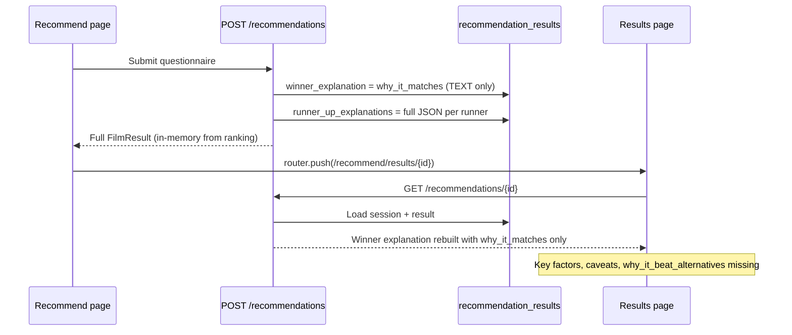

# Results screen UX — implementation plan

Plan for the GitHub issue **bug/ux: Update recommendation results screen cards with missing AI explanations, adjusted ratings, and navigation links**. This document covers gap analysis, file inventory, step-by-step implementation, testing, and verification. **Implemented in PR #31** — see git history on branch `cursor/results-screen-ux-plan-f83c`.

---

## 1. Problem summary

The recommendation results screen (`/recommend/results/[sessionId]`) and the shared history detail view (`/history/[sessionId]`) both render `ResultsView`. Users report:

| Requirement | Current state | Root cause |
|-------------|---------------|------------|
| Top Pick shows **Key factors**, **Caveats**, **Why it beat alternatives** | UI markup exists but fields are often empty on the results page | Results page **re-fetches** via `GET /recommendations/{sessionId}` after `POST`; `get_session()` rebuilds the winner explanation from a **plain-text** DB column and drops structured fields |
| Top Pick shows **Synopsis** | Not rendered | `synopsis` is not on the `FilmResult` API schema; only available on `FilmDetail.metadata` |
| Cards show **TMDB** + **RT** scores; remove **LBX** | Shows LBX + RT only | `FilmResult` exposes `letterboxd_rating` and `rotten_tomatoes_score` but not `tmdb_rating` |
| Cards link to `/watchlist/[filmId]` | Cards are static `<Card>` elements | No `Link` wrapper or click handler |

---

## 2. Codebase inventory

### 2.1 Frontend (primary)

| File | Role |
|------|------|
| [`frontend/src/components/results-view.tsx`](../frontend/src/components/results-view.tsx) | **`FilmResultCard`** — poster, metadata, ratings, explanation blocks; **`ResultsView`** — winner, runners-up grid, action buttons |
| [`frontend/src/app/recommend/results/[sessionId]/page.tsx`](../frontend/src/app/recommend/results/[sessionId]/page.tsx) | Results route; fetches session via `useRecommendation` and passes data to `ResultsView` |
| [`frontend/src/app/history/[sessionId]/page.tsx`](../frontend/src/app/history/[sessionId]/page.tsx) | History detail; **reuses `ResultsView`** — inherits all card changes automatically |
| [`frontend/src/types/api.ts`](../frontend/src/types/api.ts) | `FilmResult`, `FilmExplanation` TypeScript interfaces |
| [`frontend/src/hooks/use-recommendations.ts`](../frontend/src/hooks/use-recommendations.ts) | `useRecommendation(sessionId)` → `GET /recommendations/{id}` |

### 2.2 Frontend (reference patterns)

| File | Reuse for |
|------|-----------|
| [`frontend/src/components/film-detail-view.tsx`](../frontend/src/components/film-detail-view.tsx) | TMDB / RT score formatting (`formatRating`, `tmdb_rating` 0–10, RT as `%`) |
| [`frontend/src/components/watchlist-table.tsx`](../frontend/src/components/watchlist-table.tsx) | `Link href={\`/watchlist/${film.id}\`}` with `hover-glow` |
| [`documents/DESIGN.md`](./DESIGN.md) | Space Mono for metadata/scores; `hover-glow` on interactive cards; `text-body-lg` for synopsis/explanations |

### 2.3 Backend (data contract — required despite “frontend-only” issue scope)

| File | Role |
|------|------|
| [`api/app/schemas/recommendations.py`](../api/app/schemas/recommendations.py) | `FilmResult`, `Explanation` Pydantic models |
| [`api/app/services/recommendation_service.py`](../api/app/services/recommendation_service.py) | `_film_result()`, `create_recommendation()` persistence, `get_session()` rehydration |
| [`api/app/database/models.py`](../api/app/database/models.py) | `RecommendationResult.winner_explanation` (TEXT) and `runner_up_explanations` (JSONB) |
| [`api/app/repositories/recommendation_result_repository.py`](../api/app/repositories/recommendation_result_repository.py) | Persists result row on recommend |
| [`documents/api-contracts.md`](./api-contracts.md) | §7 `POST /recommendations` and `GET /recommendations/{session_id}` Film Result Object |

### 2.4 Tests and gates

| Area | Existing coverage | Gap |
|------|-------------------|-----|
| API integration | [`api/tests/test_integration_recommendation.py`](../api/tests/test_integration_recommendation.py) asserts `winner.explanation.why_it_matches` only | No assertion on `most_influential_factors`, `why_it_beat_alternatives`, `caveats` round-trip via GET |
| API history | [`api/tests/test_integration_recommendation_history.py`](../api/tests/test_integration_recommendation_history.py) | Same gap on session detail |
| Frontend unit | No `results-view` tests | Add component tests or extend E2E |
| E2E | [`frontend/e2e/first-time-journey.spec.ts`](../frontend/e2e/first-time-journey.spec.ts), [`frontend/e2e/all-routes.spec.ts`](../frontend/e2e/all-routes.spec.ts) | Can assert ratings labels and card navigation |

---

## 3. Data-flow analysis (why explanations disappear)



**Key code paths:**

- **Create (full explanation in memory):** `recommendation_service.py` lines ~140–158 persist only `winner_expl.why_it_matches`; runners-up get full JSON.
- **GET session (incomplete winner):** `get_session()` lines ~245–250 build `winner_payload` with `most_influential_factors: []` and omit `why_it_beat_alternatives` / `caveats`.
- **Frontend navigation:** [`frontend/src/app/recommend/page.tsx`](../frontend/src/app/recommend/page.tsx) pushes to results URL; [`results/[sessionId]/page.tsx`](../frontend/src/app/recommend/results/[sessionId]/page.tsx) always refetches — it does **not** use POST response cache.

**Implication:** Fixing the UI alone is insufficient. Backend must persist and rehydrate the full winner `Explanation` object (same shape as runners-up JSONB).

---

## 4. Target UX (acceptance criteria)

### 4.1 Top Pick (winner) card

- Existing blocks remain: **Why it matches**, **Key factors** (badges), **Why it beat alternatives**, **Caveats**.
- **New:** **Synopsis** section (film overview text) — winner only per issue scope.
- **Ratings row:** `TMDB: {score}` and `RT: {score}%` using Space Mono (`font-mono`); show `—` when null (match `formatRating` in `film-detail-view.tsx`).
- **Remove:** `LBX:` line entirely from results cards.
- **Interaction:** Entire card is a single clickable target → `/watchlist/{film_id}`.

### 4.2 Runners-up cards

- Same rating change (TMDB + RT, no LBX).
- Existing explanation blocks unchanged (runners-up already round-trip structured explanations via JSONB).
- Entire card clickable → `/watchlist/{film_id}`.

### 4.3 Pages

- [`results/[sessionId]/page.tsx`](../frontend/src/app/recommend/results/[sessionId]/page.tsx): No structural change expected; `ResultsView` owns card UX.
- History detail inherits behavior via shared `ResultsView`.
- **Answer summary** sheet and **New recommendation** / **View history** buttons must remain clickable (do not wrap the whole page in a link; link only `FilmResultCard`).

### 4.4 Design system

Per [`DESIGN.md`](./DESIGN.md) and Phase 6.5 results-view notes:

- Winner card: `border-primary bg-surface-high shadow-glow hover-glow` (keep).
- Runner-up cards: `hover-glow` (keep).
- Synopsis + explanations: `text-body-lg text-muted-foreground`.
- Section labels: `text-label-md normal-case tracking-normal`.
- Factor badges: `Badge variant="secondary"` (lime secondary tokens).

---

## 5. Step-by-step implementation

### Step 1 — Extend backend `FilmResult` schema

**Files:** `api/app/schemas/recommendations.py`, `documents/api-contracts.md`

Add to `FilmResult`:

| Field | Type | Source |
|-------|------|--------|
| `synopsis` | `str \| None` | `film.metadata_.synopsis` |
| `tmdb_rating` | `float \| None` | `film.metadata_.tmdb_rating` (0–10; preserve `0.0` as valid per `test_vote_average_zero_is_preserved`) |

Keep `letterboxd_rating` on the schema for backward compatibility but **do not display it** on the results screen (optional: deprecate in api-contracts note). Issue explicitly requires removal from these views only.

Update api-contracts §7 Film Result Object example JSON and field table.

### Step 2 — Populate new fields in `_film_result()`

**File:** `api/app/services/recommendation_service.py`

In `_film_result()` (~lines 506–528), map from `metadata`:

```python
synopsis=metadata.synopsis if metadata else None,
tmdb_rating=float(metadata.tmdb_rating) if metadata and metadata.tmdb_rating is not None else None,
```

Use the same null-safe pattern as existing `rotten_tomatoes_score` / `letterboxd_rating` mapping.

### Step 3 — Persist full winner explanation (DB + service)

**Problem:** `recommendation_results.winner_explanation` is `TEXT`; runners-up use `JSONB`.

**Recommended approach (minimal migration):**

1. Add Alembic migration: new column `winner_explanation_detail JSONB` on `recommendation_results` (nullable).
2. On create (~lines 153–158), store full winner explanation object:
   ```python
   {
     "why_it_matches": ...,
     "most_influential_factors": [...],
     "why_it_beat_alternatives": ...,
     "caveats": ...,
   }
   ```
3. Keep `winner_explanation` TEXT populated with `why_it_matches` for backward compatibility (existing queries, history excerpts).
4. Update `recommendation_result_repository.create()` signature to accept `winner_explanation_detail`.
5. In `get_session()` (~lines 245–250), prefer `result.winner_explanation_detail` when present; fall back to legacy TEXT + empty factors for old rows.

**Alternative (larger change):** Migrate `winner_explanation` from TEXT to JSONB. Higher risk for existing data; only choose if consolidating columns is preferred.

### Step 4 — Update frontend TypeScript types

**File:** `frontend/src/types/api.ts`

Extend `FilmResult`:

```typescript
synopsis: string | null;
tmdb_rating: number | null;
```

`letterboxd_rating` can remain on the interface until a major API version removes it.

### Step 5 — Update `FilmResultCard` in `results-view.tsx`

**5a. Ratings row** (replace lines ~67–72):

- Remove `LBX: {formatRating(film.letterboxd_rating)}`.
- Add `TMDB: {formatRating(film.tmdb_rating)}` (always show label with `—` when null, or match film-detail conditional display — prefer consistent pair: TMDB + RT always visible on results cards per scannability goal).
- Keep `RT: {film.rotten_tomatoes_score}%` when not null; show `RT: —` when null for symmetry.

Apply `font-mono` to the ratings row per design system.

**5b. Synopsis (winner only):**

After metadata header (director · runtime) and before or after ratings, add:

```tsx
{isWinner && film.synopsis && (
  <div>
    <p className="text-label-md ...">Synopsis</p>
    <p className="text-body-lg text-muted-foreground">{film.synopsis}</p>
  </div>
)}
```

Place synopsis in `CardContent` above **Why it matches** so users see film context before AI reasoning.

**5c. Explanation blocks:**

No structural change needed — conditional rendering already handles empty arrays/null. After Step 3, winner fields will populate on GET.

Optional hardening: for winner, always render section headings with fallback copy only if product wants visible empty states (not required by issue).

**5d. Clickable cards:**

Wrap each `FilmResultCard` root in Next.js `Link`:

```tsx
<Link href={`/watchlist/${film.film_id}`} className="block rounded-lg focus-visible:outline-none focus-visible:ring-2 focus-visible:ring-ring">
  <Card className="... cursor-pointer ...">...</Card>
</Link>
```

Reference: [`watchlist-table.tsx`](../frontend/src/components/watchlist-table.tsx) linking pattern.

**Accessibility:**

- Use a single link per card (not nested links).
- Ensure keyboard focus ring on the card link.
- `Card` hover styles (`hover-glow`) should apply to the linked wrapper.

**5e. `ResultsView`:**

No change to action buttons / sheet placement — only pass `film_id` through `FilmResultCard` (already on `film.film_id`).

### Step 6 — Results page (`page.tsx`)

**File:** `frontend/src/app/recommend/results/[sessionId]/page.tsx`

Expected: **no changes** unless adding a visual hint (“Click a film for details”). Keep page shell as-is.

Verify `useRecommendation` typed response includes new fields once API is updated (no hook changes required if types align).

### Step 7 — Tests

#### 7.1 API tests

Add or extend in `api/tests/test_integration_recommendation.py`:

1. After `POST /recommendations`, `GET /recommendations/{session_id}` returns winner with:
   - `explanation.most_influential_factors` non-empty (mock ranking provides factors)
   - `explanation.why_it_beat_alternatives` not null on winner
   - `explanation.caveats` (nullable but assert key exists)
2. `winner.synopsis` and `winner.tmdb_rating` present when metadata seeded (use existing `seed_ready_films` helpers).
3. `letterboxd_rating` may still be in JSON but is not asserted for UI.

Add parallel assertion in `test_integration_recommendation_history.py` for history detail GET.

#### 7.2 Frontend tests (recommended)

Create `frontend/src/components/results-view.test.tsx`:

- Mock `FilmResult` with full explanation, synopsis, ratings.
- Assert no `LBX` text in output.
- Assert `TMDB` and `RT` labels.
- Assert winner shows synopsis; runner-up does not.
- Assert `Link` `href` is `/watchlist/{film_id}`.

Or extend Playwright `all-routes.spec.ts` / journey spec to click a result card and expect `/watchlist/` navigation.

#### 7.3 Regression

| Check | Command |
|-------|---------|
| API lint | `cd api && ruff check app tests` |
| API tests | `cd api && DATABASE_URL=... TEST_DATABASE_URL=... pytest tests/test_integration_recommendation.py tests/test_integration_recommendation_history.py -v` |
| Frontend types | `cd frontend && npx tsc --noEmit` |
| Frontend build | `cd frontend && npm run build` |
| Phase 6 gate (optional) | `bash scripts/verify-phase6-gates.sh` |

### Step 8 — Documentation touch-ups

| Document | Update |
|----------|--------|
| `documents/api-contracts.md` | Film Result fields: `synopsis`, `tmdb_rating`; note winner explanation persistence |
| `documents/manual-testing-plan.md` | Test 7: TMDB + RT instead of Letterboxd; synopsis on winner; click card → watchlist detail |
| `documents/PRD.md` | §16 Winner metadata (optional follow-up): TMDB Rating replaces Letterboxd on results screen — align if product owner approves |

---

## 6. Implementation order (suggested slices)

| Slice | Scope | Gate |
|-------|-------|------|
| **A — Backend contract** | Steps 1–3: schema, `_film_result`, winner JSONB persistence + migration | API integration tests pass |
| **B — Frontend display** | Steps 4–5: types, ratings, synopsis, explanations verify on GET | `tsc`, component test |
| **C — Navigation** | Step 5d: Link wrappers | E2E or component test for href |
| **D — Docs & manual QA** | Steps 7–8 | Manual Test 7 in manual-testing-plan |

Slices A and B can be developed in parallel once the API shape is agreed; **slice A must merge before B** is verified end-to-end.

---

## 7. Risks and decisions

| Topic | Notes |
|-------|-------|
| Issue claims backend already exposes all fields | **Partially true:** metadata exists on films, but `FilmResult` omits `synopsis` / `tmdb_rating`; winner structured explanation is **not** round-tripped on GET |
| PRD §16 lists Letterboxd Rating | Issue explicitly replaces with TMDB on results cards — treat issue/PR as source of truth for this change |
| `tmdb_rating` of `0.0` | Must not use falsy check; follow `film-detail-view.tsx` / `test_vote_average_zero_is_preserved` |
| Clickable card vs buttons | Sheet trigger and page buttons are **outside** `FilmResultCard` — no conflict |
| Old sessions | Migration fallback: legacy rows show `why_it_matches` only until re-recommendation |
| Dev mode panel | Unaffected; lives below `ResultsView` on results/history pages |

---

## 8. Files changed (expected checklist)

### Backend

- [ ] `api/alembic/versions/XXXX_winner_explanation_detail.py` (new migration)
- [ ] `api/app/database/models.py`
- [ ] `api/app/schemas/recommendations.py`
- [ ] `api/app/services/recommendation_service.py`
- [ ] `api/app/repositories/recommendation_result_repository.py`
- [ ] `api/tests/test_integration_recommendation.py`
- [ ] `api/tests/test_integration_recommendation_history.py`

### Frontend

- [ ] `frontend/src/types/api.ts`
- [ ] `frontend/src/components/results-view.tsx`
- [ ] `frontend/src/components/results-view.test.tsx` (new, recommended)
- [ ] `frontend/src/app/recommend/results/[sessionId]/page.tsx` (verify only)

### Docs

- [ ] `documents/api-contracts.md`
- [ ] `documents/manual-testing-plan.md` (optional)
- [ ] `documents/PRD.md` (optional alignment)

---

## 9. Manual verification script

With `docker compose up` and a ready watchlist:

1. Complete questionnaire → land on `/recommend/results/{sessionId}`.
2. **Top Pick:** confirm synopsis, key factor badges, why it beat alternatives, caveats (when mock/live ranking provides them).
3. Confirm ratings show **TMDB** and **RT** only (no LBX).
4. Click Top Pick card → `/watchlist/{filmId}` detail loads.
5. Click a runner-up card → same watchlist detail route.
6. **View answer summary** still opens sheet; **View history** still navigates.
7. Open same session from **History** detail → winner explanations still complete (GET round-trip).
8. Resize to 375px and 1280px — layout remains scannable per DESIGN.md.

---

## 10. Out of scope

- Changing ratings on `film-detail-view.tsx` or watchlist table (still show Letterboxd there).
- Caching POST response on the client to avoid GET (unnecessary once backend round-trip is fixed).
- Making runner-up cards show synopsis (issue specifies Top Pick only).
- ESLint setup for frontend.
