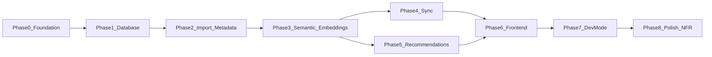

# Film Picker — Implementation Roadmap

Version 1.1

---

## Overview

Film Picker (repository: **Cuebox**) is a locally hosted, single-user application that helps users choose what to watch from their Letterboxd watchlist. This roadmap describes the phased build from greenfield to MVP, aligned with the existing specification documents.

**Current state:** Phase 1 complete. Full PostgreSQL schema deployed via Alembic; SQLAlchemy models, session dependency, repository helpers, and container entrypoint migrations in place. Next up: Phase 2 — Import, Metadata Matching & Enrichment Pipeline.

### Reference Documents

| Document | Purpose |
|----------|---------|
| [PRD.md](./PRD.md) | Product requirements, user journeys, success criteria |
| [Architecture.md](./Architecture.md) | Technical stack, services, pipeline stages |
| [api-contracts.md](./api-contracts.md) | REST API v1 contract |
| [database-design.md](./database-design.md) | PostgreSQL + pgvector schema, migrations |
| [sequence-diagrams.md](./sequence-diagrams.md) | Mermaid flows for major journeys |

### Test Fixtures

Sample Letterboxd exports in a local `letterboxd/` folder (gitignored) — primarily `watchlist.csv` for integration testing.

### Technology Stack

| Layer | Technology |
|-------|------------|
| Frontend | Next.js, TypeScript, React Query, TailwindCSS, shadcn/ui |
| Backend | FastAPI, Pydantic, SQLAlchemy |
| Database | PostgreSQL 16+, pgvector |
| Scheduling | APScheduler, FastAPI Background Tasks |
| Deployment | Docker Compose (`frontend`, `api`, `postgres`) |

---

## Phase Dependency Graph



Phases 4 and 5 can run in parallel once Phase 3 is complete. Phase 6 requires both Phase 4 and Phase 5 backend endpoints.

---

## Phase 0 — Project Foundation

**Duration:** 3–5 days  
**Goal:** Runnable local dev environment with provider configuration and service skeleton.

### API layering

```
Router → Service → Repository → SQLAlchemy (database/)
```

### Task Checklist — Repository scaffold (complete)

- [x] Create repository layout:
  ```
  Cuebox/
  ├── api/
  │   ├── app/
  │   │   ├── main.py              # stub
  │   │   ├── core/
  │   │   │   └── config.py        # stub; load/validate config.yaml
  │   │   ├── routers/v1/
  │   │   ├── services/
  │   │   ├── repositories/
  │   │   ├── database/
  │   │   │   ├── base.py
  │   │   │   ├── session.py
  │   │   │   └── models.py
  │   │   ├── schemas/
  │   │   │   └── errors.py        # api-contracts §2
  │   │   └── providers/
  │   ├── tests/
  │   └── pyproject.toml           # incl. alembic, psycopg[binary], pgvector
  ├── frontend/
  │   ├── src/
  │   │   ├── app/
  │   │   ├── features/            # watchlist, recommendations, history, dev-mode
  │   │   ├── components/
  │   │   ├── hooks/
  │   │   ├── types/               # shared Film, Recommendation, ApiError, etc.
  │   │   └── lib/
  │   │       └── api-client.ts
  │   ├── package.json
  │   └── (Next.js / Tailwind / shadcn config stubs)
  ├── alembic/
  │   └── versions/                # placeholder; env.py in Phase 1
  ├── artifacts/                   # generated outputs (OpenAPI, ERDs, coverage)
  ├── config.example.yaml
  ├── .env.example
  └── .gitignore
  ```
- [x] Create `config.example.yaml` with sections:
  - `providers.embedding`, `providers.semantic_enrichment`, `providers.ranking`
  - `scoring` weights (see [Architecture.md §16](./Architecture.md))
  - `recommendation.retrieval_candidate_limit`
  - `developer_mode: false`
- [x] Create `.env.example` documenting:
  - `DATABASE_URL`
  - `CONFIG_PATH` (mounted config.yaml location)
  - `TMDB_API_KEY`, `OMDB_API_KEY`
  - AI provider keys (OpenAI, Anthropic, etc.)
- [x] Add `.gitignore` excluding `config.yaml`, `.env`, and node_modules
- [x] Add `api/app/schemas/errors.py` — error envelope models per [api-contracts.md §2](./api-contracts.md)
- [x] Declare Phase 1 database dependencies in `api/pyproject.toml`: `alembic`, `psycopg[binary]`, `pgvector`

Dockerfiles are intentionally omitted from the scaffold; they are added with Docker Compose in the runnable pass below.

### Task Checklist — Runnable environment (complete)

- [x] Add `api/Dockerfile` and `frontend/Dockerfile`
- [x] Add `docker-compose.yml` with three services:
  - `postgres` — pgvector-enabled image (e.g. `pgvector/pgvector:pg16`)
  - `api` — FastAPI on port 8000
  - `frontend` — Next.js on port 3000
- [x] Implement FastAPI app shell in `api/app/main.py`:
  - `/api/v1` router prefix
  - Standardized error envelope per [api-contracts.md §2](./api-contracts.md)
  - Exception handlers for `VALIDATION_ERROR`, `NOT_FOUND`, etc.
- [x] Implement `api/app/core/config.py` — load and validate `config.yaml` via Pydantic
- [x] Implement `GET /health` per [api-contracts.md §10.1](./api-contracts.md)
- [x] Install frontend dependencies; run `shadcn init`; wire React Query

### Suggested Modules

| Module | Responsibility |
|--------|----------------|
| `api/app/main.py` | App factory, middleware, router registration |
| `api/app/core/config.py` | Load and validate `config.yaml` via Pydantic |
| `api/app/schemas/errors.py` | Error envelope models |
| `api/app/repositories/` | Data-access layer (Repository pattern) |
| `api/app/database/` | SQLAlchemy base, session, ORM models |
| `frontend/src/lib/api-client.ts` | Base fetch wrapper with error parsing |
| `frontend/src/features/` | Feature-oriented UI (watchlist, recommendations, history, dev-mode) |
| `frontend/src/types/` | Shared TypeScript types across features |

### Verification Gate

- [x] `docker compose up` starts all three services without errors
- [x] `GET http://localhost:8000/api/v1/health` returns `200` with `status: ok`
- [x] Frontend loads at `http://localhost:3000`

### PRD Success Criteria Addressed

None directly — infrastructure prerequisite for all criteria.

---

## Phase 1 — Database & Core Models

**Duration:** 3–5 days  
**Depends on:** Phase 0  
**Goal:** Full schema deployed via Alembic; SQLAlchemy models match [database-design.md](./database-design.md).

### Task Checklist

- [x] Initialise Alembic in `api/alembic/` with SQLAlchemy sync engine config
- [x] Create migration `0001_initial_schema`:
  - Extensions: `pgcrypto`, `vector`
  - All enums (see [database-design.md §3](./database-design.md))
  - All 14 tables in dependency order (see [database-design.md §4](./database-design.md))
  - All constraints and indexes including HNSW indexes
  - View `v_recommendation_candidates_detail`
  - `set_updated_at()` trigger on tables with `updated_at`
  - Partial unique index `uq_watchlist_film_active` (see [phase-1-plan.md](./phase-1-plan.md))
- [x] Create migration `0002_seed_system_versions`:
  - Insert active records for `semantic-v1`, `embedding-v1`, `scoring-v1`, `recommendation-v1`
- [x] Implement SQLAlchemy models mirroring all tables
- [x] Implement database session dependency (`get_db`)
- [x] Run `alembic upgrade head` via container entrypoint before serving traffic
- [x] Add basic repository/query helpers for common lookups

### Suggested Modules

| Module | Responsibility |
|--------|----------------|
| `api/app/database/models.py` | SQLAlchemy ORM models (expand per table group as needed) |
| `api/app/database/session.py` | Engine, session factory, dependency injection |
| `api/app/repositories/` | Query helpers and data-access for common lookups |
| `api/alembic/versions/0001_initial_schema.py` | Full DDL |
| `api/alembic/versions/0002_seed_system_versions.py` | Seed data |
| `api/entrypoint.sh` | Migration entrypoint before uvicorn |

### Tables Created

`import_jobs`, `films`, `film_metadata`, `film_semantic_profiles`, `film_embeddings`, `watchlist_entries`, `metadata_match_reviews`, `recommendation_profiles`, `recommendation_sessions`, `recommendation_candidates`, `recommendation_results`, `recommendation_exposure`, `rss_sync_events`, `system_versions`

### Verification Gate

- [x] Fresh database bootstraps via `alembic upgrade head` without errors
- [x] All 14 tables, enums, indexes, and view exist
- [x] `SELECT * FROM system_versions WHERE active = true` returns 4 rows
- [x] HNSW indexes present on `film_embeddings` and `recommendation_profiles`

### PRD Success Criteria Addressed

| # | Criterion |
|---|-----------|
| 5 | Semantic profiles are versioned (schema ready) |
| 14 | Recommendation history auditable (schema ready) |

---

## Phase 2 — Import, Metadata Matching & Enrichment Pipeline (Part 1)

**Duration:** 1–2 weeks  
**Depends on:** Phase 1  
**Goal:** Watchlist CSV import with async metadata enrichment through TMDB/OMDb.

See [sequence-diagrams.md §1–§4](./sequence-diagrams.md) for flow diagrams.

### Task Checklist

#### Provider Service

- [ ] Implement `ProviderService` reading active providers from `config.yaml`
- [ ] Implement TMDB client (search, movie details, keywords)
- [ ] Implement OMDb client (RT score supplementation)

#### Import Service

- [ ] `POST /import` — [api-contracts.md §3.1](./api-contracts.md)
  - Validate CSV columns: `Date`, `Title`, `Year`, `Letterboxd URI`
  - Enforce 500-film limit, detect in-file duplicates
  - Create `import_jobs` record (`status: running`)
  - Insert `films` (`enrichment_status: pending`) and `watchlist_entries` (`active: true`)
  - Schedule background enrichment task
  - Return `202 Accepted` with `job_id`
- [ ] `GET /import/{job_id}/status` — [api-contracts.md §3.2](./api-contracts.md)
  - Aggregate `processed_films`, `failed_films`, `duplicate_films`
  - Build `failure_summary` from failed films
  - Set job `status: complete` when all films reach terminal states
- [ ] FastAPI Background Task orchestrator iterating per-film pipeline

#### Metadata Service

- [ ] TMDB search by title + year
- [ ] Confidence scoring (title similarity, year match, director match):
  - ≥ 95% → auto accept, `enrichment_status → enriching`
  - 80–95% → accept + flag review record
  - < 80% → `enrichment_status → review_required`, create `metadata_match_reviews`
- [ ] Persist `film_metadata` including `genres`, `keywords`, `original_language`, `original_title`
- [ ] OMDb supplementation for Rotten Tomatoes score
- [ ] Handle enrichment failures → `enrichment_status: failed`, update job counters

#### Film & Review Endpoints

- [ ] `GET /films` — [api-contracts.md §4.1](./api-contracts.md)
- [ ] `GET /films/{film_id}` — [api-contracts.md §4.2](./api-contracts.md)
- [ ] `GET /films/review-required` — [api-contracts.md §4.3](./api-contracts.md)
- [ ] `POST /reviews/{review_id}/accept` — [api-contracts.md §5.1](./api-contracts.md)
- [ ] `POST /reviews/{review_id}/reject` — [api-contracts.md §5.2](./api-contracts.md)

### Suggested Modules

| Module | Responsibility |
|--------|----------------|
| `api/app/services/provider_service.py` | Resolve configured providers |
| `api/app/services/import_service.py` | CSV parsing, job creation, orchestration |
| `api/app/services/metadata_service.py` | TMDB matching, confidence scoring, OMDb |
| `api/app/providers/tmdb.py` | TMDB API client |
| `api/app/providers/omdb.py` | OMDb API client |
| `api/app/routers/import.py` | Import endpoints |
| `api/app/routers/films.py` | Film list/detail endpoints |
| `api/app/routers/reviews.py` | Match review accept/reject |

### Verification Gate

- [ ] Upload `letterboxd/watchlist.csv` via `POST /import`; response returns immediately with `job_id`
- [ ] Poll `GET /import/{job_id}/status` until `status: complete`
- [ ] Films reach `ready`, `review_required`, or `failed` with accurate counts
- [ ] `GET /films/review-required` returns low-confidence matches with `candidate_payload`
- [ ] Accept/reject review transitions film status correctly

### PRD Success Criteria Addressed

| # | Criterion |
|---|-----------|
| 1 | Watchlists import successfully and return immediately with a job ID |
| 2 | Enrichment status is poll-visible per film and per job |
| 3 | Metadata enrichment succeeds |
| 20 | Archived films retain metadata (schema + lifecycle groundwork) |

---

## Phase 3 — Semantic Enrichment & Embeddings

**Duration:** 1 week  
**Depends on:** Phase 2  
**Goal:** Complete the enrichment pipeline so films become recommendation-eligible.

See [sequence-diagrams.md §3](./sequence-diagrams.md) (semantic + embedding steps).

### Task Checklist

- [ ] Implement Semantic Enrichment Provider interface (config-driven)
  - Default: OpenAI or Ollama per `config.yaml`
  - Prompt template for themes, subgenres, tones, emotional outcomes, visual descriptors, viewing contexts, numerical scores, semantic summary
  - Persist to `film_semantic_profiles` with `semantic_version`, `generated_by_model`, `generated_at`
- [ ] Implement Embedding Provider interface (config-driven)
  - Default: OpenAI `text-embedding-3-small` (1536 dimensions)
  - Input: synopsis, genres, keywords, semantic profile, semantic summary
  - Persist to `film_embeddings` (`embedding_type: semantic`)
- [ ] Wire pipeline continuation after metadata step:
  - `enriching → ready` on success
  - `enriching → failed` on provider error
- [ ] Update import job completion when all films reach terminal states
- [ ] Resume pipeline on review accept (schedule semantic + embedding generation)
- [ ] Rate-limit / batch enrichment to respect provider API limits

### Suggested Modules

| Module | Responsibility |
|--------|----------------|
| `api/app/services/semantic_service.py` | LLM semantic profile generation |
| `api/app/services/embedding_service.py` | Film embedding generation |
| `api/app/providers/semantic/` | Provider implementations (OpenAI, Ollama) |
| `api/app/providers/embedding/` | Provider implementations (OpenAI, Voyage) |
| `api/app/prompts/semantic_enrichment.py` | Versioned prompt templates |

### Verification Gate

- [ ] Enriched films have populated `film_semantic_profiles` and `film_embeddings`
- [ ] `enrichment_status = ready` for successfully enriched films
- [ ] pgvector HNSW index contains embedding rows
- [ ] Failed enrichments appear in import job `failure_summary`
- [ ] Accept-review flow completes enrichment to `ready`

### PRD Success Criteria Addressed

| # | Criterion |
|---|-----------|
| 4 | Semantic enrichment is generated and persisted |
| 5 | Semantic profiles are versioned |
| 6 | Film embeddings are generated and stored |
| 12 | Recommendations come exclusively from films with `enrichment_status = ready` (pipeline enforced) |

---

## Phase 4 — Watchlist Synchronisation

**Duration:** 1 week  
**Depends on:** Phase 3  
**Goal:** Keep local state aligned with Letterboxd as source of truth.

See [sequence-diagrams.md §5–§6](./sequence-diagrams.md).

### Task Checklist

#### Manual CSV Sync

- [ ] `POST /sync/csv` — [api-contracts.md §6.1](./api-contracts.md)
  - Same CSV validation as import
  - Diff uploaded CSV against active `watchlist_entries`
  - **Added:** insert or restore archived → active; schedule enrichment for new films
  - **Removed:** deactivate watchlist entry; set `films.status = archived`
  - **Watched:** set `films.status = watched`; deactivate watchlist entry
  - Enforce post-sync active watchlist ≤ 500 films
  - Return sync summary with film lists

#### RSS Sync

- [ ] Add `sync_config` table (or persist in dedicated config store) for RSS username and poll metadata
- [ ] `PUT /sync/rss` — [api-contracts.md §6.2](./api-contracts.md)
- [ ] `GET /sync/rss/status` — [api-contracts.md §6.3](./api-contracts.md)
- [ ] Implement Letterboxd RSS feed parser
- [ ] APScheduler job polling every 900 seconds
- [ ] Idempotent event processing via `rss_sync_events` ledger:
  - `watchlist_add` → insert/restore film + schedule enrichment if needed
  - `watchlist_remove` → archive film
  - `watched` → mark film watched, deactivate entry
- [ ] Record `last_polled_at`, `last_poll_status`, `events_processed_last_poll`

#### Film Lifecycle

- [ ] `active` — on watchlist, eligible if enriched
- [ ] `watched` — excluded from recommendations
- [ ] `archived` — removed from watchlist; retains metadata, semantic profiles, embeddings, history
- [ ] Re-add archived film → restore to `active` without re-enrichment if already `ready`

### Suggested Modules

| Module | Responsibility |
|--------|----------------|
| `api/app/services/sync_service.py` | CSV diff, RSS event application |
| `api/app/services/rss_parser.py` | Letterboxd RSS feed parsing |
| `api/app/scheduler.py` | APScheduler setup and RSS poll job |
| `api/app/routers/sync.py` | Sync endpoints |

### Design Decision: RSS Config Storage

Use a dedicated `sync_config` key-value table (single-row) rather than `system_versions` JSONB. Keeps sync settings separate from AI artifact versioning and simplifies `GET /sync/rss/status` queries.

### Verification Gate

- [ ] Re-upload modified CSV produces correct `added`, `removed`, `watched` counts
- [ ] Archived films retain metadata and semantic profiles
- [ ] Watched films excluded from recommendation candidate queries
- [ ] RSS poll applies events without processing duplicates
- [ ] `GET /sync/rss/status` reflects last poll metadata

### PRD Success Criteria Addressed

| # | Criterion |
|---|-----------|
| 15 | RSS synchronization updates watchlist state |
| 20 | Archived films retain metadata and recommendation history |
| 21 | Watched films are excluded from future recommendations |

---

## Phase 5 — Recommendation Engine

**Duration:** 1.5–2 weeks  
**Depends on:** Phase 3  
**Goal:** Full 6-stage synchronous recommendation pipeline with audit trail.

See [Architecture.md §15](./Architecture.md), [PRD.md §13](./PRD.md), and [sequence-diagrams.md §7–§8](./sequence-diagrams.md).

### Task Checklist

#### Recommendation Profile Service

- [ ] Transform questionnaire responses to `structured_profile`
- [ ] Generate `narrative_profile` (interpret free-text notes via LLM or template)
- [ ] Canonicalize profile (sort arrays, normalize case/whitespace, remove nulls, sort object keys)
- [ ] SHA-256 hash → lookup in `recommendation_profiles`
- [ ] On cache miss: generate embedding, insert profile record
- [ ] Return `profile_id`, embedding, `profile_cache_hit` flag

#### Recommendation Service — Six Stages

**Stage 1 — Hard Constraint Filtering**
- [ ] Exclude watched, archived, non-`ready` films
- [ ] Apply runtime ceiling from questionnaire (`le_90`, `le_120`, `le_150`, `any`)
- [ ] Apply subtitle proxy: exclude non-English `original_language` when `subtitle_preference = no`
- [ ] Relax constraints if too few candidates; record in `constraint_relaxation` JSONB

**Stage 2 — Semantic Retrieval**
- [ ] pgvector cosine similarity search (HNSW index)
- [ ] Respect `retrieval_candidate_limit` from config
- [ ] Record `retrieval_rank` and `similarity_score` per candidate

**Stage 3 — Structured Scoring**
- [ ] Score signals: theme fit, emotional fit, pacing fit, complexity fit, era fit, obscurity fit, viewing context fit, recommendation history
- [ ] Apply configurable weights from `config.yaml`
- [ ] Compute `raw_score` per candidate; persist `score_breakdown`

**Stage 4 — Diversity Adjustment**
- [ ] Load `recommendation_exposure` counters
- [ ] Apply exposure penalties and freshness bonuses
- [ ] Compute `final_score`

**Stage 5 — Controlled Stochastic Selection**
- [ ] Weighted selection among similarly scored candidates
- [ ] Promote diversity-adjusted candidates to prevent stagnation

**Stage 6 — LLM Ranking**
- [ ] Resolve ranking provider from config
- [ ] Input: profile, candidate metadata, semantic enrichment, scores
- [ ] Output: winner, 4 runners-up, structured explanations
- [ ] LLM may reorder candidates when justified

#### Persistence & Endpoints

- [ ] Insert `recommendation_sessions` with all version metadata
- [ ] Insert `recommendation_candidates` with full observability fields
- [ ] Insert `recommendation_results` with winner and runner-up explanations
- [ ] Update `recommendation_exposure` counters
- [ ] `POST /recommendations` — [api-contracts.md §7.1](./api-contracts.md) (target < 30s)
- [ ] `GET /recommendations/{session_id}` — [api-contracts.md §7.2](./api-contracts.md)
- [ ] `GET /recommendations` — [api-contracts.md §8.1](./api-contracts.md)

#### Validation

- [ ] Questionnaire validation including `NO_PREFERENCE_CONFLICT`
- [ ] Return `INSUFFICIENT_CANDIDATES` (422) when no films survive filtering

### Suggested Modules

| Module | Responsibility |
|--------|----------------|
| `api/app/services/recommendation_profile_service.py` | Profile creation and caching |
| `api/app/services/recommendation_service.py` | Six-stage pipeline orchestration |
| `api/app/services/scoring_service.py` | Structured scoring signals |
| `api/app/services/diversity_service.py` | Exposure penalties and freshness |
| `api/app/services/ranking_service.py` | LLM ranking and explanations |
| `api/app/providers/ranking/` | Ranking provider implementations |
| `api/app/prompts/ranking.py` | Versioned ranking prompt (`recommendation-v1`) |
| `api/app/routers/recommendations.py` | Recommendation endpoints |

### Verification Gate

- [ ] End-to-end recommendation from enriched watchlist completes in < 30 seconds
- [ ] Winner + up to 4 runners-up returned with structured explanations
- [ ] Identical questionnaire produces `profile_cache_hit: true` on second run
- [ ] All candidate observability fields populated in `recommendation_candidates`
- [ ] Constraint relaxation recorded when applied
- [ ] History list and detail endpoints return correct data

### PRD Success Criteria Addressed

| # | Criterion |
|---|-----------|
| 7 | Recommendation profiles are created independently of sessions |
| 8 | Sessions reference profiles via `profile_id` |
| 9 | Recommendation profile embeddings are cached by profile hash |
| 10 | Candidate retrieval uses vector similarity |
| 11 | Retrieval traces are stored |
| 12 | Recommendations from `ready` films only |
| 13 | Subtitle filtering uses `original_language` proxy |
| 14 | Recommendation history is auditable |
| 17 | Recommendation generation completes within 30 seconds |
| 18 | One winner and four runners-up with structured reasoning |
| 19 | All recommendation decisions are explainable and traceable |
| 23 | Constraint relaxation recorded as JSONB on session |
| 24 | System promotes variety while remaining explainable |

---

## Phase 6 — Frontend (MVP UX)

**Duration:** 1.5–2 weeks  
**Depends on:** Phases 4 and 5  
**Goal:** Complete user journeys from [PRD.md §4](./PRD.md) without Developer Mode.

See [sequence-diagrams.md §11](./sequence-diagrams.md) for the first-time user journey.

### Task Checklist

#### Shared Infrastructure

- [ ] API client with base URL config and error envelope parsing
- [ ] React Query hooks for all endpoints
- [ ] Shared layout, navigation, loading/error states
- [ ] Toast notifications for API errors

#### Pages & Flows

- [ ] **Home / empty state** — detect no watchlist; prompt CSV upload
- [ ] **Import flow**
  - File upload component
  - `POST /import` → redirect to status page
  - Poll `GET /import/{job_id}/status` every 2–5 seconds
  - Progress bar, failure summary, link to match review if needed
- [ ] **Match review**
  - List films from `GET /films/review-required`
  - Display candidate poster, title, year, director, confidence score
  - Accept/reject actions calling review endpoints
- [ ] **Questionnaire**
  - 10 questions presented one at a time
  - Controlled vocabulary for genres, emotional outcomes, visual/tonal vibes
  - `No Preference` validation (cannot combine with other selections)
  - Optional free-text notes (max 1000 chars)
- [ ] **Results screen**
  - Winner: poster, title, year, runtime, director, ratings
  - Structured explanation sections (why it matches, influential factors, trade-offs)
  - Four runners-up with poster and explanations
  - Answer summary drawer/modal
- [ ] **History**
  - Card grid from `GET /recommendations`
  - Search by winner title; filter by date and watch status
  - Click card → `GET /recommendations/{session_id}` detail view
- [ ] **Sync settings**
  - Manual CSV re-upload via `POST /sync/csv`
  - RSS username configuration via `PUT /sync/rss`
  - RSS status display via `GET /sync/rss/status`

### Suggested Frontend Structure

| Path | Purpose |
|------|---------|
| `frontend/src/app/page.tsx` | Home / routing hub |
| `frontend/src/app/import/page.tsx` | CSV upload |
| `frontend/src/app/import/[jobId]/page.tsx` | Import status polling |
| `frontend/src/app/review/page.tsx` | Metadata match review |
| `frontend/src/app/recommend/page.tsx` | Questionnaire wizard |
| `frontend/src/app/recommend/results/[sessionId]/page.tsx` | Results screen |
| `frontend/src/app/history/page.tsx` | Recommendation history |
| `frontend/src/app/settings/sync/page.tsx` | Sync configuration |
| `frontend/src/hooks/use-import.ts` | Import + status polling hooks |
| `frontend/src/hooks/use-recommendations.ts` | Recommendation + history hooks |

### Verification Gate

- [ ] First-time user journey completable end-to-end through UI
- [ ] Import → poll → review (if needed) → questionnaire → results → history
- [ ] Sync settings update watchlist state correctly
- [ ] Error states display user-friendly messages for all API error codes

### PRD Success Criteria Addressed

All user-facing criteria validated through UI walkthrough.

---

## Phase 7 — Developer Mode

**Duration:** 3–5 days  
**Depends on:** Phase 6  
**Goal:** Internal observability for recommendation debugging.

See [sequence-diagrams.md §10](./sequence-diagrams.md) and [PRD.md §20](./PRD.md).

### Task Checklist

#### Backend

- [ ] Gate all `/dev/*` routes on `developer_mode: true` in config; return `404` when disabled
- [ ] `GET /dev/recommendations/{session_id}/retrieval` — [api-contracts.md §9.1](./api-contracts.md)
- [ ] `GET /dev/recommendations/{session_id}/scoring` — [api-contracts.md §9.2](./api-contracts.md)
- [ ] `GET /dev/recommendations/{session_id}/ai` — [api-contracts.md §9.3](./api-contracts.md)
- [ ] `GET /dev/films/{film_id}/match` — [api-contracts.md §9.4](./api-contracts.md)
- [ ] `GET /dev/system/versions` — [api-contracts.md §9.5](./api-contracts.md)

#### Frontend

- [ ] Hidden Dev Mode entry (e.g. keyboard shortcut or URL param when config enabled)
- [ ] Tabs on results/history detail:
  - **Retrieval** — profile, embedding metadata, candidate similarity scores
  - **Scoring** — weight set, per-candidate score breakdowns
  - **AI** — providers, models, prompt version, token usage
  - **Versions** — active system version registry

### Suggested Modules

| Module | Responsibility |
|--------|----------------|
| `api/app/services/developer_service.py` | Aggregate observability data |
| `api/app/routers/dev.py` | Dev mode endpoints with config gate |
| `frontend/src/components/dev-mode/` | Dev panel UI components |

### Verification Gate

- [ ] Dev endpoints return full trace data for a completed recommendation session
- [ ] Dev endpoints return `404` when `developer_mode: false`
- [ ] Frontend dev panel renders retrieval, scoring, and AI data

### PRD Success Criteria Addressed

| # | Criterion |
|---|-----------|
| 16 | Developer Mode exposes recommendation internals |

---

## Phase 8 — Integration, NFR Validation & Polish

**Duration:** 1 week  
**Depends on:** Phase 7  
**Goal:** Meet [PRD.md §21](./PRD.md) non-functional requirements and all [PRD.md §23](./PRD.md) success criteria.

### Task Checklist

#### Integration Tests

- [ ] Import → enrich → recommend → history (API-level, using test fixtures)
- [ ] Profile cache hit on duplicate questionnaire
- [ ] CSV sync diff scenarios (add, remove, watch, re-add archived)
- [ ] Review accept/reject flows
- [ ] Error cases: `INSUFFICIENT_CANDIDATES`, `NO_PREFERENCE_CONFLICT`, `WATCHLIST_SIZE_EXCEEDED`

#### Unit Tests

- [ ] Profile canonicalization and hashing
- [ ] Scoring signal calculations
- [ ] Confidence score computation
- [ ] CSV validation logic
- [ ] Constraint relaxation logic

#### Performance Validation

- [ ] Recommendation generation < 30 seconds (500-film watchlist, typical questionnaire)
- [ ] History list load < 2 seconds
- [ ] Import returns immediately (< 1 second for job creation)

#### Documentation & Tooling

- [ ] Root `README.md` with:
  - Prerequisites (Docker, API keys)
  - Setup steps (`config.yaml`, `.env`, `docker compose up`)
  - Link to specification documents
- [ ] Optional smoke test script using `letterboxd/watchlist.csv`

### Verification Gate

- [ ] All 24 PRD success criteria verified (see checklist below)
- [ ] Integration test suite passes
- [ ] Performance targets met on representative hardware

---

## API Endpoint Cross-Reference

| Endpoint | Phase | Spec Reference |
|----------|-------|----------------|
| `GET /health` | 0 | [api-contracts.md §10.1](./api-contracts.md) |
| `POST /import` | 2 | [api-contracts.md §3.1](./api-contracts.md) |
| `GET /import/{job_id}/status` | 2 | [api-contracts.md §3.2](./api-contracts.md) |
| `GET /films` | 2 | [api-contracts.md §4.1](./api-contracts.md) |
| `GET /films/{film_id}` | 2 | [api-contracts.md §4.2](./api-contracts.md) |
| `GET /films/review-required` | 2 | [api-contracts.md §4.3](./api-contracts.md) |
| `POST /reviews/{review_id}/accept` | 2 | [api-contracts.md §5.1](./api-contracts.md) |
| `POST /reviews/{review_id}/reject` | 2 | [api-contracts.md §5.2](./api-contracts.md) |
| `POST /sync/csv` | 4 | [api-contracts.md §6.1](./api-contracts.md) |
| `PUT /sync/rss` | 4 | [api-contracts.md §6.2](./api-contracts.md) |
| `GET /sync/rss/status` | 4 | [api-contracts.md §6.3](./api-contracts.md) |
| `POST /recommendations` | 5 | [api-contracts.md §7.1](./api-contracts.md) |
| `GET /recommendations/{session_id}` | 5 | [api-contracts.md §7.2](./api-contracts.md) |
| `GET /recommendations` | 5 | [api-contracts.md §8.1](./api-contracts.md) |
| `GET /dev/recommendations/{session_id}/retrieval` | 7 | [api-contracts.md §9.1](./api-contracts.md) |
| `GET /dev/recommendations/{session_id}/scoring` | 7 | [api-contracts.md §9.2](./api-contracts.md) |
| `GET /dev/recommendations/{session_id}/ai` | 7 | [api-contracts.md §9.3](./api-contracts.md) |
| `GET /dev/films/{film_id}/match` | 7 | [api-contracts.md §9.4](./api-contracts.md) |
| `GET /dev/system/versions` | 7 | [api-contracts.md §9.5](./api-contracts.md) |

---

## PRD Success Criteria Mapping

Complete checklist from [PRD.md §23](./PRD.md). Verify in Phase 8.

| # | Success Criterion | Phase |
|---|-------------------|-------|
| 1 | Watchlists import successfully and return immediately with a job ID | 2 |
| 2 | Enrichment status is poll-visible per film and per job | 2 |
| 3 | Metadata enrichment succeeds | 2 |
| 4 | Semantic enrichment is generated and persisted | 3 |
| 5 | Semantic profiles are versioned | 3 |
| 6 | Film embeddings are generated and stored | 3 |
| 7 | Recommendation profiles are created independently of sessions | 5 |
| 8 | Sessions reference profiles via `profile_id` | 5 |
| 9 | Recommendation profile embeddings are cached by profile hash | 5 |
| 10 | Candidate retrieval uses vector similarity | 5 |
| 11 | Retrieval traces are stored | 5 |
| 12 | Recommendations come exclusively from films with `enrichment_status = ready` | 3, 5 |
| 13 | Subtitle filtering uses `original_language` as proxy | 5 |
| 14 | Recommendation history is auditable via stored profile and version metadata | 5 |
| 15 | RSS synchronization updates watchlist state | 4 |
| 16 | Developer Mode exposes recommendation internals | 7 |
| 17 | Recommendation generation completes within 30 seconds | 5, 8 |
| 18 | Users receive one winner and four runners-up with structured reasoning | 5, 6 |
| 19 | All recommendation decisions are explainable and traceable | 5 |
| 20 | Archived films retain metadata and recommendation history | 4 |
| 21 | Watched films are excluded from future recommendations | 4, 5 |
| 22 | Provider changes require only `config.yaml` edits, not code changes | 0, 3, 5 |
| 23 | Constraint relaxation is recorded as a JSONB object on the session | 5 |
| 24 | The recommendation system promotes variety while remaining explainable | 5 |

---

## Cross-Cutting Concerns

### Provider Independence

All external providers (TMDB, OMDb, embedding, semantic enrichment, ranking) are configured via `config.yaml`. Swapping a provider requires only a config change and, if needed, a compatible provider implementation class registered in the Provider Service. No application code changes should be required for model or provider switches within the same interface.

### Auditability

Every recommendation session stores:

- Recommendation profile (structured + narrative)
- Embedding model and version
- Semantic version
- Scoring version and weight set
- Ranking provider, model, and prompt version
- Constraint relaxation record
- Full candidate trace (retrieval rank, similarity, scores, LLM rank, breakdown)

Raw questionnaire answers are not stored separately; the structured profile is the authoritative record.

### Testing Strategy

| Layer | Scope |
|-------|-------|
| Unit | Canonicalization, scoring, CSV validation, confidence scoring |
| Integration | Import pipeline, sync diff, recommendation pipeline |
| Manual | UI walkthrough of all user journeys |
| Performance | Recommendation latency, history load time |

### Configuration Management

- `config.yaml` — mounted into API container; excluded from version control
- `config.example.yaml` — committed template with all keys documented
- `.env.example` — committed; documents secret env vars
- `documents/` — authored specifications (PRD, architecture, API contracts)
- `artifacts/` — implementation-generated outputs (OpenAPI exports, ERDs, coverage reports); contents gitignored, structure committed

---

## Risks & Mitigations

| Risk | Impact | Mitigation |
|------|--------|------------|
| TMDB rate limits during bulk import | Slow or failed enrichment | Batch with delays; cache TMDB responses; retry with exponential backoff |
| AI provider costs for semantic enrichment | High cost on 500-film import | Batch prompts; use cost-effective models for enrichment; log token usage |
| Embedding dimension mismatch on provider switch | Broken vector search | Migration strategy in [database-design.md §9](./database-design.md); version embeddings separately |
| Letterboxd RSS feed format changes | Sync failures | Defensive parsing; log raw events; surface errors in RSS status endpoint |
| Subtitle proxy inaccuracy | Wrong films filtered | Documented approximation in PRD; constraint relaxation fallback |
| LLM ranking latency | Exceeds 30s target | Limit candidate set sent to ranker; use fast model; parallel scoring stages |
| Low-confidence metadata matches | User friction at import | Clear review UI; batch review workflow |
| pgvector HNSW recall at small scale | Minor retrieval quality | Default `ef_search` sufficient for ≤500 films per [database-design.md §9](./database-design.md) |

---

## Suggested Timeline

| Phase | Focus | Duration |
|-------|-------|----------|
| 0 | Project foundation | 3–5 days |
| 1 | Database & models | 3–5 days |
| 2 | Import + metadata | 1–2 weeks |
| 3 | Semantic + embeddings | 1 week |
| 4 | Watchlist sync | 1 week |
| 5 | Recommendation engine | 1.5–2 weeks |
| 6 | Frontend MVP | 1.5–2 weeks |
| 7 | Developer Mode | 3–5 days |
| 8 | Integration + NFR | 1 week |

**Total estimate:** 8–12 weeks for a single developer.

Phases 4 and 5 can overlap after Phase 3. Phase 6 should begin once Phase 5 core endpoints are stable, even if Phase 4 sync UI is built in parallel.

---

## Future Expansion Backlog

Items from [PRD.md §22](./PRD.md) and [Architecture.md §22](./Architecture.md). Out of scope for MVP; architecture should accommodate without redesign.

| Feature | Notes |
|---------|-------|
| Conversational recommendations | Multi-turn profile refinement; reuse profile service |
| Similar-film exploration | Vector similarity from film embeddings |
| Watchlist clustering | Unsupervised grouping of semantic profiles |
| Recommendation collections | Curated multi-film sessions |
| Offline recommendation generation | Local ranking/embedding models |
| Alternative ranking engines | Additional provider implementations |
| Local embedding models | Ollama, sentence-transformers via provider interface |
| Semantic search | Free-text search over film semantic summaries |
| Multi-embedding types | `synopsis`, `theme` embedding types beyond `semantic` |
| Automatic metadata re-match | Periodic TMDB refresh for updated metadata |

---

## Document Index

| Topic | Primary Document |
|-------|------------------|
| User journeys & questionnaire | [PRD.md](./PRD.md) |
| Service architecture & pipeline | [Architecture.md](./Architecture.md) |
| REST API contracts | [api-contracts.md](./api-contracts.md) |
| Database schema & migrations | [database-design.md](./database-design.md) |
| Sequence diagrams | [sequence-diagrams.md](./sequence-diagrams.md) |
| Implementation plan | This document |
