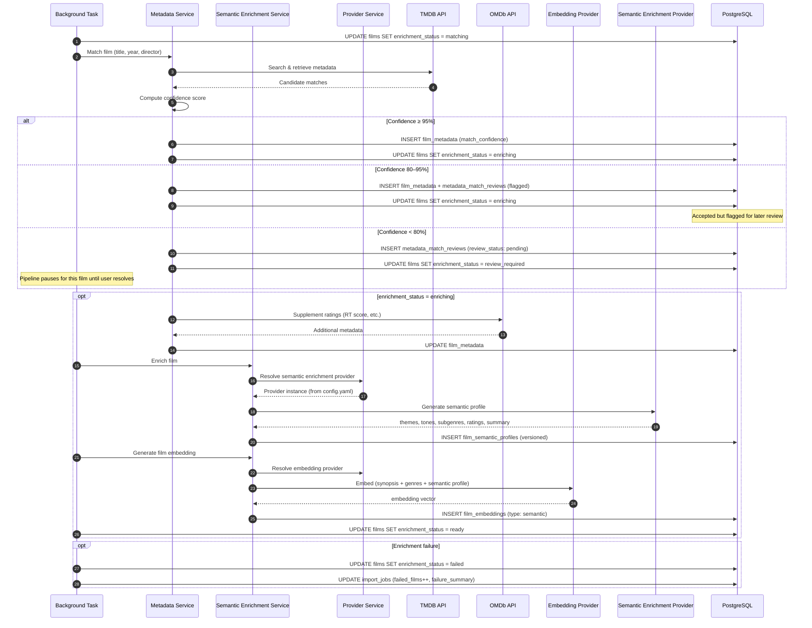
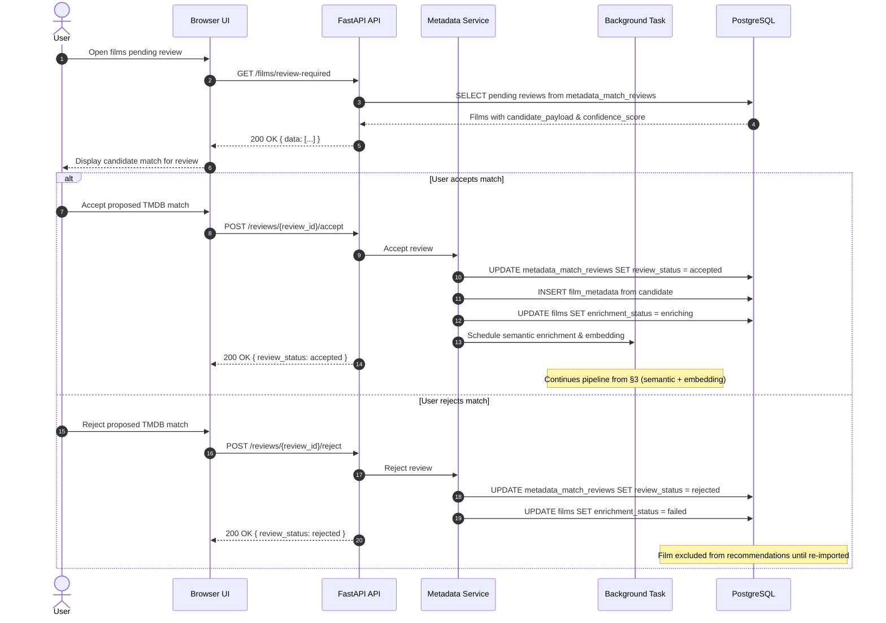
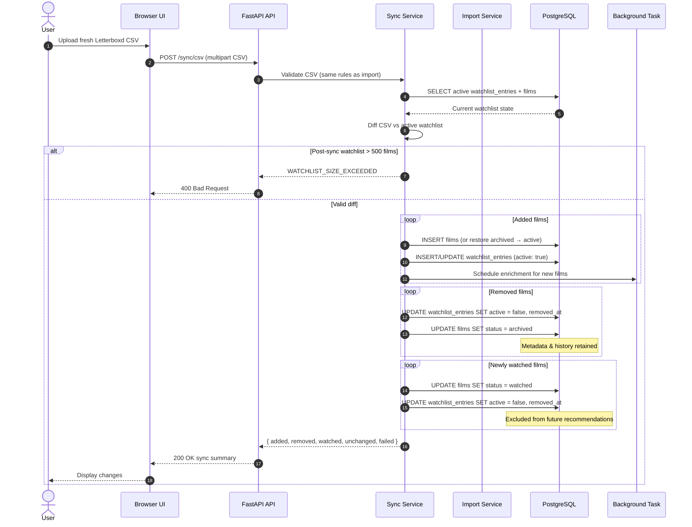
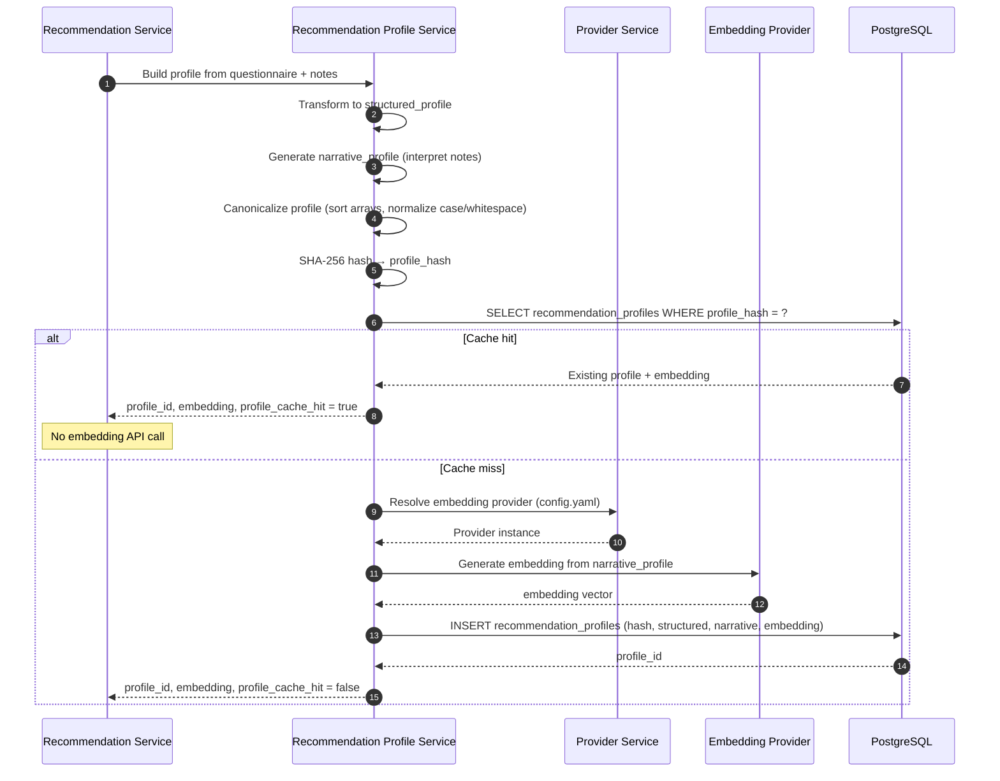
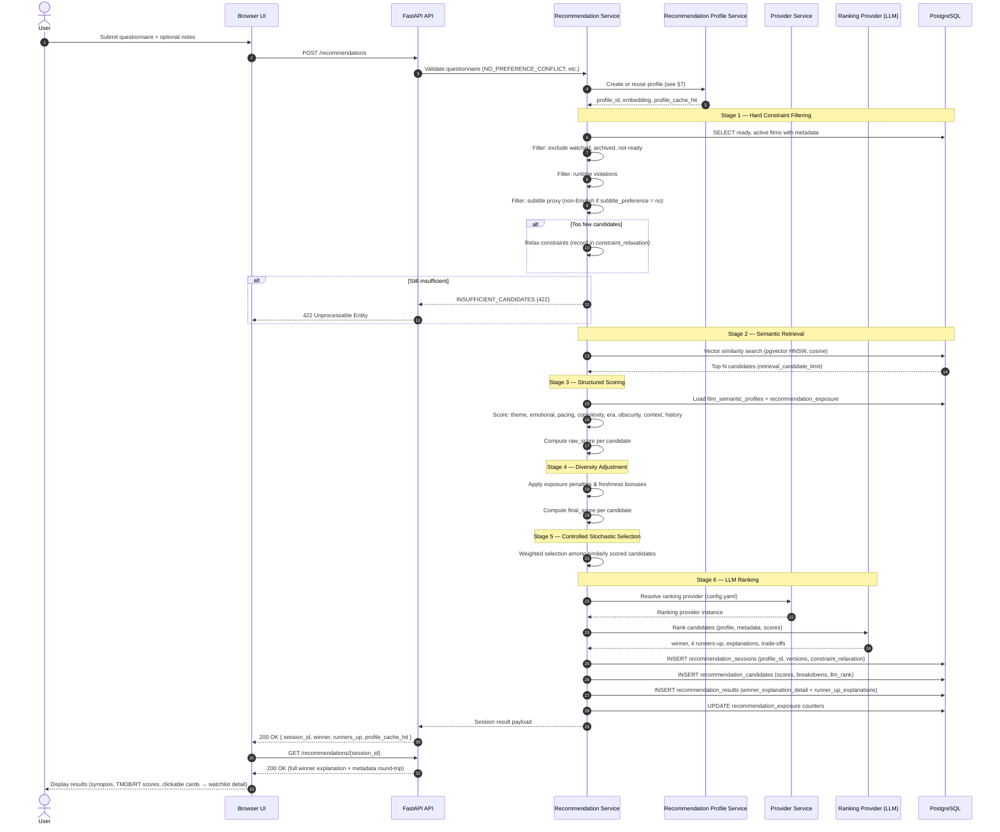
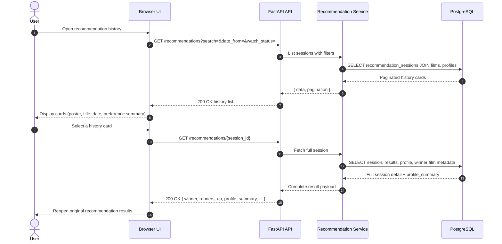
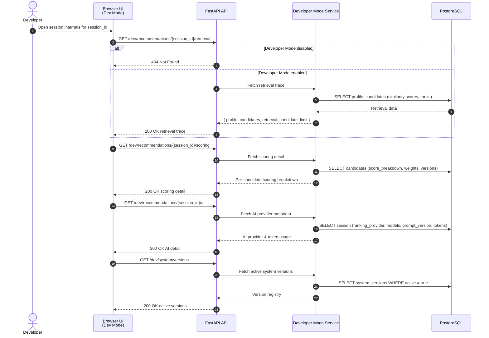

# Film Picker — Sequence Diagrams

Version 1.0

Sequence diagrams for the major flows described in [Architecture.md](./Architecture.md), [PRD.md](./PRD.md), [api-contracts.md](./api-contracts.md), and [database-design.md](./database-design.md).

All diagrams use [Mermaid](https://mermaid.js.org/) syntax and can be rendered in GitHub, VS Code, and most Markdown viewers.

---

## Table of Contents

1. [Watchlist Import & Async Enrichment](#1-watchlist-import--async-enrichment)
2. [Import Job Status Polling](#2-import-job-status-polling)
3. [Metadata Matching & Enrichment (Per Film)](#3-metadata-matching--enrichment-per-film)
4. [Metadata Match Review](#4-metadata-match-review)
5. [Manual CSV Synchronisation](#5-manual-csv-synchronisation)
6. [RSS Synchronisation](#6-rss-synchronisation)
7. [Recommendation Profile Creation & Caching](#7-recommendation-profile-creation--caching)
8. [Recommendation Generation Pipeline](#8-recommendation-generation-pipeline)
9. [Recommendation History](#9-recommendation-history)
10. [Developer Mode Observability](#10-developer-mode-observability)
11. [First-Time User Journey](#11-first-time-user-journey)

---

## 1. Watchlist Import & Async Enrichment

User uploads a Letterboxd CSV. The API returns immediately with a job ID; enrichment runs asynchronously via FastAPI Background Tasks.

```mermaid
sequenceDiagram
    autonumber
    actor User
    participant UI as Browser UI<br/>(Next.js)
    participant API as FastAPI API
    participant Import as Import Service
    participant DB as PostgreSQL
    participant BG as Background Task

    User->>UI: Upload Letterboxd CSV
    UI->>API: POST /import (multipart CSV)
    API->>Import: Validate CSV format & size (≤500 films)
    alt Invalid CSV
        Import-->>API: VALIDATION_ERROR / INVALID_CSV_FORMAT
        API-->>UI: 400 Bad Request
        UI-->>User: Show validation error
    else Valid CSV
        Import->>DB: INSERT import_jobs (status: running)
        Import->>DB: INSERT films (enrichment_status: pending)
        Import->>DB: INSERT watchlist_entries (active: true)
        Import->>BG: Schedule enrichment pipeline
        Import-->>API: job_id
        API-->>UI: 202 Accepted { job_id, status: running }
        UI-->>User: Show import started; redirect to status view

        loop For each film in job
            BG->>BG: Run metadata matching & enrichment (see §3)
        end
    end
```

---

## 2. Import Job Status Polling

The UI polls aggregate progress while enrichment runs in the background.

```mermaid
sequenceDiagram
    autonumber
    actor User
    participant UI as Browser UI
    participant API as FastAPI API
    participant Import as Import Service
    participant DB as PostgreSQL

    loop Until job complete or failed
        User->>UI: View import status page
        UI->>API: GET /import/{job_id}/status
        API->>Import: Fetch job progress
        Import->>DB: SELECT import_jobs + aggregate film counts
        DB-->>Import: total_films, processed_films, failed_films, duplicate_films
        Import-->>API: Job status payload
        API-->>UI: 200 OK { status, counts, failure_summary }
        UI-->>User: Display progress bar & per-film status
        Note over UI: Poll interval (e.g. every 2–5 seconds)
    end

    alt status = complete
        UI-->>User: Show import summary; enable recommendations
    else status = failed
        UI-->>User: Show failure summary
    end
```

---

## 3. Metadata Matching & Enrichment (Per Film)

Each film progresses through metadata lookup, semantic enrichment, and embedding generation. Films are excluded from recommendations until `enrichment_status = ready`.



---

## 4. Metadata Match Review

User resolves low-confidence TMDB matches before the film becomes recommendation-eligible.



---

## 5. Manual CSV Synchronisation

Returning user uploads a fresh CSV. The system diffs against the active watchlist and applies additions, removals, and watched-status changes.



---

## 6. RSS Synchronisation

APScheduler polls the Letterboxd RSS feed every 15 minutes. Events are recorded in an idempotent ledger before being applied.

```mermaid
sequenceDiagram
    autonumber
    actor User
    participant UI as Browser UI
    participant API as FastAPI API
    participant Scheduler as APScheduler
    participant Sync as Sync Service
    participant RSS as Letterboxd RSS
    participant DB as PostgreSQL
    participant BG as Background Task

    User->>UI: Configure RSS sync username
    UI->>API: PUT /sync/rss { username }
    API->>DB: Persist RSS configuration
    API-->>UI: 200 OK { polling_interval_seconds: 900 }

    loop Every 15 minutes
        Scheduler->>Sync: Trigger RSS poll
        Sync->>RSS: Fetch RSS feed for username
        RSS-->>Sync: Feed entries (additions, removals, watched)

        loop For each feed event
            Sync->>DB: Check if event already exists
            alt Duplicate event (idempotent)
                Sync->>DB: Skip (event already exists)
            else New event
                Sync->>DB: INSERT rss_sync_events (processed: false)
                alt watchlist_add
                    Sync->>DB: INSERT/restore film + watchlist_entry
                    Sync->>BG: Schedule enrichment if new
                else watchlist_remove
                    Sync->>DB: Archive film; deactivate watchlist_entry
                else watched
                    Sync->>DB: UPDATE films SET status = watched
                    Sync->>DB: UPDATE watchlist_entries SET active = false, removed_at
                end
                Sync->>DB: UPDATE rss_sync_events SET processed = true
            end
        end
        Sync->>DB: Record last_polled_at, last_poll_status
    end

    User->>UI: View RSS sync status
    UI->>API: GET /sync/rss/status
    API->>DB: SELECT RSS config & last poll metadata
    API-->>UI: 200 OK { configured, last_polled_at, events_processed }
```

---

## 7. Recommendation Profile Creation & Caching

Questionnaire answers are transformed into a canonical recommendation profile. Profiles are created independently of sessions and cached by SHA-256 hash.



---

## 8. Recommendation Generation Pipeline

Synchronous endpoint (`POST /recommendations`). Target response time under 30 seconds. Six-stage pipeline with full audit trail persisted to the database.



---

## 9. Recommendation History

Past sessions are listed and can be reopened in full detail.



---

## 10. Developer Mode Observability

Developer Mode endpoints expose internal pipeline data for a recommendation session. Requires `developer_mode: true` in `config.yaml`.



---

## 11. First-Time User Journey

End-to-end flow from first launch through first recommendation.

```mermaid
sequenceDiagram
    autonumber
    actor User
    participant UI as Browser UI
    participant API as FastAPI API

    User->>UI: Launch application
    UI-->>User: Show empty state; prompt CSV upload

    User->>UI: Upload Letterboxd watchlist CSV
    Note over UI,API: See §1 Watchlist Import
    UI->>API: POST /import
    API-->>UI: 202 { job_id }

    loop Poll until enrichment complete
        Note over UI,API: See §2 Import Job Status Polling
        UI->>API: GET /import/{job_id}/status
        API-->>UI: Progress counts
    end

    opt Films require metadata review
        Note over UI,API: See §4 Metadata Match Review
        User->>UI: Resolve ambiguous matches
    end

    UI-->>User: Enrichment complete; enable recommendations

    User->>UI: Start new recommendation
    UI-->>User: Present questionnaire (Q1–Q10 + notes)

    User->>UI: Answer questions & submit
    Note over UI,API: See §8 Recommendation Generation Pipeline
    UI->>API: POST /recommendations
    API-->>UI: 200 { winner, runners_up, explanations }

    UI->>API: GET /recommendations/{session_id}
    API-->>UI: 200 OK (persisted session detail)
    UI-->>User: Display results (auto-saved to history; cards link to watchlist detail)
    Note over User: Session persisted with full audit trail
```

---

## Diagram Index

| Diagram | Primary Reference Docs | Key API Endpoints |
|---------|------------------------|-------------------|
| §1 Import & Enrichment | Architecture §7, PRD §5 | `POST /import` |
| §2 Status Polling | Architecture §7, PRD §5 | `GET /import/{job_id}/status` |
| §3 Per-Film Enrichment | Architecture §7–12, DB §4.2–4.5 | — (background) |
| §4 Match Review | Architecture §19, PRD §5 | `GET /films/review-required`, `POST /reviews/{id}/accept`, `POST /reviews/{id}/reject` |
| §5 Manual Sync | Architecture §18, PRD §6 | `POST /sync/csv` |
| §6 RSS Sync | Architecture §18, PRD §6, DB §4.13 | `PUT /sync/rss`, `GET /sync/rss/status` |
| §7 Profile Caching | Architecture §13–14, PRD §12 | — (internal) |
| §8 Recommendation Pipeline | Architecture §15, PRD §13, DB §9 | `POST /recommendations` |
| §9 History | PRD §17, API §8 | `GET /recommendations`, `GET /recommendations/{id}` |
| §10 Developer Mode | Architecture §21, PRD §20, API §9 | `GET /dev/...` |
| §11 First-Time User | PRD §4 | Multiple |
