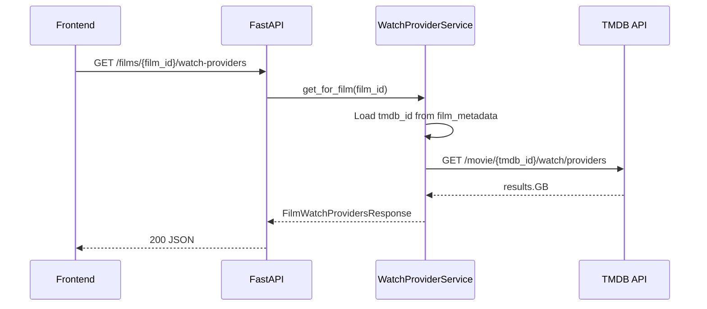
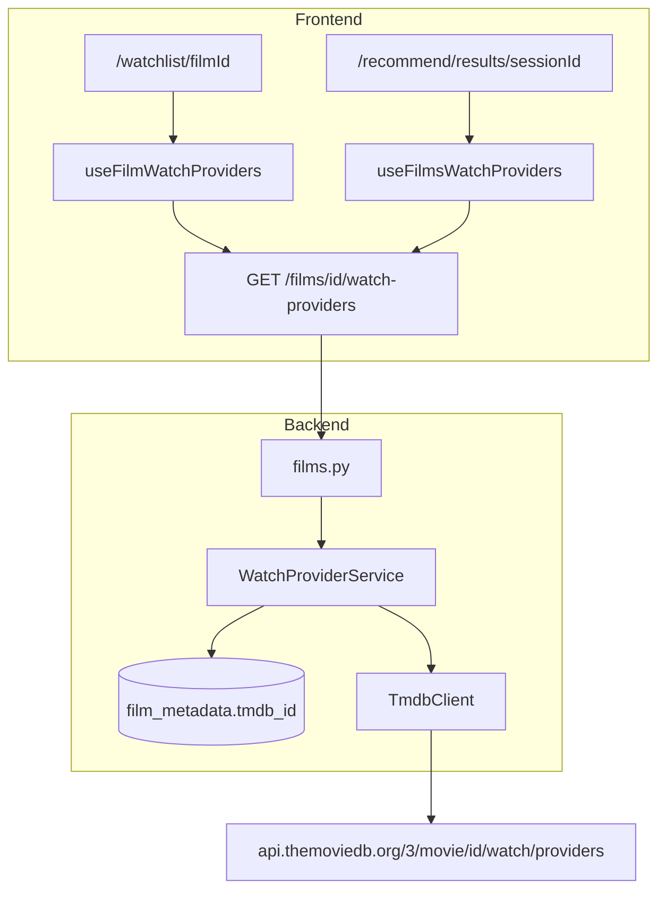

# TMDB Watch Providers — Implementation Plan

## Context

**MVP (Phase 8) is complete.** Cuebox enriches films with TMDB metadata during import (search, details, keywords, credits) and persists that data in `film_metadata`. Users can browse enriched films at `/watchlist/[filmId]` and view recommendation results at `/recommend/results/[sessionId]` (and history detail at `/history/[sessionId]`).

**Feature goal:** Show users where they can stream, rent, or buy recommended or watchlisted films in the **United Kingdom (GB)** using TMDB’s real-time Watch Providers API. Because streaming rights change frequently, provider data must **not** be stored in Postgres during enrichment — it is fetched on demand when the user opens the relevant screens.

**Authoritative references:**

| Document | Purpose |
|----------|---------|
| GitHub PR / issue | UX requirements, GB default, monetization categories |
| [TMDB Watch Providers API](https://developer.themoviedb.org/reference/movie-watch-providers) | External data source (`GET /3/movie/{movie_id}/watch/providers`) |
| [`documents/api-contracts.md`](./api-contracts.md) | REST contract (extend §4 Films) |
| [`documents/DESIGN.md`](./DESIGN.md) | Modern Neo-Noir Cinema UI tokens |
| [`documents/roadmap.md`](./roadmap.md) | Post-MVP backlog |

---

## Current State (Gap Analysis)

### What exists today

| Layer | Relevant files | Current behavior |
|-------|----------------|------------------|
| TMDB client | `api/app/providers/tmdb.py` | `search_movie`, `get_movie_details`, `get_movie_keywords`, `get_movie_credits`; image URL helpers |
| Provider wiring | `api/app/services/provider_service.py` | Instantiates `TmdbClient` when `providers.metadata.tmdb.enabled` + `TMDB_API_KEY` |
| HTTP retry | `api/app/providers/http_retry.py` | Shared retry for TMDB calls |
| Film metadata DB | `api/app/database/models.py` → `FilmMetadata` | Stores `tmdb_id`, poster, ratings, etc. — **no watch provider fields** |
| Films API | `api/app/routers/v1/films.py` | `GET /films`, `GET /films/{id}`, `GET /films/review-required` — returns persisted metadata only |
| Film detail UI | `frontend/src/app/watchlist/[filmId]/page.tsx`, `frontend/src/components/film-detail-view.tsx` | Hero, Overview, Metadata, Semantic profile cards |
| Results UI | `frontend/src/components/results-view.tsx` | Private `FilmResultCard`; ratings + explanation; no provider icons |
| Types | `frontend/src/types/api.ts`, `api/app/schemas/film_schemas.py` | `FilmDetail`, `FilmResult` — no watch provider types |
| Test mocks | `api/tests/mock_providers.py` | Mocks search/details/keywords/credits — **no watch/providers handler** |
| Images | `frontend/next.config.ts` | `image.tmdb.org` already allowed for Next.js `<Image>` |

### What does not exist

- No `get_movie_watch_providers` on `TmdbClient`
- No API route proxying watch provider data
- No frontend components for “Where to Watch”
- No database migration needed (by design)
- No JustWatch attribution in the UI (required by TMDB API terms)

---

## Architecture Decisions

### 1. Backend proxy (not frontend → TMDB)

`TMDB_API_KEY` lives server-side in `.env`. The frontend must **not** call TMDB directly. Follow the existing pattern: `Router → Service → TmdbClient → TMDB`.

### 2. No Postgres persistence

Do **not** add columns to `film_metadata` or store provider payloads during import enrichment. Each screen load triggers a fresh TMDB fetch (optionally with a short in-memory TTL cache in the service layer — see [Optional enhancements](#optional-enhancements)).

### 3. Film-ID-based API (not tmdb_id in URL)

Expose `GET /films/{film_id}/watch-providers`. The backend resolves `tmdb_id` from `film_metadata`. This:

- Keeps TMDB IDs internal
- Works for both film detail and recommendation cards (which already expose `film_id` on `FilmResult`)
- Returns `404` if film not found, `422` (or `200` with empty categories) if film has no `tmdb_id`

### 4. Country code: GB default

Parse `results.GB` from the TMDB response. Default `GB` in `config.yaml`; allow future override without code changes.

### 5. Monetization categories

From the GB object, parse and return all four arrays when present:

| TMDB key | UI label (film detail) | Results card |
|----------|------------------------|--------------|
| `flatrate` | Stream | Show logo |
| `rent` | Rent | Show logo |
| `buy` | Buy | Show logo |
| `ads` | Free with Ads | Show logo |

Deduplicate providers that appear in multiple categories for the condensed results view (prefer `flatrate` > `ads` > `rent` > `buy` for icon display order).

### 6. Logo URLs

TMDB returns `logo_path` (e.g. `/7rwgEs15tFwyR9NPQ5vpzxTj19Q.jpg`). Build full URLs server-side:

```text
https://image.tmdb.org/t/p/w92{logo_path}
```

Add a `provider_logo_url(path)` static helper on `TmdbClient` (w92 is appropriate for favicon-sized icons; w45 for results row).

### 7. JustWatch attribution

TMDB requires attributing JustWatch as the data source. Include a small footer in the film-detail “Where to Watch” section, e.g. “Streaming availability data provided by JustWatch via TMDB.” Link to the TMDB `link` field from the GB object when present.

### 8. Results page fetch strategy

Recommendation responses include 1 winner + up to 4 runners-up (`FilmResult.film_id`). Use **parallel per-film fetches** via React Query `useQueries` calling `GET /films/{film_id}/watch-providers` — five concurrent requests is acceptable. Optionally add a batch endpoint later if latency becomes an issue.

---

## TMDB API Reference

**Endpoint:** `GET https://api.themoviedb.org/3/movie/{movie_id}/watch/providers`

**Note:** The PR description references `watch_providers`; the actual TMDB path is `/watch/providers` (with a slash).

**Response shape (relevant fields):**

```json
{
  "id": 550,
  "results": {
    "GB": {
      "link": "https://www.themoviedb.org/movie/550-fight-club/watch?locale=GB",
      "flatrate": [
        {
          "logo_path": "/7rwgEs15tFwyR9NPQ5vpzxTj19Q.jpg",
          "provider_id": 337,
          "provider_name": "Disney Plus",
          "display_priority": 1
        }
      ],
      "rent": [ "..." ],
      "buy": [ "..." ],
      "ads": [ "..." ]
    }
  }
}
```

**Parsing rules:**

1. Read `results[country_code]` (default `GB`).
2. If country key missing or all four arrays empty/absent → return empty response (not an error).
3. Sort each category by `display_priority` ascending.
4. Map each item to `{ provider_id, provider_name, logo_url }`.
5. Include top-level `link` (TMDB watch page) and `country_code` in the API response.

---

## Proposed API Contract

Add to [`documents/api-contracts.md`](./api-contracts.md) as **§4.4 Get Film Watch Providers**.

### `GET /films/{film_id}/watch-providers`

#### Query parameters

| Parameter | Type | Default | Description |
|-----------|------|---------|-------------|
| `country` | string | `GB` (from config) | ISO 3166-1 alpha-2 country code |

#### Response `200 OK`

```json
{
  "film_id": "f1a2b3c4-...",
  "tmdb_id": 11453,
  "country_code": "GB",
  "link": "https://www.themoviedb.org/movie/11453-the-wicker-man/watch?locale=GB",
  "flatrate": [
    {
      "provider_id": 337,
      "provider_name": "Disney Plus",
      "logo_url": "https://image.tmdb.org/t/p/w92/7rwgEs15tFwyR9NPQ5vpzxTj19Q.jpg"
    }
  ],
  "rent": [],
  "buy": [],
  "ads": []
}
```

#### Errors

| Code | HTTP | Trigger |
|------|------|---------|
| `NOT_FOUND` | 404 | `film_id` not found |
| `PROVIDER_UNAVAILABLE` | 503 | TMDB client not configured or TMDB HTTP failure after retries |
| `VALIDATION_ERROR` | 422 | Film exists but has no `tmdb_id` (enrichment incomplete / review required) |

**Empty providers:** When `tmdb_id` exists but GB has no listings, return `200` with empty arrays (frontend shows fallback copy).

### Optional batch endpoint (defer unless needed)

`GET /films/watch-providers?film_ids=uuid1,uuid2,...` — register **before** `/{film_id}` in the router. Returns `{ data: FilmWatchProviders[] }`. Implement only if parallel single-film latency is problematic.

---

## Step-by-Step Implementation

### Step 1 — Config

**Files:** `config.example.yaml`, `api/app/core/config.py`

Add:

```yaml
watch_providers:
  country_code: GB
```

Load via existing YAML config loader; expose as `config.watch_providers.country_code`.

---

### Step 2 — TMDB client extension

**File:** `api/app/providers/tmdb.py`

1. Add frozen dataclasses:
   - `TmdbWatchProvider` — `provider_id`, `provider_name`, `logo_path`
   - `TmdbWatchProvidersResult` — `tmdb_id`, `country_code`, `link`, `flatrate`, `rent`, `buy`, `ads` (lists of `TmdbWatchProvider`)

2. Add method:

```python
async def get_movie_watch_providers(
    self, tmdb_id: int, *, country_code: str = "GB"
) -> TmdbWatchProvidersResult:
    # GET /movie/{tmdb_id}/watch/providers
    # Parse results[country_code]; normalize empty/missing → empty lists
```

3. Add `provider_logo_url(path: str | None, *, size: str = "w92")` static helper.

4. Reuse `request_with_retry` — same pattern as `get_movie_details`.

---

### Step 3 — Pydantic schemas

**New file:** `api/app/schemas/watch_providers.py`

```python
class WatchProviderItem(BaseModel):
    provider_id: int
    provider_name: str
    logo_url: str

class FilmWatchProvidersResponse(BaseModel):
    film_id: UUID
    tmdb_id: int
    country_code: str
    link: str | None
    flatrate: list[WatchProviderItem]
    rent: list[WatchProviderItem]
    buy: list[WatchProviderItem]
    ads: list[WatchProviderItem]
```

---

### Step 4 — Watch provider service

**New file:** `api/app/services/watch_provider_service.py`

Responsibilities:

1. Accept `film_id` + optional `country_code` override.
2. Load film + metadata from DB (`film_repository.get_by_id_with_relations` or metadata repo).
3. If no `tmdb_id` → raise `validation_error` (422).
4. Call `provider_service.get_tmdb_client().get_movie_watch_providers(tmdb_id, country_code=...)`.
5. Map `logo_path` → `logo_url` via `TmdbClient.provider_logo_url`.
6. Return `FilmWatchProvidersResponse`.

**Dependency:** Add `get_watch_provider_service()` to `api/app/dependencies.py`.

---

### Step 5 — Films router endpoint

**File:** `api/app/routers/v1/films.py`

```python
@router.get("/{film_id}/watch-providers", response_model=FilmWatchProvidersResponse)
async def get_film_watch_providers(
    film_id: uuid.UUID,
    country: str | None = None,
    db: Session = Depends(get_db),
    service: WatchProviderService = Depends(get_watch_provider_service),
) -> FilmWatchProvidersResponse:
    ...
```

Use `async` because TMDB client is async. Follow pattern from other async routes if any exist; otherwise run async client via `asyncio` in sync router (check existing conventions — `MetadataService` uses async enrichment in background tasks).

**Router async note:** If the films router stays sync, wrap the async TMDB call with `anyio`/`asyncio.run` or make the service method sync via `httpx` sync client. Prefer matching existing `TmdbClient` async usage from `MetadataService`.

---

### Step 6 — Backend tests

| File | Coverage |
|------|----------|
| `api/tests/test_tmdb_watch_providers.py` | Unit: parse GB object, empty country, sort by `display_priority`, logo URL builder |
| `api/tests/mock_providers.py` | Add handler for `GET .../watch/providers` with Matrix TMDB ID sample GB payload |
| `api/tests/test_film_watch_providers.py` | Integration: 200 with providers, 200 empty arrays, 404 film, 422 no tmdb_id, 503 TMDB down |

**Mock sample GB payload** (minimal):

```json
{
  "id": 603,
  "results": {
    "GB": {
      "link": "https://www.themoviedb.org/movie/603-the-matrix/watch?locale=GB",
      "flatrate": [
        { "provider_id": 337, "provider_name": "Disney Plus", "logo_path": "/7rwgEs15tFwyR9NPQ5vpzxTj19Q.jpg", "display_priority": 1 }
      ],
      "rent": [],
      "buy": [],
      "ads": []
    }
  }
}
```

Seed films using `api/tests/helpers/seed_ready_films.py` (already has `tmdb_id`).

---

### Step 7 — API contract & sequence diagram

1. **`documents/api-contracts.md`** — Add §4.4 with request/response/errors above.
2. **`documents/sequence-diagrams.md`** — New subsection under user journeys:



---

### Step 8 — Frontend types & API client

**Files:** `frontend/src/types/api.ts`, `frontend/src/lib/api-client.ts`

```typescript
export interface WatchProviderItem {
  provider_id: number;
  provider_name: string;
  logo_url: string;
}

export interface FilmWatchProviders {
  film_id: string;
  tmdb_id: number;
  country_code: string;
  link: string | null;
  flatrate: WatchProviderItem[];
  rent: WatchProviderItem[];
  buy: WatchProviderItem[];
  ads: WatchProviderItem[];
}
```

```typescript
export function getFilmWatchProviders(filmId: string): Promise<FilmWatchProviders> {
  return fetchApi<FilmWatchProviders>(`/films/${filmId}/watch-providers`);
}
```

---

### Step 9 — React Query hooks

**New file:** `frontend/src/hooks/use-watch-providers.ts`

```typescript
export function useFilmWatchProviders(filmId: string) {
  return useQuery({
    queryKey: ["films", filmId, "watch-providers"],
    queryFn: () => getFilmWatchProviders(filmId),
    enabled: Boolean(filmId),
    staleTime: 0,           // always refetch on mount — data is time-sensitive
    gcTime: 5 * 60_000,     // short cache only for back-navigation
  });
}

export function useFilmsWatchProviders(filmIds: string[]) {
  return useQueries({
    queries: filmIds.map((filmId) => ({
      queryKey: ["films", filmId, "watch-providers"],
      queryFn: () => getFilmWatchProviders(filmId),
      enabled: Boolean(filmId),
      staleTime: 0,
    })),
  });
}
```

Do **not** block film detail page on watch providers — load film detail first, fetch providers in parallel (secondary query).

---

### Step 10 — Shared UI components

**New file:** `frontend/src/components/watch-providers/`

| Component | Purpose |
|-----------|---------|
| `provider-logo.tsx` | Single provider image with `alt={provider_name}`, rounded, `h-8 w-8` (detail) or `h-6 w-6` (results) |
| `watch-provider-icons.tsx` | Condensed row for results cards — dedupe, max ~6 icons, `title` tooltip with name |
| `where-to-watch-section.tsx` | Full film-detail section — category groups, loading skeleton, empty state, JustWatch footer |

**Design system alignment** (`documents/DESIGN.md`):

- Wrap in `Card` with `CardHeader` / `CardTitle` “Where to Watch”
- Category labels: `text-label-md text-muted-foreground`
- Provider grid: `flex flex-wrap gap-3`
- Provider name beside logo on detail view (not just icon)
- Empty state: `text-body-md text-muted-foreground` — *“No streaming options currently listed for the UK.”*
- Link to TMDB watch page when `link` present: subtle `text-primary` anchor
- JustWatch attribution: `text-label-md text-muted-foreground` footer

---

### Step 11 — Film detail page integration

**Files:** `frontend/src/components/film-detail-view.tsx`, `frontend/src/app/watchlist/[filmId]/page.tsx`

**Option A (recommended):** Keep `FilmDetailView` presentational; parent page fetches watch providers and passes as prop:

```tsx
// page.tsx
const { data: film } = useFilm(filmId);
const { data: watchProviders, isLoading, isError } = useFilmWatchProviders(filmId);

return (
  <FilmDetailView
    film={film}
    watchProviders={watchProviders}
    watchProvidersLoading={isLoading}
    watchProvidersError={isError}
  />
);
```

**Placement:** Insert `WhereToWatchSection` after the **Metadata** card and before **Semantic profile** (or as a sidebar on `lg:` breakpoints if layout permits).

**Edge cases:**

| Condition | UI |
|-----------|-----|
| Loading | Skeleton rows in the card |
| No `tmdb_id` / 422 | Omit section or show “Match TMDB metadata to see streaming options.” |
| 200 + empty arrays | Fallback message |
| TMDB 503 | Inline error with retry button (`ErrorState` pattern) |

---

### Step 12 — Recommendation results integration

**File:** `frontend/src/components/results-view.tsx`

1. Extract `FilmResultCard` to `frontend/src/components/film-result-card.tsx` (optional but recommended as the card grows).
2. In `ResultsView`, collect all `film_id`s from `winner` + `runners_up`.
3. Call `useFilmsWatchProviders(filmIds)`.
4. Pass per-card provider data into `FilmResultCard`.
5. Render `WatchProviderIcons` below the LBX/RT ratings row (~line 67).

**History detail:** `frontend/src/app/history/[sessionId]/page.tsx` reuses `ResultsView` — no extra work if providers are wired in `ResultsView`.

**Condensed display rules:**

- Show flatrate logos first; if none, show ads; then rent/buy.
- Max 5–6 icons; overflow `+N` badge if needed.
- If no providers: omit row (don't show empty state on cards — keeps cards clean).

---

### Step 13 — E2E & frontend unit tests

| File | Coverage |
|------|----------|
| `frontend/src/components/watch-providers/*.test.tsx` | Render categories, empty state, icon deduplication |
| `frontend/e2e/helpers/dev-api-mocks.ts` | Add `watchProviders` fixture; wire into film detail + results mocks |
| `frontend/e2e/all-routes.spec.ts` or new spec | Film detail shows “Where to Watch”; results cards show provider icons (mocked) |

---

### Step 14 — Verification gate script

**New file:** `scripts/verify-watch-providers-gates.sh`

```bash
#!/usr/bin/env bash
set -euo pipefail
# 1. api/tests/test_tmdb_watch_providers.py
# 2. api/tests/test_film_watch_providers.py (Postgres required)
# 3. cd frontend && npx tsc --noEmit && npm run build
# 4. cd frontend && npm run test:unit (new component tests)
# 5. bash scripts/verify-phase8-gates.sh (regression)
```

Update **`AGENTS.md`** lint/test table with the new gate script.

---

### Step 15 — Documentation updates

| Document | Change |
|----------|--------|
| `documents/roadmap.md` | Add “TMDB Watch Providers (real-time GB)” to Future Expansion Backlog with link to this plan |
| `documents/roadmap.md` Document Index | Add `tmdb-watch-providers-plan.md` |
| `AGENTS.md` | Gate script, hello-world step for Where to Watch |
| `README.md` | Optional one-liner under features |

---

## File Change Summary

### New files

| Path | Purpose |
|------|---------|
| `api/app/schemas/watch_providers.py` | Response schemas |
| `api/app/services/watch_provider_service.py` | Orchestration |
| `api/tests/test_tmdb_watch_providers.py` | Client parsing unit tests |
| `api/tests/test_film_watch_providers.py` | API integration tests |
| `frontend/src/hooks/use-watch-providers.ts` | React Query hooks |
| `frontend/src/components/watch-providers/provider-logo.tsx` | Logo atom |
| `frontend/src/components/watch-providers/watch-provider-icons.tsx` | Results row |
| `frontend/src/components/watch-providers/where-to-watch-section.tsx` | Detail section |
| `scripts/verify-watch-providers-gates.sh` | Verification gate |

### Modified files

| Path | Change |
|------|--------|
| `api/app/providers/tmdb.py` | `get_movie_watch_providers`, `provider_logo_url` |
| `api/app/routers/v1/films.py` | New endpoint |
| `api/app/dependencies.py` | `get_watch_provider_service` |
| `api/app/core/config.py` | `watch_providers.country_code` |
| `config.example.yaml` | Default GB |
| `api/tests/mock_providers.py` | Watch providers mock route |
| `documents/api-contracts.md` | §4.4 |
| `documents/sequence-diagrams.md` | New diagram |
| `frontend/src/types/api.ts` | Types |
| `frontend/src/lib/api-client.ts` | `getFilmWatchProviders` |
| `frontend/src/components/film-detail-view.tsx` | Where to Watch section |
| `frontend/src/app/watchlist/[filmId]/page.tsx` | Hook wiring |
| `frontend/src/components/results-view.tsx` | Provider icons on cards |
| `frontend/e2e/helpers/dev-api-mocks.ts` | Mock fixture |
| `documents/roadmap.md` | Backlog + index |
| `AGENTS.md` | Gate + hello-world |

### Explicitly out of scope (no changes)

| Area | Reason |
|------|--------|
| `film_metadata` table / Alembic migrations | PR requires real-time fetch, not persistence |
| `MetadataService.enrich_film()` | No provider fetch during import |
| `FilmResult` on `POST /recommendations` | Providers fetched separately on results page load |
| `GET /health` TMDB status | Optional follow-up; not required for MVP of this feature |
| Country picker UI | GB hardcoded via config; user-facing selector is future work |

---

## Data Flow Diagram



---

## Risks & Mitigations

| Risk | Impact | Mitigation |
|------|--------|------------|
| TMDB rate limits on results page (5 calls) | Slow or 429 errors | `request_with_retry` already handles 429; optional batch endpoint; short TTL cache |
| Film without `tmdb_id` | No providers to show | 422 or graceful omit; common for `review_required` films |
| Stale data expectation | User confusion | `staleTime: 0` on frontend; consider “last fetched” only in dev mode |
| JustWatch attribution missing | TMDB API ToS violation | Required footer on detail view |
| TMDB `link` is not a deep link | User lands on TMDB, not service | Document in UI copy; acceptable per TMDB API design |
| Provider appears in rent + buy | Duplicate icons on results | Dedupe by `provider_id` in `WatchProviderIcons` |
| Missing `TMDB_API_KEY` | 503 on watch-providers | Same as enrichment — clear error message; CI uses mocks |

---

## Optional Enhancements (post-MVP)

1. **In-memory TTL cache** (e.g. 15 minutes) keyed by `(tmdb_id, country_code)` in `WatchProviderService` — reduces TMDB calls on refresh without DB persistence.
2. **Batch endpoint** `GET /films/watch-providers?film_ids=...` — single round-trip for results page.
3. **User-configurable country** — settings page or browser locale detection.
4. **Developer Mode tab** — raw TMDB watch/providers JSON on film detail when `?dev=1`.
5. **Health endpoint** — report TMDB watch-provider probe status alongside other providers.

---

## Verification Checklist

Before marking the feature complete:

- [ ] `bash scripts/verify-watch-providers-gates.sh` passes (Postgres + mocked TMDB)
- [ ] `bash scripts/verify-phase8-gates.sh` regression passes
- [ ] Film detail shows grouped providers for a film with GB `flatrate` data (manual or E2E)
- [ ] Film detail shows empty-state copy when GB has no providers
- [ ] Results cards show condensed provider icons for winner and runners-up
- [ ] JustWatch attribution visible on film detail
- [ ] No `TMDB_API_KEY` in frontend bundle or network tab to TMDB
- [ ] `documents/api-contracts.md` matches implemented response shape
- [ ] CI workflows (`api-ci.yml`, `frontend-ci.yml`) green

---

## Manual Test Script

With `docker compose up`, `TMDB_API_KEY` set, and an enriched film on the watchlist:

1. Open `/watchlist/{filmId}` — confirm “Where to Watch” loads after the main film data.
2. Verify Stream / Rent / Buy / Free with Ads groups match [TMDB film page](https://www.themoviedb.org/) for GB.
3. Open a film with no GB listings — confirm fallback message.
4. Run a recommendation — on results, confirm small provider icons appear on each card.
5. Open `/history/{sessionId}` — confirm same icons on historical results.
6. Temporarily unset `TMDB_API_KEY`, restart API — confirm graceful error on watch-providers fetch.

---

## Implementation Order (Suggested)

1. Config + TMDB client + unit tests
2. Schemas + service + router + integration tests
3. API contract docs
4. Frontend types + API client + hooks
5. `WhereToWatchSection` + film detail wiring
6. `WatchProviderIcons` + results view wiring
7. E2E mocks + component tests
8. Gate script + AGENTS.md + roadmap index

This order keeps backend contract stable before frontend work and allows parallel frontend UI development against mocked API responses after Step 2.
