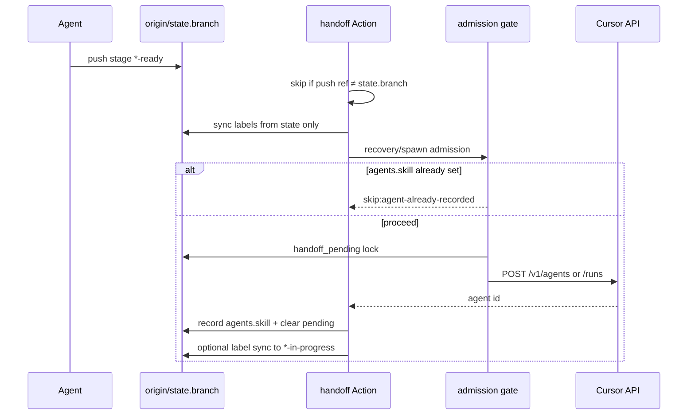

# Issue #127: v1 hardening — orchestration reliability (dedup spawns, idempotent resume, serialization)

**GitHub:** https://github.com/BlackLodgeLabs/cuebox/issues/127

## Summary

Harden the v1 Cursor workflow orchestrator so a single issue run completes reliably without manual nudges. Recent dogfood runs ([#28](https://github.com/BlackLodgeLabs/cuebox/issues/28), [#79](https://github.com/BlackLodgeLabs/cuebox/issues/79), [#84](https://github.com/BlackLodgeLabs/cuebox/issues/84), [#92](https://github.com/BlackLodgeLabs/cuebox/issues/92), [#26](https://github.com/BlackLodgeLabs/cuebox/issues/26), [#115](https://github.com/BlackLodgeLabs/cuebox/issues/115)) exposed duplicate/parallel agent spawns, cold-start cache tax across late stages, labels that advance before spawn is confirmed, and handoffs that stall when recovery is skipped or deferred without a durable retry path.

This issue consolidates **remaining** v1 reliability gaps after companion fixes ([#90](https://github.com/BlackLodgeLabs/cuebox/pull/94), [#117](https://github.com/BlackLodgeLabs/cuebox/issues/117), [#118](https://github.com/BlackLodgeLabs/cuebox/issues/118), [#119](https://github.com/BlackLodgeLabs/cuebox/issues/119), [#111](https://github.com/BlackLodgeLabs/cuebox/issues/111)) into one coherent hardening pass — **before** Callsheet extraction ([#122](https://github.com/BlackLodgeLabs/cuebox/issues/122)).

## Problem

### Symptoms operators see

| Symptom | Example | Root cause (partial) |
|---------|---------|----------------------|
| Multiple demo/create-pr/babysit agents for one issue | [#28](https://github.com/BlackLodgeLabs/cuebox/issues/28), [#84](https://github.com/BlackLodgeLabs/cuebox/issues/84) | Concurrent handoff runs + side-branch pushes re-trigger spawn before `agents.<skill>` lands |
| Status comment shows `demo-in-progress` with no demo agent | [#26](https://github.com/BlackLodgeLabs/cuebox/issues/26) | `HANDOFF_PROGRESS_STAGE` sync runs before confirmed spawn; deferral leaves misleading label |
| Pipeline stuck at `demo-ready` / `create-pr-ready` for hours | [#115](https://github.com/BlackLodgeLabs/cuebox/issues/115) | Cancelled handoff + failed recovery; no durable re-queue after in-job backoff exhausts |
| Second nearly-identical agent run after skill already finished | [#92](https://github.com/BlackLodgeLabs/cuebox/issues/92) | Side-branch `create-pr-ready` push + canonical push both trigger babysit |
| Late stages re-load large context from scratch | Observed across demo → create-pr → babysit | Each stage uses `POST /v1/agents` (new workspace) instead of resuming prior agent where safe |

### What already landed (do not re-implement)

| Area | Issue / PR |
|------|------------|
| Cross-run spawn dedup (refetch, pending lock, first-wins record) | [#84](https://github.com/BlackLodgeLabs/cuebox/issues/84) / [#88](https://github.com/BlackLodgeLabs/cuebox/pull/88) |
| Pre-write refetch + recovery `--agents-from-tip` | [#90](https://github.com/BlackLodgeLabs/cuebox/issues/90) / [#94](https://github.com/BlackLodgeLabs/cuebox/pull/94) |
| Demo admission gate + execute `active_skill` clearing | [#91](https://github.com/BlackLodgeLabs/cuebox/issues/91), [#109](https://github.com/BlackLodgeLabs/cuebox/issues/109) |
| Stalled notifier (terminal spawn failure) | [#111](https://github.com/BlackLodgeLabs/cuebox/issues/111) |
| ARG_MAX-safe agents-list fetch | [#117](https://github.com/BlackLodgeLabs/cuebox/issues/117) |
| Recovery fetch hard-fail → stalled notify | [#118](https://github.com/BlackLodgeLabs/cuebox/issues/118) |
| Demo skill single-push `demo-ready` | [#119](https://github.com/BlackLodgeLabs/cuebox/issues/119) |
| Post-merge agent side-branch cleanup | [#103](https://github.com/BlackLodgeLabs/cuebox/issues/103) |

### Goal

One clean v1 run per issue: serialized spawns, honest labels, idempotent resume until the next agent is confirmed, optional durable re-queue when the global cap blocks spawn, late-stage context reuse where the Cursor API allows, and an operator checklist for orphaned workspaces.

## Acceptance criteria

### 1. Per-issue spawn serialization

- [ ] Admission gate blocks spawning skill `S` for issue `N` when another in-flight run for the **same issue + same skill** already exists (query Cursor agents list filtered by repo + branch prefix `cursor/issue-{N}-`)
- [ ] Admission gate blocks spawning **any** new handoff skill for issue `N` when `handoff_pending` is fresh for a **different** skill on the canonical branch (existing behaviour preserved)
- [ ] Handoff Action skips spawn/handoff/recovery when `GITHUB_REF` branch ≠ `workflow.state.json` `.branch` (canonical branch guard — proposed in [#92 review](https://github.com/BlackLodgeLabs/cuebox/blob/0c1aeae/workflow/issues/issue-92/WORKFLOW-REVIEW.md))
- [ ] Side-branch pushes (`*-agent-*` refs) never trigger label sync or spawn for the parent issue
- [ ] Unit tests in `scripts/test-cursor-workflow-handoff.sh` cover: canonical-only handoff, side-branch push ignored, duplicate same-skill defer/skip

### 2. Handoff dedup and single-push finalize

- [ ] Document and enforce **one handoff-triggering push** per `*-ready` finalize for demo, create-pr, and babysit (demo/create-pr already documented; extend babysit if needed)
- [ ] Handoff YAML `concurrency.cancel-in-progress` behaviour documented: a follow-up push within seconds cancels the in-flight spawn job — agents must not rely on recovery for SHA-fix races
- [ ] Spawn path logs `skip:duplicate-handoff` when stage unchanged and `agents.<target>` already set at branch tip (recovery must not POST again)
- [ ] `bash scripts/verify-workflow-paths.sh` passes

### 3. Idempotent resume until spawn confirmed

- [ ] When `stage` is a handoff value (`spec-ready` … `create-pr-ready`) and `agents.<target_skill>` is **null** at branch tip, recovery **must** attempt spawn on every sync-only push and `workflow_dispatch` resync (existing `cursor-workflow-handoff-recovery.sh` behaviour — harden, do not regress)
- [ ] When agent committed `*-ready` but `record-spawn-on-branch.sh` failed after successful `POST`, recovery re-records or spawns until `agents.<skill>` is non-null (peer first-wins preserved)
- [ ] Recovery and spawn paths share the same admission gate + refetch + pending-lock sequence (no bypass)
- [ ] Tests: skill-complete state without `agents.*` → recovery spawns exactly once; peer-recorded id → skip

### 4. Labels/status only on confirmed progress

- [ ] **Remove or gate** pre-spawn `HANDOFF_PROGRESS_STAGE` label sync in `cursor-workflow-spawn-agent.sh` / `cursor-workflow-sync-github-status.sh`: GitHub labels and pinned status comment must reflect `workflow.state.json` `stage` unless spawn is **confirmed** (`agents.<skill>` written on branch tip) **or** the agent explicitly committed `stage: <skill>-in-progress` in state (not Action-injected override)
- [ ] Failed/deferred handoff (`defer:*` exhaust, `pending-lock` stale clear without spawn) must **not** leave `*-in-progress` labels when state still shows prior `*-ready`
- [ ] Stalled notifier ([#111](https://github.com/BlackLodgeLabs/cuebox/issues/111)) remains the path for terminal non-self-healing defer (e.g. `defer:execute-active` after execute finished — [#26](https://github.com/BlackLodgeLabs/cuebox/issues/26))
- [ ] Tests: defer without spawn → labels match state file stage, not `HANDOFF_PROGRESS_STAGE`

### 5. Durable re-queue on cap / transient failure (optional but recommended)

- [ ] When in-job backoff exhausts for `defer:at-cap`, `defer:pending-lock`, or `api-400`, persist a **deferred handoff marker** in `workflow.state.json` (new optional field, schema v1 minor: e.g. `handoff_deferred: {skill, reason, at}`) cleared on successful spawn
- [ ] Add scheduled `workflow_dispatch` or cron job (e.g. `.github/workflows/cursor-workflow-retry-deferred.yml`) that scans open `cursor:spec-ready` … `cursor:create-pr-ready` issues with `handoff_deferred` set and re-runs handoff recovery (respecting global 8-run cap)
- [ ] Document human fallback comment template in `SETUP.md`: `@cursoragent use <skill> skill for issue NNN` or Actions → handoff resync
- [ ] Deferral comment ([#95](https://github.com/BlackLodgeLabs/cuebox/issues/95) transient path) unchanged for self-healing defers; stalled notifier for terminal cases

### 6. Late-stage context reuse (demo → create-pr → babysit)

- [ ] Where Cursor API supports `POST /v1/agents/{id}/runs` with a new prompt (same pattern as execute pass-back), prefer **resume** over new agent for adjacent late stages when prior agent id is recorded and workspace is still viable:
  - `demo-ready` → create-pr: optional resume `agents.demo` when config flag enabled
  - `create-pr-ready` → babysit-pr: optional resume `agents.create-pr`
- [ ] Default remains `POST /v1/agents` (new workspace) for safety; reuse opt-in via `workflow.config.yaml` key (e.g. `orchestration.late_stage_resume: false` default)
- [ ] Admission gate treats resumed run as spawn confirmed (record run id or update `agents.<skill>` metadata if API returns new run id)
- [ ] Skills note reduced cold-start expectation when resume enabled
- [ ] Tests with `MOCK_CURSOR_API=1` cover resume path vs new-agent path

### 7. Operator dashboard / orphan ACTIVE checklist

- [ ] Add `workflow/cursor-workflow/OPERATIONS.md` (or extend `SETUP.md` § Troubleshooting) with:
  - How to list in-flight **runs** vs durable **ACTIVE** workspaces (`cursor-workflow-count-active-agents.sh` counts runs only — document the distinction from [#70](https://github.com/BlackLodgeLabs/cuebox/issues/70))
  - Pre-flight checklist before starting a new issue: confirm &lt; 8 in-flight runs; sweep stale agent side-branches (housekeeping Action); optionally archive/kill orphaned ACTIVE workspaces in Cursor dashboard
  - Link to `scripts/cursor-workflow-list-agents.ps1` (Windows) / equivalent `gh` + Cursor API query for Linux
  - When to use handoff `workflow_dispatch` resync vs human `@cursoragent` comment
- [ ] Housekeeping drift report mentions deferred-handoff count when marker present (optional)

### 8. Regression gates

- [ ] `bash scripts/test-cursor-workflow-handoff.sh` — all new cases pass
- [ ] `bash scripts/verify-workflow-paths.sh` passes
- [ ] `bash scripts/verify-workflow-portable.sh` passes (portable core unchanged in semantics; new optional state field allowed)
- [ ] `WORKFLOW.md` updated: canonical branch guard, label honesty rules, deferred re-queue, late-stage resume flag, operations checklist cross-link

## Scope

### In scope

| Component | Changes |
|-----------|---------|
| `scripts/cursor-workflow-admission-gate.sh` | Per-issue same-skill dedup; canonical branch awareness |
| `scripts/cursor-workflow-spawn-agent.sh` | Label sync gating; deferred marker; optional late-stage resume |
| `scripts/cursor-workflow-handoff-recovery.sh` | Idempotent retry hardening; shared gate path |
| `scripts/cursor-workflow-sync-github-status.sh` | Honest label source (state vs confirmed spawn) |
| `.github/workflows/cursor-workflow-handoff.yml` | Canonical branch skip; error handling unchanged from #118 |
| New optional workflow | Deferred handoff retry (cron/dispatch) |
| `workflow.config.yaml` | `late_stage_resume`, optional `per_issue_spawn_serialization` |
| `workflow/cursor-workflow/WORKFLOW.md`, `SETUP.md`, `OPERATIONS.md` | Operator docs |
| `scripts/test-cursor-workflow-handoff.sh` | Regression coverage |

### Out of scope

| Item | Tracked in |
|------|------------|
| v2 configurable pipeline / stage graph | [#68](https://github.com/BlackLodgeLabs/cuebox/issues/68) |
| Portable boundary / schema versioning / Callsheet extraction | [#122](https://github.com/BlackLodgeLabs/cuebox/issues/122) |
| SKILL content trims / tiering | [#126](https://github.com/BlackLodgeLabs/cuebox/issues/126) |
| Application code (API, frontend, DB) | — |
| Removing GitHub Actions as spawn authority | — |
| Replacing `workflow.state.json` handoff contract | — |

### Dependencies / sequencing

| Prerequisite | Status |
|--------------|--------|
| [#117](https://github.com/BlackLodgeLabs/cuebox/issues/117) ARG_MAX fetch | Closed |
| [#118](https://github.com/BlackLodgeLabs/cuebox/issues/118) stalled on fetch fail | Closed |
| [#119](https://github.com/BlackLodgeLabs/cuebox/issues/119) demo single-push | Closed |
| [#111](https://github.com/BlackLodgeLabs/cuebox/issues/111) stalled notifier | Closed (verify terminal `defer:execute-active` wired) |

Planning should treat this issue as **ready to implement** without waiting on #122/#126.

## User flows / API changes

No product UI or application API changes.

### Operators

1. Issue labels and pinned status comment reflect **actual** pipeline state — not optimistic in-progress labels during failed spawns.
2. Stuck handoffs at `*-ready` self-heal on the next push or scheduled retry without a manual comment when recovery is healthy.
3. Terminal stalls still receive stalled notification with recovery steps ([#111](https://github.com/BlackLodgeLabs/cuebox/issues/111)).
4. New issues started after clearing in-flight run cap and optional orphan sweep are less likely to hit duplicate spawns.
5. `OPERATIONS.md` checklist available before triaging new workflow issues.

### Agents (cloud)

1. Continue pushing `workflow.state.json` for every stage transition; merge helper before commit.
2. Single batched push at each `*-ready` finalize (demo, create-pr, babysit).
3. Clear `active_skill: null` on `*-ready` finalize (execute, demo, create-pr).
4. When late-stage resume is enabled, receive `POST /v1/agents/{id}/runs` handoff instead of a fresh workspace — faster context carry-over for PR.md / babysit triage.
5. Side-branch work must merge to canonical `state.branch` before expecting handoff.

### Handoff flow (target)

## Data and integration notes

- **Application DB/API:** none
- **GitHub:** possible new scheduled workflow; no new secrets beyond existing `CURSOR_API_KEY` / `GITHUB_TOKEN`
- **Cursor Cloud API:** optional `POST /v1/agents/{id}/runs` for late-stage resume (same auth as pass-back)
- **State schema:** optional `handoff_deferred` object (v1 minor, backward compatible); document in `STATE-SCHEMA.md`
- **Config:** new keys under `orchestration:` in `workflow.config.yaml`, read via `cursor-workflow-config.sh`

## Open questions (must be empty before plan-ready)

None.

## Links

- GitHub issue: https://github.com/BlackLodgeLabs/cuebox/issues/127
- Retrospectives index: [workflow/cursor-workflow/RETROSPECTIVES.md](../../cursor-workflow/RETROSPECTIVES.md)
- Handoff hardening history: [#79](https://github.com/BlackLodgeLabs/cuebox/issues/79), [#84](https://github.com/BlackLodgeLabs/cuebox/issues/84), [#90](https://github.com/BlackLodgeLabs/cuebox/issues/90), [#92](https://github.com/BlackLodgeLabs/cuebox/issues/92), [#115](https://github.com/BlackLodgeLabs/cuebox/issues/115)
- Communication / stalled: [#95](https://github.com/BlackLodgeLabs/cuebox/issues/95), [#111](https://github.com/BlackLodgeLabs/cuebox/issues/111)
- Callsheet boundary (follow-on): [#122](https://github.com/BlackLodgeLabs/cuebox/issues/122)
- v2 pipeline (follow-on): [#68](https://github.com/BlackLodgeLabs/cuebox/issues/68)
