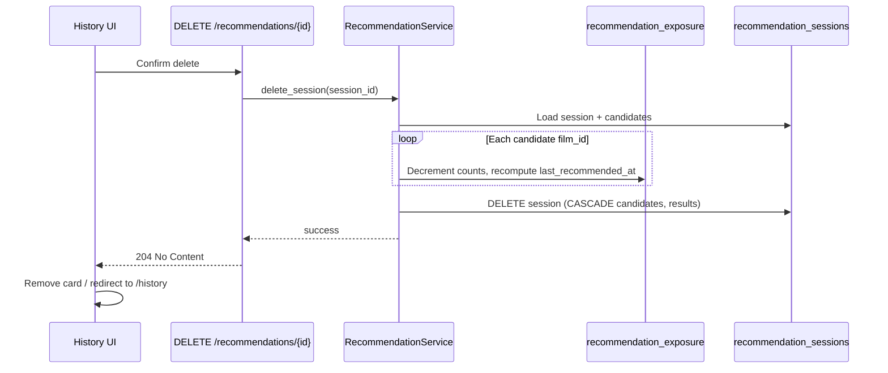

# Issue #28: Hard delete past recommendations from user history

## Summary

Add user-initiated **hard delete** for individual recommendation history entries. Deleting a session removes its stored audit trail (session, candidates, results) and **reverses recommendation exposure counters** so affected films are scored as if that run never happened. The history list and detail pages gain a delete action with confirmation; the UI updates immediately without a full page reload.

Cuebox is single-user and local-first — there is no `user_id` column. “Own history” means any session in `recommendation_sessions` (the sole user’s data).

## Problem

Recommendation history is read-only today:

- API: `GET /recommendations` (list) and `GET /recommendations/{session_id}` (detail) only — no `DELETE` route.
- Frontend: `/history` and `/history/[sessionId]` display cards and results but offer no remove action.
- PRD §17 states history is retained indefinitely with no automatic pruning; users still need an explicit way to remove entries they no longer want.

Deleting only the session row is **insufficient** for the issue’s “never recommended before” goal. Each recommendation run calls `recommendation_exposure_repository.increment_exposure` for every shortlisted candidate (`recommendation_service.py`), and Stage 4 diversity scoring (`diversity_service.py`) penalizes films with high `recommendation_count` / `winner_count` and rewards freshness via `last_recommended_at`. Leaving exposure inflated after delete would continue to bias future recommendations.

## Acceptance criteria

- [ ] `DELETE /recommendations/{session_id}` returns `204 No Content` when the session exists.
- [ ] `DELETE /recommendations/{session_id}` returns `404 NOT_FOUND` when the session does not exist.
- [ ] Deleting a session removes the `recommendation_sessions` row and, via existing `ON DELETE CASCADE`, all `recommendation_candidates` and `recommendation_results` rows for that session.
- [ ] Before session delete, exposure is reversed for every candidate film in that session: `recommendation_count` decremented by 1 per appearance; `winner_count` decremented by 1 when the film was the session winner. Counts never go below zero; if both counts reach 0, the `recommendation_exposure` row is removed.
- [ ] After exposure decrement, `last_recommended_at` for each affected film is recomputed from remaining sessions (max `recommendation_sessions.created_at` where the film is a candidate or winner), or set to `NULL` when no sessions remain for that film.
- [ ] Films deleted from the watchlist do not block session delete; sessions with `winner_film_id = NULL` (film removed) remain deletable.
- [ ] `GET /recommendations` no longer includes the deleted `session_id`; pagination `total` decreases accordingly.
- [ ] `GET /recommendations/{session_id}` and Developer Mode `GET /dev/recommendations/{session_id}/*` return `404` after delete.
- [ ] Future recommendation runs treat exposure-reversed films with the same diversity scoring as films that were never shortlisted before (verified by integration test comparing exposure map before/after delete).
- [ ] History list (`/history`): each card shows a visible delete control (e.g. trash icon) that does not navigate to the detail page when activated.
- [ ] History detail (`/history/[sessionId]`): a delete control is available (e.g. “Remove from history” button).
- [ ] Delete triggers a confirmation dialog with copy equivalent to: *“Are you sure you want to remove this from your history? This cannot be undone.”*
- [ ] On confirm, the entry disappears from the list without a full page refresh; from detail, the user is redirected to `/history` after success.
- [ ] Failed delete shows a toast/error state; the entry remains visible.
- [ ] `documents/api-contracts.md` documents `DELETE /recommendations/{session_id}`; PRD §17 notes user-initiated delete is allowed alongside “no automatic pruning.”
- [ ] Integration tests cover delete happy path, 404, cascade, exposure reversal, and list exclusion; frontend hook unit test covers cache invalidation; mocked Playwright E2E covers confirm-and-remove on history list.

## Scope

### In scope

- **Backend**
  - `recommendation_exposure_repository`: helpers to decrement exposure and recompute `last_recommended_at` per film.
  - `recommendation_session_repository`: `delete_by_id` (or service-level delete using existing `get_by_id`).
  - `RecommendationService.delete_session`: load session + candidates, reverse exposure, delete session, commit.
  - `DELETE /recommendations/{session_id}` route returning `204`.
- **Frontend**
  - `deleteRecommendation(sessionId)` in `api-client.ts`.
  - `useDeleteRecommendation` mutation hook with React Query invalidation for `["recommendations", "history"]` and removal of `["recommendations", sessionId]`.
  - Delete control + confirmation `Dialog` on history list cards and history detail page.
  - Optimistic or post-success list update; redirect from detail after delete.
- **Docs & verification**
  - `api-contracts.md` §8.2 (new subsection).
  - PRD §17 clarification (user delete vs auto-prune).
  - Integration tests in `test_integration_recommendation_history.py` (or dedicated delete test module).
  - Frontend unit test for hook; optional Playwright E2E on mocked API.

### Out of scope

- Bulk delete, “clear all history,” or automatic retention/TTL pruning.
- Delete from the fresh recommendation results page (`/recommend/results/[sessionId]`) — users can delete from history after navigating away; adding delete on results is a follow-up if desired.
- Deleting or modifying watchlist films, film embeddings, or semantic profiles.
- Deleting `recommendation_profiles` rows (questionnaire cache shared across sessions); orphan profile garbage collection is not required for this feature.
- Alembic schema migrations — existing CASCADE FKs are sufficient.
- Authentication/authorization beyond the single-user local model.
- Soft delete / undo / trash archive.

## User flows / API changes

### Flow A — Delete from history list

1. User opens **History** (`/history`).
2. User clicks the delete (trash) icon on a history card.
3. Confirmation dialog appears with irreversible warning.
4. User confirms → `DELETE /recommendations/{session_id}` → card removed from grid; pagination count updates.
5. User cancels → dialog closes; no API call.

### Flow B — Delete from history detail

1. User opens a past recommendation (`/history/{sessionId}`).
2. User clicks **Remove from history** (or equivalent).
3. Same confirmation dialog as Flow A.
4. On confirm → delete API → redirect to `/history` with the entry gone from the list.

### Flow C — Exposure reset (backend, invisible)

1. Service loads session and its `recommendation_candidates`.
2. For each distinct `film_id` in candidates: decrement `recommendation_count`; decrement `winner_count` if `film_id == session.winner_film_id`.
3. Recompute or clear `last_recommended_at` per affected film.
4. Delete `recommendation_sessions` row (CASCADE removes candidates + results).
5. Commit transaction.

### API addition

| Method | Path | Success | Body |
|--------|------|---------|------|
| `DELETE` | `/recommendations/{session_id}` | `204 No Content` | — |

**Errors**

| Code | HTTP | When |
|------|------|------|
| `NOT_FOUND` | 404 | Unknown `session_id` |

**Idempotency:** Second `DELETE` on the same `session_id` returns `404` (session already gone).

### UI notes

- Use existing `Dialog` component for confirmation (same pattern as other destructive actions in the app).
- Delete control on list cards must use `stopPropagation` / separate click target so it does not trigger the card’s navigation `Link`.
- Trash icon should include an accessible label (`aria-label="Remove from history"`).
- Match Modern Neo-Noir Cinema tokens from `documents/DESIGN.md` (muted destructive styling, not loud red unless design system defines a destructive variant).

## Data and integration notes

### Tables affected

| Table | On delete |
|-------|-----------|
| `recommendation_sessions` | Row removed (primary action) |
| `recommendation_candidates` | CASCADE delete with session |
| `recommendation_results` | CASCADE delete with session |
| `recommendation_exposure` | Counts decremented per candidate; row removed when both counts hit 0 |
| `recommendation_profiles` | **Preserved** — may still be referenced by other sessions |
| `films`, `film_embeddings`, `film_semantic_profiles` | **Untouched** |

### Exposure reversal detail

On create, `increment_exposure` runs once per **shortlisted candidate** (`pipeline_candidates`), with `is_winner=True` only for the winner (`recommendation_service.py` ~L159–164). Reversal must mirror that:

- Source of truth for which films to reverse: `recommendation_candidates` rows for the session (not only winner + runners-up displayed in UI).
- `last_recommended_at` recompute query (conceptual):  
  `MAX(recommendation_sessions.created_at)` JOIN `recommendation_candidates` ON `session_id` WHERE `film_id = :fid`, union winner-only sessions where `winner_film_id = :fid` and no candidate row exists (edge case if data ever diverges).

### Developer Mode

`/dev/recommendations/{session_id}/retrieval|scoring|ai` read from deleted session data — they should return `404` after delete (natural consequence of missing session).

### PRD alignment

PRD §17 “History is retained indefinitely. No automatic pruning” remains true. This feature adds **user-initiated** removal; the spec should update §17 with one sentence clarifying that distinction so PRD audit scripts stay accurate.

### Performance

Delete is a single transaction (load candidates → update exposure rows → delete session). History list performance target (`GET /recommendations` < 2s) is unchanged.

## Open questions (must be empty before plan-ready)

_None — issue body and codebase review provide sufficient detail._

## Links

- GitHub issue: https://github.com/BlackLodgeLabs/cuebox/issues/28
- Related (superseded for workflow): draft plan PR https://github.com/BlackLodgeLabs/cuebox/pull/29 — **ignore for implementation**; this spec is authoritative.
- PRD §17: `documents/PRD.md`
- API contracts §8: `documents/api-contracts.md`
- Backend entry points: `api/app/routers/v1/recommendations.py`, `api/app/services/recommendation_service.py`, `api/app/repositories/recommendation_exposure_repository.py`
- Frontend entry points: `frontend/src/app/history/page.tsx`, `frontend/src/app/history/[sessionId]/page.tsx`, `frontend/src/hooks/use-recommendations.ts`
