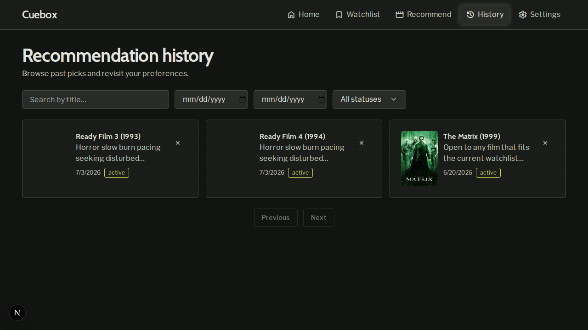
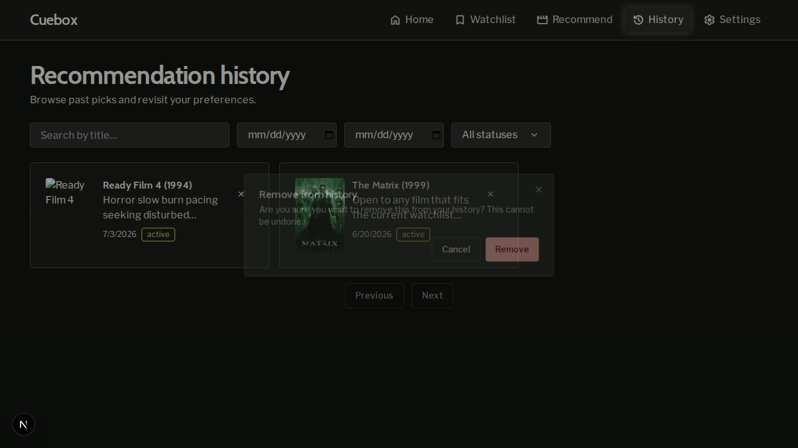
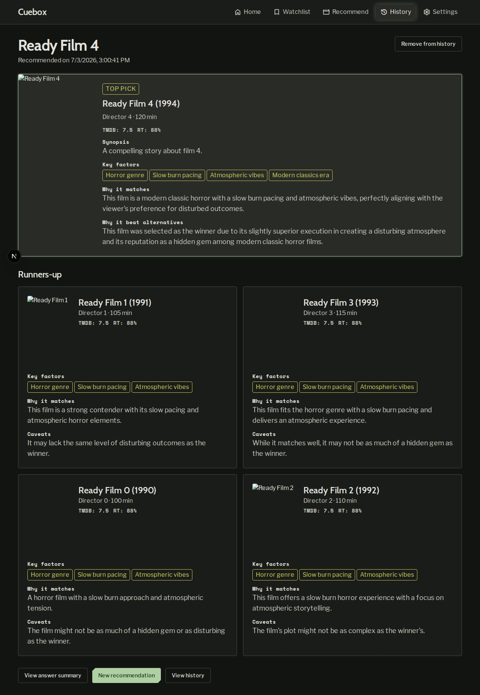
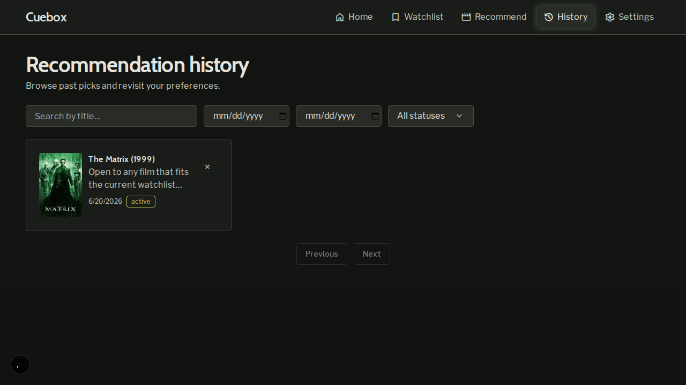
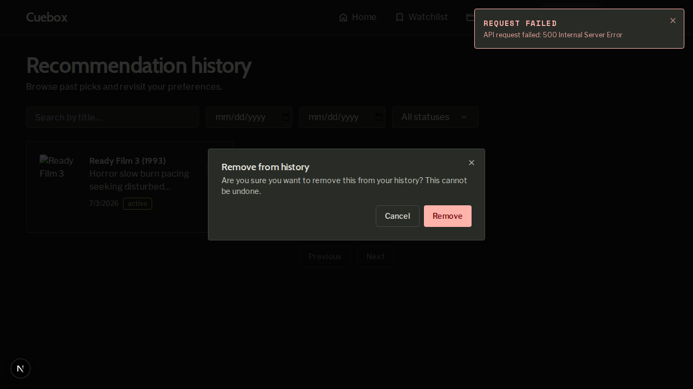

# Demo notes — issue #28: Hard delete past recommendations

- **Date:** 2026-07-03
- **Commit:** `b21322948eb5678a103286278878054a4d882a87` (demo-in-progress state); feature branch `cursor/issue-28-hard-delete-past-recommendations`
- **Stack:** Full Docker Compose (`postgres`, `api`, `frontend`, `backup`) — health OK on `:3000` and `:8000`
- **Seed:** Part 2 films present; created additional recommendation sessions via `POST /api/v1/recommendations` for multi-card UI demos

## Scenario results

### Scenario 1: Delete from history list — **PASS**

Opened `/history` with three history cards. Clicked **Remove from history** (✕) on **Ready Film 3**; navigation to detail did not occur. Confirmation dialog showed irreversible warning copy. **Cancel** closed the dialog and left the card visible. Second delete → **Remove** removed the card without a full page reload; **Ready Film 4** and **The Matrix** remained.

| Artifact | Path |
|----------|------|
| Before | `scenario-1-history-list-before.png` |
| Dialog | `scenario-1-confirm-dialog.png` |
| After | `scenario-1-history-list-after.png` |

### Scenario 2: Delete from history detail — **PASS**

Opened **Ready Film 4** detail from the history list. **Remove from history** → confirm **Remove** redirected to `/history`; **Ready Film 4** no longer listed; **The Matrix** still visible.

| Artifact | Path |
|----------|------|
| Detail before | `scenario-2-detail-before.png` |
| After redirect | `scenario-2-history-after-redirect.png` |

### Scenario 3: API delete and exposure reversal — **PASS**

`DELETE /api/v1/recommendations/{session_id}` returned **204**. Detail `GET` returned **404** with `NOT_FOUND`. List excluded the deleted session (`total` 1 → 0).

See `scenario-3-api-delete.log` for redacted request/response trace.

### Scenario 4: Failed delete shows error (optional) — **PASS**

Loaded `/history` with API up, stopped `api` container, attempted delete from list. Destructive toast **Request failed** / **API request failed: 500 Internal Server Error** appeared; card remained. API restarted afterward.

## Summary

All required scenarios (1–3) and optional scenario 4 passed against the live stack on branch `cursor/issue-28-hard-delete-past-recommendations`.
