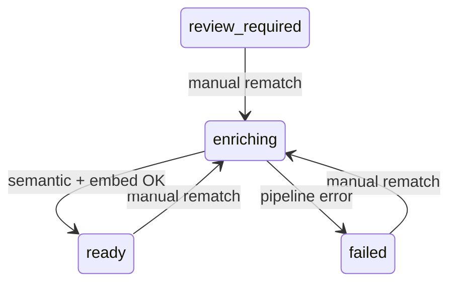

# Issue #59: Allow manual rematching/editing of film metadata (New Workflow)

## Summary

Add a user-facing **Edit Film Match** flow so any user can search TMDB, pick the correct movie for a watchlist entry, and have Cuebox replace stored metadata and regenerate semantic profiles and embeddings. Entry points are the watchlist, review, and recommendation screens; all routes lead to `/watchlist/[id]` where the edit action lives.

This spec supersedes the earlier backlog item ([#23](https://github.com/BlackLodgeLabs/cuebox/issues/23)) for the Cursor multi-agent workflow ([#59](https://github.com/BlackLodgeLabs/cuebox/issues/59)).

## Problem

Automated TMDB matching is the only way metadata is linked today:

- **Low-confidence matches** land in `review_required`; the user can only accept or reject the single auto-picked candidate (`POST /reviews/{id}/accept|reject`).
- **High-confidence wrong matches** reach `ready` with no correction path.
- **Rejected or failed matches** (`failed` after reject, or TMDB/provider errors) stay broken until the user re-imports the CSV.

Letterboxd title, year, and URI remain the watchlist identity, but wrong TMDB metadata poisons posters, synopsis, semantic profiles, embeddings, and recommendations. Users need an in-app way to relink any watchlist film to the correct TMDB record at any time after import.

## Acceptance criteria

- [ ] Every film detail page at `/watchlist/[id]` shows an **Edit Film Match** button for all enrichment states, including when metadata and semantic data are absent (`failed`, `review_required`, or pre-enrichment).
- [ ] Clicking **Edit Film Match** opens a modal (or equivalent overlay) with a TMDB search field pre-filled from the Letterboxd title, optional year filter, and a scrollable result list (poster, title, year, overview).
- [ ] Selecting a result and confirming calls a new rematch API; on success the film transitions to `enriching`, then `ready` (or `failed` if the semantic/embedding pipeline errors).
- [ ] Rematch replaces `film_metadata` with full TMDB details (including keywords, ratings, poster/backdrop URLs) and sets `metadata_source` to a manual-override value (e.g. `tmdb_manual`) with `match_confidence = 1.0`.
- [ ] Rematch deletes or overwrites prior semantic profile and embedding rows and regenerates them via the existing `run_semantic_pipeline_for_film` background path.
- [ ] Rematch is allowed from `ready`, `failed`, and `review_required`; it is rejected with `409 CONFLICT` while `matching` or `enriching`.
- [ ] Rematch is rejected with `409 CONFLICT` when the chosen `tmdb_id` (or derived `imdb_id`) is already linked to a **different** film (`film_metadata.tmdb_id` is unique).
- [ ] Pending `metadata_match_reviews` for the film are reconciled on rematch so the film no longer appears on `/review` with a stale candidate.
- [ ] Watchlist table rows/cards, review cards, and recommendation result cards link to `/watchlist/[id]` (watchlist and results already do; review page must gain links).
- [ ] After rematch, watchlist, review list, film detail, and open recommendation/history views reflect updated metadata without a full page reload (React Query cache invalidation and/or polling until terminal enrichment state).
- [ ] `documents/api-contracts.md` documents the new endpoints; integration tests cover rematch from `ready`, `failed`, and `review_required`, plus duplicate-`tmdb_id` conflict.
- [ ] Frontend `tsc --noEmit` and targeted Playwright coverage (mocked API path) verify the edit dialog and post-rematch UI update.

## Scope

### In scope

- **Backend**
  - `GET /films/{film_id}/tmdb-search` — proxy TMDB movie search (query/year overrides, capped result count).
  - `POST /films/{film_id}/rematch` — apply user-selected `tmdb_id`, persist metadata, reconcile reviews, enqueue semantic + embedding regeneration.
  - Service-layer guards, conflict detection, and reuse of `MetadataService._persist_metadata` and `enrichment_pipeline.run_semantic_pipeline_for_film`.
- **Frontend**
  - `EditFilmMatchDialog` (or equivalent) using existing Dialog/Card/FilmPoster patterns from [DESIGN.md](../../documents/DESIGN.md).
  - `FilmDetailView` CTA always visible; loading/enriching state after rematch.
  - Review page entry points linking to film detail (and optional inline “Choose different match” shortcut).
  - API client hooks with debounced search and cache invalidation for `["films"]`, `["films", filmId]`, and `["films", "review-required"]`.
- **Docs & verification**
  - `api-contracts.md` §4.4–4.5 (or equivalent numbering), sequence diagram for manual rematch.
  - Integration tests, gate script or Phase 8 regression inclusion, mocked Playwright E2E.

### Out of scope

- Editing Letterboxd-sourced fields (`title`, `year`, `letterboxd_uri`) — Letterboxd remains source of truth; only TMDB-linked metadata changes.
- Bulk rematch or “fix all failed films” automation.
- Periodic/automatic metadata refresh (distinct roadmap item).
- Developer Mode–only rematch (`/dev/*`); this is a standard user feature.
- TV series / non-movie TMDB entities.
- Changing recommendation **history** snapshots; past sessions keep the film IDs and explanations from the time of the run (detail pages show current metadata for that ID).
- Alembic schema migrations (existing `film_metadata`, `metadata_match_reviews`, and enrichment enums are sufficient).

## User flows / API changes

### Flow A — Fix a wrong match on a ready film

1. User opens **Watchlist** → clicks a film row → `/watchlist/{id}`.
2. User clicks **Edit Film Match**.
3. Modal opens with search pre-filled (`film.title`, optional `film.year`).
4. User adjusts query if needed; results load from `GET /films/{id}/tmdb-search?q=...&year=...`.
5. User selects the correct TMDB result and confirms.
6. UI shows enriching state; client polls `GET /films/{id}` until `ready` or `failed`.
7. Detail page, watchlist row, and future recommendations use updated poster, synopsis, and semantic data.

### Flow B — Recover a failed film

1. User navigates to a `failed` film (watchlist enrichment badge or import failure follow-up).
2. Detail page shows sparse/empty metadata card but **Edit Film Match** is still visible.
3. User searches, selects, confirms → same rematch pipeline as Flow A.

### Flow C — Override review candidate

1. User opens **Review matches** → clicks through to `/watchlist/{id}` (or uses inline search from review card).
2. Instead of accept/reject only, user opens **Edit Film Match**, searches, and picks a different TMDB ID than the pending candidate.
3. Rematch supersedes the pending review; film leaves the review queue and enters `enriching`.

### Flow D — From recommendation results

1. User views recommendation results or history detail (existing `CardWatchlistLink` to `/watchlist/{film_id}`).
2. User opens film detail and uses **Edit Film Match** as in Flow A.

### API additions (summary)

| Method | Path | Purpose |
|--------|------|---------|
| `GET` | `/films/{film_id}/tmdb-search` | Search TMDB for candidates (`q`, `year`, `limit` query params). |
| `POST` | `/films/{film_id}/rematch` | Body: `{ "tmdb_id": number }`. Returns `202` with `enrichment_status: "enriching"`. |

**Search response** includes lightweight result objects: `tmdb_id`, `title`, `original_title`, `year`, `overview`, `poster_url`. Director is omitted in the list (full details fetched on rematch confirm).

**Rematch errors**

| Code | HTTP | When |
|------|------|------|
| `NOT_FOUND` | 404 | Unknown `film_id` or TMDB movie ID |
| `CONFLICT` | 409 | Film in `matching`/`enriching`; `tmdb_id`/`imdb_id` owned by another film |
| `PROVIDER_ERROR` | 502 | TMDB (or OMDb supplementation) HTTP failure |

### Enrichment state transitions (rematch)

Blocked: `pending`, `matching`, `enriching` (concurrent rematch).

## Data and integration notes

### Preserved vs replaced

| Data | On rematch |
|------|------------|
| `films.title`, `films.year`, `films.letterboxd_uri`, `films.status` | Unchanged |
| `film_metadata` row | Upserted from TMDB (+ OMDb RT score when available) |
| `film_semantic_profiles` | Regenerated (overwrite via existing semantic service) |
| `film_embeddings` | Regenerated (overwrite via existing embedding service) |
| `metadata_match_reviews` (pending) | Reconciled — mark resolved so `/films/review-required` no longer lists the film |

### TMDB integration

- Reuse `TmdbClient.search_movie`, `get_movie_details`, `get_movie_keywords` ([`api/app/providers/tmdb.py`](../../api/app/providers/tmdb.py)).
- Requires `TMDB_API_KEY` in `.env`; surface provider errors clearly in the modal.
- Consider extending `TmdbSearchResult` with `poster_path` so search results show posters without N+1 detail calls.

### Unique constraints

- `film_metadata.tmdb_id` is `UNIQUE`. Before upsert, check for another film holding the same `tmdb_id` or `imdb_id` and return `409` with a message identifying the conflict.
- Rematching to the **same** `tmdb_id` already on this film should be idempotent or rejected politely (product choice: allow re-run enrichment to refresh semantic/embed).

### Background work

- Mirror review accept: after DB commit, schedule `run_semantic_pipeline_for_film` via FastAPI `BackgroundTasks` ([`api/app/services/enrichment_pipeline.py`](../../api/app/services/enrichment_pipeline.py), [`api/app/services/metadata_service.py`](../../api/app/services/metadata_service.py)).
- `import_jobs.failure_summary` should be updated when rematch recovers a previously `failed` film (reuse `sync_import_job_progress` or equivalent).

### Frontend cache behavior

- Invalidate `["films", filmId]`, `["films"]`, and `["films", "review-required"]` on successful rematch.
- Poll film detail every ~2s while `enrichment_status === "enriching"`; toast success on `ready`, error on `failed`.

### Existing code touchpoints

| Area | File(s) |
|------|---------|
| Metadata matching | `api/app/services/metadata_service.py` |
| Review accept pattern | `api/app/routers/v1/reviews.py` |
| Film detail UI | `frontend/src/components/film-detail-view.tsx`, `frontend/src/app/watchlist/[filmId]/page.tsx` |
| Review UI (needs links) | `frontend/src/app/review/page.tsx` |
| Results links (exists) | `frontend/src/components/results-view.tsx` |
| Watchlist links (exists) | `frontend/src/components/watchlist-table.tsx` |

## Open questions (must be empty before plan-ready)

_None — resolved for planning:_

- **Pending review on rematch:** Mark pending reviews `accepted` when the user manually picks a match (audit trail retains the record); film leaves `review_required`.
- **Same TMDB ID rematch:** Allowed — re-triggers enrichment to refresh semantic/embeddings.
- **Response code for rematch:** `202 Accepted` with async pipeline (consistent with fire-and-forget semantic work).
- **Search UI:** Modal on film detail (not a separate route).

## Links

- GitHub issue: https://github.com/BlackLodgeLabs/cuebox/issues/59
- Related (superseded for workflow): https://github.com/BlackLodgeLabs/cuebox/issues/23
- Prior draft plan (reference only): `origin/cursor/manual-film-rematch-plan-e5fc` → `documents/film-rematch-plan.md`
- API contracts: [documents/api-contracts.md](../../documents/api-contracts.md)
- Design system: [documents/DESIGN.md](../../documents/DESIGN.md)
