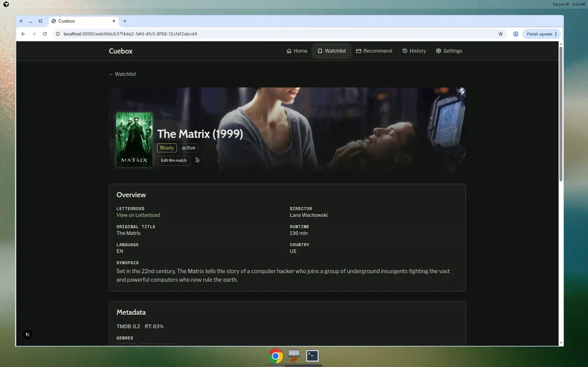
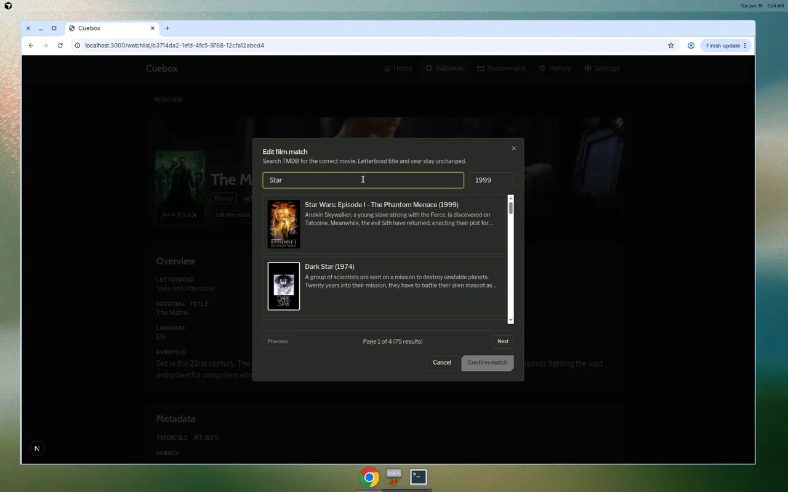
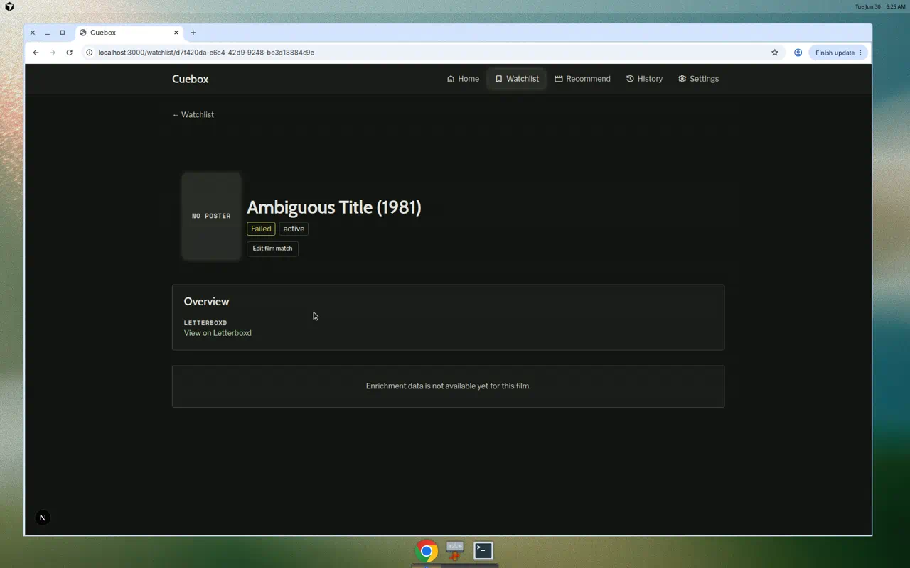
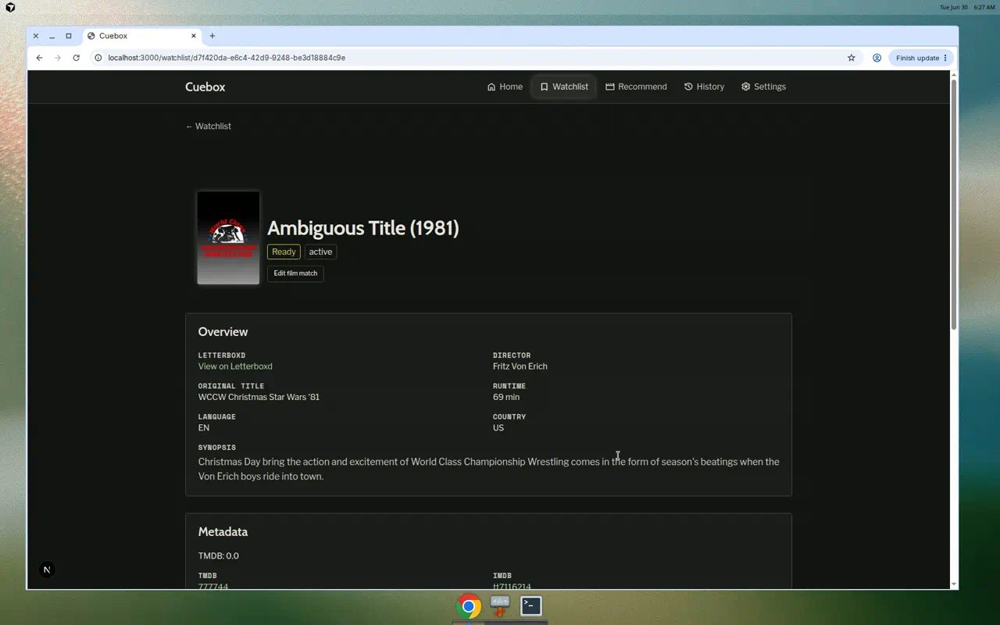
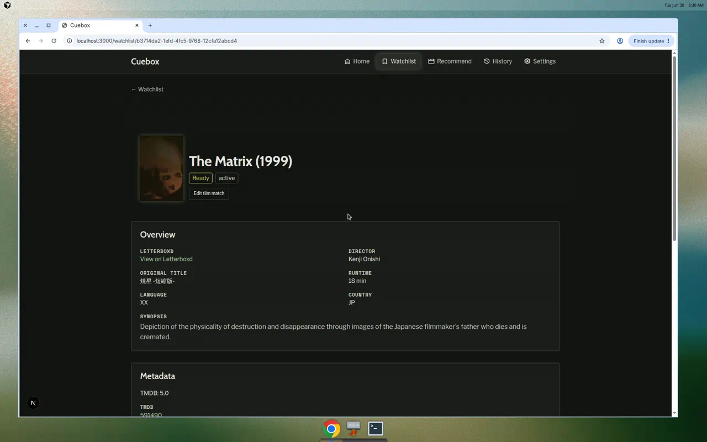

# Demo notes — issue #59

**Date:** 2026-06-30  
**Commit:** `c0876a2` (TMDB search pagination)  
**Stack:** Full Docker Compose on localhost (API :8000, frontend :3000)  
**Branch:** `cursor/issue-59-manual-film-metadata-rematch`

## Preconditions

- All four containers Up; health endpoints returned `status: ok`, `database: ok`
- Seeded watchlist: ≥10 `ready` films
- `TMDB_API_KEY` present in `.env` (not shown in captures)

## Pagination fix verification

TMDB search in the **Edit Film Match** modal now supports multi-page results:

- Broad query **"Star"** returned **75 results across 4 pages**
- Modal shows **Page X of Y (N results)** with **Previous** / **Next** controls
- **Next** loads page 2 with a different result set (no overlap with page 1)
- Selection and rematch from page 2 completes enrichment successfully

## Scenario results

### Scenario 1 — Fix wrong match on ready film (Flow A) — **PASS**

Opened **The Matrix** from watchlist. **Edit Film Match** visible on a `ready` film. Modal opened with Letterboxd title pre-filled; changed search to **Star** to exercise pagination (**Page 1 of 4, 75 results**). Navigated to page 2, selected **A Burning Star (Short Version)**, confirmed rematch. Detail page showed enriching state then returned to **Ready** (~5s) with updated metadata.

| Artifact | Path |
|----------|------|
| Before | `scenario-1-detail-before.png` |
| Modal (pagination) | `scenario-1-modal-search.png` |
| After | `scenario-1-detail-after.png` |

### Scenario 2 — Recover failed film (Flow B) — **PASS**

Opened **Ambiguous Title** (`failed`). Sparse detail with **Edit Film Match** visible. Rematched via TMDB search to **WCCW Christmas Star Wars '81**. Transition **failed → enriching → ready** (~5s). Metadata card and semantic profile populated.

| Artifact | Path |
|----------|------|
| Before | `scenario-2-failed-before.png` |
| After | `scenario-2-ready-after.png` |

### Scenario 3 — Override review candidate (Flow C) — **SKIP (no pending reviews)**

`/review` showed **All matches resolved** — no pending review items in the current environment. Prior demo captures from 2026-06-28 retained for reference.

| Artifact | Path |
|----------|------|
| Review card (prior run) | `scenario-3-review-card.png` |
| Cleared queue (prior run) | `scenario-3-review-cleared.png` |

### Scenario 4 — Entry from recommendation results (Flow D) — **PASS**

Opened a history recommendation session, clicked watchlist link on the recommended film card. Landed on `/watchlist/{id}` with **Edit Film Match** visible.

| Artifact | Path |
|----------|------|
| From results | `scenario-4-from-results.png` |

## Summary

Scenarios 1, 2, and 4 **passed** on the pagination branch. Scenario 3 skipped (empty review queue). TMDB search pagination is functional end-to-end. No secrets visible in artifacts.
