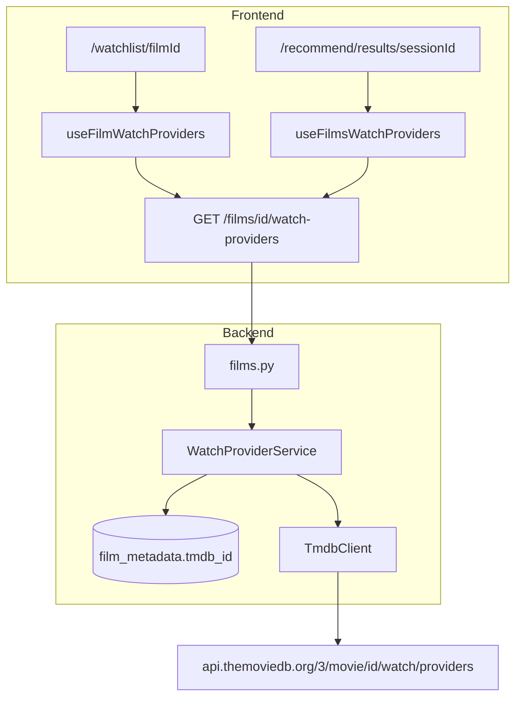

# Issue #72: Integrate TMDB Real-Time Watch Providers Data (new workflow)

## Summary

Add real-time **Where to Watch** availability for UK (GB) streaming, rental, purchase, and ad-supported platforms by proxying TMDB's Watch Providers API through the backend. Show a grouped **Where to Watch** section on film detail (`/watchlist/[id]`) and condensed provider icons on recommendation result cards (`/recommend/results/[sessionId]` and `/history/[sessionId]`). Provider data is fetched on screen load and **not** persisted to Postgres.

This spec supersedes the earlier backlog item ([#24](https://github.com/BlackLodgeLabs/cuebox/issues/24)) for the Cursor multi-agent workflow ([#72](https://github.com/BlackLodgeLabs/cuebox/issues/72)). A prior planning-only draft exists on branch `cursor/tmdb-watch-providers-plan-e5cc` (`documents/tmdb-watch-providers-plan.md`); this spec is the workflow source of truth.

## Problem

Cuebox enriches films with TMDB metadata during import (search, details, keywords, credits) and stores `tmdb_id` in `film_metadata`, but users cannot see where a film is available to watch. Streaming rights change frequently, so storing provider lists during enrichment would go stale quickly. Users need up-to-date UK availability when browsing their watchlist or reviewing recommendation results so they can act on a pick immediately.

## Acceptance criteria

- [ ] Backend successfully calls TMDB `GET /3/movie/{movie_id}/watch/providers` (via `TmdbClient`) when the frontend requests watch-provider data for a film with a linked `tmdb_id`.
- [ ] `TMDB_API_KEY` remains server-side only; the frontend never calls TMDB directly.
- [ ] Response parsing defaults to the **GB** (United Kingdom) localization object from `results.GB`.
- [ ] All four monetization arrays present in the GB object are parsed and returned when non-empty: `flatrate`, `rent`, `buy`, `ads`.
- [ ] `GET /films/{film_id}/watch-providers` resolves `film_id` → `tmdb_id` from `film_metadata` and returns normalized provider categories with logo URLs and display names.
- [ ] Film detail at `/watchlist/[id]` shows a **Where to Watch** card grouping providers by category (Stream, Rent, Buy, Free with Ads) with logos and names per [DESIGN.md](../../documents/DESIGN.md).
- [ ] Recommendation results at `/recommend/results/[sessionId]` show condensed provider logo icons on each result card (winner + runners-up).
- [ ] History detail at `/history/[sessionId]` shows the same condensed icons (via shared `ResultsView`).
- [ ] When GB has no providers, film detail shows: *"No streaming options currently listed for the UK."*
- [ ] When a film has no `tmdb_id`, film detail shows a helpful message (e.g. *"Match TMDB metadata to see streaming options."*) rather than a broken UI.
- [ ] TMDB/JustWatch attribution is visible on the film-detail section (TMDB API terms).
- [ ] `documents/api-contracts.md` documents the new endpoint; backend unit and integration tests cover GB parsing, empty GB, missing `tmdb_id`, and TMDB errors (mocked).
- [ ] Frontend `tsc --noEmit`, component tests, and mocked Playwright coverage verify loading, populated, and empty states.

## Scope

### In scope

- **Backend**
  - `TmdbClient.get_movie_watch_providers(tmdb_id)` and `provider_logo_url(path)` helper.
  - Pydantic schemas (`WatchProviderItem`, category groups, `FilmWatchProvidersResponse`).
  - `WatchProviderService` — resolve film → `tmdb_id`, call TMDB, normalize logos, handle missing GB data.
  - `GET /films/{film_id}/watch-providers` on the films router (register static paths like `/review-required` before `/{film_id}` routes).
  - `watch_providers.country_code: GB` default in `config.example.yaml` and `app/core/config.py`.
  - Extend `api/tests/mock_providers.py` with a watch/providers handler.
- **Frontend**
  - Types, API client method, React Query hooks (`useFilmWatchProviders`, `useFilmsWatchProviders` with `useQueries` for results).
  - `WhereToWatchSection` component on film detail (after Metadata card, before Semantic profile).
  - `WatchProviderIcons` condensed row on recommendation cards in `results-view.tsx`.
  - Loading skeletons, empty states, and inline error/retry on film detail.
  - Dedupe providers across categories on results cards (prefer `flatrate` > `ads` > `rent` > `buy` for icon order; cap ~5–6 icons with `+N` overflow).
- **Docs & verification**
  - `documents/api-contracts.md` §4 extension.
  - `documents/sequence-diagrams.md` entry for watch-provider fetch flow.
  - New gate script `scripts/verify-watch-providers-gates.sh` (backend tests + frontend tsc/build/unit + Phase 8 regression).
  - `AGENTS.md` gate table update.

### Out of scope

- Persisting watch-provider data in Postgres (`film_metadata` columns, enrichment pipeline changes).
- Fetching providers during import/enrichment (`MetadataService.enrich_film()`).
- Embedding provider data in `POST /recommendations` / `FilmResult` payloads (fetched separately on results page load).
- Country picker UI or non-GB regions (GB hardcoded via config for now).
- Deep links to individual streaming services (TMDB `link` is a TMDB watch page — acceptable).
- Developer Mode raw JSON panel (optional follow-up).
- Batch endpoint `GET /films/watch-providers?film_ids=...` (optional follow-up if parallel fetches prove slow).
- In-memory TTL cache (optional follow-up; frontend should use `staleTime: 0` initially).
- Superseding issue #24's closed draft PR #32 — workflow continues on issue #72.

## User flows / API changes

### Flow A — Film detail Where to Watch

1. User opens `/watchlist/{filmId}`.
2. Page loads film via existing `useFilm` hook.
3. In parallel, `useFilmWatchProviders(filmId)` calls `GET /films/{filmId}/watch-providers`.
4. Backend loads `film_metadata.tmdb_id`; if missing, returns `422` with a clear error code.
5. Backend calls TMDB watch/providers; parses `results.GB` into categorized providers.
6. UI renders **Where to Watch** card:
   - **Stream** (`flatrate`), **Rent** (`rent`), **Buy** (`buy`), **Free with Ads** (`ads`) — only non-empty groups shown.
   - Each provider: logo (`image.tmdb.org`) + `provider_name`.
   - Footer: JustWatch/TMDB attribution; optional link using GB `link` field.
7. If all categories empty → fallback message.
8. On TMDB failure → inline error with retry (reuse `ErrorState` pattern).

### Flow B — Recommendation results icons

1. User completes questionnaire → `/recommend/results/{sessionId}`.
2. `ResultsView` collects `film_id` from winner + up to 4 runners-up.
3. `useFilmsWatchProviders(filmIds)` fires parallel `GET /films/{id}/watch-providers` requests.
4. Each `FilmResultCard` shows `WatchProviderIcons` below ratings row.
5. If no providers for a card → omit icon row (no empty-state text on cards).
6. User can click through to film detail for full **Where to Watch** section.

### Flow C — History detail (inherits Flow B)

1. User opens `/history/{sessionId}`.
2. Page reuses `ResultsView` with `showActions` — provider icons appear identically to Flow B without additional wiring.

### API addition

| Method | Path | Purpose |
|--------|------|---------|
| `GET` | `/films/{film_id}/watch-providers` | Real-time GB watch providers for a watchlist film |

**Query params:** optional `country` override (default from config `GB`; not exposed in UI v1).

**Response shape (summary):**

```json
{
  "film_id": "uuid",
  "tmdb_id": 12345,
  "country_code": "GB",
  "link": "https://www.themoviedb.org/movie/12345/watch?locale=GB",
  "categories": [
    {
      "type": "flatrate",
      "label": "Stream",
      "providers": [
        {
          "provider_id": 8,
          "provider_name": "Netflix",
          "logo_url": "https://image.tmdb.org/t/p/w92/...",
          "display_priority": 1
        }
      ]
    }
  ]
}
```

Omit empty category groups from `categories`. When GB exists but all four arrays are empty, return `200` with `categories: []` so the frontend can show the UK empty-state copy.

**Errors**

| Code | HTTP | When |
|------|------|------|
| `NOT_FOUND` | 404 | Unknown `film_id` |
| `UNPROCESSABLE` | 422 | Film has no `tmdb_id` (not yet matched) |
| `PROVIDER_ERROR` | 502/503 | TMDB HTTP failure or missing `TMDB_API_KEY` |

### Data flow



## Data and integration notes

### TMDB API

- **Endpoint:** `GET https://api.themoviedb.org/3/movie/{movie_id}/watch/providers`
- **Note:** TMDB's actual path is `/watch/providers` (not `/watch_providers` as sometimes written in issue drafts).
- **GB object fields used:** `flatrate`, `rent`, `buy`, `ads`, `link`; each entry includes `provider_id`, `provider_name`, `logo_path`, `display_priority`.
- **Logo URLs:** `https://image.tmdb.org/t/p/w92{logo_path}` for detail; `w45` acceptable for condensed card icons.
- **Attribution:** TMDB requires JustWatch attribution on displays of watch-provider data.

### No database changes

| Area | Behavior |
|------|----------|
| `film_metadata` | Read-only `tmdb_id` lookup; no new columns |
| Enrichment pipeline | Unchanged |
| Recommendation history | Unchanged; provider fetch is live at view time |

### Existing code touchpoints

| Area | File(s) |
|------|---------|
| TMDB client | `api/app/providers/tmdb.py` |
| Provider wiring | `api/app/services/provider_service.py` |
| HTTP retry | `api/app/providers/http_retry.py` |
| Films router | `api/app/routers/v1/films.py` |
| Film detail UI | `frontend/src/components/film-detail-view.tsx`, `frontend/src/app/watchlist/[filmId]/page.tsx` |
| Results UI | `frontend/src/components/results-view.tsx` |
| History detail | `frontend/src/app/history/[sessionId]/page.tsx` |
| Results route | `frontend/src/app/recommend/results/[sessionId]/page.tsx` |
| Next.js images | `frontend/next.config.ts` (`image.tmdb.org` already allowed) |
| Test mocks | `api/tests/mock_providers.py`, `frontend/e2e/helpers/dev-api-mocks.ts` |

### Frontend cache behavior

- `staleTime: 0` on watch-provider queries — always refetch on mount so data reflects current rights.
- Do not add provider data to existing `useFilm` / recommendation session caches.

### Risks and mitigations

| Risk | Mitigation |
|------|------------|
| Up to 5 parallel TMDB calls on results page | Acceptable for v1; `request_with_retry` handles 429; batch endpoint deferred |
| Film without `tmdb_id` | `422` + film-detail copy pointing users to Edit Film Match |
| Missing `TMDB_API_KEY` | `503` with clear message; CI uses mocks |
| Duplicate provider in rent + buy | Dedupe by `provider_id` on results icons |
| JustWatch attribution omitted | Required footer on detail section |

## Open questions (must be empty before plan-ready)

_None — resolved for planning:_

- **Integration pattern:** Backend proxy (`GET /films/{film_id}/watch-providers`), not frontend → TMDB.
- **Persistence:** None; real-time fetch only.
- **Country:** GB via `config.yaml`; no user-facing region picker in v1.
- **Results fetch:** Parallel per-film requests via React Query `useQueries` (up to 5 films).
- **History detail:** In scope via shared `ResultsView`.
- **Empty results cards:** Omit icon row; no per-card empty message.
- **Films without `tmdb_id`:** Show guidance message on detail; omit icons on results cards.
- **Category UI labels:** Stream / Rent / Buy / Free with Ads (Rent and Buy as separate groups on detail).
- **Prior art:** Reference plan on `cursor/tmdb-watch-providers-plan-e5cc`; implementation follows this spec.

## Links

- GitHub issue: https://github.com/BlackLodgeLabs/cuebox/issues/72
- Related (superseded for workflow): https://github.com/BlackLodgeLabs/cuebox/issues/24
- TMDB API: https://developer.themoviedb.org/reference/movie-watch-providers
- Prior draft plan (reference only): `origin/cursor/tmdb-watch-providers-plan-e5cc` → `documents/tmdb-watch-providers-plan.md`
- API contracts: [documents/api-contracts.md](../../documents/api-contracts.md)
- Design system: [documents/DESIGN.md](../../documents/DESIGN.md)
