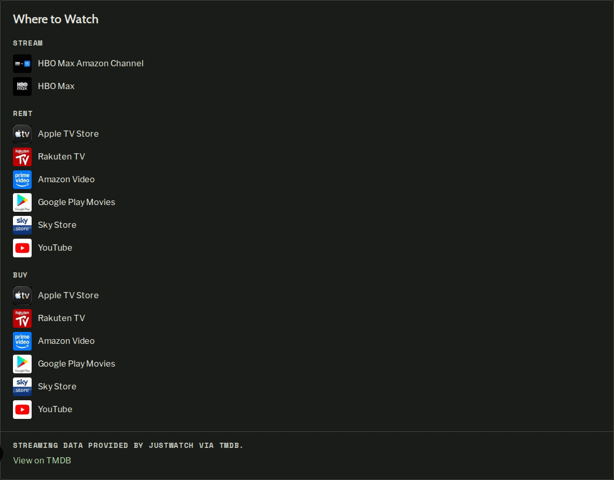
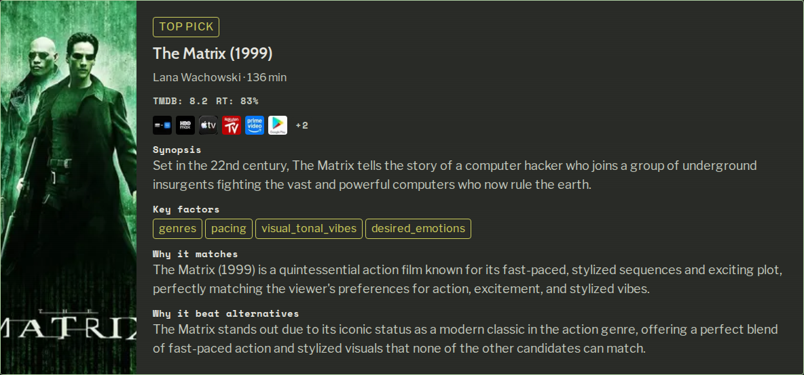
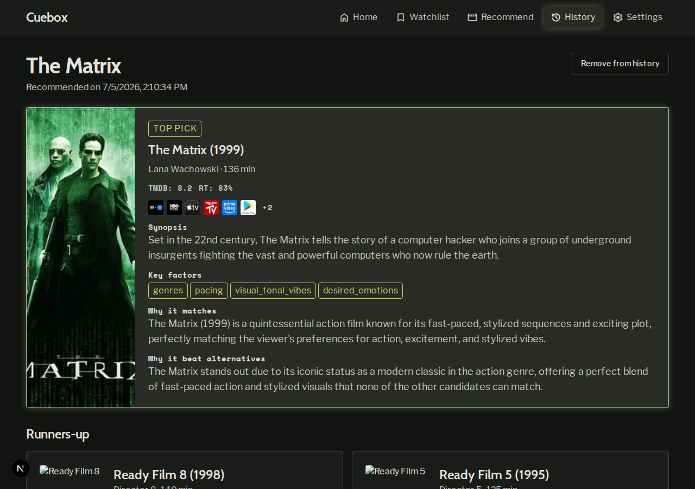
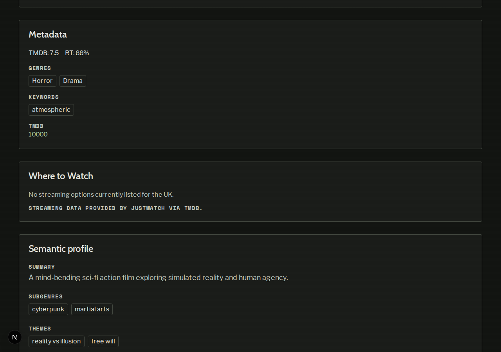
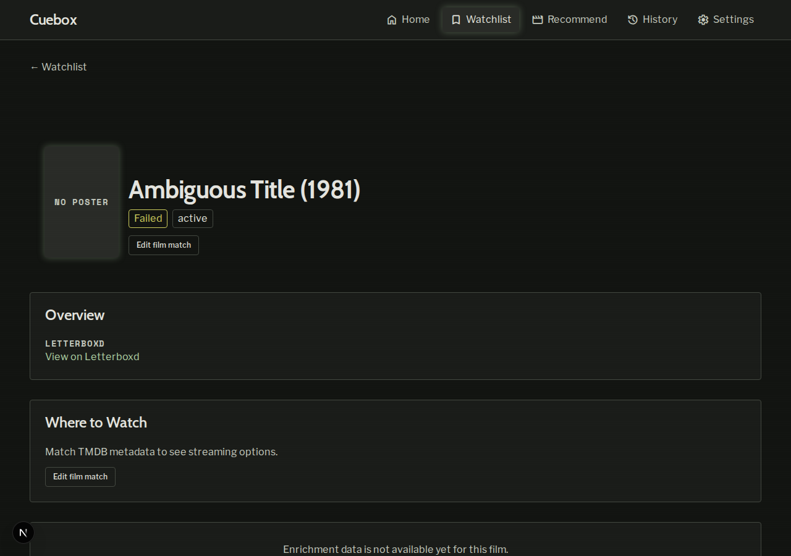

# Demo notes — issue #72

**Date:** 2026-07-05  
**Commit:** `6e0e205774c0499d4dd82407b878831704394313`  
**Branch:** `cursor/issue-72-tmdb-watch-providers-real-time`  
**Stack:** Full Docker Compose (postgres, api, frontend, backup); `TMDB_API_KEY` set in `.env`

## Environment

- Seeded 10 ready films via `python3 scripts/seed-dev-db.py` (plus existing The Matrix and Ambiguous Title fixtures).
- Live TMDB watch-provider fetches verified for UK (`GB`) region.
- Recommendation sessions created via `POST /api/v1/recommendations` for results/history scenarios (session `138ca8b2-0b8a-4023-8e4b-d0b370513a84`, winner: The Matrix).

## Scenarios

### Scenario 1: Film detail Where to Watch — **PASS**

Opened `/watchlist/b3714da2-1efd-4fc5-9768-12cfa12abcd4` (The Matrix). The **Where to Watch** card shows Stream, Rent, and Buy categories with provider logos and names. JustWatch/TMDB attribution appears in the card footer.

### Scenario 2: Recommendation results provider icons — **PASS**

Opened `/recommend/results/138ca8b2-0b8a-4023-8e4b-d0b370513a84`. Winner card (The Matrix, TOP PICK) shows condensed provider icons below TMDB/RT ratings. Runner-up cards without UK providers omit the icon row.

### Scenario 3: History detail inherits results icons — **PASS**

Opened `/history/138ca8b2-0b8a-4023-8e4b-d0b370513a84`. History detail reuses `ResultsView`; same provider icons on the winner card. Page shows history-specific chrome (“Remove from history”, recommended date).

### Scenario 4: Empty UK providers fallback — **PASS**

Film `0759994e-665d-46e1-b84a-4a44b81d53e1` (Ready Film 0) returns HTTP 200 with `categories: []` from `GET /api/v1/films/{id}/watch-providers`. UI shows *“No streaming options currently listed for the UK.”* with attribution; no stuck spinner.

API response: [scenario-4-api-response.json](scenario-4-api-response.json)

### Scenario 5: Film without TMDB match guidance — **PASS**

Opened `/watchlist/d7f420da-e6c4-42d9-9248-be3d18884c9e` (Ambiguous Title, `enrichment_status: failed`, no metadata). **Where to Watch** shows *“Match TMDB metadata to see streaming options.”* with **Edit film match** affordance.

## Summary

All five demo scenarios passed against the live stack with real TMDB watch-provider data.
