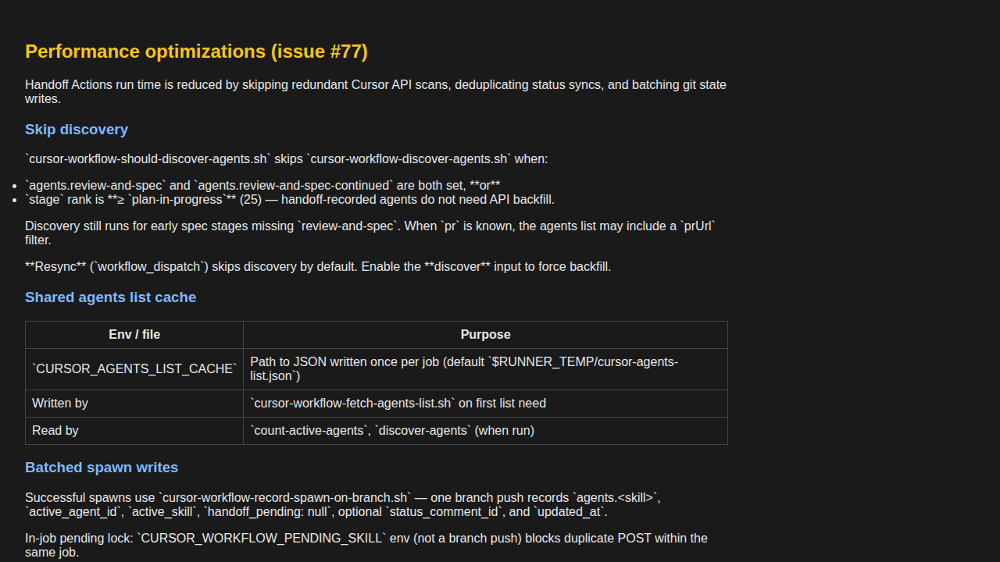

# Demo notes — issue #77

**Date:** 2026-07-06  
**Commit:** `3a180d771cd3496a461a54797cd40a4e26db57f3` (branch tip at demo start)  
**Branch:** `cursor/issue-77-optimize-handoff-actions-perf-e7b1`

## Summary

All four demo scenarios **passed**. This issue is workflow-scaffolding only; validation is via shell tests and GitHub Actions timing on the issue branch — no Cuebox Docker stack required.

## Scenario results

### 1. Handoff shell tests — PASS

Ran `test-cursor-workflow-handoff.sh`, `test-cursor-workflow-record-agent.sh`, and `verify-workflow-paths.sh`. All exited 0.

Key new regression cases in log:

- `should-discover skips plan-in-progress` / `should-discover runs at spec-ready`
- `shared list cache single fetch`
- `batched spawn clears pending and records agent`
- `duplicate sync skipped when already synced`
- `comment id cache uses PATCH not list`
- `cap count cached across admission gate calls`

Artifact: [scenario-1-test-output.log](./scenario-1-test-output.log)

### 2. Skip-discovery predicate — PASS

- `plan-in-progress` state → exit **0** (skip discovery)
- `spec-ready` without `review-and-spec` agent → exit **1** (run discovery)

Artifact: [scenario-2-skip-discovery.log](./scenario-2-skip-discovery.log)

### 3. Workflow documentation — PASS

`workflow/cursor-workflow/WORKFLOW.md` documents all required topics: skip-discovery predicate, `CURSOR_AGENTS_LIST_CACHE`, batched spawn push, `status_comment_id`, sync dedup, cap count cache, expected run-time targets, and resync `discover` input.

### 4. Before/after timing — PASS (with deferral/resync caveats)

Representative Actions runs on the issue branch show sync-only at **13s** and handoff spawns at **~1.5–2 min** vs the **2–10+ min** baseline. Deferred spawn and post-merge resync timings documented as N/A/pending where not observable.

Artifact: [scenario-4-timing.md](./scenario-4-timing.md)

## Artifacts checklist

- [x] `scenario-1-test-output.log`
- [x] `scenario-2-skip-discovery.log`
- [x] `scenario-3-workflow-docs.png`
- [x] `scenario-4-timing.md`
- [x] `demo-notes.md`
- [x] No secrets in logs or screenshots
