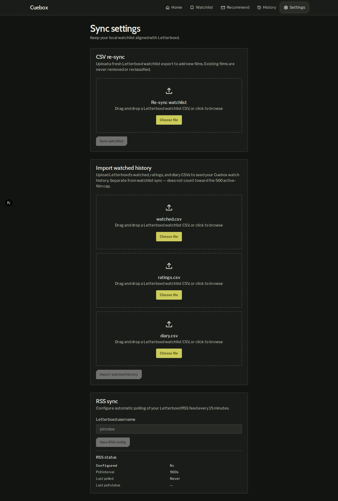
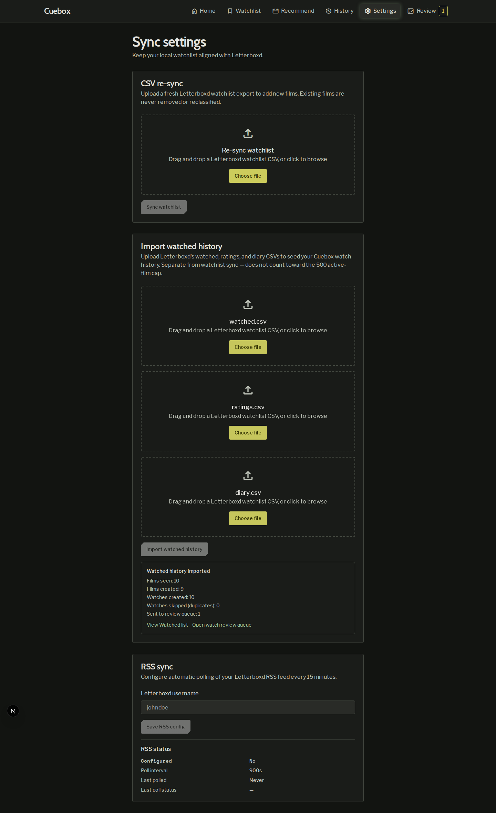
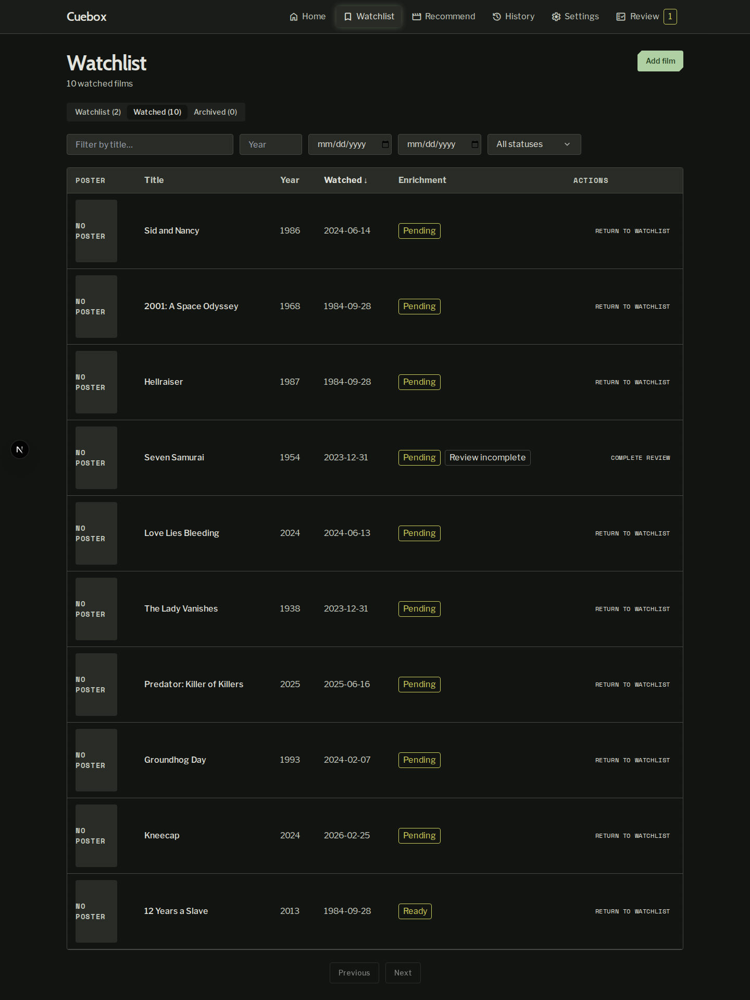
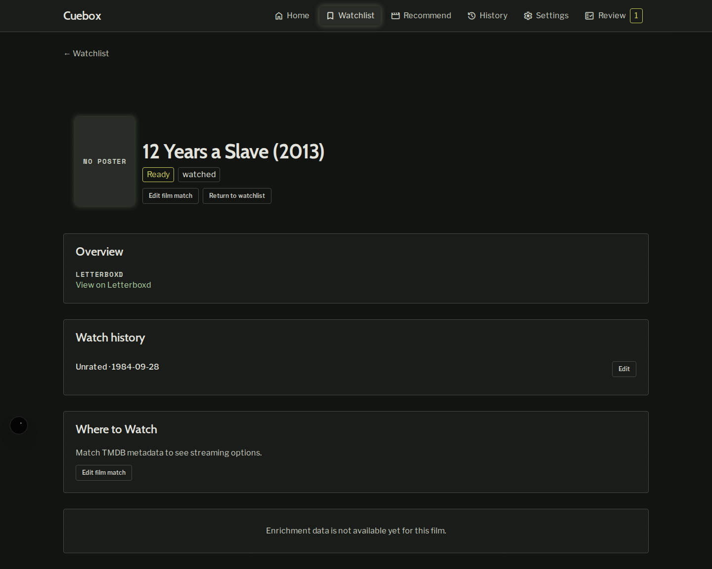
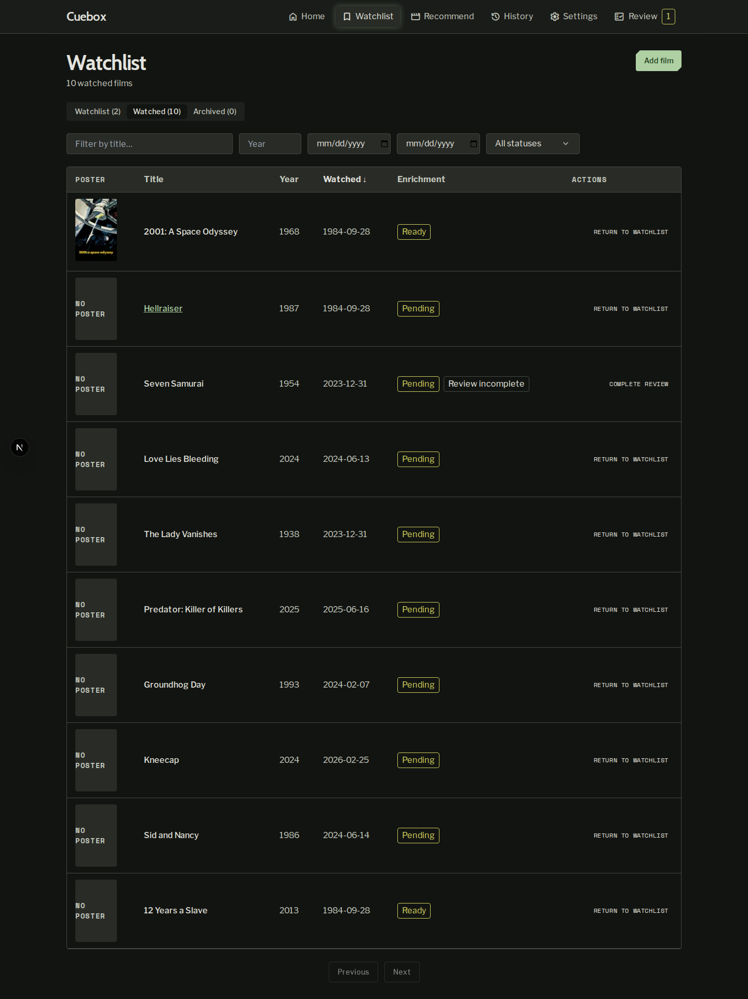
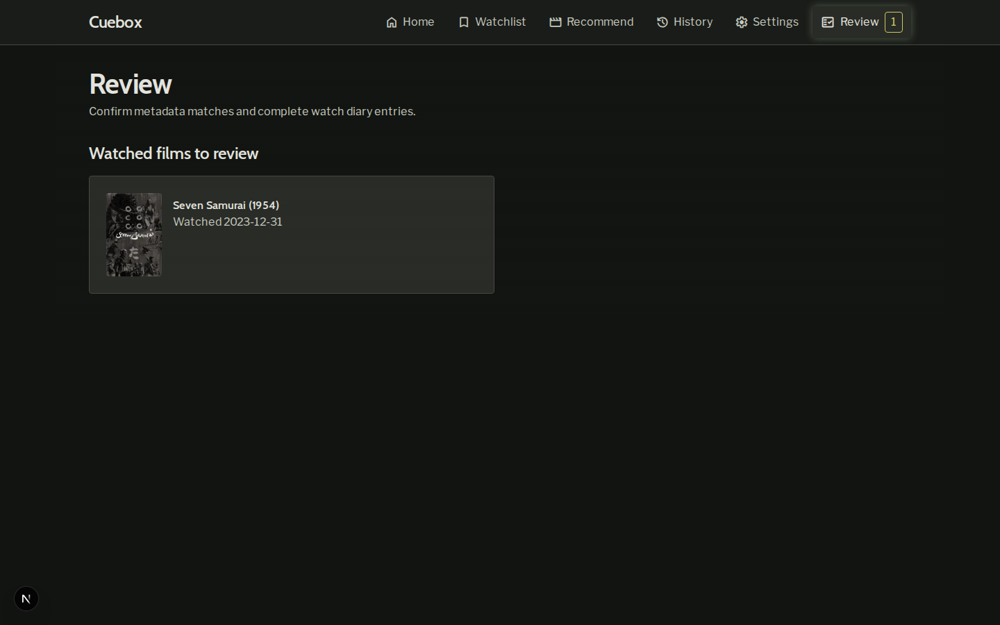
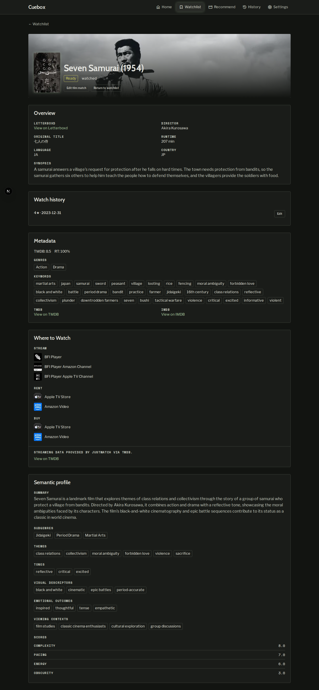
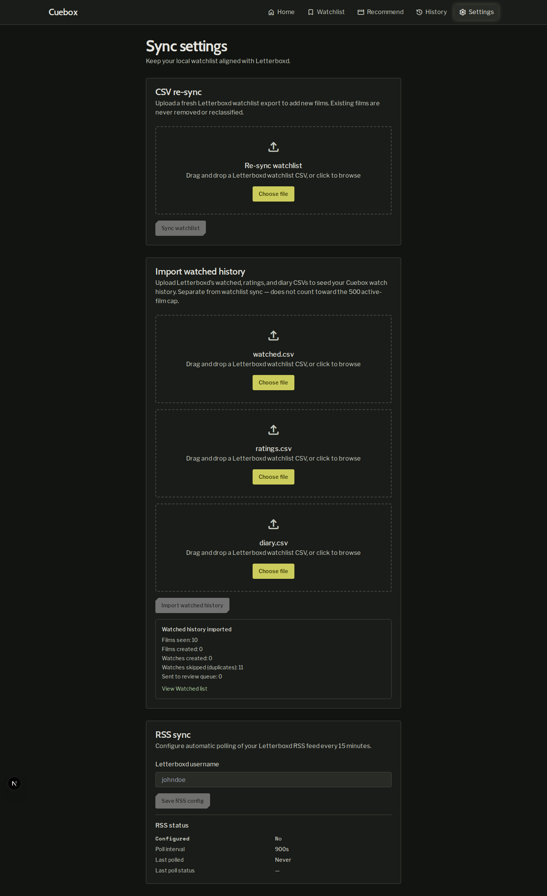

# Demo notes — issue #89

**Date:** 2026-07-20  
**Tier:** `application`  
**Commit:** `8f37273` (`8f37273d4971f45222280a532fc71c8a9d2b2915`)
**Branch:** `cursor/issue-89-import-watched-list-9ab1`  
**Stack:** Docker Compose (`postgres`, `api`, `frontend`, `backup` Up); API/FE health `"status":"ok"`, `"database":"ok"`; migration `0008` head.

**Gate:** `bash scripts/verify-workflow-paths.sh` → **exit 0** (workflow path regression; application UI verified via scenarios below).

**Seed:** Tier-3 DB already had 2 active films (Matrix, Ambiguous Title). Seeded active **12 Years a Slave** (`https://boxd.it/2D2e`) for Scenario 3. Fixtures: `api/tests/fixtures/watched_import/{watched,ratings,diary}.csv`.

## Scenario results

| # | Scenario | Result | Evidence |
|---|----------|--------|----------|
| 1 | Settings Import watched history card | **PASS** | `scenario-1-settings-watched-import.png` — separate card with three file inputs; Import CTA disabled with 0 files |
| 2 | Import sample CSVs + Watched tab | **PASS** | Summary: films_seen=10, watches_created=10, duplicates=0, pending_review=1. Watched tab lists imports. Unrated `12 Years a Slave` shows `Unrated · 1984-09-28`. Hellraiser scored with default date. Kneecap has watches `2024-11-03` and `2026-02-25` |
| 3 | Active → watched | **PASS** | Active 3→2; `12 Years a Slave` status `watched` (see `scenario-3-active-count.json`, `scenario-3-active-to-watched.png`) |
| 4 | Diary-without-score → review | **PASS** | Seven Samurai pending with Watched Date `2023-12-31`; completed at 4★ → `watched` (`scenario-4-review-queue.png`, `scenario-4-after-complete.png`) |
| 5 | Idempotent re-upload | **PASS** | UI: watches_created=0, watches_skipped_duplicate=11. API JSON confirms. Kneecap still 2 watches (`scenario-5-kneecap-api.json`) |
| 6 | Cap unchanged | **PASS** | `scenario-6-cap-notes.md` — HTTP 200, no `WATCHLIST_SIZE_EXCEEDED`; cap remains 500 for CSV sync only |

## Scenario narrative

### Scenario 1 — PASS

Settings → Sync shows **CSV re-sync**, distinct **Import watched history** (watched/ratings/diary), and **RSS sync**. Import button stayed disabled until all three files were selected.

### Scenario 2 — PASS

First UI import of fixtures:

- Films seen: **10**
- Films created: **9** (12 Years already existed as active)
- Watches created: **10**
- Duplicates skipped: **0**
- Pending review: **1** (Seven Samurai)

Watched tab showed Hellraiser, Kneecap, Sid and Nancy, 12 Years a Slave, etc. Detail for 12 Years: **Unrated · 1984-09-28** (no invented stars). Kneecap detail: two completed dates.

### Scenario 3 — PASS

Pre-seeded active 12 Years a Slave transitioned to `watched` on import. Active total **3 → 2**. Film appears on Watched tab, not Active.

### Scenario 4 — PASS

`/review` queue listed Seven Samurai with **Watched 2023-12-31** (diary Watched Date, not watched.csv’s 2024-07-19). Completed review at 4★; film detail shows `4★ · 2023-12-31` and status `watched`.

### Scenario 5 — PASS

Second upload: **0** watches created, **11** duplicates skipped. Third API POST same. Kneecap API: exactly **2** watch rows.

### Scenario 6 — PASS

See `scenario-6-cap-notes.md`. Watched import never returned `WATCHLIST_SIZE_EXCEEDED`; `MAX_ACTIVE_WATCHLIST = 500` remains for watchlist CSV/active paths only.

## Notes

- No secrets in screenshots or logs.
- Capture used Playwright against the live Compose stack (headless Chromium).
- Optional extras: `scenario-2-hellraiser-detail.png`, `scenario-2-kneecap-detail.png`, `scenario-*-*.txt`/`json` API proofs.
- First-import JSON reconstructed from UI summary (`scenario-2-api-response.json`); exact multipart body captured on later posts in `scenario-5-api-response.json`.
