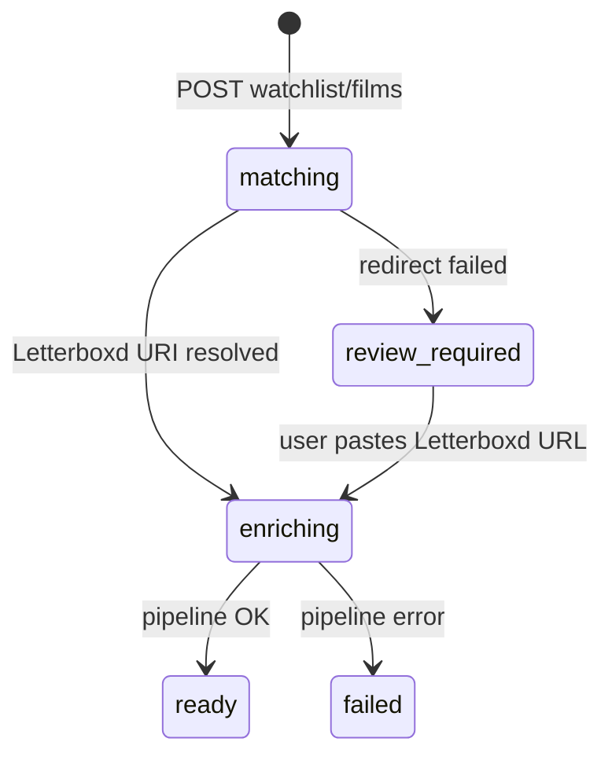

# Issue #99: Feature - Add a film to your watch list

## Summary

Add a user-facing flow to search TMDB, pick a film, resolve its Letterboxd identity, and add it to the active watchlist with full metadata and semantic enrichment — so it can be recommended alongside CSV/RSS-imported films.

Entry points on **Home** and **Watchlist** both link to a dedicated **`/watchlist/add`** route. Letterboxd identity is resolved via the public `https://letterboxd.com/tmdb/{tmdb_id}` redirect (no private Letterboxd API). Failures or ambiguous resolution go to a **review queue** where the user pastes the Letterboxd film URL manually.

## Problem

Today watchlist films enter Cuebox only through Letterboxd CSV import or RSS sync. Users cannot add a single film in-app when they discover something they want to watch without re-exporting their full watchlist.

The product needs:

- TMDB search and user-confirmed film selection (reusing patterns from manual rematch, issue #59)
- A real `letterboxd_uri` on every added film (not synthetic IDs)
- The existing enrichment pipeline so the film reaches `ready` and enters recommendations
- Clear handling for duplicates, restored archived/watched films, and sync interaction with Letterboxd

## Product decisions (resolved)

| # | Topic | Decision |
|---|--------|----------|
| Q1 | Film identity | User picks TMDB result → resolve `letterboxd_uri` via `GET https://letterboxd.com/tmdb/{tmdb_id}` (follow redirects) → on failure/ambiguity, review queue with manual Letterboxd URL paste. No Letterboxd API (private; not available). |
| Q2 | CSV sync | Manual adds **persist** — CSV re-import does **not** remove films solely because they are absent from the export. |
| Q2 | RSS sync | Normal Letterboxd RSS events **apply** when the film matches by `letterboxd_uri` (watchlist add/remove, **watched**). Example: add in Cuebox → add on Letterboxd → watch on Letterboxd → RSS marks watched before the next CSV sync. |
| Q3 | UI entry | Dedicated route **`/watchlist/add`**. **Home:** “Add film to watchlist” between New recommendation and History. **Watchlist:** add button. Both link to the same route. |
| Q4 | Duplicate on watchlist | Friendly message + link to existing film detail; no duplicate row. |
| Q5 | Previously archived/watched | **Restore** — reuse film row, set `status = active`, reactivate watchlist entry. Applies to both `archived` and `watched`. (Future watched-list UX is out of scope; same table/status model.) |
| Q6 | 500-film cap | Manual adds are **exempt** from the active watchlist cap. CSV import and RSS add remain capped at 500. |

## Acceptance criteria

- [ ] **`/watchlist/add`** route provides TMDB search (query, optional year), result list (poster, title, year, overview), and confirm action.
- [ ] **Home** shows “Add film to watchlist” between New recommendation and History when the user has a watchlist; link targets `/watchlist/add`.
- [ ] **Watchlist** page shows an add button linking to `/watchlist/add`.
- [ ] **`GET /films/tmdb-search`** (or equivalent global search endpoint) proxies TMDB movie search without requiring an existing `film_id`.
- [ ] **`POST /watchlist/films`** (or equivalent) accepts user-selected `tmdb_id`, resolves Letterboxd URI via `/tmdb/{id}` redirect, creates or restores film + active watchlist entry, persists TMDB metadata, and enqueues semantic/embedding enrichment.
- [ ] On successful Letterboxd redirect, film transitions to `enriching` then `ready` (or `failed` on pipeline error); user-selected TMDB skips auto-matching and `review_required` for TMDB confidence.
- [ ] When redirect fails or is ambiguous, film is created (or updated) in **`review_required`** with a pending **Letterboxd URI resolution** review; user can paste a valid Letterboxd film URL on `/review` (or inline) to complete the add.
- [ ] Pasted Letterboxd URLs are validated (film page / `boxd.it` short link patterns); normalized to canonical `letterboxd_uri` before storage.
- [ ] If the resolved `letterboxd_uri` is already on the **active** watchlist, API returns success payload with `already_on_watchlist: true` and `film_id`; UI shows message and link to existing film detail (no duplicate entry).
- [ ] If a film with the same `letterboxd_uri` exists as **`archived`** or **`watched`**, add **restores** it to `active` and reactivates the watchlist entry; re-enrichment only when metadata is missing or not `ready`.
- [ ] Manual add is **not** blocked by `MAX_ACTIVE_WATCHLIST` (500); CSV import and RSS watchlist add behavior unchanged.
- [ ] **CSV sync** does not remove manual-add films solely for being missing from the uploaded export.
- [ ] **RSS sync** continues to apply watchlist remove and watched events to manual-add films when matched by `letterboxd_uri`.
- [ ] `documents/api-contracts.md` documents new endpoints and error codes; integration tests cover happy path, redirect failure → review, duplicate, restore archived/watched, and CSV non-removal of manual adds.
- [ ] Frontend `tsc --noEmit` and targeted unit/Playwright tests cover the add flow (mocked API path).

## Scope

### In scope

- **Backend**
  - Global TMDB search endpoint (decoupled from `GET /films/{film_id}/tmdb-search`).
  - Watchlist add endpoint: TMDB pick → Letterboxd redirect resolver → film + watchlist entry + metadata persist → background enrichment.
  - Letterboxd redirect client: HTTP GET `https://letterboxd.com/tmdb/{tmdb_id}` with redirects; parse final URL for `/film/{slug}/` (reject unexpected destinations).
  - Letterboxd URI resolution review type (extend `metadata_match_reviews` or parallel table — planning choice) with accept-via-pasted-URL flow.
  - Duplicate, restore, and `already_on_watchlist` responses.
  - Cap exemption for manual add only.
  - CSV diff: exclude manual-only active entries from the “removed because absent from CSV” set (identify via metadata source flag, e.g. `add_source: manual`, or equivalent).
- **Frontend**
  - `/watchlist/add` page (search, results, confirm, enriching poll).
  - Home and Watchlist entry buttons per Q3.
  - Review UI extension for “paste Letterboxd URL” (distinct copy from TMDB match review).
  - Duplicate messaging with link to `/watchlist/[filmId]`.
- **Docs**
  - `api-contracts.md`, sequence diagram for manual watchlist add.

### Out of scope

- Letterboxd private API integration.
- Scraping Letterboxd advanced search HTML as primary resolver (redirect-only for happy path).
- **Add as watched** / watched-list browser / watched CSV upload (future issues; same `films.status` model).
- Recommendation questionnaire “include seen films?” (future).
- Bulk manual add.
- TV / non-movie TMDB entities (block or fail gracefully with clear message; `/tmdb/{id}` does not support TV).
- Changing the 500-film cap for CSV import or RSS.
- Developer Mode–only add path.

## User flows / API changes

### Flow A — Happy path

1. User opens `/watchlist/add` from Home or Watchlist.
2. User searches TMDB, selects a result.
3. User confirms add.
4. Backend fetches `https://letterboxd.com/tmdb/{tmdb_id}`, follows redirect to `https://letterboxd.com/film/{slug}/`.
5. Backend creates or restores film + active watchlist entry with resolved `letterboxd_uri`, persists TMDB metadata (`metadata_source` e.g. `tmdb_manual_add`, `match_confidence = 1.0`), returns `202` with `enrichment_status: enriching`.
6. UI polls film until `ready` or `failed`; toast on completion.
7. Film appears on watchlist and is eligible for recommendations when `ready`.

### Flow B — Letterboxd redirect fails

1. Steps 1–3 as Flow A.
2. Redirect fails (404, no `/film/` destination, timeout, or ambiguous multiple slugs if detectable).
3. Backend creates film stub (title/year from TMDB), sets `review_required`, creates Letterboxd URI resolution review.
4. User opens review UI, pastes Letterboxd film URL, submits.
5. Backend validates URL, sets `letterboxd_uri`, completes watchlist entry, persists metadata, enqueues enrichment.

### Flow C — Already on watchlist

1. Resolved `letterboxd_uri` matches an active watchlist entry.
2. API returns `200` with `already_on_watchlist: true`, `film_id`.
3. UI: “Already on your watchlist” + link to `/watchlist/{film_id}`.

### Flow D — Restore archived or watched

1. Resolved URI matches existing film with `status` `archived` or `watched` and inactive watchlist entry.
2. Backend calls `restore_active`, `ensure_active_entry`; re-enrich only if not `ready`.
3. UI: “Added back to your watchlist” (optional distinct copy for prior `watched`).

### Flow E — RSS marks manual add watched

1. User manually adds film in Cuebox (not yet on Letterboxd).
2. User adds same film on Letterboxd and watches it.
3. RSS poll matches by `letterboxd_uri`, applies watched handling (`mark_watched`, deactivate watchlist entry) before next CSV sync.

### API additions (summary)

| Method | Path | Purpose |
|--------|------|---------|
| `GET` | `/films/tmdb-search` | Global TMDB search (`q`, `year`, `page`, `limit`). |
| `POST` | `/watchlist/films` | Body: `{ "tmdb_id": number }`. Resolve Letterboxd, add/restore, enqueue enrichment. |

**Add response variants**

| Case | HTTP | Payload notes |
|------|------|----------------|
| New add, enriching | `202` | `film_id`, `enrichment_status: enriching` |
| Already on watchlist | `200` | `already_on_watchlist: true`, `film_id` |
| Letterboxd unresolved | `202` | `enrichment_status: review_required`, `review_id` |
| Restore archived/watched | `202` | `film_id`, `restored: true` |
| Invalid TMDB id / provider error | `4xx`/`502` | Standard error envelope |

**Letterboxd review accept**

| Method | Path | Purpose |
|--------|------|---------|
| `POST` | `/reviews/{review_id}/resolve-letterboxd` | Body: `{ "letterboxd_uri": string }` — validate, complete add, enqueue enrichment. |

(Exact path names finalized in planning; behavior as above.)

### Enrichment state transitions (manual add)

User-confirmed TMDB bypasses TMDB confidence `review_required`; only Letterboxd resolution uses review.

## Data and integration notes

### Letterboxd redirect resolver

- Documented public shortcut: [Letterboxd film data](https://letterboxd.com/about/film-data/) — `https://letterboxd.com/tmdb/{id}` imports from TMDB if needed and redirects to film page.
- Implementation: `httpx` with redirect following; extract slug from final URL matching `letterboxd.com/film/{slug}/`.
- Cache successful `tmdb_id → letterboxd_uri` mappings in-process or DB to reduce repeated requests.
- Polite rate limiting; handle timeouts with review fallback.
- **Movies only** — TV entries cannot use this shortcut; return clear error or review fallback.

### Identity and duplicates

- `films.letterboxd_uri` remains `NOT NULL UNIQUE`.
- Duplicate detection on active watchlist: `letterboxd_uri` (primary) and optionally `film_metadata.tmdb_id`.
- Normalize `boxd.it` short links to canonical form when pasted in review.

### Manual add vs CSV cap

- `MAX_ACTIVE_WATCHLIST = 500` unchanged for `ImportService`, `SyncService` CSV diff, and RSS `_apply_watchlist_add`.
- Manual add endpoint skips cap check (product decision Q6).
- Document implication: active watchlist may exceed 500; recommendation pipeline must tolerate >500 candidates (existing behavior for large imports is the reference).

### CSV sync — manual adds persist

- CSV diff must not archive manual-add films solely because they are missing from the uploaded file.
- Track manual origin (e.g. `films.add_source = 'manual'` column or `metadata_source` / import job sentinel) so diff logic can exclude them from removal set.
- If the same film later appears in CSV, reconcile normally (update title/year if needed, ensure active entry).

### RSS sync — full lifecycle

- No exemption: `_apply_watchlist_remove`, `_apply_watched`, and `_apply_watchlist_add` apply when `letterboxd_uri` matches.
- Manual-add films without a Letterboxd presence are unaffected by RSS until the user adds them on Letterboxd.

### Restore semantics (Q5)

- `archived` or `watched` → `active` via `restore_active()` + `ensure_active_entry()`.
- Distinct from future “add as watched” (out of scope).
- Future watched-list features use the same row/status; this feature only implements “add to watchlist” → `active`.

### Reuse existing code

| Area | File(s) |
|------|---------|
| TMDB search | `api/app/providers/tmdb.py`, `api/app/services/metadata_service.py` |
| Metadata persist | `MetadataService._persist_metadata`, rematch pattern (#59) |
| Enrichment | `run_semantic_pipeline_for_film` |
| Watchlist | `watchlist_repository.py` |
| Restore | `film_repository.restore_active`, RSS `_apply_watchlist_add` |
| Review pattern | `metadata_review_repository`, `reviews` router |
| Rematch UI patterns | `EditFilmMatchDialog`, issue #59 frontend |

### Frontend layout (Home)

- When `hasWatchlist`, show three primary actions in order: **New recommendation** → **Add film to watchlist** → **History** (grid or stacked per design system).
- Empty-watchlist home unchanged (import CTA only).

## Open questions (must be empty before plan-ready)

_None — all product decisions recorded above._

## Links

- GitHub issue: https://github.com/BlackLodgeLabs/cuebox/issues/99
- Related: issue #59 (manual TMDB rematch)
- Letterboxd TMDB shortcut: https://letterboxd.com/about/film-data/
- API contracts: [documents/api-contracts.md](../../documents/api-contracts.md)
- Design system: [documents/DESIGN.md](../../documents/DESIGN.md)
