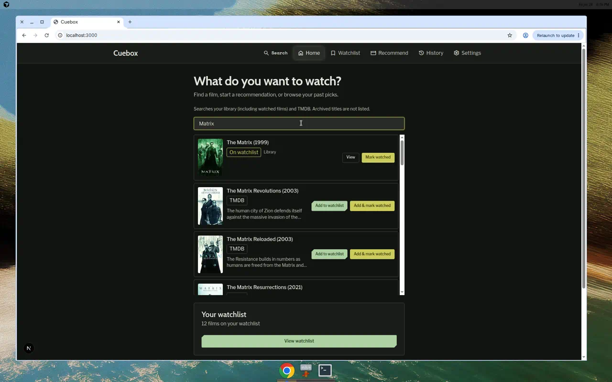
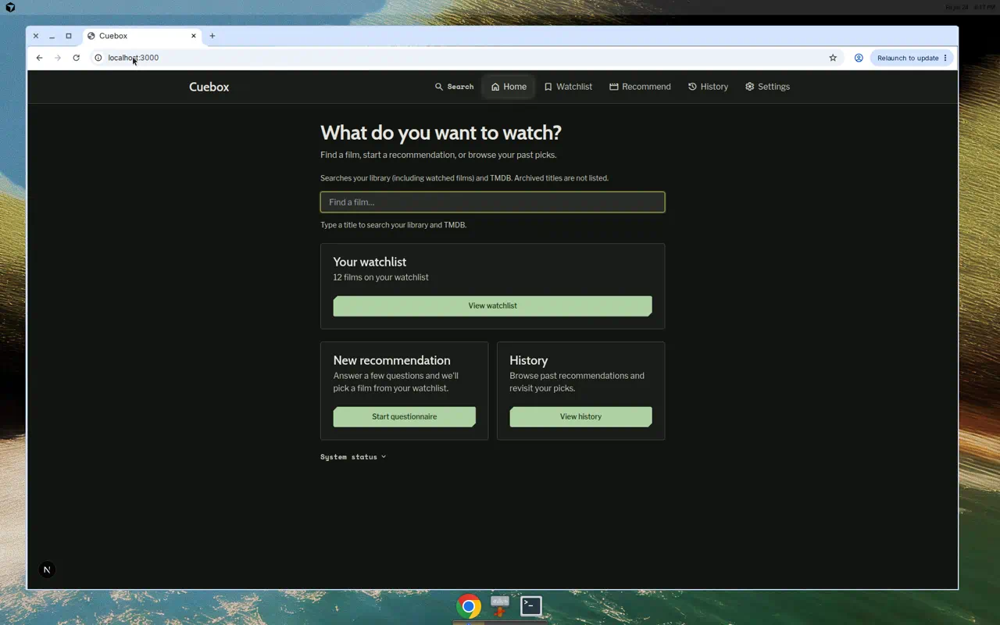
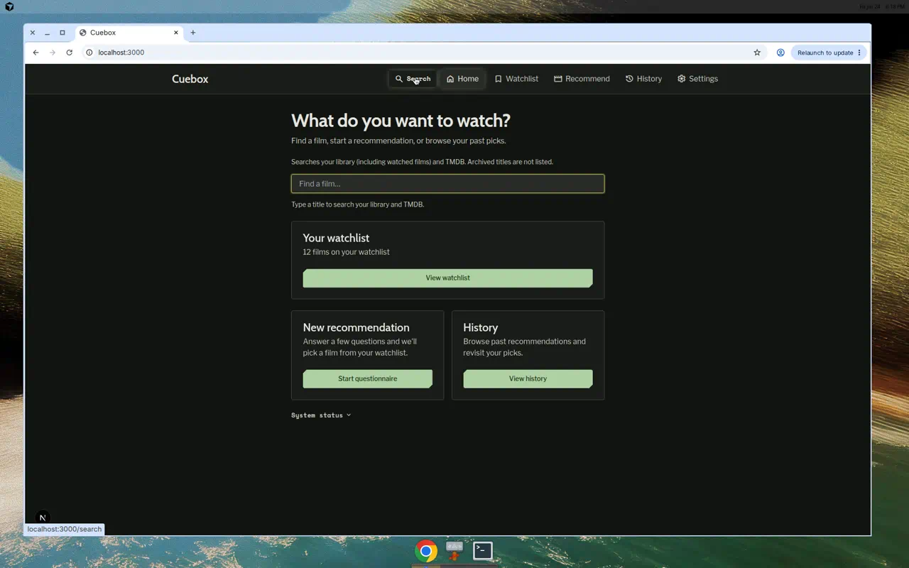
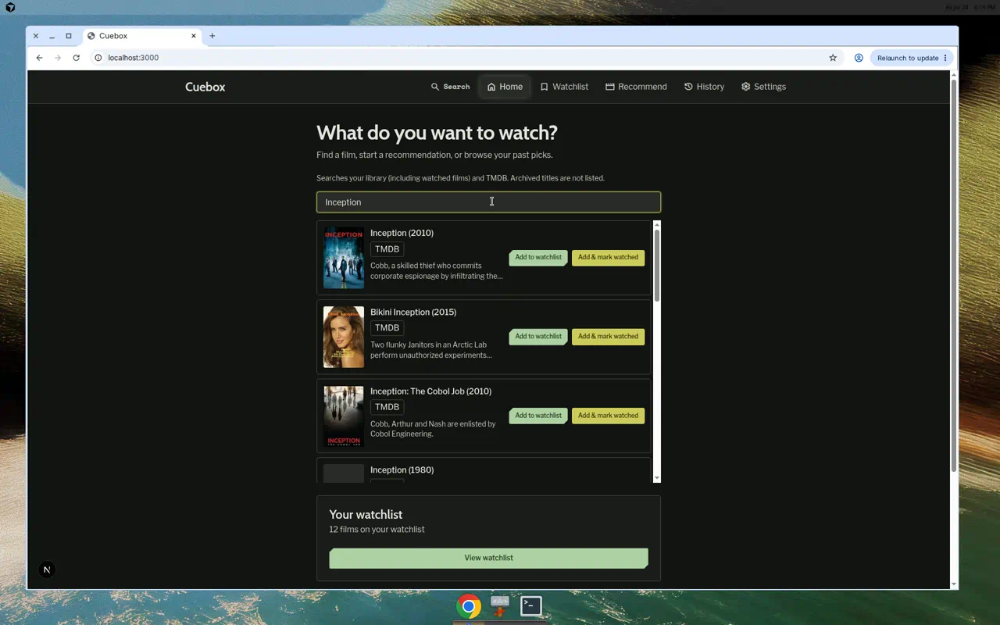

# Demo notes — issue #140

**Date:** 2026-07-24  
**Commit:** 8f5ae0a3a14a5c58cd48809200b3f4c958a9c481
**Tier:** application  
**Branch:** `cursor/issue-140-home-inline-search-8d81`  
**Stack:** Docker Compose (`postgres`, `api`, `frontend`, `backup` Up); health OK on API + frontend; watchlist seeded to 12 ready films (`python3` seed via API container after bootstrap found only 2).

## Scenario results

| Scenario | Result | Artifact |
|----------|--------|----------|
| 1 — Home inline picker | **PASS** | `scenario-1-home-inline-picker.png` |
| 2 — `/search` alias focuses Home | **PASS** | `scenario-2-search-alias-focus.png` |
| 3 — Header search icon | **PASS** | `scenario-3-header-search.png` |
| 4 — TMDB actions | **PASS** | `scenario-4-tmdb-actions.png` |
| 5 — Empty-watchlist focus no-op | **SKIPPED** | preserve Part 2 seed (no `docker compose down -v`) |

### Scenario 1 — Home inline picker

- Heading **What do you want to watch?** present on returning-user hub.
- Inline field placeholder **Find a film…** sits above New recommendation / History cards (visible in scenarios 2–3 screenshots; scenario 1 shows results expanded).
- No **Add a film** / **Mark watched** links to `/search?intent=…`.
- Query `Matrix` → library hit **The Matrix (1999)** with **View** / **Mark watched**; TMDB sequels also listed.

### Scenario 2 — `/search` alias focuses Home

- Opened `/search` → URL resolved to `localhost:3000` (root `/`).
- Search input focused with placeholder **Find a film…**; cards below confirm picker is on Home (not standalone `/search` chrome).

### Scenario 3 — Header search icon

- From `/watchlist`, activated header **Search** (accessible name **Search films** / magnifying glass).
- Landed on Home with inline field; link target `/search` visible in browser status on hover.

### Scenario 4 — TMDB actions

- Query `Inception` (not in seed library) → TMDB-only rows with both **Add to watchlist** and **Add & mark watched**.
- `TMDB_API_KEY` present; live TMDB search succeeded.
- Optional `scenario-4-add-mark-watched.mp4` not captured (buttons proven; dialog click skipped to keep demo concise). Mocked E2E covers the enrichment → review dialog path.

### Scenario 5 — Empty focus no-op

Skipped — preserving Part 2 seeded volume (12 ready films). Empty-hub behavior covered by execute unit/E2E.

## Notes

- No secrets in images.
- Artifacts reflect current branch behavior after execute commits (`feat(frontend): embed library search on Home for issue #140` and follow-up toast fix).

## Babysit (2026-07-24)

- Frontend CI **success** on `4c5dce8`; merge state **CLEAN**; no Bugbot review threads / must-fix items; loops unused (`bugbot` 0 / `ci_autofix` 0).
- MCP `update_pull_request` `draft: false` failed (PAT: Resource not accessible); marked ready via `gh pr ready 147` instead.
