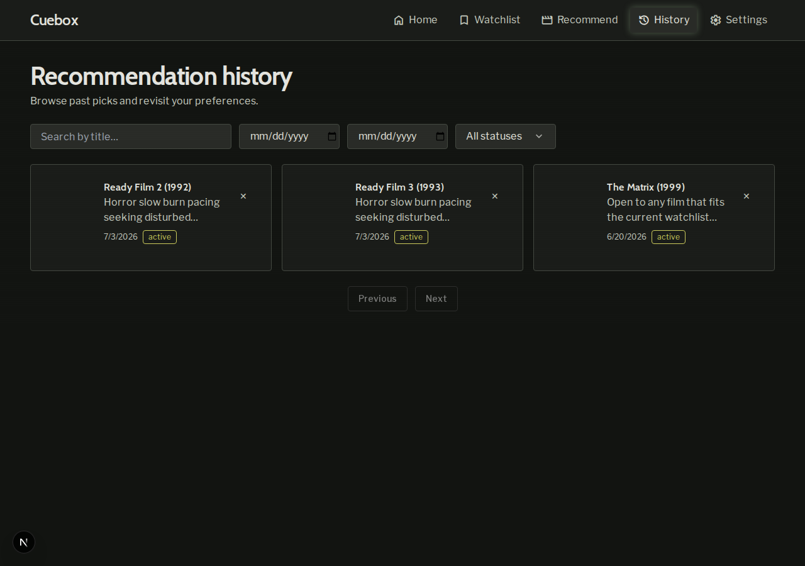
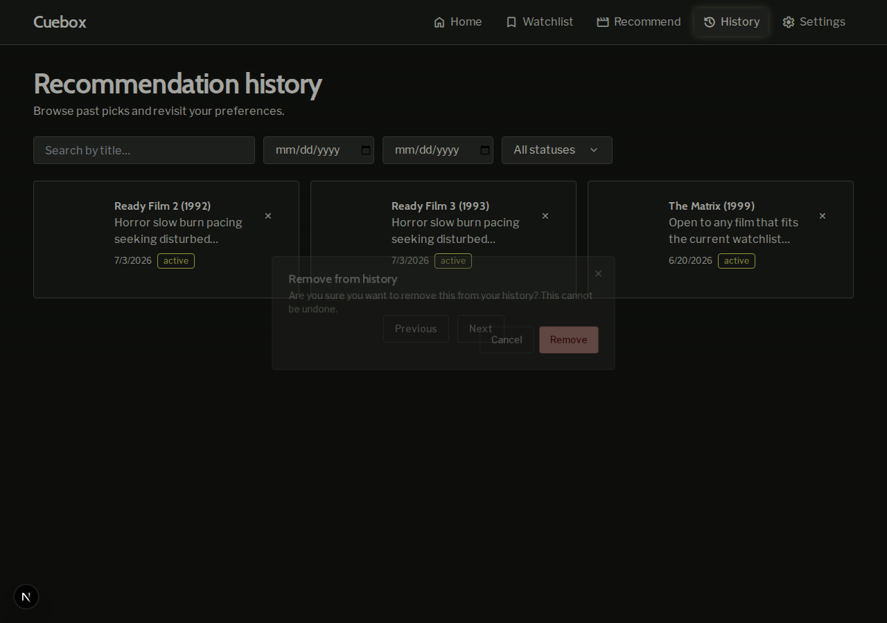
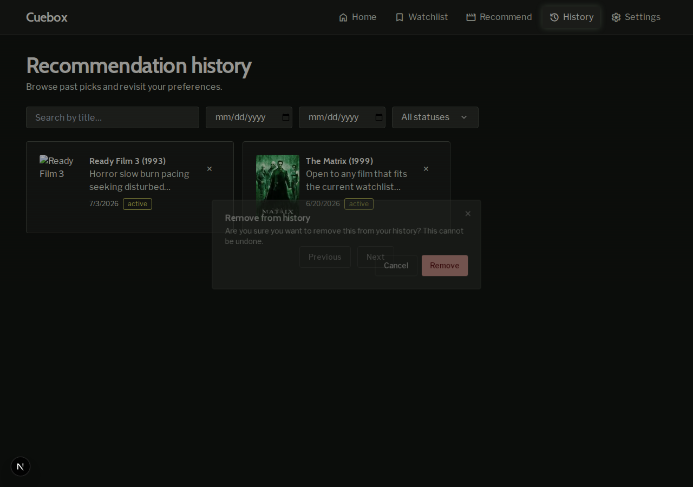
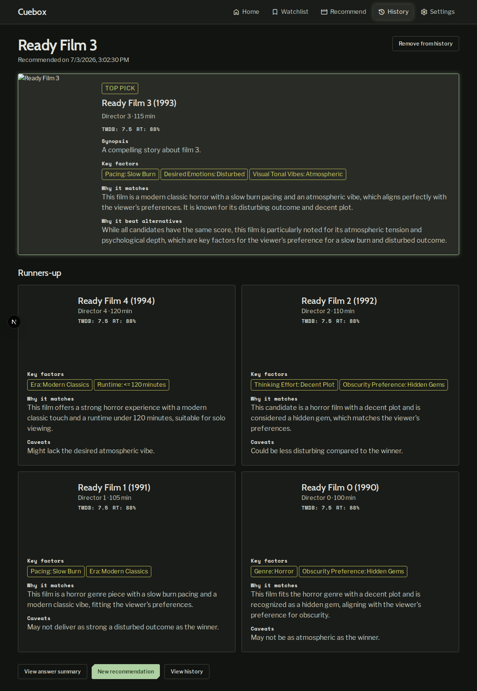
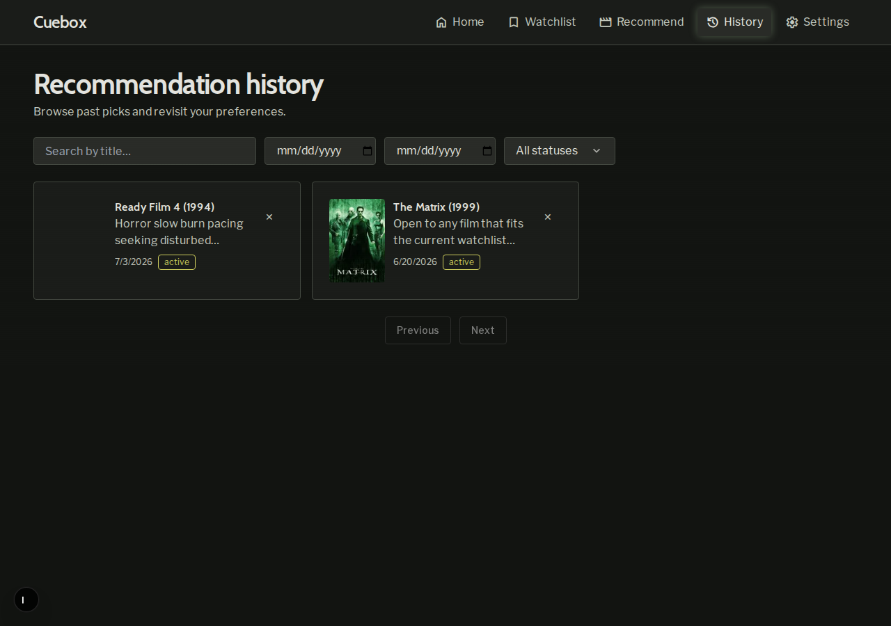
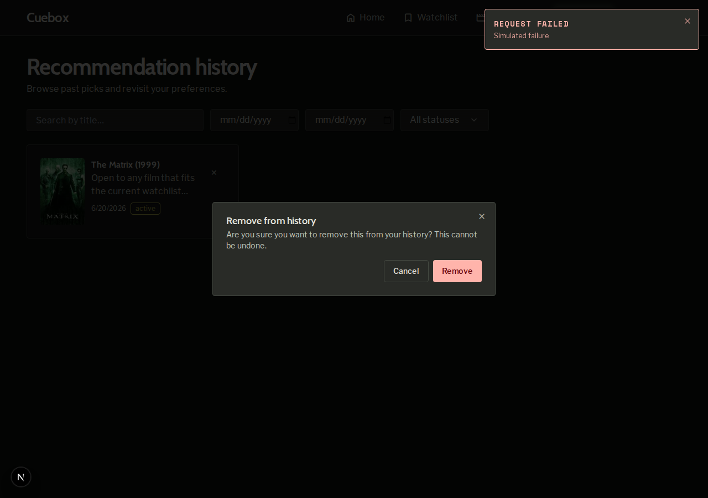

# Demo notes — issue #28: Hard delete past recommendations

- **Date:** 2026-07-03
- **Commit SHA:** `c3bef16` (branch `cursor/issue-28-hard-delete-past-recommendations`)
- **Stack:** Full Docker Compose (`postgres`, `api`, `frontend`, `backup` all Up); health checks OK on ports 3000 and 8000.

## Preconditions

- Seeded 10 ready films via `scripts/seed-dev-db.py`; created additional live recommendation sessions via `POST /api/v1/recommendations` (OpenAI providers available in `.env`).
- History list showed multiple cards before scenarios ran.

## Scenario results

### Scenario 1: Delete from history list — **PASS**

Deleted **Ready Film 2** from `/history`:

1. Trash control (✕, `aria-label="Remove from history"`) visible on card; click did not navigate to detail.
2. Confirmation dialog showed irreversible warning: *"Are you sure you want to remove this from your history? This cannot be undone."*
3. **Cancel** closed dialog; card remained.
4. **Remove** confirmed delete; card disappeared without full page reload.

| Artifact | Path |
|----------|------|
| Before | `scenario-1-history-list-before.png` |
| Dialog | `scenario-1-confirm-dialog.png` |
| After | `scenario-1-history-list-after.png` |

### Scenario 2: Delete from history detail — **PASS**

Opened `/history/c681e5d7-9780-46b9-8adb-1f2c158bdaff` (**Ready Film 3**), clicked **Remove from history**, confirmed in dialog.

- Redirected to `/history`.
- **Ready Film 3** no longer in list.

| Artifact | Path |
|----------|------|
| Detail before | `scenario-2-detail-before.png` |
| History after redirect | `scenario-2-history-after-redirect.png` |

### Scenario 3: API delete and exposure reversal — **PASS**

Session `2ccf6f4c-0542-4934-bc01-098a3e758ccd` (**Ready Film 4**):

| Step | Result |
|------|--------|
| List before | `pagination.total`: 2 |
| `DELETE /recommendations/{session_id}` | **204** |
| `GET /recommendations/{session_id}` | **404** `NOT_FOUND` |
| List after | `pagination.total`: 1; session absent from `data` |

Full log: `scenario-3-api-delete.log`

### Scenario 4: Failed delete shows error — **PASS**

Simulated DELETE failure via Playwright route interception (500 response) while API remained up. Destructive error toast appeared; **The Matrix** card remained on `/history`.

| Artifact | Path |
|----------|------|
| Error toast | `scenario-4-delete-error-toast.png` |

*Note: Spec allows skipping Scenario 4 when stopping API is disruptive; failure was demonstrated with a mocked 500 instead of `docker compose stop api` so the stack stayed healthy for remaining checks.*

## Summary

All required scenarios (1–3) and optional Scenario 4 passed. Delete controls, confirmation copy, list/detail UX, API contract (`204` / `404`), and error handling behave as specified.
