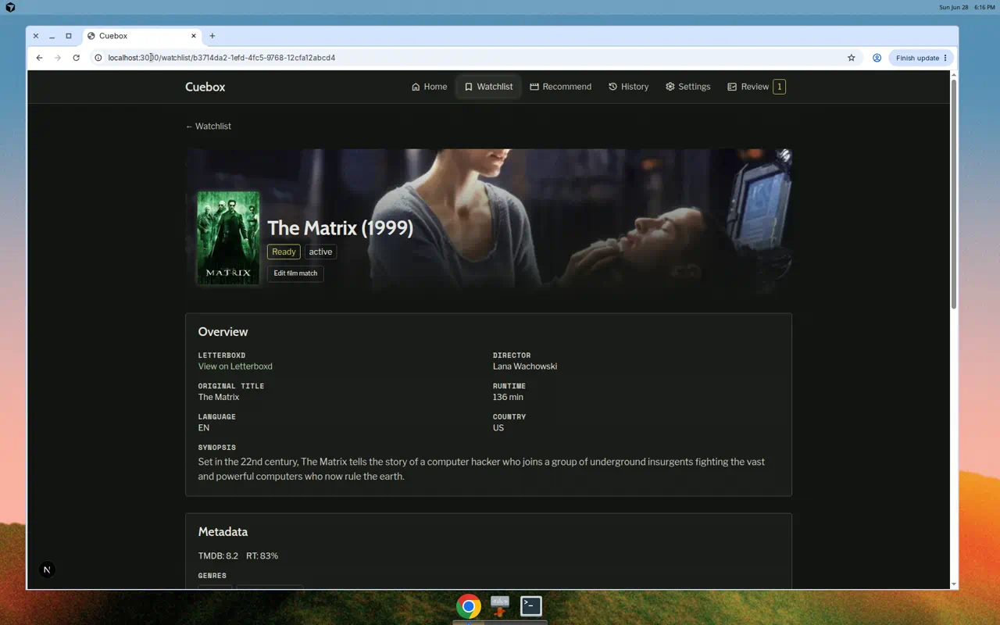
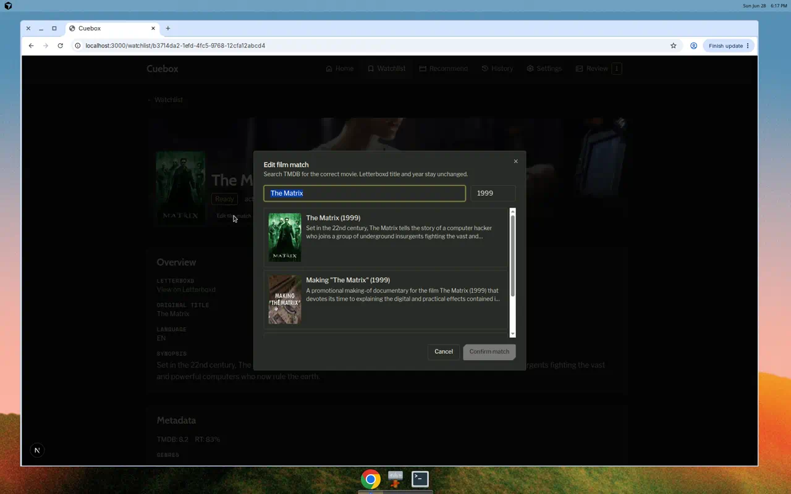
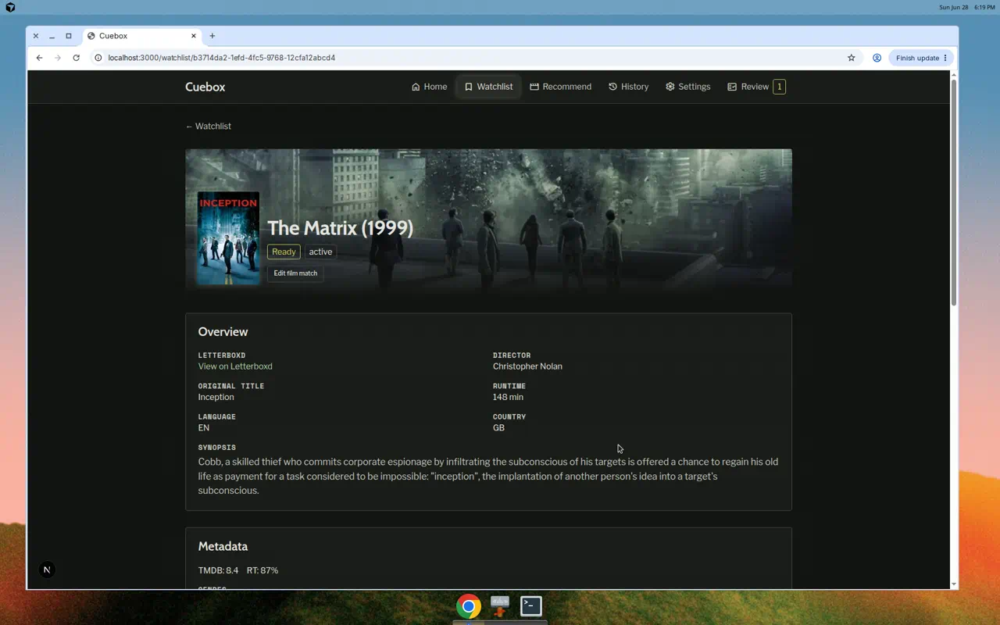
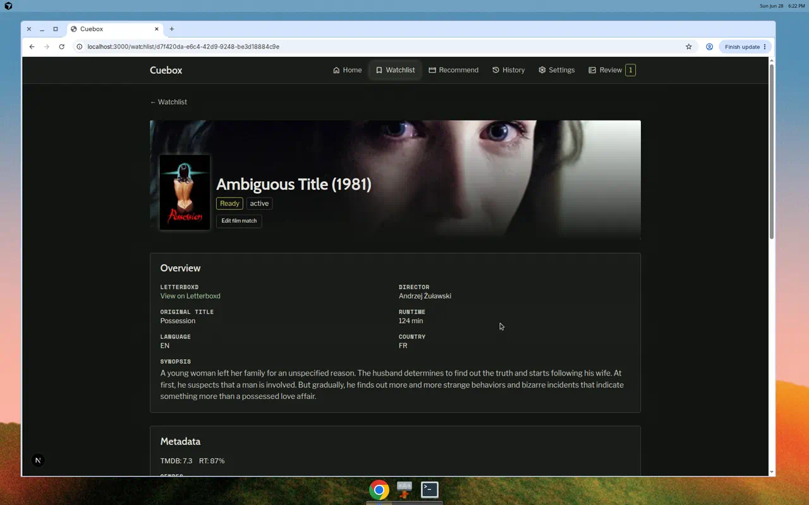
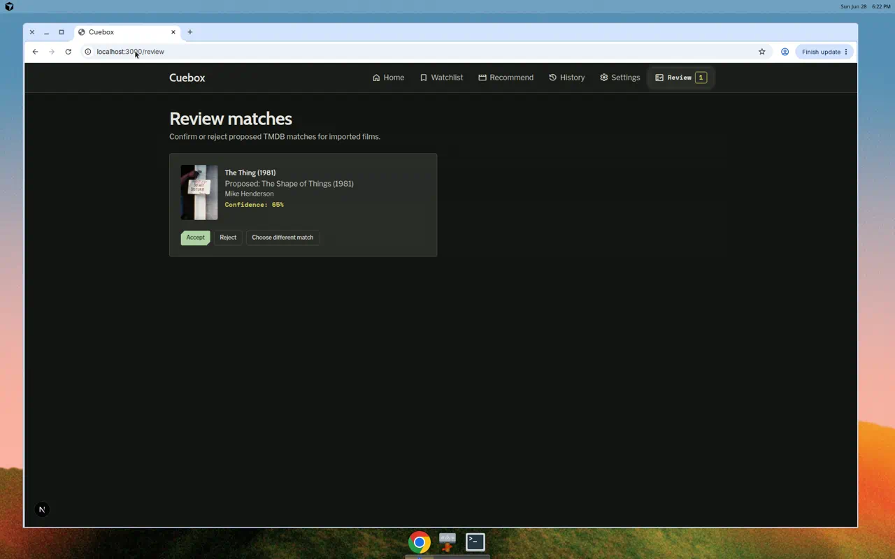
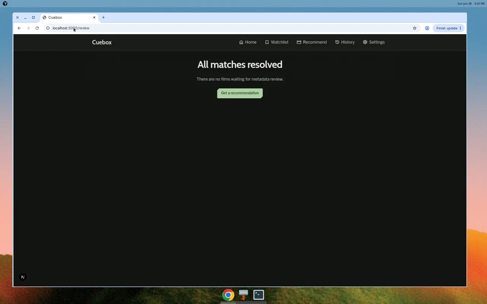
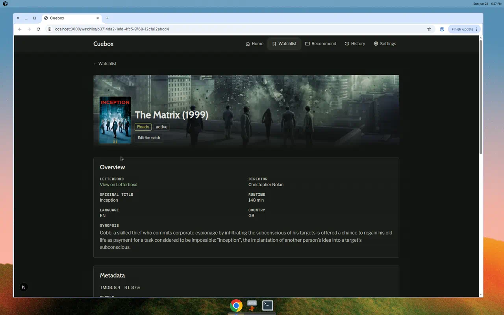

# Demo notes — issue #59

**Date:** 2026-06-28  
**Commit:** `c17a7e0` (demo artifacts + demo-ready state)  
**Stack:** Full Docker Compose on localhost (API :8000, frontend :3000)  
**Branch:** `cursor/issue-59-manual-film-metadata-rematch`

## Preconditions

- All four containers Up; health endpoints returned `status: ok`, `database: ok`
- Seeded watchlist: 11 `ready` films after `python3 scripts/seed-dev-db.py`
- `TMDB_API_KEY` present in `.env` (not shown in captures)
- Review queue seeded via CSV import of **The Thing (1981)** → low-confidence auto-match

## Scenario results

### Scenario 1 — Fix wrong match on ready film (Flow A) — **PASS**

Opened **The Matrix** (`/watchlist/b3714da2-…`). **Edit Film Match** visible on a `ready` film. Modal opened with Letterboxd title pre-filled; searched **Inception (2010)**, selected TMDB result, confirmed. Detail page showed **Enriching** / “Regenerating enrichment…” without full reload, then returned to **Ready** (~5s). Poster, director (Christopher Nolan), runtime (148 min), synopsis, and ratings updated to Inception metadata while Letterboxd title remained “The Matrix (1999)”.

| Artifact | Path |
|----------|------|
| Before | `scenario-1-detail-before.png` |
| Modal | `scenario-1-modal-search.png` |
| After | `scenario-1-detail-after.png` |

### Scenario 2 — Recover failed film (Flow B) — **PASS**

Opened **Ambiguous Title** (`/watchlist/d7f420da-…`, `failed`). Sparse detail (no poster/metadata) with **Edit Film Match** still visible. Rematched to **Possession (1981)** via TMDB search. Transition **failed → enriching → ready** (~5s). Metadata card, poster, synopsis, and semantic profile populated.

| Artifact | Path |
|----------|------|
| Before | `scenario-2-failed-before.png` |
| After | `scenario-2-ready-after.png` |

### Scenario 3 — Override review candidate (Flow C) — **PASS**

Review page listed **The Thing (1981)** with proposed match **The Shape of Things** (65% confidence). Film title linked to `/watchlist/e59a56a4-…`. Manual rematch to John Carpenter’s **The Thing (1982)**; enrichment completed (~5s). Returning to `/review` showed **“All matches resolved”** — film removed from pending queue; nav review badge cleared.

| Artifact | Path |
|----------|------|
| Review card | `scenario-3-review-card.png` |
| Cleared queue | `scenario-3-review-cleared.png` |

### Scenario 4 — Entry from recommendation results (Flow D) — **PASS**

Opened history session `/history/c618464a-…`, clicked watchlist link on the recommended film card. Landed on `/watchlist/{id}` with **Edit Film Match** visible (film showed post-rematch Inception metadata from Scenario 1).

| Artifact | Path |
|----------|------|
| From results | `scenario-4-from-results.png` |

## Summary

All four demo-spec scenarios **passed**. Manual TMDB rematch works from ready, failed, and review-required states; review queue reconciles after rematch; recommendation history links reach the edit flow. No secrets visible in artifacts. Optional screen recording omitted (each enrichment completed in ~5s; screenshots sufficient).
